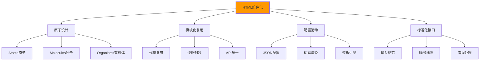

# 组件化开发

## 🧩 HTML组件化架构理念

### 📊 组件化设计体系

**组件化开发是现代化HTML项目的基础架构**：



## 🎯 HTML组件基础架构

### 📋 组件化文件组织结构

```
html-components/
├── 📁 src/
│   ├── 📁 components/           # 组件库
│   │   ├── 📁 atoms/            # 原子组件
│   │   │   ├── 📁 button/
│   │   │   │   ├── 📄 button.html
│   │   │   │   ├── 📄 button.css
│   │   │   │   ├── 📄 button.js
│   │   │   │   ├── 📄 button.json
│   │   │   │   └── 📄 button.md
│   │   │   ├── 📁 input/
│   │   │   │   ├── 📄 input.html
│   │   │   │   ├── 📄 input.css
│   │   │   │   ├── 📄 input.js
│   │   │   │   └── 📄 input.json
│   │   │   └── 📁 typography/
│   │   │       ├── 📄 heading.html
│   │   │       ├── 📄 heading.css
│   │   │       └── 📄 heading.json
│   │   ├── 📁 molecules/        # 分子组件
│   │   │   ├── 📁 search-form/
│   │   │   │   ├── 📄 search-form.html
│   │   │   │   ├── 📄 search-form.css
│   │   │   │   ├── 📄 search-form.js
│   │   │   │   └── 📄 search-form.json
│   │   │   ├── 📁 navigation/
│   │   │   │   ├── 📄 nav-item.html
│   │   │   │   ├── 📄 nav-item.css
│   │   │   │   ├── 📄 nav-item.js
│   │   │   │   └── 📄 nav-item.json
│   │   │   └── 📁 card/
│   │   │       ├── 📄 content-card.html
│   │   │       ├── 📄 content-card.css
│   │   │       ├── 📄 content-card.js
│   │   │       └── 📄 content-card.json
│   │   ├── 📁 organisms/        # 有机体组件
│   │   │   ├── 📁 header/
│   │   │   │   ├── 📄 site-header.html
│   │   │   │   ├── 📄 site-header.css
│   │   │   │   ├── 📄 site-header.js
│   │   │   │   └── 📄 site-header.json
│   │   │   ├── 📁 footer/
│   │   │   │   ├── 📄 site-footer.html
│   │   │   │   ├── 📄 site-footer.css
│   │   │   │   ├── 📄 site-footer.js
│   │   │   │   └── 📄 site-footer.json
│   │   │   └── 📁 sidebar/
│   │   │       ├── 📄 sidebar.html
│   │   │       ├── 📄 sidebar.css
│   │   │       ├── 📄 sidebar.js
│   │   │       └── 📄 sidebar.json
│   │   └── 📁 templates/       # 页面模板
│   │       ├── 📄 page-template.html
│   │       ├── 📄 article-template.html
│   │       └── 📄 contact-template.html
│   ├── 📁 data/                # 组件数据
│   │   ├── 📄 global-nav.json
│   │   ├── 📄 footer-links.json
│   │   └── 📄 component-configs.json
│   └── 📁 styles/              # 样式系统
│       ├── 📁 base/
│       │   ├── 📄 reset.css
│       │   └── 📄 typography.css
│       ├── 📁 layout/
│       │   ├── 📄 grid.css
│       │   └── 📄 containers.css
│       └── 📁 utilities/
│           ├── 📄 spacing.css
│           └── 📄 visibility.css
├── 📁 docs/                    # 组件文档
│   ├── 📄 styleguide.html
│   ├── 📄 component-overview.md
│   └── 📄 development-guidelines.md
└── 🛠️ build/                   # 构建工具
    ├── 📄 component-builder.js
    ├── 📄 style-processor.js
    └── 📄 template-engine.js
```

## 🔧 原子组件设计

### 📏 Button按钮组件

```html
<!-- 📄 src/components/atoms/button/button.html -->
<!-- Button Atom Component -->
<!-- 用法: {{ button(config) }} -->
<button type="{{type|default('button')}}" 
        class="btn {{style|default('primary')}} {{size|default('medium')}} {{modifier|default('')}}"
        disabled
        aria-label="{{ariaLabel}}"
        onclick="{{onclick}}"
        aria-controls="{{ariaControls}}"
        aria-expanded="{{ariaExpanded}}"
        {{ key }}="{{ value }}">
    
    
    <svg class="btn-icon {{iconPosition|default('left')}}" 
         aria-hidden="true">
        <use href="#{{icon}}"></use>
    </svg>
    
    
    
    <span class="btn-text">{{text}}</span>
    
    {{text|default('Button')}}
    
    
    
    <svg class="btn-loading-icon" aria-hidden="true">
        <use href="#icon-spinner"></use>
    </svg>
    
</button>

<!-- 📄 src/components/atoms/button/button.json -->
{
    "name": "button",
    "category": "atom",
    "description": "基础按钮组件，支持多种样式和尺寸",
    "variants": {
        "primary": {
            "style": "primary",
            "text": "主要按钮",
            "ariaLabel": "主要操作按钮"
        },
        "secondary": {
            "style": "secondary", 
            "text": "次要按钮",
            "ariaLabel": "次要操作按钮"
        },
        "danger": {
            "style": "danger",
            "text": "危险按钮",
            "ariaLabel": "危险操作按钮"
        },
        "with-icon": {
            "style": "primary",
            "text": "带图标按钮",
            "icon": "icon-download",
            "iconPosition": "left"
        },
        "loading": {
            "style": "primary",
            "text": "提交中...",
            "loading": true,
            "disabled": true
        }
    },
    "required": ["text"],
    "optional": ["style", "size", "disabled", "icon", "loading", "ariaLabel"],
    "styles": {
        "primary": "主要样式",
        "secondary": "次要样式", 
        "danger": "危险样式",
        "outline": "轮廓样式",
        "ghost": "幽灵样式"
    },
    "sizes": {
        "small": "小尺寸",
        "medium": "中等尺寸",
        "large": "大尺寸"
    }
}

<!-- 📄 src/components/atoms/button/button.css -->
/* Button Atom Styles */
.btn {
    /* 基础样式 */
    display: inline-flex;
    align-items: center;
    justify-content: center;
    gap: 0.5rem;
    
    /* 间距和尺寸 */
    padding: var(--btn-padding);
    margin: 0;
    
    /* 字体 */
    font-family: inherit;
    font-size: var(--btn-font-size);
    font-weight: var(--btn-font-weight);
    line-height: 1;
    
    /* 边框和圆角 */
    border: var(--btn-border);
    border-radius: var(--btn-border-radius);
    
    /* 背景和颜色 */
    background-color: var(--btn-bg-color);
    color: var(--btn-text-color);
    
    /* 交互 */
    cursor: pointer;
    transition: all 0.2s ease-in-out;
    
    /* 可访问性 */
    min-height: 44px; /* 触摸友好 */
    white-space: nowrap;
    
    /* 禁用状态 */
    &:disabled {
        opacity: 0.6;
        cursor: not-allowed;
        pointer-events: none;
    }
    
    /* 悬浮状态 */
    &:hover:not(:disabled) {
        background-color: var(--btn-bg-hover);
        transform: translateY(-1px);
        box-shadow: var(--btn-shadow-hover);
    }
    
    /* 活跃状态 */
    &:active:not(:disabled) {
        transform: translateY(0);
        box-shadow: var(--btn-shadow-active);
    }
    
    /* 焦点状态 */
    &:focus {
        outline: 2px solid var(--focus-color);
        outline-offset: 2px;
    }
}

/* 样式变体 */
.btn--primary {
    --btn-bg-color: #0066cc;
    --btn-text-color: #ffffff;
    --btn-border: 1px solid #0066cc;
    --btn-bg-hover: #0052a3;
    --btn-shadow-hover: 0 4px 12px rgba(0, 102, 204, 0.3);
    --btn-shadow-active: 0 2px 4px rgba(0, 102, 204, 0.2);
}

.btn--secondary {
    --btn-bg-color: #f8f9fa;
    --btn-text-color: #495057;
    --btn-border: 1px solid #dee2e6;
    --btn-bg-hover: #e9ecef;
    --btn-shadow-hover: 0 4px 12px rgba(0, 0, 0, 0.1);
    --btn-shadow-active: 0 2px 4px rgba(0, 0, 0, 0.05);
}

.btn--danger {
    --btn-bg-color: #dc3545;
    --btn-text-color: #ffffff;
    --btn-border: 1px solid #dc3545;
    --btn-bg-hover: #c82333;
    --btn-shadow-hover: 0 4px 12px rgba(220, 53, 69, 0.3);
    --btn-shadow-active: 0 2px 4px rgba(220, 53, 69, 0.2);
}

/* 尺寸变体 */
.btn--small {
    --btn-padding: 0.5rem 1rem;
    --btn-font-size: 0.875rem;
    min-height: 36px;
}

.btn--medium {
    --btn-padding: 0.75rem 1.5rem;
    --btn-font-size: 1rem;
}

.btn--large {
    --btn-padding: 1rem 2rem;
    --btn-font-size: 1.125rem;
    min-height: 52px;
}

/* 图标和文字布局 */
.btn-icon {
    width: 1.25em;
    height: 1.25em;
    flex-shrink: 0;
}

.btn-icon--left {
    order: -1;
}

.btn-icon--right {
    order: 1;
}

.btn-loading-icon {
    width: 1em;
    height: 1em;
    animation: spin 1s linear infinite;
}

@keyframes spin {
    from { transform: rotate(0deg); }
    to { transform: rotate(360deg); }
}

/* 触摸设备优化 */
@media (hover: none) {
    .btn:hover:not(:disabled) {
        transform: none;
        box-shadow: none;
    }
}

/* 深色模式支持 */
@media (prefers-color-scheme: dark) {
    .btn--secondary {
        --btn-bg-color: #343a40;
        --btn-text-color: #ffffff;
        --btn-border: 1px solid #495057;
        --btn-bg-hover: #495057;
    }
}
```

## 🧬 分子组件设计

### 📋 SearchForm搜索表单组件

```html
<!-- 📄 src/components/molecules/search-form/search-form.html -->
<!-- Search Form Molecule Component -->
<!-- 用法: {{ searchForm(config) }} -->
<form class="search-form {{modifier|default('')}}" 
      role="search" 
      action="{{action}}{{ query ? '?q=' ~ query : '' }}"
      method="{{method|default('get')}}"
      aria-label="{{ariaLabel}}"
      novalidate>
    
    <div class="search-form__container">
        <!-- 搜索输入框 -->
        <label for="{{inputId|default('search-input')}}" class="sr-only">
            {{labelText|default('搜索')}}
        </label>
        
        <div class="search-input-container">
            
            <svg class="search-input-icon" aria-hidden="true">
                <use href="{{searchIcon|default('#icon-search')}}"></use>
            </svg>
            
            
            <input type="search"
                   id="{{inputId|default('search-input')}}"
                   name="{{inputName|default('q')}}"
                   class="search-input {{inputModifier|default('')}}"
                   value="{{query|default('')}}"
                   placeholder="{{placeholder|default('搜索...')}}"
                   autocomplete="{{autocomplete}}"
                   maxlength="{{maxLength}}"
                   required
                   aria-describedby="{{ariaDescribedBy}}"
                   list="{{inputId|default('search-input')}}-suggestions">
            
            
            <button type="button" 
                    class="search-clear"
                    aria-label="清除搜索内容"
                    onclick="clearSearchInput('{{inputId|default('search-input')}}')">
                <svg aria-hidden="true">
                    <use href="{{clear-icon|default('#icon-close')}}"></use>
                </svg>
            </button>
            
        </div>
        
        <!-- 搜索按钮 -->
        <button type="submit" 
                class="search-submit {{buttonStyle|default('primary')}}"
                title="{{buttonText}}"
                aria-label="{{submitAriaLabel|default('搜索')}}">
            
            
            <svg class="search-submit-icon" aria-hidden="true">
                <use href="{{submitIcon|default('#icon-search')}}"></use>
            </svg>
            
            
            
            <span class="search-submit-text">{{buttonText}}</span>
            
        </button>
        
        
        <button type="button" 
                class="search-filter"
                aria-label="搜索过滤器"
                aria-expanded="false"
                aria-controls="{{inputId|default('search-input')}}-filter">
            <svg><use href="{{filterIcon|default('#icon-filter')}}"></use></svg>
        </button>
        
    </div>
    
    <!-- 搜索建议 -->
    
    <datalist id="{{inputId|default('search-input')}}-suggestions">
        
        <option value="{{suggestion}}">
        
    </datalist>
    
    
    <!-- 实时搜索结果 -->
    
    <div class="search-results" 
         id="{{inputId|default('search-input')}}-results"
         aria-live="polite"
         aria-hidden="true">
        
        <ul class="suggestions-list" role="list">
            
            <li class="suggestion-item">
                <button type="button" 
                        class="suggestion-button"
                        data-query="{{item.query}}"
                        onclick="selectSuggestion('{{item.query}}')">
                    <strong>{{item.highlight}}</strong>
                    
                    <span class="suggestion-context">{{item.context}}</span>
                    
                </button>
            </li>
            
        </ul>
        
    </div>
    
    
    <!-- 搜索过滤器面板 -->
    
    <div class="search-filters" 
         id="{{inputId|default('search-input')}}-filter"
         aria-hidden="true">
        <h3>搜索过滤器</h3>
        
        <div class="filter-group">
            <label for="content-type-filter">内容类型</label>
            <select id="content-type-filter" name="type">
                <option value="">全部</option>
                <option value="course">课程</option>
                <option value="article">文章</option>
                <option value="video">视频</option>
            </select>
        </div>
        
        <div class="filter-group">
            <label for="date-range-filter">时间范围</label>
            <select id="date-range-filter" name="date">
                <option value="">不限</option>
                <option value="day">今天</option>
                <option value="week">本周</option>
                <option value="month">本月</option>
                <option value="year">本年</option>
            </select>
        </div>
        
        <div class="filter-actions">
            <button type="button" class="btn-primary">应用过滤器</button>
            <button type="button" class="btn-secondary">清除过滤器</button>
        </div>
    </div>
    
</form>

<!-- 📄 src/components/molecules/search-form/search-form.js -->
class SearchFormComponent {
    constructor(formElement) {
        this.form = formElement;
        this.input = this.form.querySelector('input[type="search"]');
        this.results = this.form.querySelector('.search-results');
        this.suggestions = this.form.querySelector('.suggestions-list');
        this.filterButton = this.form.querySelector('.search-filter');
        this.filterPanel = this.form.querySelector('.search-filters');
        
        this.debounceTimer = null;
        this.isSearching = false;
        this.minSearchLength = 2;
        this.debounceDelay = 300;
        
        this.init();
    }
    
    init() {
        this.setupEventHandlers();
        this.setupKeyboardNavigation();
        this.setupAccessibility();
    }
    
    setupEventHandlers() {
        // 输入事件
        this.input?.addEventListener('input', (e) => {
            this.handleInput(e.target.value);
        });
        
        // 提交事件
        this.form.addEventListener('submit', (e) => {
            if (!this.input.value.trim()) {
                e.preventDefault();
                this.input.focus();
                return;
            }
            
            this.performSearch(this.input.value);
        });
        
        // 清除按钮
        const clearButton = this.form.querySelector('.search-clear');
        clearButton?.addEventListener('click', () => {
            this.clearSearch();
        });
        
        // 过滤器按钮
        this.filterButton?.addEventListener('click', () => {
            this.toggleFilters();
        });
    }
    
    setupKeyboardNavigation() {
        this.input?.addEventListener('keydown', (e) => {
            if (!this.suggestions) return;
            
            const visibleSuggestions = this.suggestions.querySelectorAll('.suggestion-button:not([style*="display: none"])');
            const currentFocused = document.activeElement;
            
            switch(e.key) {
                case 'ArrowDown':
                    e.preventDefault();
                    this.navigateSuggestions(visibleSuggestions, 'down');
                    break;
                    
                case 'ArrowUp':
                    e.preventDefault();
                    this.navigateSuggestions(visibleSuggestions, 'up');
                    break;
                    
                case 'Enter':
                    if (currentFocused.classList.contains('suggestion-button')) {
                        e.preventDefault();
                        this.selectSuggestion(currentFocused);
                    }
                    break;
                    
                case 'Escape':
                    this.hideResults();
                    this.input.blur();
                    break;
            }
        });
    }
    
    setupAccessibility() {
        // ARIA支持
        this.form.setAttribute('role', 'search');
        
        // 结果区域设置为活跃区域
        if (this.results) {
            this.results.setAttribute('aria-live', 'polite');
            this.results.setAttribute('aria-atomic', 'false');
        }
    }
    
    handleInput(value) {
        clearTimeout(this.debounceTimer);
        
        // 显示/隐藏清除按钮
        this.toggleClearButton(value);
        
        if (value.length < this.minSearchLength) {
            this.hideResults();
            return;
        }
        
        this.debounceTimer = setTimeout(() => {
            this.fetchSuggestions(value);
        }, this.debounceDelay);
    }
    
    toggleClearButton(value) {
        const clearButton = this.form.querySelector('.search-clear');
        if (clearButton) {
            clearButton.style.display = value ? 'block' : 'none';
        }
    }
    
    async fetchSuggestions(query) {
        try {
            this.isSearching = true;
            this.showLoading();
            
            const response = await fetch(`/api/search/suggestions?q=${encodeURIComponent(query)}`);
            const data = await response.json();
            
            this.displaySuggestions(data.suggestions);
            
        } catch (error) {
            console.error('获取搜索建议失败:', error);
            this.showError('搜索服务暂时不可用');
        } finally {
            this.isSearching = false;
            this.hideLoading();
        }
    }
    
    displaySuggestions(suggestions) {
        if (!this.results) return;
        
        if (!suggestions || suggestions.length === 0) {
            this.hideResults();
            return;
        }
        
        this.results.innerHTML = suggestions.map(item => `
            <li class="suggestion-item">
                <button type="button" 
                        class="suggestion-button"
                        data-query="${item.query}"
                        tabindex="-1">
                    <strong>${item.highlight}</strong>
                    ${item.context ? `<span class="suggestion-context">${item.context}</span>` : ''}
                </button>
            </li>
        `).join('');
        
        this.showResults();
    }
    
    navigateSuggestions(suggestions, direction) {
        const currentFocused = document.activeElement;
        const currentIndex = Array.from(suggestions).indexOf(currentFocused);
        
        let nextIndex;
        if (direction === 'down') {
            nextIndex = currentIndex < suggestions.length - 1 ? currentIndex + 1 : 0;
        } else {
            nextIndex = currentIndex > 0 ? currentIndex - 1 : suggestions.length - 1;
        }
        
        suggestions[nextIndex]?.focus();
    }
    
    selectSuggestion(suggestionElement) {
        const query = suggestionElement.dataset.query;
        this.input.value = query;
        this.performSearch(query);
    }
    
    performSearch(query) {
        // 更新URL参数
        const url = new URL(window.location);
        url.searchParams.set('q', query);
        url.searchParams.set('t', Date.now());
        
        // 跳转到搜索结果页面
        window.location.href = url.toString();
        
        // 或者使用AJAX加载结果
        // this.loadSearchResults(query);
    }
    
    clearSearch() {
        this.input.value = '';
        this.input.focus();
        this.hideResults();
        this.toggleClearButton('');
    }
    
    toggleFilters() {
        if (!this.filterPanel) return;
        
        const isHidden = this.filterPanel.getAttribute('aria-hidden') === 'true';
        
        this.filterPanel.setAttribute('aria-hidden', !isHidden);
        this.filterButton.setAttribute('aria-expanded', isHidden);
        
        if (isHidden) {
            this.filterButton.setAttribute('aria-expanded','true');
            this.filterPanel.style.display = 'block';
        } else {
            this.filterButton.setAttribute('aria-expanded', 'false');
            this.filterPanel.style.display = 'none';
        }
    }
    
    showResults() {
        if (this.results) {
            this.results.setAttribute('aria-hidden', 'false');
            this.results.style.display = 'block';
        }
    }
    
    hideResults() {
        if (this.results) {
            this.results.setAttribute('aria-hidden', 'true');
            this.results.style.display = 'none';
        }
    }
    
    showLoading() {
        const loadingIndicator = this.form.querySelector('.search-loading');
        if (loadingIndicator) {
            loadingIndicator.style.display = 'block';
        }
    }
    
    hideLoading() {
        const loadingIndicator = this.form.querySelector('.search-loading');
        if (loadingIndicator) {
            loadingIndicator.style.display = 'none';
        }
    }
    
    showError(message) {
        const errorElement = this.form.querySelector('.search-error');
        if (errorElement) {
            errorElement.textContent = message;
            errorElement.style.display = 'block';
            
            setTimeout(() => {
                errorElement.style.display = 'none';
            }, 3000);
        }
    }
}

// ✅ 自动初始化所有搜索表单
document.addEventListener('DOMContentLoaded', () => {
    const searchForms = document.querySelectorAll('.search-form');
    searchForms.forEach(form => new SearchFormComponent(form));
});
```

## 🏗️ 有机体组件设计

### 🧭 SiteHeader网站头部组件

```html
<!-- 📄 src/components/organisms/header/site-header.html -->
<!-- Site Header Organism Component -->
<!-- 用法: {{ siteHeader(config) }} -->
<header class="site-header {{modifier|default('')}}" 
        role="banner"
        aria-label="{{ariaLabel}}"
        data-fixed="true"
        data-transparent="true">
    
    <div class="header-container {{containerStyle|default('fluid')}}">
        <!-- Logo品牌区域 -->
        <div class="header-brand">
            <a href="{{logoHref|default('/')}}" 
               class="brand-link {{logoStyle|default('default')}}">
                
                <!-- 可配置的Logo显示 -->
                
                
                
                
                
                <span class="brand-tagline">{{logo.text}}</span>
                
            </a>
        </div>
        
        <!-- 主导航 -->
        
        
        <!-- 用户操作区域 -->
        <div class="header-user-actions {{userActionsStyle|default('compact')}}">
            <!-- 搜索组件 -->
            
            <div class="header-search {{searchPosition|default('right')}}">
                
            </div>
            
            
            <!-- 用户账户 -->
            
            <div class="header-user-menu">
                
                    <!-- 已登录用户 -->
                    <div class="user-profile-dropdown" 
                         role="button"
                         aria-haspopup="true"
                         aria-expanded="false"
                         tabindex="0">
                        
                        
                        
                        <span class="user-name">{{user.name}}</span>
                        
                        <svg class="dropdown-icon" aria-hidden="true">
                            <use href="#icon-chevron-down"></use>
                        </svg>
                        
                        <!-- 用户下拉菜单 -->
                        <ul class="user-dropdown-menu" 
                            role="menu"
                            aria-label="用户菜单">
                            <li role="none">
                                <a href="{{user.profileUrl}}" 
                                   role="menuitem" 
                                   class="dropdown-item">
                                    <svg><use href="#icon-profile"></use></svg>
                                    个人资料
                                </a>
                            </li>
                            <li role="none">
                                <a href="{{user.coursesUrl}}" 
                                   role="menuitem" 
                                   class="dropdown-item">
                                    <svg><use href="#icon-book"></use></svg>
                                    我的课程
                                </a>
                            </li>
                            <li role="none">
                                <a href="{{user.settingsUrl}}" 
                                   role="menuitem" 
                                   class="dropdown-item">
                                    <svg><use href="#icon-settings"></use></svg>
                                    设置
                                </a>
                            </li>
                            <li role="separator" class="dropdown-divider"></li>
                            <li role="none">
                                <a href="{{user.logoutUrl}}" 
                                   role="menuitem" 
                                   class="dropdown-item">
                                    <svg><use href="#icon-logout"></use></svg>
                                    退出登录
                                </a>
                            </li>
                        </ul>
                    </div>
                
                    <!-- 未登录用户 -->
                    <div class="auth-buttons">
                        <a href="{{auth.loginUrl}}" 
                           class="btn btn-ghost {{auth.loginStyle|default('text')}}">
                            {{auth.loginText|default('登录')}}
                        </a>
                        <a href="{{auth.registerUrl}}" 
                           class="btn btn-primary {{auth.registerStyle|default('solid')}}">
                            {{auth.registerText|default('注册')}}
                        </a>
                    </div>
                
            </div>
            
            
            <!-- 移动端菜单按钮 -->
            
            <button class="mobile-menu-toggle {{mobileMenuStyle|default('hamburger')}}" 
                    aria-expanded="false"
                    aria-controls="{{mobileMenuId|default('mobile-navigation')}}"
                    aria-label="打开主导航菜单">
                
                
                <span class="hamburger-line"></span>
                <span class="hamburger-line"></span>
                <span class="hamburger-line"></span>
                
                <svg class="menu-icon">
                    <use href="{{mobileMenuIcon|default('#icon-menu')}}"></use>
                </svg>
                
            </button>
            
        </div>
    </div>
    
    <!-- 移动端导航 -->
    
    <div class="mobile-navigation-overlay" 
         id="{{mobileMenuId|default('mobile-navigation')}}"
         aria-hidden="true">
        
        <nav class="mobile-navigation" role="navigation" aria-label="移动端导航">
            
        </nav>
    </div>
    
    
    <!-- 浮动效果 -->
    
    <div class="header-scroll-indicator" aria-hidden="true"></div>
    
</header>

<!-- 📄 src/components/organisms/header/site-header.js -->
class SiteHeaderComponent {
    constructor(headerElement) {
        this.header = headerElement;
        this.container = this.header.querySelector('.header-container');
        this.mobileMenuToggle = this.header.querySelector('.mobile-menu-toggle');
        this.mobileNav = this.header.querySelector('.mobile-navigation-overlay');
        this.userDropdown = this.header.querySelector('.user-profile-dropdown');
        this.scrollIndicator = this.header.querySelector('.header-scroll-indicator');
        
        this.isMobileMenuOpen = false;
        this.lastScrollY = window.scrollY;
        this.headerHeight = this.header.offsetHeight;
        this.attachBehavior = this.header.dataset.attachBehavior || 'static';
        
        this.init();
    }
    
    init() {
        this.setupScrollBehavior();
        this.setupMobileMenu();
        this.setupUserDropdown();
        this.setupKeyboardNavigation();
        this.setupAccessibility();
        
        // 初始化时检查scroll距离
        this.handleScroll();
    }
    
    setupScrollBehavior() {
        if (this.attachBehavior === 'fixed') {
            // 固定头部时的滚动效果
            window.addEventListener('scroll', this.throttle(() => {
                this.handleScroll();
            }, 100));
            
            // 初始化scroll indicator
            this.updateScrollIndicator();
        }
        
        // 添加页面加载后的类
        window.addEventListener('load', () => {
            this.header.classList.add('header-loaded');
        });
    }
    
    setupMobileMenu() {
        if (!this.mobileMenuToggle || !this.mobileNav) return;
        
        this.mobileMenuToggle.addEventListener('click', () => {
            this.toggleMobileMenu();
        });
        
        // 关闭菜单的面板点击
        this.mobileNav.addEventListener('click', (e) => {
            if (e.target === this.mobileNav) {
                this.closeMobileMenu();
            }
        });
        
        // ESC按键关闭
        document.addEventListener('keydown', (e) => {
            if (e.key === 'Escape' && this.isMobileMenuOpen) {
                this.closeMobileMenu();
            }
        });
    }
    
    setupUserDropdown() {
        if (!this.userDropdown) return;
        
        const trigger = this.userDropdown;
        const menu = this.userDropdown.querySelector('.user-dropdown-menu');
        
        trigger.addEventListener('click', () => {
            const isOpen = trigger.getAttribute('aria-expanded') === 'true';
            
            trigger.setAttribute('aria-expanded', !isOpen);
            menu.style.display = !isOpen ? 'block' : 'none';
        });
        
        // 点击外部关闭
        document.addEventListener('click', (e) => {
            if (!trigger.contains(e.target)) {
                trigger.setAttribute('aria-expanded', 'false');
                menu.style.display = 'none';
            }
        });
        
        // 键盘导航
        this.setupDropdownNavigation(trigger, menu);
    }
    
    setupDropdownNavigation(trigger, menu) {
        const menuItems = menu.querySelectorAll('[role="menuitem"]');
        
        trigger.addEventListener('keydown', (e) => {
            switch(e.key) {
                case 'Enter':
                case ' ':
                case 'ArrowDown':
                    e.preventDefault();
                    trigger.setAttribute('aria-expanded', 'true');
                    menu.style.display = 'block';
                    menuItems[0]?.focus();
                    break;
                case 'Escape':
                    trigger.setAttribute('aria-expanded', 'false');
                    menu.style.display = 'none';
                    break;
            }
        });
        
        menuItems.forEach((item, index) => {
            item.addEventListener('keydown', (e) => {
                switch(e.key) {
                    case 'ArrowDown':
                        e.preventDefault();
                        const nextIndex = (index + 1) % menuItems.length;
                        menuItems[nextIndex].focus();
                        break;
                    case 'ArrowUp':
                        e.preventDefault();
                        const prevIndex = index === 0 ? menuItems.length - 1 : index - 1;
                        menuItems[prevIndex].focus();
                        break;
                    case 'Home':
                        e.preventDefault();
                        menuItems[0].focus();
                        break;
                    case 'End':
                        e.preventDefault();
                        menuItems[menuItems.length - 1].focus();
                        break;
                    case 'Escape':
                        e.preventDefault();
                        trigger.setAttribute('aria-expanded', 'false');
                        menu.style.display = 'none';
                        trigger.focus();
                        break;
                }
            });
        });
    }
    
    setupKeyboardNavigation() {
        // 全局快捷键
        document.addEventListener('keydown', (e) => {
            // 防止在表单元素中触发
            if (e.target.matches('input, textarea, select, [contenteditable]')) {
                return;
            }
            
            switch(e.key) {
                case '/':
                    e.preventDefault();
                    this.focusSearch();
                    break;
                case 'M':
                case 'm':
                    if (e.altKey && this.mobileMenuToggle) {
                        e.preventDefault();
                        this.toggleMobileMenu();
                    }
                    break;
            }
        });
    }
    
    setupAccessibility() {
        // 移动端菜单ARIA
        if (this.mobileNav) {
            this.mobileNav.addEventListener('transitionend', () => {
                const isOpen = this.mobileNav.getAttribute('aria-hidden') === 'false';
                
                // 防止背景滚动
                document.body.style.overflow = isOpen ? 'hidden' : '';
                
                // 处理焦点
                if (isOpen) {
                    this.trapFocusInMobileMenu();
                } else {
                    this.mobileMenuToggle.focus();
                }
            });
        }
    }
    
    handleScroll() {
        const currentScrollY = window.scrollY;
        const scrollDirection = currentScrollY > this.lastScrollY ? 'down' : 'up';
        
        if (this.attachBehavior === 'fixed') {
            if (currentScrollY > this.headerHeight) {
                this.header.classList.add('header-scrolled');
                
                if (scrollDirection === 'down' && currentScrollY > 100) {
                    this.header.classList.add('header-hidden');
                } else {
                    this.header.classList.remove('header-hidden');
                }
            } else {
                this.header.classList.remove('header-scrolled', 'header-hidden');
            }
        }
        
        this.lastScrollY = new Y;
        this.updateScrollIndicator(currentScrollY);
        
        // 关闭移动端菜单
        if (this.isMobileMenuOpen && currentScrollY > 50) {
            this.closeMobileMenu();
        }
    }
    
    updateScrollIndicator(scrollY = window.scrollY) {
        if (!this.scrollIndicator) return;
        
        const docHeight = document.documentElement.scrollHeight - window.innerHeight;
        const scrollProgress = (scrollY / docHeight) * 100;
        
        this.scrollIndicator.style.width = `${Math.min(100, scrollProgress)}%`;
    }
    
    toggleMobileMenu() {
        this.isMobileMenuOpen ? this.closeMobileMenu() : this.openMobileMenu();
    }
    
    openMobileMenu() {
        this.isMobileMenuOpen = true;
        this.mobileMenuToggle.setAttribute('aria-expanded', 'true');
        this.mobileNav.setAttribute('aria-hidden', 'false');
        
        // 动画样式
        this.mobileNav.style.display = 'block';
        
        // trap focus
        setTimeout(() => {
            this.trapFocusInMobileMenu();
        }, 150);
    }
    
    closeMobileMenu() {
        this.isMobileMenuOpen = false;
        this.mobileMenuToggle.setAttribute('aria-expanded', 'false');
        this.mobileNav.setAttribute('aria-hidden', 'true');
        
        // 恢复body滚动
        document.body.style.overflow = '';
        
        setTimeout(() => {
            this.mobileNav.style.display = 'none';
        }, 300);
    }
    
    trapFocusInMobileMenu() {
        const focusableElements = this.mobileNav.querySelectorAll(
            'button, [href], input, select, textarea, [tabindex]:not([tabindex="-1"])'
        );
        
        if (focusableElements.length === 0) return;
        
        const firstElement = focusableElements[0];
        const lastElement = focusableElements[focusableElements.length - 1];
        
        firstElement.focus();
        
        // 捕获Tab键
        this.mobileNav.addEventListener('keydown', (e) => {
            if (e.key === 'Tab') {
                if (e.shiftKey) {
                    if (document.activeElement === firstElement) {
                        e.preventDefault();
                        lastElement.focus();
                    }
                } else {
                    if (document.activeElement === lastElement) {
                        e.preventDefault();
                        firstElement.focus();
                    }
                }
            }
        });
    }
    
    focusSearch() {
        const searchInput = this.header.querySelector('input[type="search"]');
        if (searchInput) {
            searchInput.focus();
        }
    }
    
    // 节流函数
    throttle(func, delay) {
        let timeoutId;
        let lastExecTime = 0;
        
        return function (...args) {
            const currentTime = Date.now();
            
            if (currentTime - lastExecTime > delay) {
                func.apply(this, args);
                lastExecTime = currentTime;
            } else {
                clearTimeout(timeoutId);
                timeoutId = setTimeout(() => {
                    func.apply(this, args);
                    lastExecTime = Date.now();
                }, delay - (currentTime - lastExecTime));
            }
        };
    }
}

// ✅ 自动初始化
document.addEventListener('DOMContentLoaded', () => {
    const headers = document.querySelectorAll('.site-header');
    headers.forEach(header => new SiteHeaderComponent(header));
});
```

---

**🔗 组件化开发深化**：
- 项目文件组织：`[[03-22 项目文件组织]]`
- 构建工具集成：`[[03-25 构建工具集成]]`
- 自动化测试：`[[03-26 自动化测试]]`
