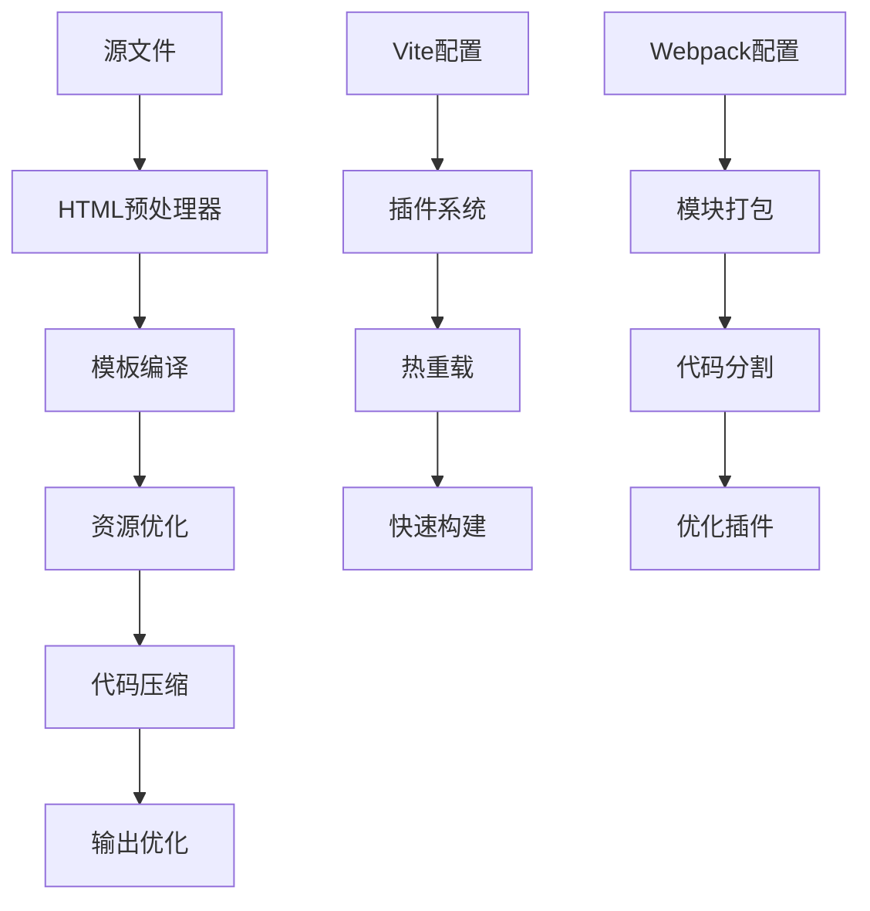
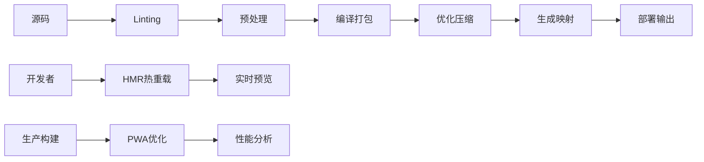

# 构建工具集成

## 🔨 现代构建工具生态系统

### ⚙️ Webpack、Vite、Rollup对比

| 工具 | 速度 | 配置复杂度 | 生态支持 | 适用场景 |
|------|------|-----------|---------|----------|
| **Webpack** | ⭐⭐⭐ | ⭐⭐⭐⭐⭐ | ⭐⭐⭐⭐⭐ | 大型复杂项目 |
| **Vite** | ⭐⭐⭐⭐⭐ | ⭐⭐ | ⭐⭐⭐ | 现代框架开发 |
| **Rollup** | ⭐⭐⭐⭐ | ⭐⭐⭐ | ⭐⭐⭐⭐ | 库文件构建 |

### 📦 HTML构建优化策略



## 🛠️ Vite + HTML 开发环境

### 🚀 快速起步配置

```javascript
// vite.config.js
import { defineConfig } from 'vite'
import { resolve } from 'path'

export default defineConfig({
  root: './src',
  build: {
    outDir: '../dist',
    rollupOptions: {
      input: {
        main: resolve(__dirname, 'src/index.html'),
        about: resolve(__dirname, 'src/about/index.html')
      }
    }
  },
  plugins: [
    // HTML模板处理
    htmlPlugin({
      template: 'src/index.html'
    })
  ]
})
```

### 📁 项目结构优化

```
html-project/
├── src/
│   ├── index.html
│   ├── assets/
│   │   ├── css/
│   │   ├── js/
│   │   └── images/
│   ├── components/
│   └── pages/
├── dist/
├── public/
└── vite.config.js
```

## 🔧 Webpack HTML集成

### 📝 核心插件配置

```javascript
// webpack.config.js
const HtmlWebpackPlugin = require('html-webpack-plugin')
const MiniCssExtractPlugin = require('mini-css-extract-plugin')

module.exports = {
  entry: './src/index.js',
  
  plugins: [
    new HtmlWebpackPlugin({
      template: './src/index.html',
      filename: 'index.html',
      chunks: ['main'],
      minify: {
        removeComments: true,
        collapseWhitespace: true
      }
    }),
    new MiniCssExtractPlugin({
      filename: '[name].[contenthash].css'
    })
  ],
  
  module: {
    rules: [
      {
        test: /\.html$/,
        use: ['html-loader']
      }
    ]
  }
}
```

## 📊 构建性能优化

### ⚡ 关键优化指标

```javascript
// 构建性能监控
const buildMetrics = {
  bundleSize: '1.2MB',
  chunkCount: 15,
  compressionRatio: 0.3,
  buildTime: '12.5s',
  
  optimization: {
    treeShaking: true,
    codeSplitting: true,
    minification: true,
    compression: 'gzip'
  }
}
```

### 🎯 HTML模板引擎集成

```html
<!-- Handlebars模板示例 -->
<!DOCTYPE html>
<html lang="zh-CN">
<head>
    <meta charset="UTF-8">
    <title>{{title}}</title>
    <meta name="description" content="{{description}}">
</head>
<body>
    <header>{{> header}}</header>
    <main>{{> content}}</main>
    <footer>{{> footer}}</footer>
</body>
</html>
```

## 🏗️ 现代化构建流程

### 📈 完整构建管道



### 🛡️ 质量保证集成

```javascript
// 构建时质量检查
const qualityChecks = {
  htmlValidation: true,
  accessibilityAudit: true,
  lighthouseCI: true,
  securityScan: true,
  
  tests: {
    unit: 'jest',
    e2e: 'playwright',
    visual: 'chromatic'
  }
}
```

## 🔗 相关链接

- [[03-23 版本控制协作]]
- [[03-26 自动化测试]]
- [[03-27 部署与监控]]
- [[HTML5语义化/03-1 语义化设计理念]]
- [[技术生态集成/04-2 HTML与JavaScript交互]]

---

*最后更新：2024年* | 🛠️ HTML构建工具专业化指南
