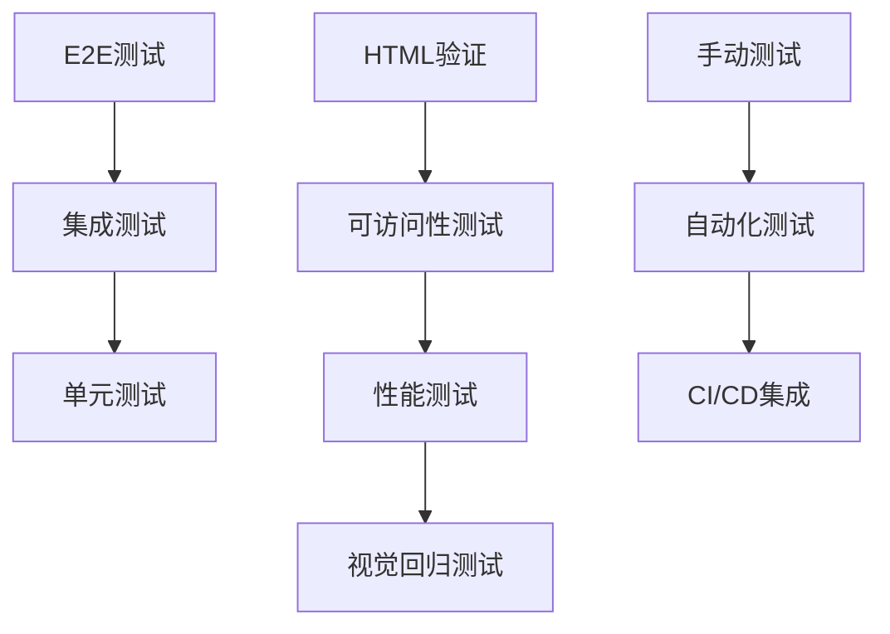

# 自动化测试

## 🧪 HTML质量保证体系

### 📊 测试金字塔结构



### 🎯 测试工具生态

| 测试类型 | 工具 | 自动化程度 | HTML支持 |
|----------|------|-----------|----------|
| **单元测试** | Jest, Vitest | ⭐⭐⭐⭐⭐ | ⭐⭐⭐⭐ |
| **E2E测试** | Playwright, Cypress | ⭐⭐⭐⭐⭐ | ⭐⭐⭐⭐⭐ |
| **可访问性** | axe-core, Lighthouse | ⭐⭐⭐⭐⭐ | ⭐⭐⭐⭐⭐ |
| **性能测试** | WebPageTest, PageSpeed | ⭐⭐⭐⭐ | ⭐⭐⭐⭐⭐ |

## 🔍 HTML验证自动化

### 📝 基础HTML测试

```javascript
// HTML结构验证测试
describe('HTML结构测试', () => {
  test('页面基础结构完整性', async () => {
    const html = await loadHTML('/')
    expect(html).toContain('<!DOCTYPE html>')
    expect(html).toContain('<html lang="zh-CN">')
    expect(html).toContain('<head>')
    expect(html).toContain('<body>')
  })
  
  test('Meta标签完整性', () => {
    const metaTags = document.querySelectorAll('meta')
    expect(metaTags.length).toBeGreaterThan(3)
    expect(document.querySelector('meta[charset]')).toBeTruthy()
    expect(document.querySelector('meta[name="viewport"]')).toBeTruthy()
  })
})
```

### 🎨 语义化标记测试

```javascript
// 语义化HTML验证
describe('语义化结构测试', () => {
  test('文章结构完整性', () => {
    const article = document.querySelector('article')
    const header = document.querySelector('header')
    const main = document.querySelector('main')
    const footer = document.querySelector('footer')
    
    expect(article).toBeTruthy()
    expect(header).toBeTruthy()
    expect(main).toBeTruthy()
    expect(footer).toBeTruthy()
  })
  
  test('标题层级正确性', () => {
    const headings = document.querySelectorAll('h1, h2, h3, h4, h5, h6')
    expect(headings.length).toBeGreaterThan(0)
    
    // 检查是否有且仅有一个h1
    const h1Tags = document.querySelectorAll('h1')
    expect(h1Tags.length).toBe(1)
  })
})
```

## ♿ 可访问性自动化测试

### 🔧 axe-core集成

```javascript
// axe-core 自动化测试
import { injectAxe, checkA11y } from 'axe-playwright'

describe('可访问性测试', () => {
  test('页面基本可访问性', async () => {
    await page.goto('/')
    await injectAxe(page)
    await checkA11y(page, null, {
      detailedReport: true,
      detailedReportOptions: { html: true }
    })
  })
  
  test('表单可访问性', async () => {
    await page.goto('/contact')
    await injectAxe(page)
    
    // 测试表单标签关联
    const labels = await page.$$eval('label', labels => 
      labels.map(l => l.htmlFor || l.textContent)
    )
    expect(labels.length).toBeGreaterThan(0)
    
    await checkA11y(page, '[role="form"]')
  })
})
```

### ⌨️ 键盘导航测试

```javascript
// 键盘导航自动化测试
describe('键盘导航测试', () => {
  test('焦点顺序正确性', async () => {
    await page.goto('/')
    
    // 模拟Tab按键序
    await page.keyboard.press('Tab')
    let focusElement = await page.evaluateHandle(() => document.activeElement)
    
    const focusableElements = []
    for (let i = 0; i < 10; i++) {
      const tagName = await focusElement.evaluate(el => el.tagName)
      focusableElements.push(tagName)
      await page.keyboard.press('Tab')
      focusElement = await page.evaluateHandle(() => document.activeElement)
    }
    
    expect(focusableElements).toContain('A') // 链接应该可聚焦
  })
  
  test('跳过链接功能', async () => {
    await page.goto('/')
    const skipLinks = await page.$$('a[href^="#"]')
    expect(skipLinks.length).toBeGreaterThan(0)
  })
})
```

## 🚀 性能自动化测试

### 📊 Lighthouse CI集成

```javascript
// Playwright性能测试
describe('页面性能测试', () => {
  test('Lighthouse性能审计', async () => {
    await page.goto('/')
    
    const performanceMetrics = await page.evaluate(() => {
      return new Promise(resolve => {
        new PerformanceObserver(list => {
          resolve(list.getEntries()[0])
        }).obscribe({ entryTypes: ['navigation'] })
      })
    })
    
    expect(performanceMetrics.loadEventEnd).toBeLessThan(3000) // 3秒内加载完成
  })
  
  test('图片加载优化', async () => {
    await page.goto('/')
    
    const images = await page.$$eval('img', imgs => 
      imgs.map(img => ({
        loading: img.loading,
        srcset: img.srcset,
        sizes: img.sizes
      }))
    )
    
    images.forEach(img => {
      if (img.loading === 'lazy') {
        expect(img.srcset || img.srcset.length > 0).toBeTruthy()
      }
    })
  })
})
```

## 🎭 视觉回归测试

### 📸 界面一致性检查

```javascript
// Chromatic视觉测试
describe('视觉回归测试', () => {
  test('桌面版界面一致性', async () => {
    await page.setViewport({ width: 1200, height: 800 })
    await page.goto('/')
    
    // 首页截图对比
    const screenshot = await page.screenshot({ fullPage: true })
    
    // 使用Chromatic或自定义算法进行对比
    const diff = await visualDiff.compare(screenshot, 'homepage-desktop.png')
    expect(diff.diffPixels).toBeLessThan(100) // 允许100像素差异
  })
  
  test('移动端适配测试', async () => {
    await page.setViewport({ width: 375, height: 667 })
    await page.goto('/')
    
    const screenshot = await page.screenshot({ fullPage: true })
    const diff = await visualDiff.compare(screenshot, 'homepage-mobile.png')
    expect(diff.diffPixels).toBeLessThan(50)
  })
})
```

## 🔄 CI/CD测试集成

### 🏗️ GitHub Actions配置

```yaml
# .github/workflows/test.yml
name: HTML自动化测试

on: [push, pull_request]

jobs:
  test:
    runs-on: ubuntu-latest
    
    steps:
    - uses: actions/checkout@v3
    
    - name: Setup Node.js
      uses: actions/setup-node@v3
      with:
        node-version: '18'
    
    - name: Install dependencies
      run: npm ci
    
    - name: HTML验证测试
      run: npm run test:html
    
    - name: 可访问性测试
      run: npm run test:a11y
    
    - name: E2E测试
      run: npm run test:e2e
    
    - name: 性能测试
      run: npm run test:lighthouse
```

### 📈 测试报告生成

```javascript
// 测试报告配置
const testReport = {
  reporters: [
    'default',
    ['html', {
      outputFolder: 'test-results/html',
      pageTitle: 'HTML测试报告'
    }],
    ['json', {
      outputFile: 'test-results/results.json'
    }]
  ],
  
  coverage: {
    reporters: ['text', 'html', 'lcov'],
    include: [
      'src/**/*.html',
      'src/**/*.js'
    ]
  }
}
```

## 🔗 相关链接

- [[03-17 页面性能优化]]
- [[03-11 无障碍设计测试]]
- [[03-21 代码质量检查]]
- [[03-25 构建工具集成]]
- [[03-27 部署与监控]]

---

*最后更新：2024年* | 🧪 HTML质量自动化保证体系
