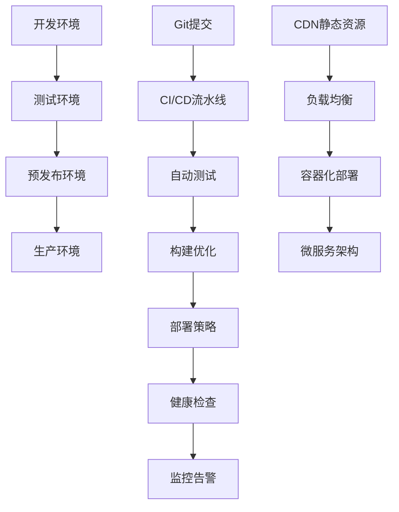

# 部署与监控

## 🚀 HTML项目部署策略

### 📊 部署架构总览



### 🌐 CDN与静态资源优化

| 部署类型 | CND提供商 | 缓存策略 | 适用场景 |
|----------|-----------|----------|----------|
| **静态HTML** | Cloudflare | 7天 | SPA应用 |
| **SSG生成** | Netlify | 1年 | 博客/文档 |
| **动态内容** | AWS CloudFront | 1小时 | 企业应用 |

## 🏗️ 容器化部署

### 🐳 Docker文件配置

```dockerfile
# Dockerfile
FROM nginx:alpine

# 复制HTML静态文件
COPY dist/ /usr/share/nginx/html/

# Nginx配置优化
COPY nginx.conf /etc/nginx/nginx.conf

# 健康检查
HEALTHCHECK --interval=30s --timeout=3s \
  CMD curl -f http://localhost/ || exit 1

EXPOSE 80
CMD ["nginx", "-g", "daemon off;"]
```

### 🔧 Nginx性能配置

```nginx
# nginx.conf
server {
    listen 80;
    server_name example.com;
    root /usr/share/nginx/html;
    
    # Gzip压缩
    gzip on;
    gzip_types
        text/html
        text/css
        application/json
        application/javascript;
    
    # 静态资源缓存
    location ~* \.(css|js|png|jpg|jpeg|gif|ico|svg)$ {
        expires 1y;
        add_header Cache-Control "public, immutable";
    }
    
    # HTML缓存策略
    location ~* \.html$ {
        expires 1h;
        add_header Cache-Control "public, must-revalidate";
    }
    
    # SPA路由支持
    location / {
        try_files $uri $uri/ /index.html;
    }
}
```

## 📊 监控与告警体系

### 🔍 关键性能指标

```javascript
// Web Vitals 监控配置
const performanceMetrics = {
  // Core Web Vitals
  LCP: { // 最大内容绘制
    threshold: 2500, // 2.5秒
    impact: 'high'
  },
  FID: { // 首次输入延迟
    threshold: 100, // 100ms
    impact: 'high'
  },
  CLS: { // 累积布局偏移
    threshold: 0.1,
    impact: 'high'
  },
  
  // 自定义指标
  HTMLValidation: { // HTML规范检查
    threshold: 0.95, // 95%通过率
    impact: 'medium'
  },
  Accessibility: { // 可访问性评分
    threshold: 0.9, // 90分以上
    impact: 'high'
  }
}
```

### 📈 实时监控设置

```javascript
// 性能监控集成
class PerformanceMonitor {
  constructor() {
    this.metrics = {}
    this.initWebVitals()
    this.initErrorTracking()
  }
  
  initWebVitals() {
    // 安装Web Vitals库进行监控
    getCLS(this.reportMetric)
    getFID(this.reportMetric)
    getLCP(this.reportMetric)
  }
  
  reportMetric(metric) {
    // 发送到监控服务
    fetch('/api/metrics', {
      method: 'POST',
      headers: { 'Content-Type': 'application/json' },
      body: JSON.stringify({
        name: metric.name,
        value: metric.value,
        timestamp: Date.now(),
        url: window.location.href
      })
    })
  }
  
  initErrorTracking() {
    // 全局错误捕获
    window.addEventListener('error', (event) => {
      this.reportError({
        type: 'JavaScript Error',
        message: event.message,
        source: event.filename,
        line: event.lineno,
        column: event.colno
      })
    })
    
    window.addEventListener('unhandledrejection', (event) => {
      this.reportError({
        type: 'Unhandled Promise Rejection',
        message: event.reason
      })
    })
  }
  
  reportError(error) {
    fetch('/api/errors', {
      method: 'POST',
      headers: { 'Content-Type': 'application/json' },
      body: JSON.stringify(error)
    })
  }
}
```

## 🔄 DevOps工作流

### 🌊 完整的CI/CD流水线

```yaml
# .github/workflows/deploy.yml
name: HTML项目部署

on:
  push:
    branches: [main]
  pull_request:
    branches: [main]

jobs:
  test:
    runs-on: ubuntu-latest
    steps:
    - uses: actions/checkout@v3
    - name: 运行测试
      run: npm test
    - name: HTML验证
      run: npm run validate:html
    - name: 可访问性测试
      run: npm run test:a11y

  build-and-deploy:
    needs: test
    runs-on: ubuntu-latest
    if: github.ref == 'refs/heads/main'
    
    steps:
    - uses: actions/checkout@v3
    
    - name: 构建项目
      run: npm run build
    
    - name: 构建Docker镜像
      run: docker build -t html-app:${{ github.sha }} .
    
    - name: 部署到生产环境
      run: |
        kubectl set image deployment/html-app html-app=html-app:${{ github.sha }}
        kubectl rollout status deployment/html-app
```

## 📊 监控面板与告警

### 🖥️ Grafana监控面板

```json
{
  "dashboard": {
    "title": "HTML应用监控",
    "panels": [
      {
        "title": "页面加载时间",
        "type": "graph",
        "targets": [
          {
            "expr": "avg(page_load_time)",
            "legendFormat": "平均加载时间"
          }
        ]
      },
      {
       "We服务错误率",
        "type": "stat",
        "targets": [
          {
            "expr": "rate(http_requests_total{status=~'5..'}[5m])",
            "legendFormat": "5xx错误率"
          }
        ]
      }
    ]
  }
}
```

### 📱 告警规则配置

```yaml
# alert-rules.yml
groups:
  - name: html-app-alerts
    rules:
      - alert: HighErrorRate
        expr: rate(http_requests_total{status=~'5..'}[5m]) > 0.05
        for: 2m
        labels:
          severity: critical
        annotations:
          summary: "HTML应用错误率过高"
          description: "过去5分钟内错误率超过5%"
      
      - alert: SlowPageLoad
        expr: avg(page_load_time) > 3000
        for: 5m
        labels:
          severity: warning
        annotations:
          summary: "页面加载时间过长"
          description: "平均页面加载时间超过3秒"
```

## 🔗 相关链接

- [[03-23 版本控制协作]]
- [[03-25 构建工具集成]]
- [[03-26 自动化测试]]
- [[SEO性能优化/03-16 页面性能优化]]
- [[实战项目案例/04-17 企业官网重构项目]]

---

*最后更新：2024年* | 🚀 HTML现代化部署运维体系
