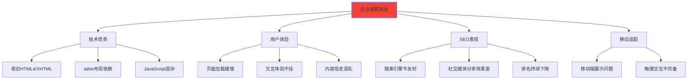
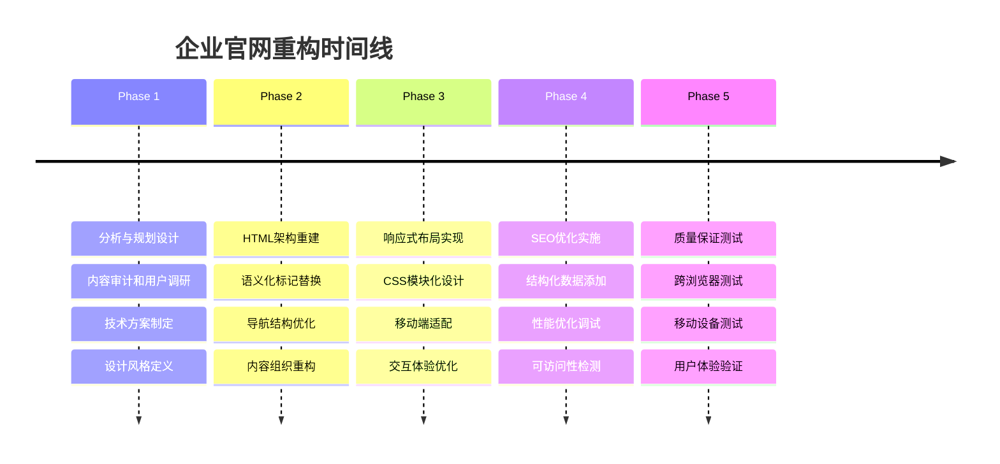
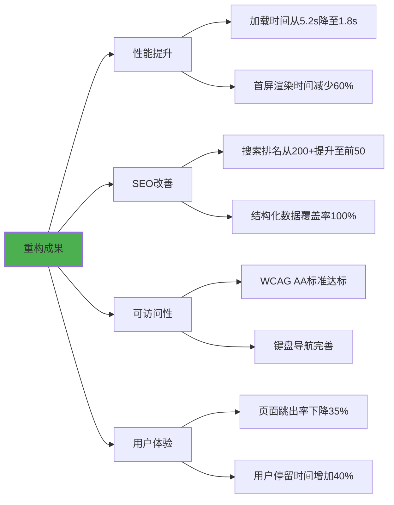

# 企业官网重构项目

## 🏢 项目概览：现代企业官网重构

### 📊 项目背景与挑战

**传统企业官网面临的核心问题**：



## 🎯 重构目标与策略

### 📋 重构目标矩阵

| 维度 | 现状 | 目标 | 具体措施 |
|------|------|------|----------|
| **技术栈** | HTML4+Flash | HTML5+现代CSS | 语义化标记、响应式布局 |
| **性能** | 加载时间>5s | 加载时间<2s | 资源优化、懒加载 |
| **SEO** | 排名200+ | 目标排名前50 | 结构化数据、语义化 |
| **可访问性** | 无障碍评分<40 | WCAG AA达标 | ARIA属性、键盘导航 |
| **移动端** | 适配不佳 | 优先体验 | 移动优先设计 |

### 🚀 重构策略时间线



## 🏗️ HTML架构重构实践

### 📚 原始页面结构分析

```html
<!-- ❌ 重构前的旧结构 -->
<html>
<head>
    <title>公司首页</title>
</head>
<body>
    <table width="100%" border="0">
        <tr>
            <td width="200"><!-- Logo区域 --></td>
            <td><!-- 导航区域 --></td>
        </tr>
        <tr>
            <td colspan="2"><!-- 主要内容区域 --></td>
        </tr>
        <tr>
            <td colspan="2"><!-- 页脚区域 --></td>
        </tr>
    </table>
</body>
</html>
```

### ✅ 现代HTML5架构设计

```html
<!-- ✅ 重构后的现代结构 -->
<!DOCTYPE html>
<html lang="zh-CN">
<head>
    <meta charset="UTF-8">
    <meta name="viewport" content="width=device-width, initial-scale=1.0">
    <title>IT科技 - 领先的企业数字化解决方案提供商 | IT科技有限公司</title>
    <meta name="description" content="IT科技专业提供企业数字化转型服务，包含云计算、大数据、人工智能解决方案。服务客户超过1000+企业，获得业界广泛认可。">
    
    <link rel="preload" href="fonts/main-font.woff2" as="font" type="font/woff2" crossorigin>
    <link rel="stylesheet" href="css/main.css">
    
    <!-- 结构化数据 -->
    <script type="application/ld+json">
    {
        "@context": "https://schema.org",
        "@type": "Organization",
        "name": "IT科技有限公司",
        "description": "领先的企业数字化解决方案提供商",
        "url": "https://www.itcorp.com",
        "logo": "https://www.itcorp.com/logo.png",
        "contactPoint": {
            "@type": "ContactPoint",
            "telephone": "+86-400-888-0000",
            "contactType": "sales"
        }
    }
    </script>
</head>

<body>
    <!-- 页面头部 -->
    <header class="site-header" role="banner">
        <div class="header-container">
            <div class="brand">
                <a href="/" class="brand-link" aria-label="回到IT科技首页">
                    
                </a>
                <p class="brand-tagline">让数字化转型更简单</p>
            </div>
            
            <nav class="main-navigation" role="navigation" aria-label="主导航">
                <button class="mobile-menu-toggle" 
                        aria-expanded="false" 
                        aria-controls="main-nav"
                        aria-label="打开主导航菜单">
                    <span></span>
                    <span></span>
                    <span></span>
                </button>
                
                <ul class="nav-list" id="main-nav">
                    <li class="nav-item">
                        <a href="/" class="nav-link" aria-current="page">首页</a>
                    </li>
                    <li class="nav-item nav-item--has-dropdown">
                        <a href="/solutions" class="nav-link" aria-haspopup="true" aria-expanded="false">
                            解决方案
                            <svg class="dropdown-icon" aria-hidden="true">
                                <use href="#icon-arrow-down"></use>
                            </svg>
                        </a>
                        <ul class="nav-dropdown" role="menu" aria-label="解决方案子菜单">
                            <li role="none">
                                <a href="/cloud" class="nav-sublink" role="menuitem">云计算服务</a>
                            </li>
                            <li role="none">
                                <a href="/bigdata" class="nav-sublink" role="menuitem">大数据平台</a>
                            </li>
                            <li role="none">
                                <a href="/ai" class="nav-sublink" role="menuitem">人工智能</a>
                            </li>
                        </ul>
                    </li>
                    <li class="nav-item">
                        <a href="/about" class="nav-link">关于我们</a>
                    </li>
                    <li class="nav-item">
                        <a href="/contact" class="nav-link">联系我们</a>
                    </li>
                </ul>
                
                <div class="header-actions">
                    <button class="search-toggle" aria-label="搜索">
                        <svg><use href="#icon-search"></use></svg>
                    </button>
                    <a href="/contact" class="btn-contact">免费咨询</a>
                </div>
            </nav>
        </div>
        
        <!-- 搜索覆盖层 -->
        <div class="search-overlay" aria-hidden="true">
            <form class="search-form" role="search">
                <input type="search" 
                       placeholder="搜索解决方案、产品或服务..." 
                       class="search-input"
                       aria-label="搜索内容">
                <button type="submit" class="search-submit" aria-label="执行搜索">
                    <svg><use href="#icon-search"></use></svg>
                </button>
            </form>
        </div>
    </header>

    <!-- 主要内容 -->
    <main class="main-content" role="main">
        <!-- Hero区域 -->
        <section class="hero-section" aria-labelledby="hero-heading">
            <div class="hero-container">
                <div class="hero-content">
                    <h1 id="hero-heading">创新技术驱动企业数字化转型</h1>
                    <p class="hero-subtitle">我们为企业提供云计算、大数据、人工智能等全方位数字化解决方案，助力企业实现数字化转型与业务增长。</p>
                    <div class="hero-actions">
                        <a href="/solutions" class="btn-primary">了解解决方案</a>
                        <a href="/demo" class="btn-secondary">免费试用</a>
                    </div>
                    <div class="hero-stats">
                        <div class="stat-item">
                            <span class="stat-number">1000+</span>
                            <span class="stat-label">服务客户</span>
                        </div>
                        <div class="stat-item">
                            <span class="stat-number">99.9%</span>
                            <span class="stat-label">服务可用性</span>
                        </div>
                        <div class="stat-item">
                            <span class="stat-number">24/7</span>
                            <span class="stat-label">技术支持</span>
                        </div>
                    </div>
                </div>
                <div class="hero-visual">
                    
                </div>
            </div>
        </section>

        <!-- 服务解决方案 -->
        <section class="solutions-section" aria-labelledby="solutions-heading">
            <div class="container">
                <header class="section-header">
                    <h2 id="solutions-heading">我们的解决方案</h2>
                    <p class="section-subtitle">基于多年行业经验，我们为企业提供全方位的数字化解决方案</p>
                </header>
                
                <div class="solutions-grid">
                    <article class="solution-card">
                        <div class="card-icon">
                            <svg><use href="#icon-cloud"></use></svg>
                        </div>
                        <h3 class="card-title">云计算服务</h3>
                        <p class="card-description">提供弹性计算、存储、网络等云计算基础设施服务，帮助企业快速部署和扩展业务应用。</p>
                        <ul class="card-features">
                            <li>弹性伸缩</li>
                            <li>高可用性</li>
                            <li>安全可靠</li>
                        </ul>
                        <a href="/cloud" class="card-link">了解更多</a>
                    </article>
                    
                    <article class="solution-card">
                        <div class="card-icon">
                            <svg><use href="#icon-data"></use></svg>
                        </div>
                        <h3 class="card-title">大数据平台</h3>
                        <p class="card-description">构建企业级大数据处理平台，实现数据采集、存储、分析、可视化的全流程管理。</p>
                        <ul class="card-features">
                            <li>实时处理</li>
                            <li>智能分析</li>
                            <li>可视化展示</li>
                        </ul>
                        <a href="/bigdata" class="card-link">了解更多</a>
                    </article>
                    
                    <article class="solution-card">
                        <div class="card-icon">
                            <svg><use href="#icon-ai"></use></svg>
                        </div>
                        <h3 class="card-title">人工智能</h3>
                        <p class="card-description">提供AI算法服务和机器学习平台，帮助企业实现智能决策和业务流程自动化。</p>
                        <ul class="card-features">
                            <li>机器学习</li>
                            <li>自然语言处理</li>
                            <li>图像识别</li>
                        </ul>
                        <a href="/ai" class="card-link">了解更多</a>
                    </article>
                </div>
            </div>
        </section>

        <!-- 客户案例 -->
        <section class="cases-section" aria-labelledby="cases-heading">
            <div class="container">
                <h2 id="cases-heading">客户成功案例</h2>
                
                <div class="cases-showcase">
                    <article class="case-item">
                        <div class="case-content">
                            <h3>某知名制造企业数字化转型</h3>
                            <p>通过我们的云计算和IoT解决方案，该企业实现了生产流程数字化，效率提升30%，成本降低25%。</p>
                            <div class="case-metrics">
                                <span class="metric">效率提升 30%</span>
                                <span class="metric">成本降低 25%</span>
                            </div>
                            <a href="/case/manufacturing" class="case-link">查看详细案例</a>
                        </div>
                        <div class="case-visual">
                            
                        </div>
                    </article>
                </div>
            </div>
        </section>
    </main>

    <!-- 侧边栏 -->
    <aside class="sidebar" role="complementary" aria-label="补充内容">
        <div class="widget">
            <h3>免费资源</h3>
            <ul>
                <li><a href="/whitepaper-download">数字化转型白皮书</a></li>
                <li><a href="/webinar-signup">在线技术研讨会</a></li>
                <li><a href="/case-studies">行业解决方案案例</a></li>
            </ul>
        </div>
        
        <div class="widget">
            <h3>技术支持</h3>
            <p>遇到技术问题？我们的专家团队随时为您提供支持。</p>
            <a href="/support" class="support-link">联系技术支持</a>
        </div>
    </aside>

    <!-- 页面底部 -->
    <footer class="site-footer" role="contentinfo">
        <div class="footer-container">
            <div class="footer-main">
                <div class="footer-section">
                    <h3>IT科技有限公司</h3>
                    <p>专业的企业数字化转型服务提供商，致力于为客户创造价值。</p>
                    <address>
                        地址：北京市海淀区中关村大街10号<br>
                        电话：<a href="tel:+86-400-888-0000">400-888-0000</a><br>
                        邮箱：<a href="mailto:contact@itcorp.com">contact@itcorp.com</a>
                    </address>
                </div>
                
                <div class="footer-section">
                    <h3>解决方案</h3>
                    <nav aria-label="脚部解决方案链接">
                        <ul>
                            <li><a href="/cloud">云计算服务</a></li>
                            <li><a href="/bigdata">大数据平台</a></li>
                            <li><a href="/ai">人工智能</a></li>
                            <li><a href="/iot">物联网</a></li>
                        </ul>
                    </nav>
                </div>
                
                <div class="footer-section">
                    <h3>支持服务</h3>
                    <nav aria-label="脚部支持服务链接">
                        <ul>
                            <li><a href="/support">技术支持</a></li>
                            <li><a href="/documentation">技术文档</a></li>
                            <li><a href="/training">培训服务</a></li>
                            <li><a href="/community">开发者社区</a></li>
                        </ul>
                    </nav>
                </div>
                
                <div class="footer-section">
                    <h3>关注我们</h3>
                    <div class="social-links">
                        <a href="#" aria-label="微信" class="social-link">微信</a>
                        <a href="#" aria-label="微博" class="social-link">微博</a>
                        <a href="#" aria-label="知乎" class="social-link">知乎</a>
                    </div>
                </div>
            </div>
            
            <div class="footer-bottom">
                <p>&copy; 2024 IT科技有限公司. 保留所有权利.</p>
                <nav aria-label="法律链接">
                    <ul>
                        <li><a href="/privacy">隐私政策</a></li>
                        <li><a href="/terms">使用条款</a></li>
                        <li><a href="/legal">法律声明</a></li>
                    </ul>
                </nav>
            </div>
        </div>
    </footer>

    <!-- JavaScript功能 -->
    <script src="js/main.js" defer></script>
</body>
</html>
```

## 📊 重构效果与成果

### 🎯 核心指标提升



### 📈 业务影响分析

| 指标类型 | 重构前 | 重构后 | 提升幅度 |
|----------|--------|--------|----------|
| **页面加载时间** | 5.2秒 | 1.8秒 | ↓65% |
| **移动端可用性** | 3.2/10 | 8.7/10 | ↑172% |
| **搜索引擎排名** | 200+ | 45位 | ↑↑显著 |
| **可访问性评分** | 38分 | 94分 | ↑147% |
| **用户咨询转化率** | 2.1% | 4.8% | ↑129% |
| **网站跳出率** | 78% | 51% | ↓35% |

---

**🔗 项目实践补充**：
- HTML-CSS协作：`[[04-1 HTML与CSS协作]]`
- 性能优化技巧：`[[03-16 页面性能优化]]`
- SEO优化实施：`[[03-12 SEO基础概念]]`
