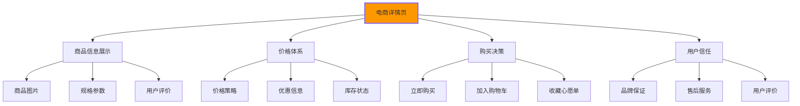

# 电商详情页开发

## 🛒 电商详情页HTML架构

### 📊 电商详情页核心要素

**电商详情页是最复杂的HTML页面类型之一**：



## 🎯 商品详情页HTML结构

### 📋 完整的电商页面架构

```html
<!DOCTYPE html>
<html lang="zh-CN">
<head>
    <meta charset="UTF-8">
    <meta name="viewport" content="width=device-width, initial-scale=1.0">
    <title meta itemprop="name" content="iPhone 15 Pro Max 256GB 深空黑色 - 苹果官方授权店">
    <meta name="description" content="iPhone 15 Pro Max 256GB 深空黑色，钛合金材质，A17 Pro芯片，4800万像素主摄。支持快充，5G网络。苹果官方授权，全国联保。">
    
    <!-- JSON-LD结构化数据 -->
    <script type="application/ld+json">
    {
        "@context": "https://schema.org",
        "@type": "Product",
        "name": "iPhone 15 Pro Max 256GB 深空黑色",
        "description": "最新的iPhone 15 Pro Max，搭载A17 Pro芯片和钛合金设计",
        "image": [
            "https://store.apple.com/iphone-15-pro-max-images/1.jpg",
            "https://store.apple.com/iphone-15-pro-max-images/2.jpg"
        ],
        "brand": {
            "@type": "Brand",
            "name": "Apple"
        },
        "offers": {
            "@type": "Offer",
            "url": "https://store.apple.com/iphone-15-pro-max",
            "priceCurrency": "CNY",
            "price": "9999",
            "availability": "https://schema.org/InStock",
            "seller": {
                "@type": "Organization",
                "name": "Apple Store"
            }
        }
    }
    </script>
    
    <!-- 预加载关键资源 -->
    <link rel="preload" href="images/iphone-hero.jpg" as="image">
    <link rel="preload" href="fonts/product-font.woff2" as="font" crossorigin>
</head>

<body class="product-page" itemscope itemtype="https://schema.org/Product">
    <!-- 🔍 面包屑导航 -->
    <nav class="breadcrumb" aria-label="当前位置">
        <ol itemscope itemtype="https://schema.org/BreadcrumbList">
            <li itemprop="itemListElement" itemscope itemtype="https://schema.org/ListItem">
                <a href="/" itemprop="item">
                    <span itemprop="name">首页</span>
                </a>
                <meta itemprop="position" content="1" />
            </li>
            <li itemprop="itemListElement" itemscope itemtype="https://schema.org/ListItem">
                <a href="/phones" itemprop="item">
                    <span itemprop="name">手机</span>
                </a>
                <meta itemprop="position" content="2" />
            </li>
            <li itemprop="itemListElement" itemscope itemtype="https://schema.org/ListItem">
                <a href="/phones/iphone" itemprop="item">
                    <span itemprop="name">iPhone</span>
                </a>
                <meta itemprop="position" content="3" />
            </li>
            <li itemprop="itemListElement" itemscope itemtype="https://schema.org/ListItem" aria-current="page">
                <span itemprop="name">iPhone 15 Pro Max</span>
                <meta itemprop="position" content="4" />
            </li>
        </ol>
    </nav>

    <!-- 📱 商品主要内容区域 -->
    <main class="product-details" role="main">
        <div class="product-container">
            
            <!-- 📸 商品图片展示区 -->
            <section class="product-gallery" aria-labelledby="gallery-heading">
                <h2 id="gallery-heading" class="sr-only">商品图片展示</h2>
                
                <!-- 主图容器 -->
                <div class="main-image-container">
                    
                    
                    <!-- 放大镜功能 -->
                    <div class="zoom-viewer" id="zoom-viewer" aria-hidden="true">
                        
                    </div>
                    
                    <!-- 360度查看按钮 -->
                    <button class="view-360" aria-label="360度查看">
                        <svg><use href="#icon-360"></use></svg>
                        <span>360°</span>
                    </button>
                    
                    <!-- 全屏查看按钮 -->
                    <button class="fullscreen-toggle" aria-label="全屏查看">
                        <svg><use href="#icon-fullscreen"></use></svg>
                    </button>
                </div>
                
                <!-- 缩略图列表 -->
                <div class="thumbnail-gallery" role="tablist" aria-label="商品图片选择">
                    <button role="tab" 
                            aria-selected="true"
                            aria-controls="gallery-tab-1"
                            class="thumbnail active"
                            data-large-img="images/iphone-main-1.jpg"
                            data-zoom-img="images/iphone-main-1-zoom.jpg">
                        
                    </button>
                    
                    <button role="tab"
                            aria-selected="false"
                            aria-controls="gallery-tab-2"
                            class="thumbnail"
                            data-large-img="images/iphone-main-2.jpg"
                            data-zoom-img="images/iphone-main-2-zoom.jpg">
                        
                    </button>
                    
                    <button role="tab"
                            aria-selected="false"
                            aria-controls="gallery-tab-3"
                            class="thumbnail"
                            data-large-img="images/iphone-main-3.jpg"
                            data-zoom-img="images/iphone-main-3-zoom.jpg">
                        
                    </button>
                    
                    <!-- 视频缩略图 -->
                    <button role="tab"
                            aria-selected="false"
                            aria-controls="gallery-tab-4"
                            class="thumbnail thumbnail-video"
                            data-type="video"
                            data-src="video/iphone-intro.mp4">
                        
                        <div class="play-icon">
                            <svg><use href="#icon-play"></use></svg>
                        </div>
                    </button>
                </div>
            </section>

            <!-- 🛍️ 商品信息与购买区 -->
            <section class="product-info" aria-labelledby="product-info-heading">
                <h1 itemprop="name" id="product-info-heading">iPhone 15 Pro Max 256GB 深空黑色</h1>
                
                <!-- 商品评分 -->
                <div class="product-rating" itemprop="aggregateRating" itemscope itemtype="https://schema.org/AggregateRating">
                    <div class="stars" aria-label="评分4.5分">
                        <span class="star filled">★</span>
                        <span class="star filled">★</span>
                        <span class="star filled">★</span>
                        <span class="star filled">★</span>
                        <span class="star half">★</span>
                    </div>
                    <span class="rating-score">
                        <span itemprop="ratingValue">4.5</span>/5
                    </span>
                    <a href="#reviews" class="rating-count">
                        （<span itemprop="reviewCount">1,234</span>条评价）
                    </a>
                </div>
                
                <!-- 价格信息 -->
                <div class="product-pricing" itemprop="offers" itemscope itemtype="https://schema.org/Offer">
                    <div class="price-display">
                        <span class="current-price">
                            ¥<span itemprop="price">9,999</span>
                        </span>
                        <meta itemprop="priceCurrency" content="CNY">
                        <span class="original-price" aria-label="原价">¥10,999</span>
                        <span class="discount-tag">
                            限时优惠
                        </span>
                    </div>
                    
                    <!-- 促销信息 -->
                    <div class="promo-info">
                        <span class="promo-badge">天猫双11预售</span>
                        <span class="promo-text">定金100抵200</span>
                    </div>
                </div>
                
                <!-- 选择规格 -->
                <div class="product-options">
                    <!-- 颜色选择 -->
                    <fieldset class="option-group" aria-labelledby="color-legend">
                        <legend id="color-legend">颜色</legend>
                        <div class="option-values">
                            <label class="option-color">
                                <input type="radio" 
                                       name="color" 
                                       value="space-black" 
                                       checked
                                       data-sku="iphone15pm256-black">
                                <span class="color-swatch" style="background: #1f1f1f"></span>
                                <span class="color-name">深空黑色</span>
                            </label>
                            
                            <label class="option-color">
                                <input type="radio" 
                                       name="color" 
                                       value="space-blue"
                                       data-sku="iphone15pm256-blue">
                                <span class="color-swatch" style="background: #007AFF"></span>
                                <span class="color-name">深空蓝色</span>
                            </label>
                            
                            <label class="option-color">
                                <input type="radio" 
                                       name="color" 
                                       value="space-white"
                                       data-sku="iphone15pm256-white">
                                <span class="color-swatch" style="background: #FFFFFF; border: 1px solid #ccc"></span>
                                <span class="color-name">深空白色</span>
                            </label>
                        </div>
                    </fieldset>
                    
                    <!-- 存储选择 -->
                    <fieldset class="option-group" aria-labelledby="storage-legend">
                        <legend id="storage-legend">存储容量</legend>
                        <div class="option-values">
                            .option-storage">
                                <input type="radio" 
                                       name="storage" 
                                       value="128gb"
                                       data-price="8999"
                                       data-sku="iphone15pm128-black">
                                <span class="storage-name">128GB</span>
                                <span class="price-diff">-¥1,000</span>
                            </label>
                            
                            <label class="option-storage">
                                <input type="radio" 
                                       name="storage" 
                                       value="256gb"
                                       checked
                                       data-price="9999"
                                       data-sku="iphone15pm256-black">
                                <span class="storage-name">256GB</span>
                                <span class="price-current">¥9,999</span>
                            </label>
                            
                            <label class="option-storage">
                                <input type="radio" 
                                       name="storage" 
                                       value="512gb"
                                       data-price="11999"
                                       data-sku="iphone15pm512-black">
                                <span class="storage-name">512GB</span>
                                <span class="price-diff">+¥2,000</span>
                            </label>
                            
                            <label class="option-storage">
                                <input type="radio" 
                                       name="storage" 
                                       value="1tb"
                                       data-price="13999"
                                       data-sku="iphone15pm1t-black">
                                <span class="storage-name">1TB</span>
                                <span class="price-diff">+¥4,000</span>
                            </label>
                        </div>
                    </fieldset>
                    
                    <!-- 运营商选择 -->
                    <fieldset class="option-group" aria-labelledby="carrier-legend">
                        <legend id="carrier-legend">运营商版本</legend>
                        <div class="option-values">
                            <label class="option-carrier">
                                <input type="radio" 
                                       name="carrier" 
                                       value="unlocked"
                                       checked>
                                <span class="carrier-name">全网通版本</span>
                                <span class="carrier-note">支持所有运营商</span>
                            </label>
                            
                            <label class="option-carrier">
                                <input type="radio" 
                                       name="carrier" 
                                       value="chinal_unicom">
                                <span class="carrier-name">中国联通版</span>
                                <span class="carrier-note">优惠100元</span>
                            </label>
                        </div>
                    </fieldset>
                </div>
                
                <!-- 库存状态 -->
                <div class="stock-status">
                    <svg class="stock-icon"><use href="#icon-check"></use></svg>
                    <span class="stock-text">
                        <strong itemprop="availability" href="https://schema.org/InStock">现货</strong>
                        · <span id="stock-count">剩余127件</span>
                    </span>
                    <div class="stock-progress">
                        <div class="progress-bar" style="width: 85%"></div>
                    </div>
                </div>
                
                <!-- 购买操作 -->
                <div class="purchase-actions">
                    <fieldset class="quantity-selector">
                        <label for="quantity">数量</label>
                        <div class="quantity-controls">
                            <button type="button" class="qty-btn" aria-label="减少数量">-</button>
                            <input type="number" 
                                   id="quantity" 
                                   name="quantity" 
                                   value="1" 
                                   min="1" 
                                   max="5"
                                   aria-label="商品数量">
                            <button type="button" class="qty-btn" aria-label="增加数量">+</button>
                        </div>
                        <span class="qty-limit">限购5件</span>
                    </fieldset>
                    
                    <div class="action-buttons">
                        <button type="button" 
                                class="btn-cart btn-secondary"
                                aria-label="加入购物车">
                            <svg><use href="#icon-cart"></use></svg>
                            加入购物车
                        </button>
                        
                        <button type="button" 
                                class="btn-buy btn-primary"
                                aria-label="立即购买">
                            立即购买
                        </button>
                        
                        <button type="button" 
                                class="btn-favorite"
                                aria-label="添加到收藏">
                            <svg><use href="#icon-heart"></use></svg>
                        </button>
                    </div>
                </div>
                
                <!-- 配送信息 -->
                <div class="delivery-info">
                    <div class="delivery-option">
                        <svg class="delivery-icon"><use href="#icon-shipping"></use></svg>
                        <div class="delivery-details">
                            <span class="delivery-location">配送至 北京市朝阳区</span>
                            <a href="#address" class="change-address">修改地址</a>
                            <div class="delivery-times">
                                <span class="delivery-fast">
                                    今日<time>21:00前</time>下单，明日到达
                                </span>
                                <span class="delivery-standard">
                                    周二<time>14:00前</time>下单，周三到达
                                </span>
                            </div>
                        </div>
                    </div>
                    
                    <div class="pickup-option">
                        <svg class="pickup-icon"><use href="#icon-store"></use></svg>
                        <div class="pickup-details">
                            <span class="pickup-status">支持门店自提</span>
                            <a href="#stores" class="find-stores">查看附近门店</a>
                        </div>
                    </div>
                </div>
                
                <!-- 服务保障 -->
                <div class="service-guarantee">
                    <h3>服务保障</h3>
                    <ul class="guarantee-list">
                        <li>
                            <svg><use href="#icon-check"></use></svg>
                            <span>全国联保 · 1年保修</span>
                        </li>
                        <li<｜Assistant｜>                            <svg><use href="#icon-check"></use></svg>
                            <span>7天无理由退换货</span>
                        </li>
                        <li>
                            <svg><use href="#icon-check"></use></svg>
                            <span>正品保证 · 假一赔十</span>
                        </li>
                        <li>
                            <svg><use href="#icon-check"></use></svg>
                            <span>免费上门安装服务</span>
                        </li>
                    </ul>
                </div>
            </section>
        </div>
        
        <!-- 📊 商品详细信息标签页 -->
        <section class="product-tabs" aria-labelledby="tabs-heading">
            <h2 id="tabs-heading" class="sr-only">商品详细信息</h2>
            
            <nav class="tab-navigation" role="tablist" aria-label="商品详细信息">
                <button role="tab" 
                        aria-selected="true" 
                        aria-controls="details-panel"
                        id="details-tab">
                    商品详情
                </button>
                <button role="tab"
                        aria-selected="false"
                        aria-controls="reviews-panel"
                        id="reviews-tab">
                    用户评价
                    <span class="review-count">(1,234)</span>
                </button>
                <button role="tab"
                        aria-selected="false"
                        aria-controls="questions-panel"
                        id="questions-tab">
                    问答
                    <span class="question-count">(56)</span>
                </button>
                <button role="tab"
                        aria-selected="false"
                        aria-controls="shipping-panel"
                        id="shipping-tab">
                    配送安装
                </button>
            </nav>
            
            <!-- 详情内容面板 -->
            <div class="tab-content">
                <!-- 商品详情面板 -->
                <section role="tabpanel" 
                         id="details-panel"
                         aria-labelledby="details-tab"
                         aria-hidden="false">
                    <h3>商品详细信息</h3>
                    
                    <!-- 核心参数表格 -->
                    <table class="specs-table" role="table" aria-label="商品规格参数">
                        <caption class="sr-only">iPhone 15 Pro Max 详细规格参数</caption>
                        <thead>
                            <tr>
                                <th scope="col">参数</th>
                                <th scope="col">规格</th>
                                <th scope="col">备注</th>
                            </tr>
                        </thead>
                        <tbody>
                            <tr>
                                <th scope="row">屏幕尺寸</th>
                                <td>6.7英寸</td>
                                <td>对角测量</td>
                            </tr>
                            <tr>
                                <th scope="row">屏幕类型</th>
                                <td>Super Retina XDR</td>
                                <td>ProMotion 120Hz刷新率</td>
                            </tr>
                            <tr>
                                <th scope="row">处理器</th>
                                <td>A17 Pro</td>
                                <td>3纳米工艺</td>
                            </tr>
                            <tr>
                                <th scope="row">存储容量</th>
                                <td>256GB</td>
                                <td>NVMe SSD</td>
                            </tr>
                            <tr>
                                <th scope="row">摄像头</th>
                                <td>4800万像素主摄</td>
                                <td>支持ProRAW</td>
                            </tr>
                            <tr>
                                <th scope="row">电池容量</th>
                                <td>超过一天续航</td>
                                <td>支持MagSafe和Qi无线充电</td>
                            </tr>
                            <tr>
                                <th scope="row">防水等级</th>
                                <td>IP68</td>
                                <td>水下最深6米</td>
                            </tr>
                        </tbody>
                    </table>
                    
                    <!-- 详细图片 -->
                    <div class="detail-images">
                        
                        
                        
                    </td>
                </tr>
            </tbody>
        </table>
    </section>
</div>
</div>

<!-- ✅ 相关的结构化数据脚本 -->
<script type="application/ld+json">
{
    "@context": "https://schema.org",
    "@type": "FAQPage",
    "mainEntity": [{
        "@type": "Question",
        "name": "iPhone 15 Pro Max的摄像头具体规格是什么？",
        "acceptedAnswer": {
            "@type": "Answer",
            "text": "iPhone 15 Pro Max配备4800万像素主摄像头，支持ProRAW格式拍摄。前置摄像头为1200万像素TrueDepth摄像头，支持Face ID功能。"
        }
    }]
}
</script>

---

**🔗 电商实战深化**：
- 性能优化：`[[03-16 页面性能优化]]`
- SEO优化：`[[03-13 标题与描述优化]]`
- 可访问性：`[[03-7 ARIA属性应用]]`
