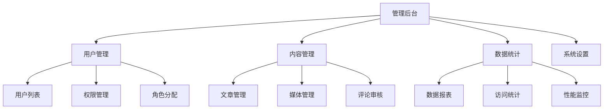

# 后台管理系统HTML架构

## 🏢 系统架构设计

### 📊 管理后台功能模块



### ⚡ HTML页面结构规划

| 模块 | HTML页面 | 权限要求 | 响应式 |
|------|----------|----------|--------|
| **仪表盘** | dashboard.html | 所有用户 | ✅ |
| **用户管理** | users.html | 管理员 | ✅ |
| **内容管理** | content.html | 编辑+ | ✅ |
| **数据统计** | analytics.html | 高级用户 | ✅ |

## 🔧 核心HTML实现

### 📝 管理后台主框架

```html
<!DOCTYPE html>
<html lang="zh-CN">
<head>
    <meta charset="UTF-8">
    <meta name="viewport" content="width=device-width, initial-scale=1.0">
    <title>后台管理系统</title>
    
    <!-- 管理后台样式 -->
    <style>
        /* 基础布局 */
        .admin-container {
            display: flex;
            min-height: 100vh;
            font-family: -apple-system, BlinkMacSystemFont, sans-serif;
        }
        
        /* 侧边栏 */
        .admin-sidebar {
            width: 250px;
            background: #2c3e50;
            color: white;
            position: fixed;
            height: 100%;
            overflow-y: auto;
            transition: transform 0.3s ease;
        }
        
        .sidebar-brand {
            padding: 1rem;
            border-bottom: 1px solid #34495e;
            font-size: 1.2rem;
            font-weight: bold;
        }
        
        .sidebar-nav {
            list-style: none;
            padding: 0;
            margin: 0;
        }
        
        .nav-item {
            border-bottom: 1px solid #34495e;
        }
        
        .nav-link {
            display: block;
            padding: 1rem;
            color: #ecf0f1;
            text-decoration: none;
            transition: background 0.2s ease;
        }
        
        .nav-link:hover,
        .nav-link.active {
            background: #3498db;
            color: white;
        }
        
        .nav-submenu {
            background: #34495e;
            list-style: none;
            padding: 0;
            margin: 0;
            display: none;
        }
        
        .nav-item.expanded .nav-submenu {
            display: block;
        }
        
        .submenu-link {
            padding: 0.75rem 1rem 0.75rem 2rem;
            color: #bdc3c7;
            font-size: 0.9rem;
        }
        
        /* 主内容区 */
        .admin-main {
            flex: 1;
            margin-left: 250px;
            background: #ecf0f1;
        }
        
        /* 顶部导航 */
        .admin-header {
            background: white;
            padding: 1rem 2rem;
            border-bottom: 1px solid #ddd;
            display: flex;
            justify-content: space-between;
            align-items: center;
            box-shadow: 0 2px 4px rgba(0,0,0,0.1);
        }
        
        .header-left {
            display: flex;
            align-items: center;
            gap: 1rem;
        }
        
        .mobile-menu-toggle {
            display: none;
            background: none;
            border: none;
            font-size: 1.5rem;
            cursor: pointer;
        }
        
        .breadcrumb {
            display: flex;
            align-items: center;
            gap: 0.5rem;
            font-size: 0.9rem;
            color: #7f8c8d;
        }
        
        .header-right {
            display: flex;
            align-items: center;
            gap: 1rem;
        }
        
        .notification-badge {
            background: #e74c3c;
            color: white;
            border-radius: 50%;
            width: 20px;
            height: 20px;
            display: flex;
            align-items: center;
            justify-content: center;
            font-size: 0.8rem;
            position: relative;
        }
        
        .user-menu {
            position: relative;
        }
        
        .user-avatar {
            width: 36px;
            height: 36px;
            border-radius: 50%;
            background: #3498db;
            display: flex;
            align-items: center;
            justify-content: center;
            color: white;
            cursor: pointer;
        }
        
        /* 内容区域 */
        .admin-content {
            padding: 2rem;
        }
        
        /* 仪表盘样式 */
        .dashboard-grid {
            display: grid;
            grid-template-columns: repeat(auto-fit, minmax(250px, 1fr));
            gap: 1.5rem;
            margin-bottom: 2rem;
        }
        
        .stat-card {
            background: white;
            padding: 2rem;
            border-radius: 8px;
            box-shadow: 0 2px 4px rgba(0,0,0,0.1);
            text-align: center;
        }
        
        .stat-icon {
            font-size: 3rem;
            margin-bottom: 1rem;
        }
        
        .stat-value {
            font-size: 2rem;
            font-weight: bold;
            color: #2c3e50;
            margin-bottom: 0.5rem;
        }
        
        .stat-label {
            color: #7f8c8d;
            font-size: 0.9rem;
        }
        
        /* 数据表格 */
        .data-table {
            background: white;
            border-radius: 8px;
            overflow: hidden;
            box-shadow: 0 2px 4px rgba(0,0,0,0.1);
        }
        
        .table-header {
            padding: 1rem 1.5rem;
            background: #f8f9fa;
            border-bottom: 1px solid #ddd;
            display: flex;
            justify-content: space-between;
            align-items: center;
        }
        
        .table-title {
            font-size: 1.1rem;
            font-weight: bold;
            color: #2c3e50;
        }
        
        .table-actions {
            display: flex;
            gap: 0.5rem;
        }
        
        .btn {
            padding: 0.5rem 1rem;
            border: none;
            border-radius: 4px;
            cursor: pointer;
            font-size: 0.9rem;
            transition: background 0.2s ease;
        }
        
        .btn-primary {
            background: #3498db;
            color: white;
        }
        
        .btn-secondary {
            background: #95a5a6;
            color: white;
        }
        
        .btn-success {
            background: #27ae60;
            color: white;
        }
        
        .btn-danger {
            background: #e74c3c;
            color: white;
        }
        
        .btn:hover {
            opacity: 0.9;
        }
        
        table {
            width: 100%;
            border-collapse: collapse;
        }
        
        th, td {
            padding: 1rem;
            text-align: left;
            border-bottom: 1px solid #eee;
        }
        
        th {
            background: #f8f9fa;
            font-weight: 600;
            color: #2c3e50;
        }
        
        .status-badge {
            padding: 0.25rem 0.75rem;
            border-radius: 12px;
            font-size: 0.8rem;
            font-weight: bold;
        }
        
        .status-active {
            background: #d4edda;
            color: #155724;
        }
        
        .status-inactive {
            background: #f8d7da;
            color: #721c24;
        }
        
        .status-pending {
            background: #fff3cd;
            color: #856404;
        }
        
        /* 响应式 */
        @media (max-width: 768px) {
            .admin-sidebar {
                transform: translateX(-100%);
            }
            
            .admin-sidebar.open {
                transform: translateX(0);
            }
            
            .admin-main {
                margin-left: 0;
            }
            
            .mobile-menu-toggle {
                display: block;
            }
            
            .dashboard-grid {
                grid-template-columns: 1fr;
            }
            
            .admin-content {
                padding: 1rem;
            }
            
            .data-table {
                overflow-x: auto;
            }
            
            table {
                min-width: 600px;
            }
        }
        
        /* 表单样式 */
        .form-group {
            margin-bottom: 1.5rem;
        }
        
        .form-label {
            display: block;
            margin-bottom: 0.5rem;
            font-weight: 600;
            color: #2c3e50;
        }
        
        .form-control {
            width: 100%;
            padding: 0.75rem;
            border: 1px solid #ddd;
            border-radius: 4px;
            font-size: 1rem;
            transition: border-color 0.2s ease;
        }
        
        .form-control:focus {
            outline: none;
            border-color: #3498db;
            box-shadow: 0 0 0 2px rgba(52, 152, 219, 0.2);
        }
        
        .form-actions {
            display: flex;
            gap: 1rem;
            justify-content: flex-end;
            margin-top: 2rem;
        }
        
        /* 模态框 */
        .modal-overlay {
            .modal-overlay {
                position: fixed;
                top: 0;
                left: 0;
                right: 0;
                bottom: 0;
                background: rgba(0,0,0,0.5};
                display: flex;
                align-items: center;
                justify-content: center;
                z-index: 1000;
                display: none;
            }
            
            .modal-overlay.show {
                display: flex;
            }
            
            .modal {
                background: white;
                border-radius: 8px;
                padding: 2rem;
                max-width: 500px;
                width: 90%;
                max-height: 80vh;
                overflow-y: auto;
            }
            
            .modal-header {
                display: flex;
                justify-content: space-between;
                align-items: center;
                margin-bottom: 1.5rem;
                padding-bottom: 1rem;
                border-bottom: 1px solid #ddd;
            }
            
            .modal-title {
                font-size: 1.2rem;
                font-weight: bold;
                color: #2c3e50;
            }
            
            .modal-close {
                background: none;
                border: none;
                font-size: 1.5rem;
                cursor: pointer;
                color: #7f8c8d;
            }
    </style>
</head>

<body>
    <div class="admin-container">
        <!-- 侧边栏 -->
        <nav class="admin-sidebar" id="sidebar">
            <div class="sidebar-brand">
                🏢 管理后台
            </div>
            
            <ul class="sidebar-nav">
                <li class="nav-item">
                    <a href="#dashboard" class="nav-link active">
                        📊 仪表盘
                    </a>
                </li>
                
                <li class="nav-item">
                    <a href="#users" class="nav-link">
                        👥 用户管理
                    </a>
                    <ul class="nav-submenu">
                        <li><a href="#users-list" class="submenu-link">用户列表</a></li>
                        <li><a href="#users-add" class="submenu-link">添加用户</a></li>
                        <li><a href="#users-roles" class="submenu-link">角色管理</a></li>
                        <li><a href="#users-permissions" class="submenu-link">权限设置</a></li>
                    </ul>
                </li>
                
                <li class="nav-item">
                    <a href="#content" class="nav-link">
                        📝 内容管理
                    </a>
                    <ul class="nav-submenu">
                        <li><a href="#content-posts" class="submenu-link">文章管理</a></li>
                        <li><a href="#content-media" class="submenu-link">媒体库</a></li>
                        <li><a href="#content-comments" class="submenu-link">评论管理</a></li>
                        <li><a href="#content-categories" class="submenu-link">分类管理</a></li>
                    </ul>
                </li>
                
                <li class="nav-item">
                    <a href="#analytics「 class="nav-link">
                        📈 数据分析
                    </a>
                    <ul class="nav-submenu">
                        <li><a href="#analytics-overview" class="submenu-link">数据概览</a></li>
                        <li><a href="#analytics-traffic" class="submenu-link">流量统计</a></li>
                        <li><a href="#analytics-users" class="submenu-link">用户行为</a></li>
                        <li><a href="#analytics-revenue" class="submenu-link">收入分析</a></li>
                    </ul>
                </li>
                
                <li class="nav-item">
                    <a href="#settings" class="nav-link">
                        ⚙️ 系统设置
                    </a>
                    <ul class="nav-submenu">
                        <li><a href="#settings-general" class="submenu-link">常规设置</a></li>
                        <li><a href="#settings-security" class="submenu-link">安全检查</a></li>
                        <li><a href="#settings-backup" class="submenu-link">数据备份</a></li>
                        <li><a href="#settings-logs" class="submenu-link">系统日志</a></li>
                    </ul>
                </li>
            </ul>
        </nav>

        <!-- 主内容区 -->
        <main class="admin-main">
            <!-- 顶部导航 -->
            <header class="admin-header">
                <div class="header-left">
                    <button class="mobile-menu-toggle" onclick="toggleSidebar()">
                        ☰
                    </button>
                    <div class="breadcrumb">
                        <span>🏢</span>
                        <span id="breadcrumb-text">仪表盘</span>
                    </div>
                </div>
                
                <div class="header-right">
                    <div class="notification-badge" title="新消息">
                        3
                    </div>
                    
                    <div class="user-menu">
                        <div class="user-avatar" onclick="showUserMenu()">
                            👤
                        </div>
                    </div>
                </div>
            </header>

            <!-- 内容区域 -->
            <div class="admin-content">
                <!-- 仪表盘内容 -->
                <div id="dashboard-content" class="content-section">
                    <h1>📊 系统仪表盘</h1>
                    
                    <!-- 统计卡片 -->
                    <div class="dashboard-grid">
                        <div class="stat-card">
                            <div class="stat-icon">👥</div>
                            <div class="stat-value">1,234</div>
                            <div class="stat-label">总用户数</div>
                        </div>
                        
                        <div class="stat-card">
                            <div class="stat-icon">📝</div>
                            <div class="stat-value">567</div>
                            <div class="stat-label">文章总数</div>
                        </div>
                        
                        <div class="stat-card">
                            <div class="stat-icon">💬</div>
                            <div class="stat-value">890</div>
                            <div class="stat-label">今日访问量</div>
                        </div>
                        
                        <div class="stat-card">
                            <div class="stat-icon">💰</div>
                            <div class="stat-value">¥12,345</div>
                            <div class="stat-label">本月收入</div>
                        </div>
                    </div>
                    
                    <!-- 最近活动 -->
                    <div class="data-table">
                        <div class="table-header">
                            <h2 class="table-title">最近活动</h2>
                            <div class="table-actions">
                                <button class="btn btn-primary" onclick="refreshActivity()">
                                    刷新
                                </button>
                            </div>
                        </div>
                        
                        <table>
                            <thead>
                                <tr>
                                    <th>时间</th>
                                    <th>用户</th>
                                    <th>活动类型</th>
                                    <th>详情</th>
                                    <th>状态</th>
                                    <th>操作</th>
                                </tr>
                            </thead>
                            <tbody id="activity-table">
                                <tr>
                                    <td>2024-01-15 14:30</td>
                                    <td>张三</td>
                                    <td>发布文章</td>
                                    <td>"HTML最佳实践"</td>
                                    <td><span class="status-badge status-active">已完成</span></td>
                                    <td>
                                        <button class="btn btn-secondary" onclick="viewActivity('1')">
                                            查看
                                        </button>
                                    </td>
                                </tr>
                                <tr>
                                    <td>2024-01-15 13:45</td>
                                    <td>李四</td>
                                    <td>用户注册</td>
                                    <td>新用户注册</td>
                                    <td><span class="status-badge status-pending">待审核</span></td>
                                    <td>
                                        <button class="btn btn-success" onclick="approveUser('2')">
                                            审核
                                        </button>
                                    </td>
                                </tr>
                                <tr>
                                    <td>2024-01-15 12:20</td>
                                    <td>王五</td>
                                    <td>评论发表</td>
                                    <td>对文章发表评论</td>
                                    <td><span class="status-badge status-active">已审核</span></td>
                                    <td>
                                        <button class="btn btn-secondary" onclick="viewComment('3')">
                                            查看
                                        </button>
                                    </td>
                                </tr>
                            </tbody>
                        </table>
                    </div>
                </div>

                <!-- 用户管理内容 -->
                <div id="users-content" class="content-section" style="display: none;">
                    <h1>👥 用户管理</h1>
                    
                    <!-- 用户列表 -->
                    <div class="data-table">
                        <div class="table-header">
                            <h2 class="table-title">用户列表</h2>
                            <div class="table-actions">
                                <button class="btn btn-primary" onclick="addUser()">
                                    添加用户
                                </button>
                                <button class="btn btn-secondary" onclick="exportUsers()">
                                    导出
                                </button>
                            </div>
                        </div>
                        
                        <table>
                            <thead>
                                <tr>
                                    <th>ID</th>
                                    <th>用户名</th>
                                    <th>邮箱</th>
                                    <th>角色</th>
                                    <th>注册时间</th>
                                    <th>最后登录</th>
                                    <th>状态</th>
                                    <th>操作</th>
                                </tr>
                            </thead>
                            <tbody id="users-table">
                                <tr>
                                    <td>1</td>
                                    <td>admin</td>
                                    <td>admin@example.com</td>
                                    <td>管理员</td>
                                    <td>2024-01-01</td>
                                    <td>2024-01-15 14:30</td>
                                    <td><span class="status-badge status-active">活跃</span></td>
                                    <td>
                                        <button class="btn btn-secondary" onclick="editUser('1')">
                                            编辑
                                        </button>
                                        <button class="btn btn-danger" onclick="deleteUser('1')">
                                            删除
                                        </button>
                                    </td>
                                </tr>
                            </tbody>
                        </table>
                    </div>
                </div>

                <!-- 内容管理内容 -->
                <div id="content-content" class="content-section" style="display: none;">
                    <h1>📝 内容管理</h1>
                    
                    <!-- 内容管理选项卡 -->
                    <div style="display: flex; gap: 1rem; margin-bottom: 2rem;">
                        <button class="btn btn-primary" onclick="showContentTab('posts')">
                            文章管理
                        </button>
                        <button class="btn btn-secondary" onclick="showContentTab('media')">
                            媒体库
                        </button>
                        <button class="btn btn-secondary" onclick="showContentTab('comments')">
                            评论管理
                        </button>
                    </div>
                    
                    <!-- 文章管理表格 -->
                    <div id="posts-section">
                        <div class="data-table">
                            <div class="table-header">
                                <h2 class="table-title">文章列表</h2>
                                <div class="table-actions">
                                    <button class="btn btn-primary" onclick="addPost()">
                                        写文章
                                    </button>
                                </div>
                            </div>
                            
                            <table>
                                <thead>
                                    <tr>
                                        <th>标题</th>
                                        <th>作者</th>
                                        <th>分类</th>
                                        <th>发布时间</th>
                                        <th>浏览量</th>
                                        <th>状态</th>
                                        <th>操作</th>
                                    </tr>
                                </thead>
                                <tbody>
                                    <tr>
                                        <td>HTML最佳实践指南</td>
                                        <td>张三</td>
                                        <td>前端开发</td>
                                        <td>2024-01-15</td>
                                        <td>1,234</td>
                                        <td><span class="status-badge status-active">已发布</span></td>
                                        <td>
                                            <button class="btn btn-secondary" onclick="editPost('1')">
                                                编辑
                                            </button>
                                        </td>
                                    </tr>
                                </tbody>
                            </table>
                        </div>
                    </div>
                </div>
            </div>
        </main>
    </div>

    <!-- 模态框 -->
    <div class="modal-overlay" id="modal-overlay">
        <div class="modal" id="modal">
            <div class="modal-header">
                <h2 class="modal-title" id="modal-title">标题</h2>
                <button class="modal-close" onclick="closeModal()">×</button>
            </div>
            <div class="modal-body" id="modal-body">
                <!-- 模态框内容 -->
            </div>
        </div>
    </div>

    <!-- 管理后台JavaScript -->
    <script>
        // 🏢 管理后台应用控制器
        class AdminAppController {
            constructor() {
                this.currentSection = 'dashboard';
                this.currentContentTab = 'posts';
                
                this.initSidebarEvents();
                this.initResponsiveHandlers();
                this.loadDashboardData();
            }
            
            initSidebarEvents() {
                // 侧边栏导航点击事件
                document.querySelectorAll('.sidebar-nav .nav-link').forEach(link => {
                    link.addEventListener('click', (e) => {
                        e.preventDefault();
                        const href = link.getAttribute('href');
                        const section = href.substring(1); // 移除#
                        
                        this.navigateToSection(section);
                        this.updateSidebarActive(link);
                    });
                });
                
                // 子菜单展开/收缩
                document.querySelectorAll('.nav-item').forEach(item => {
                    const mainLink = item.querySelector('.nav-link');
                    if (mainLink && item.querySelector('.nav-submenu')) {
                        mainLink.addEventListener('click', (e) => {
                            if (item.classList.contains('expanded')) {
                                item.classList.remove('expanded');
                            } else {
                                item.classList.add('expanded');
                            }
                        });
                    }
                });
            }
            
            navigateToSection(section) {
                // 隐藏所有内容区域
                document.querySelectorAll('.content-section').forEach(el => {
                    el.style.display = 'none';
                });
                
                // 显示目标内容区域
                const targetSection = document.getElementById(`${section}-content`);
                if (targetSection) {
                    targetSection.style.display = 'block';
                    this.currentSection = section;
                    
                    // 更新面包屑
                    this.updateBreadcrumb(section);
                    
                    // 根据section加载数据
                    this.loadSectionData(section);
                } else {
                    console.warn(`未找到section: ${section}`);
                }
            }
            
            updateSidebarActive(activeLink) {
                // 移除所有active class
                document.querySelectorAll('.sidebar-nav .nav-link').forEach(link => {
                    link.classList.remove('active');
                });
                
                // 添加active class到当前链接
                activeLink.classList.add('active');
            }
            
            updateBreadcrumb(section) {
                const breadcrumbMap = {
                    'dashboard': '仪表盘',
                    'users': '用户管理',
                    'content': '内容管理',
                    'analytics': '数据分析',
                    'settings': '系统设置'
                };
                
                document.getElementById('breadcrumb-text').textContent = 
                    breadcrumbMap[section] || section;
            }
            
            loadSectionData(section) {
                switch(section) {
                    case 'dashboard':
                        this.loadDashboardData();
                        break;
                    case 'users':
                        this.loadUsersData();
                        break;
                    case 'content':
                        this.loadContentData();
                        break;
                    default:
                        console.log(`加载 ${section} 数据`);
                }
            }
            
            loadDashboardData() {
                console.log('📊 加载仪表盘数据...');
                
                // 模拟API调用
                setTimeout(() => {
                    // 更新统计数据
                    this.updateDashboardStats({
                        users: 1234,
                        posts: 567,
                        visits: 890,
                        revenue: 12345
                    });
                    
                    // 加载活动数据
                    this.loadRecentActivity();
                }, 500);
            }
            
            updateDashboardStats(stats) {
                // 动画更新统计数据
                Object.keys(stats).forEach(key => {
                    const element = document.querySelector(`.stat-card:nth-child(${
                        key === 'users' ? 1 : 
                        key === 'posts' ? 2 : 
                        key === 'visits' ? 3 : 4
                    }) .stat-value`);
                    
                    if (element) {
                        this.animateNumber(element, stats[key]);
                    }
                });
            }
            
            animateNumber element, target) {
                const start = 0;
                const duration = 1000;
                const increment = target / (duration / 16);
                
                let current = start;
                const timer = setInterval(() => {
                    current += increment;
                    if (current >= target) {
                        current = target;
                        clearInterval(timer);
                    }
                    
                    if (target > 1000) {
                        element.textContent = target.toLocaleString();
                    } else {
                        element.textContent = Math.floor(current);
                    }
                }, 16);
            }
            
            loadRecentActivity() {
                // 模拟加载最近活动
                console.log('🔄 加载最近活动数据...');
            }
            
            loadUsersData() {
                console.log('👥 加载用户数据...');
                
                // 模拟加载用户列表
                const usersTable = document.getElementById('users-table');
                if (usersTable) {
                    // 这里会通过AJAX加载真实数据
                    console.log('用户数据加载完成');
                }
            }
            
            loadContentData() {
                console.log('📝 加载内容数据...');
            }
            
            initResponsiveHandlers() {
                // 移动端侧边栏控制
                let sidebarOpen = false;
                
                window.addEventListener('resize', () => {
                    if (window.innerWidth > 768) {
                        document.getElementById('sidebar').classList.remove('open');
                        sidebarOpen = false;
                    }
                });
                
                // 设置全局toggle函数
                window.toggleSidebar = () => {
                    const sidebar = document.getElementById('sidebar');
                    sidebarOpen = !sidebarOpen;
                    
                    if (sidebarOpen) {
                        sidebar.classList.add('open');
                    } else {
                        sidebar.classList.remove('open');
                    }
                };
            }
            
            // 模态框控制
            showModal(title, content) {
                document.getElementById('modal-title').textContent = title;
                document.getElementById('modal-body').innerHTML = content;
                document.getElementById('modal-overlay').classList.add('show');
            }
            
            closeModal() {
                document.getElementById('modal-overlay').classList.remove('show');
            }
        }

        // 🌐 全局函数
        function toggleSidebar() {
            const adminApp = window.adminApp;
            if (adminApp.toggleSidebar) {
                adminApp.toggleSidebar();
            }
        }

        function refreshActivity() {
            console.log('🔄 刷新活动数据');
            // 刷新表格数据
        }

        function addUser() {
            const formContent = `
                <div class="form-group">
                    <label class="form-label">用户名</label>
                    <input type="text" class="form-control" placeholder="请输入用户名">
                </div>
                <div class="form-group">
                    <label class="form-label">邮箱</label>
                    <input type="email" class="form-control" placeholder="请输入邮箱">
                </div>
                <div class="form-group">
                    <label class="form-label">角色</label>
                    <select class="form-control">
                        <option>管理员</option>
                        <option>编辑</option>
                        <option>普通用户</option>
                    </select>
                </div>
                <div class="form-actions">
                    <button class="btn btn-secondary" onclick="closeModal()">取消</button>
                    <button class="btn btn-primary">保存</button>
                </div>
            `;
            
            window.adminApp.showModal('添加用户', formContent);
        }

        function addPost() {
            const formContent = `
                <div class="form-group">
                    <label class="form-label">文章标题</label>
                    <input type="text" class="form-control" placeholder="请输入文章标题">
                </div>
                <div class="form-group">
                    <label class="form-label">文章分类</label>
                    <select class="form-control">
                        <option>前端开发</option>
                        <option>后端开发</option>
                        <option>项目经验</option>
                    </select>
                </div>
                <div class="form-group">
                    <label class="form-label">文章内容</label>
                    <textarea class="form-control" rows="6" placeholder="请输入文章内容"></textarea>
                </div>
                <div class="form-actions">
                    <button class="btn btn-secondary" onclick="closeModal()">取消</button>
                    <button class="btn btn-primary">发布</button>
                </div>
            `;
            
            window.adminApp.showModal('写文章', formContent);
        }

        function showContentTab(tab) {
            document.querySelectorAll('.btn').forEach(btn => {
                btn.classList.remove('btn-primary');
                btn.classList.add('btn-secondary');
            });
            
            event.target.classList.remove('btn-secondary');
            event.target.classList.add('btn-primary');
            
            console.log(`切换到 ${tab} 标签`);
        }

        function closeModal() {
            window.adminApp.closeModal();
        }

        // 其他管理功能函数
        function editUser(id) {
            console.log(`编辑用户 ${id}`);
        }

        function deleteUser(id) {
            if (confirm('确定要删除此用户吗？')) {
                console.log(`删除用户 ${id}`);
            }
        }

        function editPost(id) {
            console.log(`编辑文章 ${id}`);
        }

        function viewActivity(id) {
            console.log(`查看活动 ${id}`);
        }

        function approveUser(id) {
            console.log(`审核用户 ${id}`);
        }

        function viewComment(id) {
            console.log(`查看评论 ${id}`);
        }

        function showUserMenu() {
            console.log('显示用户菜单');
        }

        function exportUsers() {
            console.log('导出用户数据');
        }

        // 🚀 初始化管理后台应用
        document.addEventListener('DOMContentLoaded', () => {
            console.log('🏢 初始化管理后台...');
            window.adminApp = new AdminAppController();
            
            // 设置模态框关闭事件
            document.getElementById('modal-overlay').addEventListener('click', (e) => {
                if (e.target === e.currentTarget) {
                    closeModal();
                }
            });
        });
    </script>
</body>
</html>
```

## 🔗 相关链接

- [[04-21 新闻门户网站]]
- [[04-22 教育SaaS平台]]
- [[技术生态集成/04-3 前后端数据交互]]
- [[工程化开发/03-22 项目文件组织]]
- [[安全与最佳实践/03-18 HTML安全基础]]

---

*最后更新：2024年* | 🏢 企业级后台管理系统
