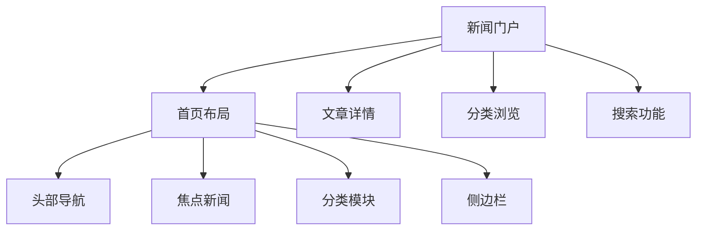

# 新闻门户网站HTML架构

## 📰 门户网站结构

### 📊 系统架构规划



### ⚡ SEO优化要点

| 模块 | HTML优化 | SEO策略 | 性能考虑 |
|------|----------|---------|----------|
| **首页** | 结构化数据 | Open Graph | CDN缓存 |
| **文章页** | 语义化HTML | Schema.org | 延迟加载 |
| **分类页** | 标题优化 | 面包屑导航 | 分页加载 |

## 🔧 核心页面实现

### 📝 新闻门户主页

```html
<!DOCTYPE html>
<html lang="zh-CN">
<head>
    <meta charset="UTF-8">
    <meta name="viewport" content="width=device-width, initial-scale=1.0">
    <title>Tech News Portal - 最新科技资讯</title>
    
    <!-- SEO Meta标签 -->
    <meta name="description" content="专业的科技新闻门户，提供最新互联网、人工智能、区块链等科技资讯">
    <meta name="keywords" content="科技新闻,互联网,人工智能,区块链,技术创新">
    
    <!-- Open Graph -->
    <meta property="og:title" content="Tech News Portal">
    <meta property="og:description" content="最新科技资讯平台">
    <meta property="og:type" content="website">
    <meta property="og:url" content="https://technews.example.com">
    <meta property="og:image" content="/images/og-image.jpg">
    
    <!-- Twitter Card -->
    <meta name="twitter:card" content="summary_large_image">
    <meta name="twitter:title" content="Tech News Portal">
    <meta name="twitter:description" content="最新科技资讯平台">
    
    <!-- 结构化数据 -->
    <script type="application/ld+json">
    {
        "@context": "https://schema.org",
        "@type": "WebSite",
        "name": "Tech News Portal",
        "description": "专业的科技新闻门户平台",
        "url": "https://technews.example.com",
        "potentialAction": {
            "@type": "SearchAction",
            "target": "https://technews.example.com/search?q={search_term_string}",
            "query.input": "required name=search_term_string"
        }
    }
    </script>
    
    <!-- 预加载关键资源 -->
    <link rel="preload" href="/fonts/inter.woff2" as="font" crossorigin>
    <link rel="preload" href="/css/critical.css" as="style">
    
    <!-- 图标 -->
    <link rel="icon" href="/favicon.ico">
    <link rel="apple-touch-icon" href="/apple-touch-icon.png">
    
    <style>
        /* 门户网站CSS */
        :root {
            --primary-color: #1a73e8;
            --secondary-color: #1976d2;
            --accent-color: #ff6b35;
            --text-color: #333;
            --bg-color: #fff;
            --border-color: #e0e0e0;
        }
        
        * {
            box-sizing: border-box;
        }
        
        body {
            margin: 0;
            font-family: -apple-system, BlinkMacSystemFont, 'Segoe UI', sans-serif;
            color: var(--text-color);
            line-height: 1.6;
        }
        
        /* 头部部分 */
        .header {
            background: var(--bg-color);
            box-shadow: 0 2px 10px rgba(0,0,0,0.1);
            position: sticky;
            top: 0;
            z-index: 100;
        }
        
        .header-top {
            background: var(--primary-color);
            color: white;
            padding: 0.5rem 0;
            font-size: 0.9rem;
        }
        
        .header-content {
            max-width: 1200px;
            margin: 0 auto;
            padding: 0 2rem;
            display: flex;
            justify-content: space-between;
            align-items: center;
        }
        
        .logo {
            font-size: 1.8rem;
            font-weight: bold;
            text-decoration: none;
            color: var(--primary-color);
        }
        
        .nav-menu {
            display: flex;
            list-style: none;
            margin: 0;
            padding: 0;
            gap: 2rem;
        }
        
        .nav-link {
            text-decoration: none;
            color: var(--text-color);
            font-weight: 500;
            transition: color 0.2s ease;
            padding: 1rem 0;
        }
        
        .nav-link:hover {
            color: var(--primary-color);
        }
        
        .search-form {
            display: flex;
            background: #f5f5f5;
            border-radius: 25px;
            overflow: hidden;
        }
        
        .search-input {
            border: none;
            padding: 0.75rem 1rem;
            background: transparent;
            outline: none;
            width: 300px;
        }
        
        .search-button {
            border: none;
            background: var(--primary-color);
            color: white;
            padding: 0.75rem 1rem;
            cursor: pointer;
        }
        
        /* 主内容区 */
        .main-container {
            max-width: 1200px;
            margin: 0 auto;
            padding: 2rem;
            display: grid;
            grid-template-columns: 1fr 300px;
            gap: 2rem;
        }
        
        /* 焦点新闻 */
        .hero-section {
            background: linear-gradient(135deg, var(--primary-color), var(--secondary-color));
            color: white;
            padding: 3rem;
            border-radius: 12px;
            margin-bottom: 2rem;
            text-align: center;
        }
        
        .hero-title {
            font-size: 2.5rem;
            margin-bottom: 1rem;
            font-weight: bold;
        }
        
        .hero-subtitle {
            font-size: 1.2rem;
            opacity: 0.9;
        }
        
        /* 新闻网格 */
        .news-grid {
            display: grid;
            grid-template-columns: repeat(auto-fit, minmax(300px, 1fr));
            gap: 2rem;
            margin-bottom: 3rem;
        }
        
        .news-card {
            background: var(--bg-color);
            border-radius: 12px;
            overflow: hidden;
            box-shadow: 0 2px 10px rgba(0,0,0,0.1);
            transition: transform 0.2s ease, box-shadow 0.2s ease;
        }
        
        .news-card:hover {
            transform: translateY(-5px);
            box-shadow: 0 5px 20px rgba(0,0,0,0.15);
        }
        
        .news-image {
            width: 100%;
            height: 200px;
            object-fit: cover;
        }
        
        .news-content {
            padding: 1.5rem;
        }
        
        .news-category {
            color: var(--accent-color);
            font-size: 0.9rem;
            font-weight: bold;
            text-transform: uppercase;
        }
        
        .news-title {
            font-size: 1.2rem;
            font-weight: bold;
            margin: 0.5rem 0;
            line-height: 1.3;
        }
        
        .news-excerpt {
            color: #666;
            font-size: 0.95rem;
            margin-bottom: 1rem;
        }
        
        .news-meta {
            display: flex;
            justify-content: space-between;
            align-items: center;
            font-size: 0.85rem;
            color: #999;
        }
        
        /* 侧边栏 */
        .sidebar {
            display: flex;
            flex-direction: column;
            gap: 2rem;
        }
        
        .sidebar-widget {
            background: var(--bg-color);
            border-radius: 12px;
            padding: 1.5rem;
            box-shadow: 0 2px 10px rgba(0,0,0,0.1);
        }
        
        .widget-title {
            font-size: 1.2rem;
            font-weight: bold;
            margin-bottom: 1rem;
            color: var(--primary-color);
        }
        
        .hot-topics {
            list-style: none;
            padding: 0;
            margin: 0;
        }
        
        .hot-topic {
            padding: 0.75rem 0;
            border-bottom: 1px solid var(--border-color);
        }
        
        .hot-topic:last-child {
            border-bottom: none;
        }
        
        .hot-topic-link {
            text-decoration: none;
            color: var(--text-color);
            transition: color 0.2s ease;
        }
        
        .hot-topic-link:hover {
            color: var(--primary-color);
        }
        
        .hot-topic-count {
            float: right;
            background: var(--accent-color);
            color: white;
            border-radius: 12px;
            padding: 0.2rem 0.6rem;
            font-size: 0.8rem;
        }
        
        /* 响应式设计 */
        @media (max-width: 768px) {
            .main-container {
                grid-template-columns: 1fr;
                padding: 1rem;
                gap: 1rem;
            }
            
            .nav-menu {
                display: none;
            }
            
            .search-input {
                width: 200px;
            }
            
            .hero-title {
                font-size: 2rem;
            }
            
            .news-grid {
                grid-template-columns: 1fr;
                gap: 1rem;
            }
        }
    </style>
</head>

<body>
    <!-- 网站头部 -->
    <header class="header">
        <div class="header-top">
            <div class="container">
                <div style="text-align: center;">
                    最新消息：OpenAI发布GPT-5预览 → 
                    <a href="#" style="color: white; text-decoration: underline;">立即查看</a>
                </div>
            </div>
        </div>
        
        <div class="header-content">
            <a href="/" class="logo">Tech News</a>
            
            <nav>
                <ul class="nav-menu">
                    <li><a href="/tech" class="nav-link">互联网</a></li>
                    <li><a href="/ai" class="nav-link">人工智能</a></li>
                    <li><a href="/blockchain" class="nav-link">区块链</a></li>
                    <li><a href="/mobile" class="nav-link">移动开发</a></li>
                    <li><a href="/security" class="nav-link">网络安全</a></li>
                </ul>
            </nav>
            
            <form class="search-form" onsubmit="handleSearch(event)">
                <input type="search" class="search-input" placeholder="搜索新闻...">
                <button type="submit" class="search-button">🔍</button>
            </form>
        </div>
    </header>

    <!-- 焦点新闻区 -->
    <section class="hero-section">
        <h1 class="hero-title">🚀 科技前沿报道</h1>
        <p class="hero-subtitle">第一时间掌握最新科技动态，引领行业发展方向</p>
    </section>

    <!-- 主内容区 -->
    <main class="main-container">
        <div class="main-content">
            <!-- 热门新闻 -->
            <section>
                <h2 style="margin-bottom: 2rem; color: var(--primary-color);">🔥 热门新闻</h2>
                
                <article class="news-grid">
                    <article class="news-card" itemscope itemtype="https://schema.org/NewsArticle">
                        
                        <div class="news-content">
                            <div class="news-category">人工智能</div>
                            <h3 class="news-title" itemprop="heading">
                                <a href="/news/ai-breakthrough" style="color: inherit; text-decoration: none;">
                                    OpenAI发布新一代大语言模型，性能提升200%
                                </a>
                            </h3>
                            <p class="news-excerpt" itemprop="description">
                                最新发布的语言模型在多个基准测试中表现卓越，推理能力显著提升...
                            </p>
                            <div class="news-meta">
                                <time itemprop="datePublished">2024-01-15</time>
                                <span>👀 1,234 阅读</span>
                            </div>
                        </div>
                    </article>
                    
                    <article class="news-card" itemscope itemtype="https://schema.org/NewsArticle">
                        
                        <div class="news-content">
                            <div class="news-category">区块链</div>
                            <h3 class="news-title" itemprop="heading">
                                <a href="/news/blockchain-feature" style="color: inherit; text-decoration: none;">
                                    Ethereum 2.0升级完成，交易费用降低90%
                                </a>
                            </h3>
                            <p class="news-excerpt" itemprop="description">
                                期待已久的以太坊升级终于完成，网络效率和安全性得到全面提升...
                            </p>
                            <div class="news-meta">
                                <time itemprop="datePublished">2024-01-14</time>
                                <span>👀 856 阅读</span>
                            </div>
                        </div>
                    </article>
                    
                    <article class="news-card" itemscope itemtype="https://schema.org/NewsArticle">
                        
                        <div class="news-content">
                            <div class="news-category">移动开发</div>
                            <h3 class="news-title" itemprop="heading">
                                <a href="/news/mobile-ar" style="color: inherit; text-decoration: none;">
                                    AR技术革新移动应用开发体验
                                </a>
                            </h3>
                            <p class="news-excerpt" itemprop="description">
                                苹果和谷歌联手推出新的AR开发框架，为移动应用增添身临其境的体验...
                            </p>
                            <div class="news-meta">
                                <time itemprop="datePublished">2024-01-13</time>
                                <span>👀 642 阅读</span>
                            </div>
                        </div>
                    </article>
                    
                    <article class="news-card" itemscope itemtype="https://schema.org/NewsArticle">
                        
                        <div class="news-content">
                            <div class="news-category">Web3</div>
                            <h3 class="news-title" itemprop="heading">
                                <a href="/news/web3-future" style="color: inherit; text-decoration: none;">
                                    去中心化互联网的未来展望
                                </a>
                            </h3>
                            <p class="news-excerpt" itemprop="description">
                                专家分析Web3技术发展趋势，预测下一轮互联网革命的核心驱动力...
                            </p>
                            <div class="news-meta">
                                <time itemprop="datePublished">2024-01-12</time>
                                <span>👀 445 阅读</span>
                            </div>
                        </div>
                    </article>
                </article>
            </section>

            <!-- 分页导航 -->
            <nav style="text-align: center; margin: 3rem 0;">
                <button class="btn" onclick="loadMoreNews()">
                    加载更多新闻 →
                </button>
            </nav>
        </div>
        
        <!-- 侧边栏 -->
        <aside class="sidebar">
            <!-- 热门话题 -->
            <div class="sidebar-widget">
                <h3 class="widget-title">🔥 热门话题</h3>
                <ul class="hot-topics">
                    <li class="hot-topic">
                        <a href="#" class="hot-topic-link">ChatGPT最新版</a>
                        <span class="hot-topic-count">1.2K</span>
                    </li>
                    <li class="hot-topic">
                        <a href="#" class="hot-topic-link">元宇宙技术</a>
                        <span class="hot-topic-count">856</span>
                    </li>
                    <li class="hot-topic">
                        <a href="#" class="hot-topic-link">量子计算突破</a>
                        <span class="hot-topic-count">634</span>
                    </li>
                    <li class="hot-topic">
                        <a href="#" class="hot-topic-link">5G应用场景</a>
                        <span class="hot-topic-count">443</span>
                    </li>
                    <li class="hot-topic">
                        <a href="#" class="hot-topic-link">自动驾驶技术</a>
                        <span class="hot-topic-count">321</span>
                    </li>
                </ul>
            </div>
            
            <!-- 相关推荐 -->
            <div class="sidebar-widget">
                <h3 class="widget-title">📖 相关推荐</h3>
                <div class="news-card" style="margin: 0;">
                    
                    <div class="news-content">
                        <div class="news-category">特别推荐</div>
                        <h4 class="news-title">
                            <a href="/featured/recommended" style="color: inherit; text-decoration: none;">
                                2024年科技趋势预测报告
                            </a>
                        </h4>
                    </div>
                </div>
            </div>
            
            <!-- 新闻简报 -->
            <div class="sidebar-widget">
                <h3 class="widget-title">📧 订阅简报</h3>
                <p style="font-size: 0.9rem; margin-bottom: 1rem;">
                    每周精选科技资讯，邮件订阅免费获得
                </p>
                <form onsubmit="subscribeNewsletter(event)">
                    <input type="email" placeholder="输入邮箱地址" required style="width: 100%; padding: 0.75rem; border: 1px solid #ddd; border-radius: 4px; margin-bottom: 0.5rem;">
                    <button type="submit" style="width: 100%; background: var(--primary-color); color: white; border: none; padding: 0.75rem; border-radius: 4px; cursor: pointer;">
                        订阅简报
                    </button>
                </form>
            </div>
        </aside>
    </main>

    <!-- 网站底部 -->
    <footer style="background: #333; color: white; padding: 3rem 2rem; text-align: center;">
        <div style="max-width: 1200px; margin: 0 auto;">
            <div style="display: grid; grid-template-columns: repeat(auto-fit,minmax(200px,1fr)); gap: 2rem; margin-bottom: 2rem;">
                <div>
                    <h4>关于我们</h4>
                    <p style="font-size: 0.9rem; opacity: 0.8;">
                        专业的科技新闻门户，致力于提供最新、最准确的科技资讯
                    </p>
                </div>
                <div>
                    <h4>快速链接</h4>
                    <nav style="display: flex; flex-direction: column; gap: 0.5rem;">
                        <a href="/about" style="color: white; text-decoration: none;">关于我们</a>
                        <a href="/contact" style="color: white; text-decoration: none;">联系我们</a>
                        <a href="/privacy" style="color: white; text-decoration: none;">隐私政策</a>
                        <a href="/terms" style="color: white; text-decoration: none;">服务条款</a>
                    </nav>
                </div>
                <div>
                    <h4>关注我们</h4>
                    <div style="display: flex; gap: 1rem; justify-content: center;">
                        <a href="#" style="color: white; text-decoration: none;">Twitter</a>
                        <a href="#" style="color: white; text-decoration: none;">Facebook</a>
                        <a href="#" style="color: white; text-decoration: none;">LinkedIn</a>
                    </div>
                </div>
            </div>
            
            <div style="border-top: 1px solid #555; padding-top: 2rem;">
                <p>&copy; 2024 Tech News Portal. All rights reserved.</p>
            </div>
        </div>
    </footer>

    <!-- JavaScript功能 -->
    <script>
        // 📰 新闻门户应用控制器
        class NewsPortalController {
            constructor() {
                this.currentPage = 1;
                this.isLoading = false;
                this.observerOptions = {
                    threshold: 0.1,
                    rootMargin: '50px'
                };
                
                this.initLazyLoading();
                this.initSearchFeature();
                this.initNewsletterSubscription();
            }
            
            initLazyLoading() {
                // 实现图片懒加载
                const images = document.querySelectorAll('img[data-src]');
                
                if ('IntersectionObserver' in window) {
                    const imageObserver = new IntersectionObserver((entries) => {
                        entries.forEach(entry => {
                            if (entry.isIntersecting) {
                                const img = entry.target;
                                img.src = img.dataset.src;
                                img.classList.remove('lazy');
                                imageObserver.unobserve(img);
                            }
                        });
                    }, this.observerOptions);
                    
                    images.forEach(img => imageObserver.observe(img));
                } else {
                    // 降级支持
                    images.forEach(img => {
                        img.src = img.dataset.src;
                    });
                }
            }
            
            initSearchFeature() {
                const searchInput = document.querySelector('.search-input');
                let searchTimeout;
                
                searchInput.addEventListener('input', (e) => {
                    clearTimeout(searchTimeout);
                    const query = e.target.value.trim();
                    
                    if (query.length > 2) {
                        searchTimeout = setTimeout(() => {
                            this.performSearch(query);
                        }, 300);
                    }
                });
            }
            
            async performSearch(query) {
                console.log(`🔍 搜索关键词: ${query}`);
                
                try {
                    // 模拟搜索API调用
                    const searchResults = await this.fetchSearchResults(query);
                    this.displaySearchResults(searchResults);
                    
                } catch (error) {
                    console.error('搜索失败:', error);
                }
            }
            
            async fetchSearchResults(query) {
                // 模拟异步搜索
                await new Promise(resolve => setTimeout(resolve, 500));
                
                return [
                    {
                        title: `${query}相关的技术文章`,
                        url: `/search?q=${encodeURIComponent(query)}`,
                        excerpt: '这是一篇关于' + query + '的详细介绍...'
                    }
                ];
            }
            
            displaySearchResults(results) {
                // 实际应用中会动态创建搜索结果区域
                console.log('搜索结果:', results);
            }
            
            initNewsletterSubscription() {
                // 订阅功能
            }
            
            async loadMoreNews() {
                if (this.isLoading) return;
                
                this.isLoading = true;
                this.currentPage++;
                
                try {
                    console.log(`📰 加载第${this.currentPage}页新闻`);
                    
                    // 模拟加载更多新闻
                    await new Promise(resolve => setTimeout(resolve, 1000));
                    
                    // 这里会动态添加新的新闻卡片
                    this.appendNewsCards();
                    
                } catch (error) {
                    console.error('加载新闻失败:', error);
                } finally {
                    this.isLoading = false;
                }
            }
            
            appendNewsCards() {
                const newsGrid = document.querySelector('.news-grid');
                // 实际应用中会从API获取数据并生成新闻卡片
                console.log('✅ 已加载更多新闻');
            }
            
            trackReadTime() {
                // 阅读时长统计
                const startTime = Date.now();
                
                window.addEventListener('beforeunload', () => {
                    const readTime = Math.round((Date.now() - startTime) / 1000);
                    console.log(`📊 页面停留时间: ${readTime}秒`);
                });
            }
            
            initializeAnalytics() {
                // 网站分析
                console.log('📈 初始化网站分析');
            }
        }

        // 🌐 全局函数
        function handleSearch(event) {
            event.preventDefault();
            const query = event.target.querySelector('.search-input').value;
            console.log(`🔍 搜索: ${query}`);
            
            // 跳转到搜索结果页
            window.location.href = `/search?q=${encodeURIComponent(query)}`;
        }

        function subscribeNewsletter(event) {
            event.preventDefault();
            const email = event.target.querySelector('input[type="email"]').value;
            
            console.log(`📧 订阅简报: ${email}`);
            alert('感谢订阅！您将每周收到精选科技资讯。');
            
            // 重置表单
            event.target.reset();
        }

        function loadMoreNews() {
            if (window.newsPortal) {
                window.newsPortal.loadMoreNews();
            }
        }

        // 🚀 页面加载完成后初始化
        document.addEventListener('DOMContentLoaded', () => {
            console.log('📰 初始化新闻门户网站');
            window.newsPortal = new NewsPortalController();
            
            // 添加阅读时长统计
            window.newsPortal.trackReadTime();
            
            // 初始化网站分析
            window.newsPortal.initializeAnalytics();
        });
    </script>
</body>
</html>
```

## 🔗 相关链接

- [[04-20 后台管理系统]]
- [[04-22 教育SaaS平台]]
- [[SEO性能优化/03-16 页面性能优化]]
- [[HTML5语义化/03-2 页面结构语义化]]

---

*最后更新：2024年* | 📰 新闻门户网站HTML架构
