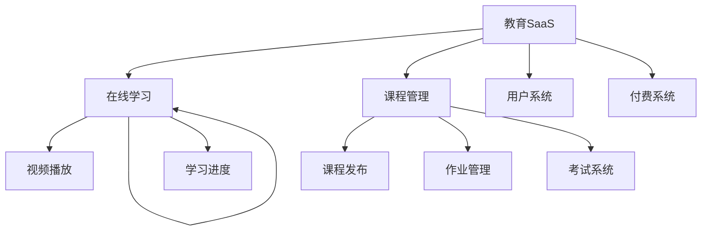

# 教育SaaS平台HTML架构

## 🎓 SaaS教育平台结构

### 📊 平台功能模块



### ⚡ HTML技术要点

| 功能 | HTML实现 | 技术要求 | 性能考虑 |
|------|-----------|----------|----------|
| **视频播放** | Video标签 | HLS支持 | CDN加速 |
| **课程目录** | Tree结构 | 可访问性 | 虚拟滚动 |
| **在线编辑器** | ContentEditable | Draft.js | 实时同步 |
| **作业提交** | Form Upload | 文件验证 | 分片上传 |

## 🔧 核心功能实现

### 📝 教育平台主页

```html
<!DOCTYPE html>
<html lang="zh-CN">
<head>
    <meta charset="UTF-8">
    <meta name="viewport" content="width=device-width, initial-scale=1.0">
    <title>LearnSpace - 在线教育平台</title>
    
    <!-- PWA支持 -->
    <meta name="theme-color" content="#4f46e5">
    <meta name="mobile-web-app-capable" content="yes">
    <link rel="manifest" href="/manifest.json">
    
    <style>
        :root {
            --primary: #4f46e5;
            --secondary: #06b6d4;
            --success: #10b981;
            --warning: #f59e0b;
            --error: #ef4444;
            --gray-50: #f9fafb;
            --gray-900: #111827;
        }
        
        * {
            margin: 0;
            padding: 0;
            box-sizing: border-box;
        }
        
        body {
            font-family: -apple-system, BlinkMacSystemFont, sans-serif;
            color: var(--gray-900);
            line-height: 1.6;
        }
        
        /* 响应式网格 */
        .platform-grid {
            display: grid;
            grid-template-columns: 250px 1fr;
            min-height: 100vh;
        }
        
        @media (max-width: 768px) {
            .platform-grid {
                grid-template-columns: 1fr;
            }
            
            .sidebar {
                display: none;
            }
        }
        
        /* 侧边导航 */
        .sidebar {
            background: white;
            border-right: 1px solid #e5e7eb;
            height: 100vh;
            overflow-y: auto;
            position: sticky;
            top: 0;
        }
        
        .brand {
            padding: 1.5rem;
            border-bottom: 1px solid #e5e7eb;
        }
        
        .brand h1 {
            color: var(--primary);
            font-size: 1.5rem;
            font-weight: bold;
        }
        
        .nav-menu {
            list-style: none;
            padding: 1rem 0;
        }
        
        .nav-item {
            border-bottom: 1px solid #f3f4f6;
        }
        
        .nav-link {
            display: flex;
            align-items: center;
            padding: 1rem 1.5rem;
            color: #6b7280;
            text-decoration: none;
            transition: all 0.2s;
            
        }
        
        .nav-link:hover,
        .nav-link.active {
            background: #f3f4f6;
            color: var(--primary);
            border-right: 3px solid var(--primary);
        }
        
        .nav-icon {
            margin-right: 0.75rem;
            font-size: 1.25rem;
        }
        
        /* 主内容区 */
        .main-content {
            background: var(--gray-50);
        }
        
        .header-bar {
            background: white;
            padding: 1rem 2rem;
            border-bottom: 1px solid #e5e7eb;
            display: flex;
            justify-content: space-between;
            align-items: center;
        }
        
        .breadcrumb {
            display: flex;
            align-items: center;
            gap: 0.5rem;
            color: #6b7280;
        }
        
        .user-profile {
            display: flex;
            align-items: center;
            gap: 1rem;
        }
        
        .avatar {
            width: 32px;
            height: 32px;
            border-radius: 50%;
            background: var(--primary);
            color: white;
            display: flex;
            align-items: center;
            justify-content: center;
            font-weight: bold;
        }
        
        /* 课程卡片 */
        .courses-grid {
            display: grid;
            grid-template-columns: repeat(auto-fit, minmax(350px, 1fr));
            gap: 1.5rem;
            padding: 2rem;
        }
        
        .course-card {
            background: white;
            border-radius: 12px;
            overflow: hidden;
            box-shadow: 0 1px 3px rgba(0,0,0,0.1);
            transition: transform 0.2s, box-shadow 0.2s;
        }
        
        .course-card:hover {
            transform: translateY(-4px);
            box-shadow: 0 8px 25px rgba(0,0,0,0.15);
        }
        
        .course-thumbnail {
            width: 100%;
            height: 200px;
            object-fit: cover;
        }
        
        .course-content {
            padding: 1.5rem;
        }
        
        .course-category {
            color: var(--secondary);
            font-size: 0.875rem;
            font-weight: 600;
            margin-bottom: 0.5rem;
        }
        
        .course-title {
            font-size: 1.125rem;
            font-weight: 600;
            margin-bottom: 0.75rem;
            color: var(--gray-900);
        }
        
        .course-description {
            color: #6b7280;
            font-size: 0.875rem;
            margin-bottom: 1rem;
            display: -webkit-box;
            -webkit-line-clamp: 3;
            -webkit-box-orient: vertical;
            overflow: hidden;
        }
        
        .course-meta {
            display: flex;
            justify-content: space-between;
            align-items: center;
            font-size: 0.875rem;
            color: #6b7280;
        }
        
        .course-price {
            color: var(--primary);
            font-weight: 600;
            font-size: 1rem;
        }
        
        .course-progress {
            margin: 1rem 0;
        }
        
        .progress-bar {
            width: 100%;
            height: 6px;
            background: #e5e7eb;
            border-radius: 3px;
            overflow: hidden;
        }
        
        .progress-fill {
            height: 100%;
            background: var(--primary);
            border-radius: 3px;
            transition: width 0.3s ease;
        }
        
        .progress-text {
            font-size: 0.75rem;
            color: #6b7280;
            margin-top: 0.25rem;
        }
        
        /* 学习视频播放器 */
        .video-player-container {
            background: #000;
            border-radius: 12px;
            overflow: hidden;
            margin: 2rem;
            aspect-ratio: 16/9;
        }
        
        .video-player {
            width: 100%;
            height: 100%;
            background: #000;
        }
        
        /* 课程大纲 */
        .course-outline {
            background: white;
            border-radius: 8px;
            margin: 2rem;
            overflow: hidden;
        }
        
        .outline-header {
            background: #f9fafb;
            padding: 1rem 1.5rem;
            border-bottom: 1px solid #e5e7eb;
        }
        
        .outline-title {
            font-weight: 600;
            color: var(--gray-900);
        }
        
        .outline-content {
            padding: 0;
        }
        
        .lesson-item {
            border-bottom: 1px solid #f3f4f6;
            transition: background 0.2s;
        }
        
        .lesson-item:last-child {
            border-bottom: none;
        }
        
        .lesson-item:hover {
            background: #f9fafb;
        }
        
        .lesson-link {
            display: flex;
            align-items: center;
            padding: 1rem 1.5rem;
            text-decoration: none;
            color: var(--gray-900);
        }
        
        .lesson-icon {
            margin-right: 0.75rem;
            color: #6b7280;
        }
        
        .lesson-info {
            flex: 1;
        }
        
        .lesson-title {
            font-weight: 500;
            margin-bottom: 0.25rem;
        }
        
        .lesson-duration {
            font-size: 0.75rem;
            color: #6b7280;
        }
        
        .lesson-status {
            margin-left: 1rem;
        }
        
        .status-badge {
            padding: 0.25rem 0.75rem;
            border-radius: 1rem;
            font-size: 0.75rem;
            font-weight: 500;
        }
        
        .status-completed {
            background: #d1fae5;
            color: #065f46;
        }
        
        .status-current {
            background: #dbeafe;
            color: #1e40af;
        }
        
        .status-locked {
            background: #f3f4f6;
            color: #6b7280;
        }
        
        /* 作业提交表单 */
        .assignment-form {
            background: white;
            border-radius: 12px;
            padding: 2rem;
            margin: 2rem;
            box-shadow: 0 1px 3px rgba(0,0,0,0.1);
        }
        
        .form-group {
            margin-bottom: 1.5rem;
        }
        
        .form-label {
            display: block;
            margin-bottom: 0.5rem;
            font-weight: 500;
            color: var(--gray-900);
        }
        
        .form-input {
            width: 100%;
            padding: 0.75rem;
            border: 1px solid #d1d5db;
            border-radius: 6px;
            font-size: 0.875rem;
            transition: border-color 0.2s;
        }
        
        .form-input:focus {
            outline: none;
            border-color: var(--primary);
            box-shadow: 0 0 0 3px rgba(79, 70, 229, 0.1);
        }
        
        .form-textarea {
            min-height: 120px;
            resize: vertical;
        }
        
        .file-upload-area {
            border: 2px dashed #d1d5db;
            border-radius: 6px;
            padding: 2rem;
            text-align: center;
            transition: border-color 0.2s;
            cursor: pointer;
        }
        
        .file-upload-area:hover {
            border-color: var(--primary);
        }
        
        .file-upload-area.dragover {
            border-color: var(--primary);
            background: #f9fafb;
        }
        
        /* 按钮样式 */
        .btn {
            padding: 0.75rem 1.5rem;
            border: none;
            border-radius: 6px;
            font-weight: 500;
            cursor: pointer;
            transition: all 0.2s;
            text-decoration: none;
            display: inline-flex;
            align-items: center;
            justify-content: center;
        }
        
        .btn-primary {
            background: var(--primary);
            color: white;
        }
        
        .btn-primary:hover {
            background: #4338ca;
            transform: translateY(-1px);
        }
        
        .btn-secondary {
            background: #6b7280;
            color: white;
        }
        
        .btn-success {
            background: var(--success);
            color: white;
        }
        
        /* 响应式优化 */
        @media (max-width: 640px) {
            .courses-grid {
                grid-template-columns: 1fr;
                padding: 1rem;
            }
            
            .assignment-form,
            .course-outline {
                margin: 1rem;
            }
            
            .video-player-container {
                margin: 1rem;
            }
        }
    </style>
</head>

<body>
    <div class="platform-grid">
        <!-- 侧边导航 -->
        <nav class="sidebar">
            <div class="brand">
                <h1>📚 LearnSpace</h1>
            </div>
            
            <ul class="nav-menu">
                <li class="nav-item">
                    <a href="#dashboard" class="nav-link active">
                        <span class="nav-icon">📊</span>
                        我的学习
                    </a>
                </li>
                
                <li class="nav-item">
                    <a href="#courses" class="nav-link">
                        <span class="nav-icon">📖</span>
                        所有课程
                    </a>
                </li>
                
                <li class="nav_item">
                    <a href="#learning-path" class="nav-link">
                        <span class="nav-icon">🛤️</span>
                        学习路径
                    </a>
                </li>
                
                <li class="nav-item">
                    <a href="#assignments" class="nav-link">
                        <span class="nav-icon">📝</span>
                        作业练习
                    </a>
                </li>
                
                <li class="nav-item">
                    <a href="#discussions" class="nav-link">
                        <span class="nav-icon">💬</span>
                        讨论区
                    </a>
                </li>
                
                <li class="nav-item">
                    <a href="#certificates" class="nav-link">
                        <span class="nav-icon">🏆</span>
                        证书中心
                    </a>
                </li>
                
                <li class="nav-item">
                    <a href="#profile" class="nav-link">
                        <span class="nav-icon">👤</span>
                        个人资料
                    </a>
                </li>
            </ul>
        </nav>
        
        <!-- 主内容区 -->
        <main class="main-content">
            <!-- 页面头部 -->
            <header class="header-bar">
                <div class="breadcrumb">
                    <span>📚</span>
                    <span>></span>
                    <span>前端开发课程</span>
                    <span>></span>
                    <span id="current-lesson">HTML基础知识</span>
                </div>
                
                <div class="user-profile">
                    <span>欢迎，张三 👋</span>
                    <div class="avatar">张</div>
                </div>
            </header>
            
            <!-- 学习展示区 -->
            <div class="content-area">
                <!-- 课程播放器 -->
                <div class="video-player-container">
                    <video class="video-player" controls poster="https://via.placeholder.com/800x450/4f46e5/white?text=Lesson+Video">
                        <source src="/videos/html-basics.mp4" type="video/mp4">
                        您的浏览器不支持视频播放
                    </video>
                </div>
                
                <!-- 课程大纲 -->
                <div class="course-outline">
                    <div class="outline-header">
                        <h2 class="outline-title">📋 课程大纲</h2>
                    </div>
                    
                    <div class="outline-content">
                        <div class="lesson-item">
                            <a href="#lesson-1" class="lesson-link">
                                <span class="lesson-icon">▶️</span>
                                <div class="lesson-info">
                                    <div class="lesson-title">HTML基础语法</div>
                                    <div class="lesson-duration">15分钟</div>
                                </div>
                                <div class="lesson-status">
                                    <span class="status-badge status-current">学习中</span>
                                </div>
                            </a>
                        </div>
                        
                        <div class="lesson-item">
                            <a href="#lesson-2" class="lesson-link">
                                <span class="lesson-icon">⏸️</span>
                                <div class="lesson-info">
                                    <div class="lesson-title">HTML元素与属性</div>
                                    <div class="lesson-duration">22分钟</div>
                                </div>
                                <div class="lesson-status">
                                    <span class="status-badge status-locked">未解锁</span>
                                </div>
                            </a>
                        </div>
                        
                        <div class="lesson-item">
                            <a href="#lesson-3" class="lesson-link">
                                <span class="lesson-icon">▶️</span>
                                <div class="lesson-info">
                                    <div class="lesson-title">HTML表单设计</div>
                                    <div class="lesson-duration">18分钟</div>
                                </div>
                                <div class="lesson-status">
                                    <span class="status-badge status-locked">未解锁</span>
                                </div>
                            </a>
                        </div>
                        
                        <div class="lesson-item">
                            <a href="#assignment-1" class="lesson-link">
                                <span class="lesson-icon">📝</span>
                                <div class="lesson-info">
                                    <div class="lesson-title">实践作业：个人简历页面</div>
                                    <div class="lesson-duration">预计2小时</div>
                                </div>
                                <div class="lesson-status">
                                    <span class="status-badge status-locked">待学习</span>
                                </div>
                            </a>
                        </div>
                    </div>
                </div>
                
                <!-- 作业提交表单 -->
                <div class="assignment-form">
                    <h3>📝 作业提交</h3>
                    <p style="color: #6b7280; margin-bottom: 1.5rem;">
                        请完成个人简历页面的HTML编写，并提交你的代码文件
                    </p>
                    
                    <form onsubmit="submitAssignment(event)">
                        <div class="form-group">
                            <label class="form-label">作业描述</label>
                            <textarea class="form-input form-textarea" placeholder="请描述你完成作业的过程和遇到的问题..."></textarea>
                        </div>
                        
                        <div class="form-group">
                            <label class="form-label">提交文件</label>
                            <div class="file-upload-area" onclick="document.getElementById('file-input').click()">
                                <p>📎 点击选择文件或拖拽文件到此处</p>
                                <p style="font-size: 0.875rem; color: #6b7280;">支持 .html, .css, .zip 文件</p>
                                <input type="file" id="file-input" style="display: none;" multiple accept=".html,.css,.zip">
                            </div>
                        </div>
                        
                        <div class="form-group">
                            <label class="form-label">GitHub链接 (可选)</label>
                            >                            <input type="url" class="form-input" placeholder="https://github.com/username/project">
                        </div>
                        
                        <button type="submit" class="btn btn-primary">
                            🚀 提交作业
                        </button>
                    </form>
                </div>
            </div>
        </main>
    </div>

    <!-- JavaScript功能 -->
    <script>
        // 🎓 教育SaaS平台控制器
        class EducationSaaSController {
            constructor() {
                this.currentLesson = 1;
                this.learningProgress = {
                    1: { status: 'current', progress: 60 },
                    2: { status: 'locked', progress: 0 },
                    3: { status: 'locked', progress: 0 }
                };
                
                this.initVideoPlayer();
                this.initProgressTracking();
                this.initFileUpload();
                this.initNavigation();
            }
            
            initVideoPlayer() {
                const video = document.querySelector('.video-player');
                if (!video) return;
                
                // 视频播放事件监听
                video.addEventListener('loadstart', () => {
                    console.log('📹 开始加载视频');
                });
                
                video.addEventListener('canplay', () => {
                    console.log('📹 视频可以播放');
                });
                
                video.addEventListener('timeupdate', () => {
                    this.trackVideoProgress(video);
                });
                
                video.addEventListener('ended', () => {
                    this.onVideoComplete();
                });
                
                // 错误处理
                video.addEventListener('error', (e) => {
                    console.error('📹 视频播放错误:', e);
                });
            }
            
            trackVideoProgress(video) {
                const duration = video.duration;
                const currentTime = video.currentTime;
                const progress = (currentTime / duration) * 100;
                
                // 更新学习进度显示
                this.updateLessonProgress(this.currentLesson, progress);
                
                // 每10%进度向服务器同步
                if (Math.floor(progress / 10) !== Math.floor((progress - 1) / 10)) {
                    this.syncLearningProgress(this.currentLesson, progress);
                }
            }
            
            updateLessonProgress(lessonId, progress) {
                const progressElements = document.querySelectorAll('.course-progress .progress-fill');
                const progressTexts = document.querySelectorAll('.course-progress .progress-text');
                
                // 更新当前课程的进度条
                if (progressElements[lessonId - 1]) {
                    progressElements[lessonId - 1].style.width = `${progress}%`;
                    progressTexts[lessonId - 1].textContent = `${Math.round(progress)}% 完成`;
                }
            }
            
            async syncLearningProgress(lessonId, progress) {
                try {
                    console.log(`📊 同步学习进度: 课程${lessonId} - ${Math.round(progress)}%`);
                    
                    // 模拟API调用
                    await fetch('/api/progress', {
                        method: 'POST',
                        headers: { 'Content-Type': 'application/json' },
                        body: JSON.stringify({
                            lessonId: lessonId,
                            progress: progress,
                            timestamp: Date.now()
                        })
                    });
                    
                } catch (error) {
                    console.error('同步进度失败:', error);
                }
            }
            
            onVideoComplete() {
                console.log('🎉 课程视频学习完成!');
                
                // 解锁下一节课
                this.unlockNextLesson(this.currentLesson);
                
                // 更新学员状态
                this.learningProgress[this.currentLesson].status = 'completed';
                this.updateLessonStatus(this.currentLesson, 'completed');
                
                // 显示完成提示
                this.showCompletionMessage();
            }
            
            unlockNextLesson(currentLessonId) {
                const nextLessonId = currentLessonId + 1;
                if (this.learningProgress[nextLessonId]) {
                    this.learningProgress[nextLessonId].status = 'unlocked';
                    this.updateLessonStatus(nextLessonId, 'unlocked');
                }
            }
            
            updateLessonStatus(lessonId, status) {
                const lessonItems = document.querySelectorAll('.lesson-item');
                const statusBadges = document.querySelectorAll('.lesson-item .status-badge');
                
                if (statusBadges[lessonId - 1]) {
                    const badge = statusBadges[lessonId - 1];
                    badge.className = 'status-badge';
                    
                    switch (status) {
                        case 'completed':
                            badge.classList.add('status-completed');
                            badge.textContent = '已完成';
                            break;
                        case 'unlocked':
                            badge.classList.add('status-current');
                            badge.textContent = '可学习';
                            break;
                    }
                }
            }
            
            showCompletionMessage() {
                // 显示完成消息
                const message = document.createElement('div');
                message.innerHTML = `
                    <div style="position: fixed; top: 50%; left: 50%; transform: translate(-50%, -50%); 
                                background: white; padding: 2rem; border-radius: 12px; 
                                box-shadow: 0 10px 40px rgba(0,0,0,0.2); z-index: 1000; text-align: center;">
                        <h3 style="color: var(--success); margin-bottom: 1rem;">🎓 恭喜完成本节课程！</h3>
                        <p style="margin-bottom: 1rem;">你已经掌握了HTML基础知识</p>
                        <button onclick="this.parentElement.remove()" class="btn btn-primary">继续学习</button>
                    </div>
                `;
                document.body.appendChild(message);
                
                // 3秒后自动关闭
                setTimeout(() => {
                    if (message.parentElement) {
                        message.remove();
                    }
                }, 3000);
            }
            
            initProgressTracking() {
                // 实现学习进度跟踪
                console.log('📈 初始化学习进度跟踪');
            }
            
            initFileUpload() {
                const fileArea = document.querySelector('.file-upload-area');
                const fileInput = document.getElementById('file-input');
                
                if (!fileArea || !fileInput) return;
                
                // 拖拽上传支持
                fileArea.addEventListener('dragover', (e) => {
                    e.preventDefault();
                    fileArea.classList.add('dragover');
                });
                
                fileArea.addEventListener('dragleave', () => {
                    fileArea.classList.remove('dragover');
                });
                
                fileArea.addEventListener('drop', (e) => {
                    e.preventDefault();
                    fileArea.classList.remove('dragover');
                    
                    const files = Array.from(e.dataTransfer.files);
                    this.handleFileUpload(files);
                });
                
                // 文件选择事件
                fileInput.addEventListener('change', (e) => {
                    const files = Array.from(e.target.files);
                    this.handleFileUpload(files);
                });
            }
            
            handleFileUpload(files) {
                const fileArea = document.querySelector('.file-upload-area');
                
                files.forEach(file => {
                    // 文件大小限制 (10MB)
                    if (file.size > 10 * 1024 * 1024) {
                        alert(`文件 ${file.name} 超过10MB限制`);
                        return;
                    }
                    
                    // 文件类型验证
                    const allowedTypes = ['.html', '.css', '.js', '.zip'];
                    const isValid = allowedTypes.some(type => file.name.toLowerCase().endsWith(type));
                    
                    if (!isValid) {
                        alert(`文件 ${file.name} 类型不支持`);
                        return;
                    }
                    
                    console.log(`📎 准备上传文件: ${file.name} (${(file.size / 1024 / 1024).toFixed(2)}MB)`);
                });
                
                // 更新上传区域显示
                if (files.length > 0) {
                    fileArea.innerHTML = `
                        <p>📎 <strong>${files.length}个文件已选择</strong></p>
                        <p style="font-size: 0.875rem; color: #6b7280;">
                            ${files.map(f => f.name).join(', ')}
                        </p>
                    `;
                }
            }
            
            initNavigation() {
                // 导航功能初始化
                document.querySelectorAll('.lesson-link').forEach((link, index) => {
                    link.addEventListener('click', (e) => {
                        e.preventDefault();
                        const lessonId = index + 1;
                        
                        if (this.learningProgress[lessonId].status === 'locked') {
                            alert('这节课还未解锁，请先完成前面的课程');
                            return;
                        }
                        
                        this.switchLesson(lessonId);
                    });
                });
            }
            
            switchLesson(lessonId) {
                console.log(`📚 切换到课程 ${lessonId}`);
                
                this.currentLesson = lessonId;
                this.updateLessonStatus(lessonId, 'current');
                
                // 更新视频源
                const video = document.querySelector('.video-player');
                const videoSrc = `/videos/lesson-${lessonId}.mp4`;
                
                video.src = videoSrc;
                video.load();
                
                // 更新面包屑
                const breadcrumbText = document.getElementById('current-lesson');
                const lessonTitles = {
                    1: 'HTML基础知识',
                    2: 'HTML元素与属性',
                    3: 'HTML表单设计'
                };
                
                if (breadcrumbText) {
                    breadcrumbText.textContent = lessonTitles[lessonId] || `课程${lessonId}`;
                }
            }
        }

        // 📝 作业提交功能
        function submitAssignment(event) {
            event.preventDefault();
            
            const formData = new FormData(event.target);
            console.log('📝 提交作业中...');
            
            // 模拟作业提交
            setTimeout(() => {
                alert('✅ 作业提交成功！老师将在一周内给出反馈。');
                event.target.reset();
                
                // 重置文件上传区域
                const fileArea = document.querySelector('.file-upload-area');
                fileArea.innerHTML = `
                    <p>📎 点击选择文件或拖拽文件到此处</p>
                    <p style="font-size: 0.875rem; color: #6b7280;">支持 .html, .css, .zip 文件</p>
                    <input type="file" id="file-input" style="display: none;" multiple accept=".html,.css,.zip">
                `;
            }, 1500);
        }

        // 🚀 初始化教育平台
        document.addEventListener('DOMContentLoaded', () => {
            console.log('🎓 初始化教育SaaS平台');
            window.educationSaaS = new EducationSaaSController();
            
            // PWA支持检测
            if ('serviceWorker' in navigator) {
                navigator.serviceWorker.register('/sw.js');
            }
            
            // 学习分析统计
            console.log('📊 开始学习行为分析');
        });
    </script>
</body>
</html>
```

## 🔗 相关链接

- [[04-20 后台管理系统]]
- [[04-21 新闻门户网站]]
- [[技术生态集成/04-3 前后端数据交互]]
- [[现代Web平台/04-9 PWA中的HTML]]
- [[安全与最佳实践/03-20 数据保护合规]]

---

*最后更新：2024年* | 🎓 教育SaaS平台HTML实现
