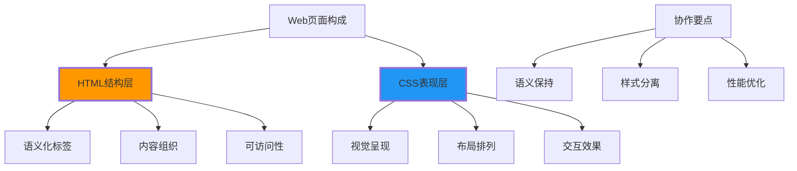

# HTML与CSS协作

## 🎨 HTML与CSS的协作模式

### 📊 HTML结构 + CSS样式的分工



## 🏗️ HTML语义化与CSS选择器

### 🎯 语义化HTML的CSS优势

**语义化HTML为CSS提供了更好的选择器基础**：

```html
<!-- ✅ 语义化HTML结构 -->
<article class="blog-post">
    <header class="post-header">
        <h1 class="post-title">HTML与CSS协作最佳实践</h1>
        <div class="post-meta">
            <time class="publish-date">2024-01-15</time>
            <span class="author">作者：张三</span>
        </div>
    </header>
    
    <div class="post-content">
        <section class="intro">
            <h2>介绍</h2>
            <p>HTML和CSS的协作是前端开发的基础...</p>
        </section>
        
        <aside class="sidebar">
            <h3>相关文章</h3>
            <ul class="related-posts">
                <li><a href="#">CSS进阶技巧</a></li>
                <li><a href="#">HTML5新特性</a></li>
            </ul>
        </aside>
    </div>
</article>
```

```css
/* ✅ 基于语义化的CSS选择器 */
/* 直接选择语义化标签 */
article {
    max-width: 800px;
    margin: 0 auto;
    padding: 2rem;
}

article header {
    border-bottom: 1px solid #e0e0e0;
    margin-bottom: 2rem;
}

article h1 {
    color: #333;
    margin-bottom: 1rem;
}

/* 组合选择器增强样式 */
.post-header .post-title {
    font-size: 2.5rem;
    font-weight: 700;
}

.post-content {
    display: grid;
    grid-template-columns: 1fr 300px;
    gap: 2rem;
}

/* 嵌套结构样式 */
.intro h2 {
    color: #0066cc;
    border-left: 4px solid #0066cc;
    padding-left: 1rem;
}

.sidebar ul {
    list-style: none;
    padding: 0;
}

.sidebar a {
    color: #666;
    text-decoration: none;
    padding: 0.5rem;
    display: block;
    border-radius: 0.25rem;
    transition: background-color 0.2s;
}

.sidebar a:hover {
    background-color: #f0f8ff;
    color: #0066cc;
}
```

## 📱 响应式HTML-CSS协作

### 🎯 移动优先的HTML设计

```html
<!-- ✅ 移动优先的HTML结构 -->
<div class="product-card">
    
    
    <div class="product-info">
        <h3 class="product-title">产品标题</h3>
        <p class="product-description">产品描述文字...</p>
        
        <div class="product-price-group">
            <span class="current-price">¥299</span>
            <span class="original-price">¥399</span>
        </div>
        
        <button class="add-to-cart" 
                aria-label="加入购物车">
            加入购物车
        </button>
    </div>
</div>
```

```css
/* ✅ 移动优先的CSS设计 */
/* 基础样式（移动端） */
.product-card {
    border: 1px solid #e0e0e0;
    border-radius: 0.5rem;
    padding: 1rem;
    margin-bottom: 1rem;
    background: #ffffff;
}

.product-image {
    width: 100%;
    height: 200px;
    object-fit: cover;
    border-radius: 0.25rem;
    margin-bottom: 1rem;
}

.product-info {
    text-align: left;
}

.product-title {
    font-size: 1.25rem;
    font-weight: 600;
    margin-bottom: 0.5rem;
    color: #333;
}

.product-description {
    color: #666;
    line-height: 1.5;
    margin-bottom: 1rem;
}

.product-price-group {
    display: flex;
    align-items: center;
    gap: 0.5rem;
    margin-bottom: 1rem;
}

.current-price {
    font-size: 1.5rem;
    font-weight: 700;
    color: #e74c3c;
}

.original-price {
    font-size: 1rem;
    color: #999;
    text-decoration: line-through;
}

.add-to-cart {
    width: 100%;
    padding: 0.75rem 1rem;
    background: #0066cc;
    color: white;
    border: none;
    border-radius: 0.25rem;
    font-size: 1rem;
    font-weight: 500;
    cursor: pointer;
    transition: background-color 0.2s;
}

.add-to-cart:hover {
    background: #0052a3;
}

/* 平板端适配 */
@media (min-width: 768px) {
    .product-card {
        display: flex;
        gap: 1.5rem;
        padding: 1.5rem;
    }
    
    .product-image {
        width: 200px;
        height: 150px;
        flex-shrink: 0;
    }
    
    .product-info {
        flex: 1;
    }
    
    .add-to-cart {
        width: auto;
        padding: 0.5rem 1.5rem;
    }
}

/* 桌面端适配 */
@media (min-width: 1024px) {
    .product-card {
        max-width: 600px;
        margin: 0 auto 2renn;
    }
    
    .product-title {
        font-size: 1.5rem;
    }
    
    .current-price {
        font-size: 1.75rem;
    }
}
```

## 🎨 CSS Grid与HTML结构

### 📊 语义化HTML配合Grid布局

```html
<!-- ✅ Grid布局友好的HTML结构 -->
<div class="website-layout">
    <header class="site-header">
        <h1 class="site-title">网站标题</h1>
        <nav class="main-nav" aria-label="主导航">
            <ul>
                <li><a href="/">首页</a></li>
                <li><a href="/about">关于</a></li>
                <li><a href="/services">服务</a></li>
            </ul>
        </nav>
    </header>
    
    <main class="main-content">
        <article class="featured-article">
            <h2>主要文章标题</h2>
            <p>文章内容...</p>
        </article>
        
        <section class="news-section">
            <h2>最新消息</h2>
            <div class="news-grid">
                <article class="news-item">
                    <h3>新闻标题一</h3>
                    <p>新闻内容...</p>
                </article>
                <article class="news-item">
                    <h3>新闻标题二</h3>
                    <p>新闻内容...</p>
                </article>
                <article class="news-item">
                    <h3>新闻标题三</h3>
                    <p>新闻内容...</p>
                </article>
            </div>
        </section>
    </main>
    
    <aside class="sidebar">
        <section class="widget">
            <h3>热门文章</h3>
            <ul>
                <li><a href="#">文章一</a></li>
                <li><a href="#">文章二</a></li>
            </ul>
        </section>
    </aside>
    
    <footer class="site-footer">
        <p>&copy; 2024 网站版权</p>
    </footer>
</div>
```

```css
/* ✅ CSS Grid布局实现 */
.website-layout {
    display: grid;
    grid-template-areas: 
        "header header header"
        "main   main   sidebar"
        "footer footer footer";
    grid-template-columns: 1fr 1fr 300px;
    grid-template-rows: auto 1fr auto;
    min-height: 100vh;
    gap: 2rem;
    padding: 2rem;
}

.site-header {
    grid-area: header;
    border-bottom: 2px solid #0066cc;
    padding-bottom: 1rem;
}

.main-content {
    grid-area: main;
    display: grid;
    gap: 2rem;
}

.news-grid {
    display: grid;
    grid-template-columns: repeat(auto-fit, minmax(300px, 1fr));
    gap: 1rem;
}

.news-item {
    border: 1px solid #e0e0e0;
    padding: 1rem;
    border-radius: 0.5rem;
}

.sidebar {
    grid-area: sidebar;
}

.site-footer {
    grid-area: footer;
    border-top: 1px solid #e0e0e0;
    padding-top: 1rem;
    text-align: center;
}

/* 响应式Grid适配 */
@media (max-width: 768px) {
    .website-layout {
        grid-template-areas: 
            "header"
            "main"
            "sidebar"
            "footer";
        grid-template-columns: 1fr;
        gap: 1rem;
        padding: 1rem;
    }
    
    .news-grid {
        grid-template-columns: 1fr;
    }
}
```

## 🔄 CSS-in-JS时代的HTML

### 📊 现代框架中的HTML-CSS协作

```html
<!-- ✅ React/Vue组件中的HTML结构 -->
<!-- 注意：这是简化的展示，实际需要在JSX/Vue模板中使用 -->

<div class="todo-app">
    <header class="app-header">
        <h1 class="app-title">任务清单</h1>
        <form class="add-todo-form">
            <input type="text" 
                   placeholder="添加新任务"
                   class="todo-input">
            <button type="submit" class="add-button">添加</button>
        </form>
    </header>
    
    <main class="todo-list">
        <div class="filter-buttons">
            <button class="filter-btn active" data-filter="all">全部</button>
            <button class="filter-btn" data-filter="active">进行中</button>
            <button class="filter-btn" data-filter="completed">已完成</button>
        </div>
        
        <ul class="todo-items">
            <li class="todo-item" data-status="active">
                <input type="checkbox" class="todo-checkbox">
                <span class="todo-text">学习HTML与CSS协作</span>
                <button class="delete-btn">删除</button>
            </li>
        </ul>
    </main>
</div>
```

```css
/* ✅ BEM命名法配合HTML */
/* Block */
.todo-app {
    max-width: 600px;
    margin: 0 auto;
    padding: 2rem;
    background: #ffffff;
    border-radius: 0.5rem;
    box-shadow: 0 2px 8px rgba(0,0,0,0.1);
}

/* Block__Element */
.app__header {
    margin-bottom: 2rem;
    text-align: center;
}

.app__title {
    font-size: 2rem;
    color: #333;
    margin-bottom: 1rem;
}

.add-todo__form {
    display: flex;
    gap: 0.5rem;
}

.todo__input {
    flex: 1;
    padding: 0.75rem;
    border: 1px solid #e0e0e0;
    border-radius: 0.25rem;
    font-size: 1rem;
}

/* Block__Element--Modifier */
.filter-btn {
    padding: 0.5rem 1rem;
    border: none;
    background: #f0f0f0;
    border-radius: 0.25rem;
    cursor: pointer;
    transition: background-color 0.2s;
}

.filter-btn--active {
    background: #0066cc;
    color: white;
}

.todo-item {
    display: flex;
    align-items: center;
    gap: 1rem;
    padding: 1rem;
    border: 1px solid #e0e0e0;
    border-radius: 0.25rem;
    margin-bottom: 0.5rem;
}

.todo-item--completed {
    opacity: 0.6;
}

.todo-item--completed .todo__text {
    text-decoration: line-through;
}
```

## 🔧 HTML结构与CSS性能

### ⚡ 高效的HTML-CSS选择器

```html
<!-- ✅ 性能友好的HTML结构 -->
<nav class="main-navigation">
    <ul class="nav-list">
        <li class="nav-item">
            <a href="/" class="nav-link nav-link--active">首页</a>
        </li>
        <li class="nav-item">
            <a href="/products" class="nav-link">产品</a>
            <ul class="nav-submenu">
                <li class="nav-subitem">
                    <a href="/products/software" class="nav-sublink">软件产品</a>
                </li>
                <li class="nav-subitem">
                    <a href="/products/services" class="nav-sublink">服务产品</a>
                </li>
            </ul>
        </li>
    </ul>
</nav>
```

```css
/* ✅ 高效的CSS选择器策略 */

/* 1. ID选择器（最高效） */
#main-nav {
    background: #333;
    padding: 1rem;
}

/* 2. Class选择器（次高效） */
.main-navigation {
    font-size: 1rem;
}

/* 3. 元素选择器配合class */
.nav-link {
    color: white;
    text-decoration: none;
    padding: 0.5rem 1rem;
    border-radius: 0.25rem;
    transition: background-color 0.2s;
}

/* 4. 避免深层嵌套选择器 */
.nav-link:hover {
    background-color: rgba(255,255,255,0.1);
}

.nav-link--active {
    background-color: #0066cc;
}

/* 5. 使用属性选择器优化 */
.nav-submenu[aria-hidden="true"] {
    display: none;
}

/* JavaScript交互的CSS状态类 */
.js-dropdown-open .nav-submenu {
    display: block;
}

/* 性能优化：使用will-change */
.nav-link {
    will-change: background-color;
}
```

---

**🔗 HTML-CSS协作深化**：
- JavaScript交互：`[[04-2 HTML与JavaScript交互]]`
- 现代框架：`[[04-4 现代框架对比分析]]`
- 实战项目：`[[04-17 企业官网重构项目]]`
