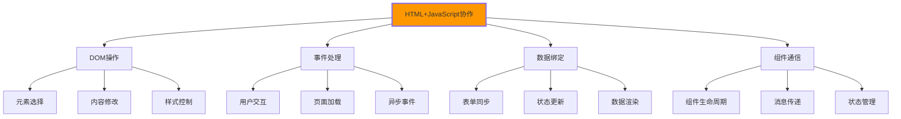

# HTML与JavaScript交互

## 🔗 HTML和JavaScript的协作机制

### 📊 两者关系与协作模式

**HTML提供结构，JavaScript提供交互行为**：



## 🎯 DOM操作技术

### 🔍 元素选择与操作

```html
<!DOCTYPE html>
<html lang="zh-CN">
<head>
    <meta charset="UTF-8">
    <meta name="viewport" content="width=device-width, initial-scale=1.0">
    <title>HTML与JavaScript交互演示</title>
    
    <style>
        .interactive-demo {
            max-width: 800px;
            margin: 0 auto;
            padding: 2rem;
        }
        
        .demo-section {
            margin: 2rem 0;
            padding: 1rem;
            border: 1px solid #e0e0e0;
            border-radius: 8px;
        }
        
        .dynamic-content {
            background: #f8f9fa;
            padding: 1rem;
            border-radius: 4px;
            margin: 1rem 0;
            min-height: 50px;
        }
        
        .highlight {
            background-color: yellow;
            transition: background-color 0.3s ease;
        }
        
        .user-input {
            width: 100%;
            padding: 0.5rem;
            border: 1px solid #ddd;
            border-radius: 4px;
            margin: 0.5rem 0;
        }
        
        .btn-demo {
            background: #007bff;
            color: white;
            border: none;
            padding: 0.5rem 1rem;
            border-radius: 4px;
            cursor: pointer;
            margin: 0.25rem;
        }
        .btn-demo:hover {
            background: #0056b3;
        }
        
        .result-display {
            margin: 1rem 0;
            padding: 1rem;
            background: #e7f3ff;
            border-radius: 4px;
            border-left: 4px solid #007bff;
        }
    </style>
</head>

<body class="interactive-demo">
    <!-- 🎯 DOM操作演示区域 -->
    <section class="demo-section" id="dom-demo">
        <h2>DOM操作演示</h2>
        
        <div class="dynamic-content" id="content-area">
            <p>点击按钮来操作这个区域的内容</p>
        </div>
        
        <!-- 元素选择器演示 -->
        <fieldset>
            <legend>元素选择器测试</legend>
            <input type="text" 
                   id="selector-input" 
                   class="user-input"
                   placeholder="输入CSS选择器 (如: #content-area, .demo-section)">
            <button class="btn-demo" onclick="testSelector()">测试选择器</button>
        </fieldset>
        
        <!-- 内容操作演示 -->
        <div>
            <h3>内容操作</h3>
            <button class="btn-demo" onclick="modifyContent()">修改内容</button>
            <button class="btn-demo" onclick="addElement()">添加元素</button>
            <button class="btn-demo" onclick="removeElement()">删除元素</button>
            <button class="btn-demo" onclick="toggleVisibility()">切换可见性</button>
        </div>
        
        <!-- 样式操作演示 -->
        <div>
            <h3>样式操作</h3>
            <button class="btn-demo" onclick="changeStyle()">改变样式</button>
            <button class="btn-demo" onclick="addClass()">添加CSS类</button>
            <button class="btn-demo" onclick="removeClass()">移除CSS类</button>
            <button class="btn-demo" onclick="animateElement()">执行动画</button>
        </div>
        
        <div class="result-display" id="dom-result">
            <h4>操作结果：</h4>
            <div id="operation-log"></div>
        </div>
    </section>

    <!-- 📋 表单交互演示 -->
    <section class="demo-section" id="form-demo">
        <h2>表单交互演示</h2>
        
        <form id="demo-form" class="demo-form" onsubmit="return handleFormSubmit(event)">
            <fieldset>
                <legend>用户信息收集</legend>
                
                <div class="form-group">
                    <label for="username">用户名：</label>
                    <input type="text" 
                           id="username" 
                           name="username"
                           class="user-input"
                           onblur="validateUsername(this)"
                           placeholder="请输入用户名">
                    <span class="error-message" id="username-error"></span>
                </div>
                
                <div class="form-group">
                    <label for="email">邮箱：</label>
                    <input type="email" 
                           id="email" 
                           name="email"
                           class="user-input"
                           onchange="validateEmail(this)"
                           placeholder="请输入邮箱">
                    <span class="error-message" id="email-error"></span>
                </div>
                
                <div class="form-group">
                    <label for="password">密码：</label>
                    <input type="password" 
                           id="password" 
                           name="password"
                           class="user-input"
                           oninput="validatePassword(this)"
                           placeholder="请输入密码">
                    <span class="error-message" id="password-error"></span>
                    <div class="password-strength" id="password-strength"></div>
                </div>
                
                <div class="form-group">
                    <label>兴趣爱好：</label>
                    <div class="checkbox-group">
                        <label><input type="checkbox" name="hobbies" value="reading" onchange="updateSelectionCount()"> 阅读</label>
                        <label><input type="checkbox" name="hobbies" value="sports" onchange="updateSelectionCount()"> 运动</label>
                        <label><input type="checkbox" name="hobbies" value="music" onchange="updateSelectionCount()"> 音乐</label>
                        <label><input type="checkbox" name="hobbies" value="traveling" onchange="updateSelectionCount()"> 旅行</label>
                    </div>
                    <div class="selection-count" id="selection-count">未选择任何爱好</div>
                </div>
                
                <div class="form-group">
                    <label for="terms">同意条款：</label>
                    <input type="checkbox" 
                           id="terms" 
                           name="terms"
                           required
                           onchange="toggleSubmitButton()">
                    我同意<a href="#" onclick="showTermsModal(event)" class="terms-link">用户协议</a>
                </div>
                
                <div class="form-actions">
                    <button type="submit" 
                            id="submit-btn" 
                            class="btn-demo"
                            disabled>
                        提交表单
                    </button>
                    <button type="button" 
                            class="btn-demo" 
                            onclick="resetForm()">
                        重置表单
                    </button>
                    <button type="button" 
                            class="btn-demo" 
                            onclick="populateForm()">
                        自动填充
                    </button>
                </div>
            </fieldset>
        </form>
        
        <div class="result-display" id="form-result">
            <h4>表单数据：</h4>
            <div id="form-data-display"></div>
        </div>
    </section>

    <!-- 🎮 事件处理演示 -->
    <section class="demo-section" id="event-demo">
        <h2>事件处理演示</h2>
        
        <div class="event-test-area" 
             id="interactive-area"
             style="background: #f0f8ff; padding: 2rem; border-radius: 8px; cursor: pointer;">
            <h3>交互区域</h3>
            <p>在这个区域测试各种鼠标和键盘事件</p>
            <div id="event-coords"></div>
            <div id="event-details"></div>
        </div>
        
        <div class="event-controls">
            <button class="btn-demo" onclick="enableEventListening()">启用事件监听</button>
            <button class="btn-demo" onclick="disableEventListening()">禁用事件监听</button>
            <button class="btn-demo" onclick="clearEventLog()">清除日志</button>
        </div>
        
        <div class="result-display">
            <h4>事件日志：</h4>
            <div id="event-log" style="max-height: 200px; overflow-y: auto; background: #f8f9fa; padding: 1rem;"></div>
        </div>
    </section>

    <!-- 📊 数据绑定演示 -->
    <section class="demo-section" id="binding-demo">
        <h2>数据绑定演示</h2>
        
        <div class="binding-controls">
            <input type="range" 
                   id="slider-input"
                   min="0" 
                   max="100" 
                   value="50"
                   oninput="updateRangeDisplay()">
            <span id="range-value">50</span>
            
            <input type="color" 
                   id="color-input"
                   onchange="updateColorDisplay()">
            <div id="color-preview" style="width: 100px; height: 50px; background: #000000; border-radius: 4px;"></div>
        </div>
        
        <div class="bound-data">
            <h3>绑定数据</h3>
            <div>滑块值: <span id="slider-display">50</span></div>
            <div>颜色值: <span id="color-display">#000000</span></div>
            <div>计算的互补色: <span id="complement-color">#ffffff</span></div>
        </div>
        
        <button class="btn-demo" onclick="exportData()">导出数据</button>
        <button class="btn-demo" onclick="importData()">导入数据</button>
        
        <div class="result-display">
            <h4>数据状态：</h4>
            <pre id="data-json"></pre>
        </div>
    </section>

    <!-- JavaScript交互逻辑 -->
    <script>
        // 📊 全局状态管理
        class AppState {
            constructor() {
                this.data = {
                    slider: 50,
                    color: '#000000',
                    user: {},
                    events: []
                };
                this.eventListeners = new Map();
                this.updateUI();
            }
            
            update(key, value) {
                this.data[key] = value;
                this.updateUI();
            }
            
            updateUI() {
                // 触发DOM更新
                this.notifyObservers();
            }
            
            notifyObservers() {
                // 通知所有观察者数据已更新
                const event = new CustomEvent('dataChanged', { 
                    detail: this.data 
                });
                document.dispatchEvent(event);
            }
        }
        
        // 初始化应用状态
        const appState = new AppState();
        
        // 📍 DOM操作函数
        function logOperation(operation, element = null) {
            const log = document.getElementById('operation-log');
            const time = new Date().toLocaleTimeString();
            const entry = document.createElement('div');
            entry.innerHTML = `<span style="color: #666;">[${time}]</span> ${operation}`;
            if (element) {
                entry.innerHTML += ` - 操作元素: <code>${element.tagName.toLowerCase()}${element.id ? '#' + element.id : ''}</code>`;
            }
            log.appendChild(entry);
            log.scrollTop = log.scrollHeight;
        }
        
        function testSelector() {
            const selector = document.getElementById('selector-input').value;
            if (!selector) {
                alert('请输入选择器');
                return;
            }
            
            try {
                const element = document.querySelector(selector);
                if (element) {
                    element.classList.add('highlight');
                    logOperation(`找到匹配元素: ${selector}`, element);
                    
                    setTimeout(() => {
                        element.classList.remove('highlight');
                    }, 2000);
                } else {
                    logOperation(`未找到匹配元素: ${selector}`);
                }
            } catch (error) {
                logOperation(`选择器语法错误: ${selector} - ${error.message}`);
            }
        }
        
        function modifyContent() {
            const contentArea = document.getElementById('content-area');
            const newContent = `
                <h3>动态生成的内容</h3>
                <p>生成时间: ${new Date().toLocaleString()}</p>
                <ul>
                    <li>项目 1</li>
                    <li>项目 2</li>
                    <li>项目 3</li>
                </ul>
            `;
            
            contentArea.innerHTML = newContent;
            logOperation('修改内容区域', contentArea);
        }
        
        function addElement() {
            const contentArea = document.getElementById('content-area');
            const newElement = document.createElement('div');
            newElement.className = 'dynamic-item';
            newElement.innerHTML = `
                <h4>新添加的元素</h4>
                <p>添加时间: ${new Date().toLocaleTimeString()}</p>
                <button class="btn-demo" onclick="this.parentElement.remove()">删除</button>
            `;
            
            contentArea.appendChild(newElement);
            logOperation('添加新元素', newElement);
        }
        
        function removeElement() {
            const contentArea = document.getElementById('content-area');
            const lastElement = contentArea.lastElementChild;
            
            if (lastElement && lastElement.contentArea.parentElement) {
                lastElement.remove();
                logOperation('删除最后添加的元素', lastElement);
            } else {
                logOperation('没有可删除的元素');
            }
        }
        
        function toggleVisibility() {
            const contentArea = document.getElementById('content-area');
            const isVisible = contentArea.style.display !== 'none';
            
            contentArea.style.display = isVisible ? 'none' : 'block';
            logOperation(`${isVisible ? '隐藏' : '显示'}内容区域`, contentArea);
        }
        
        function changeStyle() {
            const contentArea = document.getElementById('content-area');
            const colors = ['#ffeb3b', '#4caf50', '#2196f3', '#ff9800', '#e91e63'];
            const randomColor = colors[Math.floor(Math.random() * colors.length)];
            
            contentArea.style.backgroundColor = randomColor;
            contentArea.style.color = randomColor === '#ffeb3b' ? '#000' : '#fff';
            
            logOperation(`改变背景色为: ${randomColor}`, contentArea);
        }
        
        function addClass() {
            const contentArea = document.getElementById('content-area');
            contentArea.classList.add('highlight');
            logOperation('添加highlight类', contentArea);
            
            setTimeout(() => {
                contentArea.classList.remove('highlight');
            }, 3000);
        }
        
        function removeClass() {
            const contentArea = document.getElementById('content-area');
            contentArea.classList.remove('highlight');
            logOperation('移除highlight类', contentArea);
        }
        
        function animateElement() {
            const contentArea = document.getElementById('content-area');
            
            // 添加动画效果
            contentArea.style.transition = 'all 0.5s ease';
            contentArea.style.transform = 'scale(1.05) rotate(3deg)';
            
            logOperation('执行缩放旋转动画', contentArea);
            
            setTimeout(() => {
                contentArea.style.transform = 'scale(1) rotate(0deg)';
            }, 500);
        }
        
        // 📝 表单处理函数
        function validateUsername(field) {
            const value = field.value.trim();
            const errorElement = document.getElementById('username-error');
            
            if (!value) {
                showError(errorElement, '用户名不能为空');
                return false;
            } else if (value.length < 3) {
                showError(errorElement, '用户名至少需要3个字符');
                return false;
            } else if (!/^[a-zA-Z0-9_\u4e00-\u9fa5]+$/.test(value)) {
                showError(errorElement, '用户名只能包含字母、数字、下划线和中文');
                return false;
            } else {
                showError(errorElement, '');
                return true;
            }
        }
        
        function validateEmail(field) {
            const value = field.value.trim();
            const errorElement = document.getElementById('email-error');
            const emailRegex = /^[^\s@]+@[^\s@]+\.[^\s@]+$/;
            
            if (!value) {
                showError(errorElement, '邮箱不能为空');
                return false;
            } else if (!emailRegex.test(value)) {
                showError(errorElement, '请输入有效的邮箱地址');
                return false;
            } else {
                showError(errorElement, '');
                return true;
            }
        }
        
        function validatePassword(field) {
            const value = field.value;
            const errorElement = document.getElementById('password-error');
            const strengthElement = document.getElementById('password-strength');
            
            let strength = 0;
            let strengthText = '';
            let strengthColor = '';
            
            if (value.length >= 8) strength++;
            if (/[a-z]/.test(value)) strength++;
            if (/[A-Z]/.test(value)) strength++;
            if (/[0-9]/.test(value)) strength++;
            if (/[^A-Za-z0-9]/.test(value)) strength++;
            
            switch(strength) {
                case 0:
                case 1:
                    strengthText = '密码强度：很弱';
                    strengthColor = '#f44336';
                    break;
                case 2:
                    strengthText = '密码强度：弱';
                    strengthColor = '#ff9800';
                    break;
                case 3:
                    strengthText = '密码强度：中等';
                    strengthColor = '#ffeb3b';
                    break;
                case 4:
                    strengthText = '密码强度：强';
                    strengthColor = '#4caf50';
                    break;
                case 5:
                    strengthText = '密码强度：很强';
                    strengthColor = '#2196f3';
                    break;
            }
            
            strengthElement.innerHTML = `<span style="color: ${strengthColor};">${strengthText}</span>`;
            
            if (value.length === 0) {
                showError(errorElement, '密码不能为空');
                return false;
            } else if (strength < 3) {
                showError(errorElement, '密码强度太弱，请增强');
                return false;
            } else {
                showError(errorElement, '');
                return true;
            }
        }
        
        function showError(element, message) {
            element.textContent = message;
            element.style.color = message ? '#f44336' : '';
        }
        
        function updateSelectionCount() {
            const checkedBoxes = document.querySelectorAll('input[name="hobbies"]:checked');
            const countElement = document.getElementById('selection-count');
            
            if (checkedBoxes.length === 0) {
                countElement.textContent = '未选择任何爱好';
            } else {
                const hobbies = Array.from(checkedBoxes).map(cb => cb.value);
                countElement.textContent = `已选择 ${checkedBoxes.length} 个爱好: ${hobbies.join(', ')}`;
            }
        }
        
        function toggleSubmitButton() {
            const submitBtn = document.getElementById('submit-btn');
            const termsCheckbox = document.getElementById('terms');
            
            // 检查所有验证
            const username = document.getElementById('username');
            const email = document.getElementById('email');
            const password = document.getElementById('password');
            
            const isValid = termsCheckbox.checked && 
                           validateUsername(username) && 
                           validateEmail(email) && 
                           validatePassword(password);
            
            submitBtn.disabled = !isValid;
            submitBtn.textContent = isValid ? '提交表单' : '请完善信息';
        }
        
        function handleFormSubmit(event) {
            event.preventDefault();
            
            const formData = new FormData(event.target);
            const data = Object.fromEntries(formData.entries());
            
            // 获取复选框选中的值
            const hobbies = Array.from(document.querySelectorAll('input[name="hobbies"]:checked'))
                               .map(cb => cb.value);
            data.hobbies = hobbies;
            
            displayFormData(data);
            
            // 模拟提交到服务器
            setTimeout(() => {
                alert('表单提交成功！');
            };
        }
        
        function displayFormData(data) {
            const displayElement = document.getElementById('form-data-display');
            displayElement.innerHTML = `
                <h4>收集的数据：</h4>
                <ul>
                    <li><strong>用户名:</strong> ${data.username}</li>
                    <li><strong>邮箱:</strong> ${data.email}</li>
                    <li><strong>密码:</strong> ${'*'.repeat(data.password.length)}</li>
                    <li><strong>爱好:</strong> ${data.hobbies.join(', ') || '无'}</li>
                    <li><strong>同意条款:</strong> ${data.terms ? '是' : '否'}</li>
                </ul>
            `;
        }
        
        function resetForm() {
            document.getElementById('demo-form').reset();
            document.getElementById('submit-btn').disabled = true;
            document.getElementById('form-data-display').innerHTML = '';
            updateSelectionCount();
        }
        
        function populateForm() {
            document.getElementById('username').value = 'demo_user';
            document.getElementById('email').value = 'demo@example.com';
            document.getElementById('password').value = 'SecurePass123!';
            document.querySelectorAll('input[name="hobbies"]').forEach(cb => cb.checked = true);
            document.getElementById('terms').checked = true;
            
            // 触发验证
            validateUsername(document.getElementById('username'));
            validateEmail(document.getElementById('email'));
            validatePassword(document.getElementById('password'));
            updateSelectionCount();
            toggleSubmitButton();
        }
        
        function showTermsModal(event) {
            event.preventDefault();
            alert('用户协议内容...\n\n1. 用户注册\n2. 服务使用\n3. 隐私保护\n4. 责任限制');
        }
        
        // 🎮 事件处理函数
        let eventListeningEnabled = false;
        let eventCount = 0;
        
        function enableEventListening() {
            if (eventListeningEnabled) return;
            
            const interactiveArea = document.getElementById('interactive-area');
            
            // 鼠标事件
            interactiveArea.addEventListener('mouseenter', logEvent);
            interactiveArea.addEventListener('mouseleave', logEvent);
            interactiveArea.addEventListener('click', logEvent);
            interactiveArea.addEventListener('mousedown', logEvent);
            interactiveArea.addEventListener('mouseup', logEvent);
            interactiveArea.addEventListener('mousemove', logEvent);
            interactiveArea.addEventListener('contextmenu', logEvent);
            
            // 键盘事件
            document.addEventListener('keydown', logEvent);
            document.addEventListener('keyup', logEvent);
            
            // 滚轮事件
            interactiveArea.addEventListener('wheel', logEvent);
            interactiveArea.addEventListener('scroll', logEvent);
            
            eventListeningEnabled = true;
            logEvent({ type: 'system', detail: '事件监听已启用' });
        }
        
        function disableEventListening() {
            if (!eventListeningEnabled) return;
            
            const interactiveArea = document.getElementById('interactive-area');
            
            // 移除所有事件监听器
            interactiveArea.removeEventListener('mouseenter', logEvent);
            interactiveArea.removeEventListener('mouseleave', logEvent);
            interactiveArea.removeEventListener('click', logEvent);
            interactiveArea.removeEventListener('mousedown', logEvent);
            interactiveArea.removeEventListener('mouseup', logEvent);
            interactiveArea.removeEventListener('mousemove', logEvent);
            interactiveArea.removeEventListener('contextmenu', logEvent);
            document.removeEventListener('keydown', logEvent);
            document.removeEventListener('keyup', logEvent);
            interactiveArea.removeEventListener('wheel', logEvent);
            interactiveArea.removeEventListener('scroll', logEvent);
            
            eventListeningEnabled = false;
            logEvent({ type: 'system', detail: '事件监听已禁用' });
        }
        
        function logEvent(event) {
            if (!eventListeningEnabled && event.type !== 'system') return;
            
            eventCount++;
            const logElement = document.getElementById('event-log');
            const time = new Date().toLocaleTimeString();
            
            let eventInfo = '';
            if (event.type === 'system') {
                eventInfo = `<span style="color: #666;">[SYSTEM] ${event.detail}</span>`;
            } else {
                const target = event.target ? `${event.target.tagName.toLowerCase()}${event.target.id ? '#' + event.target.id : ''}` : '';
                eventInfo = `
                    <span style="color: #007bff;">#${eventCount}</span>
                    <span style="color: #666;">[${time}]</span>
                    <strong>${event.type}</strong>
                    ${target ? `在 ${target}` : ''}
                    ${getEventDetails(event)}
                `;
            }
            
            const logEntry = document.createElement('div');
            logEntry.innerHTML = eventInfo;
            logElement.appendChild(logEntry);
            logElement.scrollTop = logElement.scrollHeight;
            
            // 限制日志条数
            if (logElement.children.length > 50) {
                logElement.removeChild(logElement.firstChild);
            }
            
            // 更新坐标显示
            if (event.type === 'mousemove') {
                updateCoords(event.clientX, event.clientY);
            }
        }
        
        function getEventDetails(event) {
            const details = [];
            
            if (event.clientX !== undefined && event.clientY !== undefined) {
                details.push(`位置: ${event.clientX}, ${event.clientY}`);
            }
            
            if (event.ctrlKey) details.push('Ctrl');
            if (event.shiftKey) details.push('Shift');
            if (event.altKey) details.push('Alt');
            
            if (event.key) details.push(`按键: ${event.key}`);
            if (event.button !== undefined) {
                const buttons = ['左键', '中键', '右键'];
                details.push(`按键: ${buttons[event.button]}`);
            }
            
            return details.length ? `(${details.join(', ')})` : '';
        }
        
        function updateCoords(x, y) {
            document.getElementById('event-coords').innerHTML = 
                `<span>鼠标位置: X: ${x}, Y: ${y}</span>`;
        }
        
        function clearEventLog() {
            document.getElementById('event-log').innerHTML = '';
            eventCount = 0;
        }
        
        // 📊 数据绑定函数
        function updateRangeDisplay() {
            const slider = document.getElementById('slider-input');
            const value = slider.value;
            
            document.getElementById('range-value').textContent = value;
            document.getElementById('slider-display').textContent = value;
            
            appState.update('slider', parseInt(value));
            updateDataDisplay();
        }
        
        function updateColorDisplay() {
            const colorInput = document.getElementById('color-input');
            const color = colorInput.value;
            
            document.getElementById('color-preview').style.background = color;
            document.getElementById('color-display').textContent = color;
            
            // 计算互补色
            const complementColor = getComplementColor(color);
            document.getElementById('complement-color').textContent = complementColor;
            
            appState.update('color', color);
            updateDataDisplay();
        }
        
        function getComplementColor(hex) {
            // 简单的互补色计算方法
            const r = parseInt(hex.slice(1, 3), 16);
            const g = parseInt(hex.slice(3, 5), 16);
            const b = parseInt(hex.slice(5, 7), 16};
            
            const complementR = (255 - r).toString(16).padStart(2, '0');
            const complementG = (255 - g).toString(16).padStart(2, '0');
            const complementB = (255 - b).toString(16).padStart(2, '0');
            
            return `#${complementR}${complementG}${complementB}`;
        }
        
        function updateDataDisplay() {
            document.getElementById('data-json').textContent = 
                JSON.stringify(appState.data, null, 2);
        }
        
        function exportData() {
            const dataStr = JSON.stringify(appState.data, null, 2);
            const blob = new Blob([dataStr], { type: 'application/json' };
            
            const downloadLink = document.createElement('a');
            downloadLink.href = URL.createObjectURL(blob);
            downloadLink.download = 'html-js-demo-data.json';
            downloadLink.click();
        }
        
        function importData() {
            const input = document.createElement('input');
            input.type = 'file';
            input.accept = '.json';
            
            input.onchange = function(event) {
                const file = event.target.files[0];
                if (!file) return;
                
                const reader = new FileReader();
                reader.onload = function(e) {
                    try {
                        const data = JSON.parse(e.target.result);
                        // 恢复数据状态
                        if (data.slider) {
                            document.getElementById('slider-input').value = data.slider;
                            updateRangeDisplay();
                        }
                        if (data.color) {
                            document.getElementById('color-input').value = data.color;
                            updateColorDisplay();
                        }
                        
                        alert('数据导入成功！');
                    } catch (error) {
                        alert('数据格式错误：' + error.message);
                    }
                };
                reader.readAsText(file);
            };
            
            input.click();
        }
        
        // 🎯 监听数据变化事件
        document.addEventListener('dataChanged', function(event) {
            console.log('数据已更新:', event.detail);
        });
        
        // 📱 响应式处理
        window.addEventListener('resize.', function() {
            logOperation(`窗口尺寸已改变: ${window.innerWidth} x ${window.innerHeight}`);
        });
        
        // 🚀 页面加载完成后的初始化
        document.addEventListener('DOMContentLoaded', function() {
            logOperation('页面加载完成，HTML与JavaScript交互演示已就绪');
            updateDataDisplay();
            
            // 自动启用事件监听（仅限演示）
            setTimeout(() => {
                enableEventListening();
            }, 1000);
        });
        
        // 🔄 定时器演示
        setTimeout(() => {
            console.log('页面加载5秒后执行的任务');
        }, 5000);
        
        // 🌐 XMLHttpRequest演示（模拟AJAX）
        function loadSampleData() {
            const xhr = new XMLHttpRequest();
            xhr.open('GET', '/api/sample-data', true);
            
            xhr.onreadystatechange = function() {
                if (xhr.readyState === 4) {
                    if (xhr.status === 200) {
                        const data = JSON.parse(xhr.responseText);
                        logOperation(`成功加载示例数据: ${data.message}`);
                    } else {
                        logOperation(`加载数据失败: ${xhr.status}`);
                    }
                }
            };
            
            xhr.send();
        }
        
        // 🎨 Promise和异步处理演示
        function delayOperation(ms) {
            return new Promise(resolve => {
                setTimeout(() => {
                    resolve(`延迟 ${ms}ms 后执行的操作`);
                }, ms);
            });
        }
        
        async function performAsyncOperation() {
            try {
                logOperation('开始异步操作...');
                const result = await delayOperation(2000);
                logOperation(result);
            } catch (error) {
                logOperation('异步操作失败: ' + error.message);
            }
        }
        
        // 🔧 错误处理演示
        window.addEventListener('error', function(event) {
            console.error('页面错误:', event.error);
            logOperation(`发生错误: ${event.error.message}`);
        });
        
        // 📈 性能监控演示
        if (performance && performance.mark) {
            performance.mark('html-js-demo-start');
            
            window.addEventListener('load', function() {
                performance.mark('html-js-demo-load');
                performance.measure('demo-load-time', 'html-js-demo-start', 'html-js-demo-load');
                
                const measure = performance.getEntriesByName('demo-load-time')[0];
                logOperation(`页面加载时间: ${measure.duration.toFixed(2)}ms`);
            });
        }
    </script>
</body>
</html>
```

---

**🔗 HTML-JavaScript交互深化**：
- 现代框架对比：`[[04-4 现代框架对比分析]]`
- 响应式设计：`[[04-7 响应式设计深度]]`
- 实战项目案例：`[[04-18 电商详情页开发]]`
