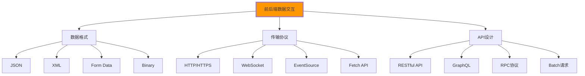

# 前后端数据交互

## 🔄 HTTP数据交互机制

### 📊 前后端交互架构

**前后端通过Web标准协议实现数据交换**：



## 🎯 完整的数据交互实现

### 📋 RESTful API交互演示

```html
<!DOCTYPE html>
<html lang="zh-CN">
<head>
    <meta charset="UTF-8">
    <meta name="viewport" content="width=device-width, initial-scale=1.0">
    <title>前后端数据交互演示</title>
    
    <style>
        .interaction-demo {
            max-width: 1200px;
            margin: 0 auto;
            padding: 2rem;
        }
        
        .demo-section {
            margin: 2rem 0;
            padding: 1rem;
            border: 1px solid #e0e0e0;
            border-radius: 8px;
        }
        
        .api-tester {
            display: grid;
            grid-template-columns: 1fr 1fr;
            gap: 1rem;
        }
        
        .request-panel {
            background: #f8f9fa;
            padding: 1rem;
            border-radius: 4px;
        }
        
        .response-panel {
            background: #fff3cd;
            padding: 1prem;
            border-radius: 4px;
            max-height: 400px;
            overflow-y: auto;
        }
        
        .method-selector {
            display: flex;
            gap: 0.5rem;
            margin-bottom: 1rem;
        }
        
        .method-btn {
            padding: 0.5rem 1rem;
            border: none;
            border-radius: 4px;
            cursor: pointer;
            font-weight: bold;
        }
        
        .method-get { background: #28a745; color: white; }
        .method-post { background: #007bff; color: white; }
        .method-put { background: #ffc107; color: black; }
        .method-delete { background: #dc3545; color: white; }
        
        .url-input {
            width: 100%;
            padding: 0.5rem;
            border: 1px solid #ddd;
            border-radius: 4px;
            margin-bottom: 1rem;
        }
        
        .headers-section, .body-section {
            margin: 1rem 0;
        }
        
        .json-editor {
            width: 100%;
            height: 200px;
            font-family: monospace;
            border: 1px solid #ddd;
            border-radius: 4px;
            padding: 0.5rem;
        }
        
        .response-content {
            font-family: monospace;
            white-space: pre-wrap;
            word-break: break-all;
        }
    </style>
</head>

<body>
    <div class="interaction-demo">
        <h1>前后端数据交互完整演示</h1>

        <!-- 🔌 API测试器 -->
        <section class="demo-section">
            <h2>API接口测试器</h2>
            
            <div class="api-tester">
                <!-- 请求配置面板 -->
                <div class="request-panel">
                    <h3>请求配置</h3>
                    
                    <!-- HTTP方法选择 -->
                    <div class="method-selector">
                        <button class="method-btn method-get" onclick="selectMethod('GET')">GET</button>
                        <button class="method-btn method-post" onclick="selectMethod('POST')">POST</button>
                        <button class="method-btn method-put" onclick="selectMethod('PUT')">PUT</button>
                        <button class="method-btn method-delete" onclick="selectMethod('DELETE')">DELETE</button>
                    </div>
                    
                    <!-- URL输入 -->
                    <input type="text" 
                           id="api-url" 
                           class="url-input"
                           placeholder="输入API端点URL，例如：https://api.example.com/users"
                           value="https://jsonplaceholder.typicode.com/users">
                    
                    <!-- 请求头 -->
                    <div class="headers-section">
                        <h4>请求头 (JSON格式)</h4>
                        <textarea id="request-headers" 
                                  class="json-editor"
                                  placeholder='{"Content-Type": "application/json", "Authorization": "Bearer token"}'>{
  "Content-Type": "application/json",
  "User-Agent": "Web-Demo/1.0"
}</textarea>
                    </div>
                    
                    <!-- 请求体 (POST/PUT) -->
                    <div class="body-section" id="body-section" style="display: none;">
                        <h4>请求体 (JSON格式)</h4>
                        <textarea id="request-body" 
                                  class="json-editor"
                                  placeholder='{"name": "示例用户", "email": "user@example.com"}'></textarea>
                    </div>
                    
                    <!-- 发送请求按钮 -->
                    <button onclick="sendAPIRequest()" class="send-btn" style="width: 100%; padding: 1rem; background: #28a745; color: white; border: none; border-radius: 4px; cursor: pointer;">
                        发送请求
                    </button>
                </div>

                <!-- 响应显示面板 -->
                <div class="response-panel">
                    <h3>响应结果</h3>
                    <div id="response-status" class="status-info"></div>
                    <div id="response-headers" class="headers-info"></div>
                    <div id="response-body" class="response-content"></div>
                    <div id="response-time" class="time-info"></div>
                </div>
            </div>
        </section>

        <!-- 📋 CRUD操作示例 -->
        <section class="demo-section">
            <h2>CRUD操作演示</h2>

            <!-- 用户列表 -->
            <div class="crud-demo">
                <h3>用户管理</h3>
                
                <!-- 创建用户表单 -->
                <div class="create-form">
                    <h4>创建新用户</h4>
                    <form id="create-user-form" onsubmit="createUser(event)">
                        <input type="text" 
                               id="user-name" 
                               placeholder="用户名" 
                               required>
                        <input type="email" 
                               id="user-email" 
                               placeholder="邮箱地址" 
                               required>
                        <input type="tel" 
                               id="user-phone" 
                               placeholder="电话号码">
                        <button type="submit">创建用户</button>
                    [/form>
                </div>

                <!-- 用户列表 -->
                <div class="user-list">
                    <h4>用户列表</h4>
                    <button onclick="loadUsers()" class="load-btn">加载用户列表</button>
                    <div id="users-container"></div>
                </div>
            </div>
        </section>

        <!-- 🌐 实时数据交互 -->
        <section class="demo-section">
            <h2>实时数据交互</h2>

            <div class="realtime-demo">
                <h3>WebSocket通信</h3>
                
                <div class="websocket-controls">
                    <button onclick="connectWebSocket()" id="ws-connect-btn">连接WebSocket</button>
                    <button onclick="disconnectWebSocket()" id="ws-disconnect-btn" disabled>断开连接</button>
                    <input type="text" 
                           id="ws-message" 
                           placeholder="输入要发送的消息">
                    <button onclick="sendWebSocketMessage()">发送消息</button>
                </div>
                
                <div class="websocket-status">
                    <div id="ws-status">未连接</div>
                    <div id="ws-messages" class="messages-log"></div>
                </div>
            </div>

            <div class="server-events-demo">
                <h3>Server-Sent Events</h3>
                
                <div class="sse-controls">
                    <button onclick="startSSE()" id="sse-start-btn">开始事件流</button>
                    <button onclick="stopSSE()" id="sse-stop-btn" disabled>停止事件流</button>
                </div>
                
                <div class="sse-status">
                    <div id="sse-status">未连接</div>
                    <div id="sse-events" class="events-log"></div>
                </div>
            </div>
        </section>

        <!-- 📊 数据格式转换 -->
        <section class="demo-section">
            <h2>数据格式处理</h2>

            <div class="format-demo">
                <h3>JSON数据操作</h3>
                
                <div class="json-operations">
                    <textarea id="json-input" 
                              class="json-editor"
                              placeholder="输入JSON数据"></textarea>
                    
                    <div class="operation-buttons">
                        <button onclick="validateJSON()">验证JSON格式</button>
                        <button onclick="formatJSON()">格式化JSON</button>
                        <button onclick="compressJSON()">压缩JSON</button>
                        <button onclick="convertXML()">转换为XML</button>
                    </div>
                    
                    <textarea id="json-output" 
                              class="json-editor"
                              readonly></textarea>
                </div>

                <h3>FormData处理</h3>
                
                <div class="formdata-demo">
                    <form id="formdata-form" enctype="multipart/form-data">
                        <input type="text" name="username" placeholder="用户名">
                        <input type="email" name="email" placeholder="邮箱">
                        <input type="file" name="avatar" accept="image/*">
                        <button type="button" onclick="handleFormData()">处理FormData</button>
                    </form>
                    
                    <div id="formdata-output" class="formdata-result"></div>
                </div>
            </div>
        </section>

        <!-- 🚀 高级交互模式 -->
        <section class="demo-section">
            <h2>高级交互模式</h2>

            <div class="advanced-demo">
                <h3>批量请求处理</h3>
                
                <div class="batch-requests">
                    <button onclick="sendBatchRequests()">发送批量请求</button>
                    <button onclick="sendParallelRequests()">发送并行请求</button>
                    <button onclick="sendSequentialRequests()">发送顺序请求</button>
                    <div id="batch-results"></div>
                </div>

                <h3>请求缓存管理</h3>
                
                <div class="cache-demo">
                    <button onclick="cacheRequest()">缓存请求</button>
                    <button onclick="clearCache()">清除缓存</button>
                    <button onclick="checkCache()">检查缓存</button>
                    <div id="cache-status"></div>
                </div>

                <h3>错误重试机制</h3>
                
                <div class="retry-demo">
                    <button onclick="sendRequestWithRetry()">发送带重试的请求</button>
                    <div id="retry-results"></div>
                </div>
            </div>
        </section>
    </div>

    <!-- JavaScript实现 -->
    <script>
        // 🔧 HTTP客户端管理器
        class HTTPClient {
            constructor() {
                this.baseURL = '';
                this.defaultHeaders = {
                    'Content-Type': 'application/json'
                };
                this.requestCache = new Map();
                this.init();
            }
            
            init() {
                // 初始化为空状态
                console.log('HTTP客户端已初始化');
            }
            
            // HTTP方法封装
            async request(url, options = {}) {
                const startTime = performance.now();
                
                const config = {
                    method: options.method || 'GET',
                    headers: { ...this.defaultHeaders, ...options.headers },
                    ...options
                };
                
                // 添加缓存键
                const cacheKey = `${config.method}:${url}:${JSON.stringify(config.body || {})}`;
                
                try {
                    const response = await fetch(this.baseURL + url, config);
                    const duration = performance.now() - startTime;
                    
                    return {
                        success: response.ok,
                        status: response.status,
                        statusText: response.statusText,
                        headers: Object.fromEntries(response.headers.entries()),
                        data: await response.json(),
                        duration: Math.round(duration)
                    };
                } catch (error) {
                    const duration = performance.now() - startTime;
                    
                    return {
                        success: false,
                        error: error.message,
                        duration: Math.round(duration)
                    };
                }
            }
            
            // GET请求
            async get(url, options = {}) {
                return this.request(url, { ...options, method: 'GET' });
            }
            
            // POST请求
            async post(url, data, options = {}) {
                return this.request(url, {
                    ...options,
                    method: 'POST',
                    body: JSON.stringify(data)
                });
            }
            
            // PUT请求
            async put(url, data, options = {}) {
                return this.request(url, {
                    ...options,
                    method: 'PUT',
                    body: JSON.stringify(data)
                });
            }
            
            // DELETE请求
            async delete(url, options = {}) {
                return this.request(url, { ...options, method: 'DELETE' });
            }
            
            // 批量请求
            async batchRequest(requests) {
                const results = await Promise.allSettled(
                    requests.map(req => this.request(req.url, req.options))
                );
                
                return results.map((result, index) => ({
                    index,
                    requestedUrl: requests[index].url,
                    success: result.status === 'fulfilled',
                    data: result.status === 'fulfilled' ? result.value : null,
                    error: result.status === 'rejected' ? result.reason.message : null
                }));
            }
            
            // 带重试的请求
            async requestWithRetry(url, options = {}, maxRetries = 3) {
                let lastError;
                
                for (let i = 0; i <= maxRetries; i++) {
                    try {
                        const result = await this.request(url, options);
                        if (result.success) {
                            return { ...result, retryCount: i };
                        }
                        lastError = result;
                        
                        // 指数退避延迟
                        if (i < maxRetries) {
                            await new Promise(resolve => 
                                setTimeout(resolve, Math.pow(2, i) * 1000)
                            );
                        }
                    } catch (error) {
                        lastError = error;
                        if (i < maxRetries) {
                            await new Promise(resolve => 
                                setTimeout(resolve, Math.pow(2, i) * 1000)
                            );
                        }
                    }
                }
                
                return {
                    success: false,
                    error: lastError.message || '请求失败',
                    retryCount: maxRetries
                };
            }
        }

        // 📡 WebSocket管理器
        class WebSocketManager {
            constructor() {
                this.socket = null;
                this.reconnectAttempts = 0;
                this.maxReconnectAttempts = 5;
                this.isConnected = false;
            }
            
            connect(url = 'ws://localhost:8080') {
                return new Promise((resolve, reject) => {
                    try {
                        this.socket = new WebSocket(url);
                        
                        this.socket.onopen = () => {
                            this.isConnected = true;
                            this.reconnectAttempts = 0;
                            this.updateStatus('已连接', 'success');
                            resolve();
                        };
                        
                        this.socket.onmessage = (event) => {
                            this.handleMessage(event.data);
                        };
                        
                        this.socket.onclose = () => {
                            this.isConnected = false;
                            this.updateStatus('连接已关闭')；
                            this.attemptReconnect(url);
                        };
                        
                        this.socket.onerror = (error) => {
                            this.updateStatus('连接错误', 'error');
                            reject(error);
                        };
                        
                    } catch (error) {
                        reject(error);
                    }
                });
            }
            
            disconnect() {
                if (this.socket) {
                    this.socket.close();
                    this.isConnected = false;
                    this.updateStatus('已断开连接');
                }
            }
            
            send(message) {
                if (this.isConnected && this.socket) {
                    this.socket.send(JSON.stringify({
                        type: 'message',
                        content: message,
                        timestamp: new Date().toISOString()
                    }));
                } else {
                    console.warn('WebSocket未连接');
                }
            }
            
            handleMessage(data) {
                const messageElement = document.getElementById('ws-messages');
                if (messageElement) {
                    const messageDiv = document.createElement('div');
                    messageDiv.className = 'ws-message';
                    messageDiv.innerHTML = `
                        <span class="message-time">${new Date().toLocaleTimeString()}</span>
                        <span class="message-content">${data}</span>
                    `;
                    messageElement.appendChild(messageDiv);
                    messageElement.scrollTop = messageElement.scrollHeight;
                }
            }
            
            updateStatus(text, type = 'info') {
                const statusElement = document.getElementById('ws-status');
                if (statusElement) {
                    statusElement.textContent = text;
                    statusElement.className = `status-${type}`;
                }
                
                const connectBtn = document.getElementById('ws-connect-btn');
                const disconnectBtn = document.getElementById('ws-disconnect-btn');
                
                if (this.isConnected) {
                    connectBtn.disabled = true;
                    disconnectBtn.disabled = false;
                } else {
                    connectBtn.disabled = false;
                    disconnectBtn.disabled = true;
                }
            }
            
            attemptReconnect(url) {
                if (this.reconnectAttempts < this.maxReconnectAttempts) {
                    this.reconnectAttempts++;
                    this.updateStatus(`重连中... (${this.reconnectAttempts}/${this.maxReconnectAttempts})`);
                    
                    setTimeout(() => {
                        this.connect(url);
                    }, 5000);
                }
            }
        }

        // 📰 Server-Sent Events管理器
        class SSEManager {
            constructor() {
                this.eventSource = null;
                this.isConnected = false;
            }
            
            start(url = '/api/sse') {
                if (this.isConnected) return;
                
                this.eventSource = new EventSource(url);
                
                this.eventSource.onopen = () => {
                    this.isConnected = true;
                    this.updateStatus('事件流已连接', 'success');
                };
                
                this.eventSource.onmessage = (event) => {
                    this.handleEvent(event);
                };
                
                this.eventSource.onerror = () => {
                    this.updateStatus('事件流错误', 'error');
                    this.isConnected = false;
                };
            }
            
            stop() {
                if (this.eventSource) {
                    this.eventSource.close();
                    this.isConnected = false;
                    this.updateStatus('事件流已断开');
                }
            }
            
            handleEvent(event) {
                const eventsElement = document.getElementById('sse-events');
                if (eventsElement) {
                    const eventDiv = document.createElement('div');
                    eventDiv.className = 'sse-event';
                    eventDiv.innerHTML = `
                        <span class="event-time">${new Date().toLocaleTimeString()}</span>
                        <span class="event-type">消息</span>
                        <span class="event-data">${event.data}</span>
                    `;
                    eventsElement.appendChild(eventDiv);
                    eventsElement.scrollTop = eventsElement.scrollHeight;
                }
            }
            
            updateStatus(text, type = 'info') {
                const statusElement = document.getElementById('sse-status');
                if (statusElement) {
                    statusElement.textContent = text;
                    statusElement.className = `status-${type}`;
                }
                
                const startBtn = document.getElementById('sse-start-btn');
                const stopBtn = document.getElementById('sse-stop-btn');
                
                if (this.isConnected) {
                    startBtn.disabled = true;
                    stopBtn.disabled = false;
                } else {
                    startBtn.disabled = false;
                    stopBtn.disabled = true;
                }
            }
        }

        // 🔧 全局实例和管理函数
        let httpClient = new HTTPClient();
        let wsManager = new WebSocketManager();
        let sseManager = new SSEManager();

        // 🎯 API测试相关函数
        function selectMethod(method) {
            // 更新UI中的选中状态
            document.querySelectorAll('.method-btn').forEach(btn => {
                btn.style.opacity = '0.7';
            });
            
            event.target.style.opacity = '1';
            
            // 显示/隐藏请求体
            const bodySection = document.getElementById('body-section');
            if (method === 'POST' || method === 'PUT') {
                bodySection.style.display = 'block';
            } else {
                bodySection.style.display = 'none';
            }
            
            // 存储选中的方法
            event.target.dataset.selectedMethod = method;
        }

        async function sendAPIRequest() {
            const url = document.getElementById('api-url').value;
            const method = document.querySelector('.method-btn[style*="opacity: 1"]')?.dataset.selectedMethod || 'GET';
            const headersText = document.getElementById('request-headers').value;
            const bodyText = document.getElementById('request-body').value;

            // 更新UI状态
            const sendBtn = event.target;
            sendBtn.disabled = true;
            sendBtn.textContent = '请求中...';

            try {
                // 解析请求头
                let headers = {};
                if (headersText.trim()) {
                    headers = JSON.parse(headersText);
                }

                // 解析请求体
                let body = null;
                if ((method === 'POST' || method === 'PUT') && bodyText.trim()) {
                    body = JSON.parse(bodyText);
                }

                // 发送请求
                const options = { method, headers };
                if (body) {
                    options.body = JSON.stringify(body);
                }

                const response = await httpClient.request(url, options);

                // 显示响应
                displayResponse(response);

            } catch (error) {
                displayResponse({
                    success: false,
                    error: error.message,
                    duration: 0
                });
            } finally {
                sendBtn.disabled = false;
                sendBtn.textContent = '发送请求';
            }
        }

        function displayResponse(response) {
            // 状态信息
            const statusElement = document.getElementById('response-status');
            const statusClass = response.success ? 'success' : 'error';
            const statusText = response.success 
                ? `✅ ${response.status} ${response.statusText}`
                : `❌ ${response.status} ${response.statusText || response.error}`;

            statusElement.innerHTML = `<div class="${statusClass}">${statusText}</div>`;

            // 响应头
            const headersElement = document.getElementById('response-headers');
            if (response.headers) {
                headersElement.innerHTML = `
                    <h4>响应头:</h4>
                    <pre>${JSON.stringify(response.headers, null, 2)}</pre>
                `;
            }

            // 响应体
            const bodyElement = document.getElementById('response-body');
            if (response.data) {
                bodyElement.innerHTML = `<pre>${JSON.stringify(response.data, null, 2)}</pre>`;
            } else if (response.error) {
                bodyElement.innerHTML = `<div class="error">${response.error}</div>`;
            }

            // 请求时间
            const timeElement = document.getElementById('response-time');
            timeElement.textContent = `响应时间: ${response.duration}ms`;
        }

        // 📋 CRUD操作函数
        async function loadUsers() {
            const response = await httpClient.get('https://jsonplaceholder.typicode.com/users');
            
            const container = document.getElementById('users-container');
            
            if (response.success) {
                container.innerHTML = `
                    <div class="user-list-header">
                        <span>ID</span>
                        <span>用户名</span>
                        <span>邮箱</span>
                        <span>操作</span>
                    </div>
                    ${response.data.map(user => `
                        <div class="user-item">
                            <span>${user.id}</span>
                            <span>${user.name}</span>
                            <span>${user.email}</span>
                            <span>
                                <button onclick="editUser({${user.id}})">编辑</button>
                                <button onclick="deleteUser(${user.id})">删除</button>
                            </span>
                        </div>
                    `).join('')}
                `;
            } else {
                container.innerHTML = `<div class="error">加载用户失败: ${response.error}</div>`;
            }
        }

        async function createUser(event) {
            event.preventDefault();
            
            const formData = {
                name: document.getElementById('user-name').value,
                email: document.getElementById('user-email').value,
                phone: document.getElementById('user-phone').value
            };

            const response = await httpClient.post('https://jsonplaceholder.typicode.com/users', formData);

            if (response.success) {
                alert('用户创建成功!');
                document.getElementById('create-user-form').reset();
                loadUsers(); // 重新加载用户列表
            } else {
                alert('创建用户失败: ' + response.error);
            }
        }

        async function editUser(userId) {
            const newName = prompt('输入新用户名:');
            if (newName) {
                const response = await httpClient.put(
                    `https://jsonplaceholder.typicode.com/users/${userId}`,
                    { name: newName }
                );

                if (response.success) {
                    alert('用户更新成功!');
                    loadUsers();
                } else {
                    alert('更新用户失败: ' + response.error);
                }
            }
        }

        async function deleteUser(userId) {
            if (confirm('确定要删除这个用户吗?')) {
                const response = await httpClient.delete(`https://jsonplaceholder.typicode.com/users/${userId}`);

                if (response.success) {
                    alert('用户删除成功!');
                    loadUsers();
                } else {
                    alert('删除用户失败: ' + response.error);
                }
            }
        }

        // 🌐 实时通信函数
        function connectWebSocket() {
            wsManager.connect('wss://echo.websocket.org');
        }

        function disconnectWebSocket() {
            wsManager.disconnect();
        }

        function sendWebSocketMessage() {
            const message = document.getElementById('ws-message').value;
            if (message) {
                wsManager.send(message)；
                document.getElementById('ws-message').value = '';
            }
        }

        function startSSE() {
            sseManager.start('/api/sse');
        }

        function stopSSE() {
            sseManager.stop();
        }

        // 📊 数据操作函数
        function validateJSON() {
            const input = document.getElementById('json-input').value;
            const output = document.getElementById('json-output');
            
            try {
                JSON.parse(input);
                output.value = JSON.stringify({ valid: true, message: "JSON格式正确" }, null, 2);
            } catch (error) {
                output.value = JSON.stringify({ valid: false, error: error.message }, null, 2);
            }
        }

        function formatJSON() {
            const input = document.getElementById('json-input').value;
            const output = document.getElementById('json-output');
            
            try {
                const parsed = JSON.parse(input);
                output.value = JSON.stringify(parsed, null, 2);
            } catch (error) {
                output.value = `JSON格式错误: ${error.message}`;
            }
        }

        function compressJSON() {
            const input = document.getElementById('json-input').value;
            const output = document.getElementById('json-output');
            
            try {
                const parsed = JSON.parse(input);
                output.value = JSON.stringify(parsed);
            } catch (error) {
                output.value = `JSON格式错误: ${error.message}`;
            }
        }

        function convertXML() {
            const input = document.getElementById('json-input').value;
            const output = document.getElementById('json-output');
            
            try {
                const jsonData = JSON.parse(input);
                const xmlData = jsonToXml(jsonData);
                output.value = xmlData;
            } catch (error) {
                output.value = `转换失败: ${error.message}`;
            }
        }

        function jsonToXml(obj, root = 'root') {
            let xml = `<?xml version="1.0" encoding="UTF-8"?>\n<${root}>`;
            
            for (const [key, value] of Object.entries(obj)) {
                if (typeof value === 'object' && value !== null) {
                    if (Array.isArray(value)) {
                        value.forEach(item => {
                            xml += `<${key}>`;
                            if (typeof item === 'object') {
                                xml += jsonToXml(item, key).replace(`<${key}>`, '').replace(`</${key}>`, '');
                            } else {
                                xml += item;
                            }
                            xml += `</${key}>`;
                        });
                    } else {
                        xml += `<${key}>${jsonToXml(value, key).replace(`<${key}>`, '').replace(`</${key}>`, '')}</${key}>`;
                    }
                } else {
                    xml += `<${key}>${value}</${key}>`;
                }
            }
            
            xml += `</${root}>`;
            return xml;
        }

        function handleFormData() {
            const form = document.getElementById('formdata-form');
            const formData = new FormData(form);
            const output = document.getElementById('formdata-output');
            
            const result = {};
            for (const [key, value] of formData.entries()) {
                result[key] = value instanceof File ? `File: ${value.name}` : value;
            }
            
            output.innerHTML = `<pre>${JSON.stringify(result, null, 2)}</pre>`;
        }

        // 🚀 高级功能函数
        async function sendBatchRequests() {
            const requests = [
                { url: 'https://jsonplaceholder.typicode.com/users/1' },
                { url: 'https://jsonplaceholder.typicode.com/users/2' },
                { url: 'https://jsonplaceholder.typicode.com/users/3' }
            ];

            const results = await httpClient.batchRequest(requests);
            
            const resultsDiv = document.getElementById('batch-results');
            resultsDiv.innerHTML = `
                <h4>批量请求结果:</h4>
                <pre>${JSON.stringify(results, null, 2)}</pre>
            `;
        }

        async function sendParallelRequests() {
            const requests = [
                httpClient.get('https://jsonplaceholder.typicode.com/users/1'),
                httpClient.get('https://jsonplaceholder.typicode.com/posts/1'),
                httpClient.get('https://jsonplaceholder.typicode.com/comments/1')
            ];

            const results = await Promise.allSettled(requests);
            
            const resultsDiv = document.getElementById('batch-results');
            resultsDiv.innerHTML = `
                <h4>并行请求结果:</h4>
                <pre>${JSON.stringify(results, null, 2)}</pre>
            `;
        }

        async function sendSequentialRequests() {
            const urls = [
                'https://jsonplaceholder.typicode.com/users/1',
                'https://jsonplaceholder.typicode.com/posts/1',
                'https://jsonplaceholder.typicode.com/comments/1'
            ];

            const results = [];
            for (const url of urls) {
                const result = await httpClient.get(url);
                results.push(result);
            }
            
            const resultsDiv = document.getElementById('batch-results');
            resultsDiv.innerHTML = `
                <h4>顺序请求结果:</h4>
                <pre>${JSON.stringify(results, null, 2)}</pre>
            `;
        }

        async function cacheRequest() {
            urlClient.requestCache.set('example', { 
                data: 'cached data', 
                timestamp: Date.now() 
            });
            
            document.getElementById('cache-status').innerHTML = 
                '✅ 请求已缓存到内存中';
        }

        function clearCache() {
            httpClient.requestCache.clear();
            document.getElementById('cache-status').innerHTML = 
                '✅ 缓存已清除';
        }

        function checkCache() {
            const cacheSize = httpClient.requestCache.size;
            const cacheEntries = Array.from(httpClient.requestCache.entries());
            
            document.getElementById('cache-status').innerHTML = `
                <h4>缓存状态:</h4>
                <p>缓存条目数: ${cacheSize}</p>
                <pre>${JSON.stringify(cacheEntries, null, 2)}</pre>
            `;
        }

        async function sendRequestWithRetry() {
            const result = await httpClient.requestWithRetry(
                'https://httpstat.us/500', // 模拟失败的服务
                {},
                3 // 最大重试3次
            );
            
            const resultsDiv = document.getElementById('retry-results');
            resultsDiv.innerHTML = `
                <h4>重试请求结果:</h4>
                <p>重试次数: ${result.retryCount}</p>
                <p>最终状态: ${result.success ? '成功' : '失败'}</p>
                <pre>${JSON.stringify(result, null, 2)}</pre>
            `;
        }

        // 🎯 初始化和事件绑定
        document.addEventListener('DOMContentLoaded', () => {
            console.log('前后端数据交互演示已加载');
            
            // 全局HTTP工具
            window.HTTPTools = {
                client: httpClient,
                sendRequest: sendAPIRequest,
                batchRequest: sendBatchRequests,
                websocket: wsManager,
                sse: sseManager
            };
        });
    </script>
</body>
</html>
```

---

**🔗 前后端数据交互深化**：
- 现代框架对比：`[[04-4 现代框架对比分析]]`
- 服务器端渲染：`[[04-6 服务器端渲染SSR]]`
- 构建工具集成：`[[03-25 构建工具集成]]`
