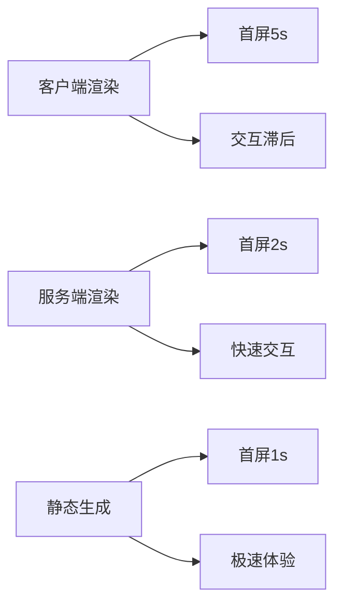

# 现代框架对比分析

## 🎯 主流框架HTML处理对比

### 📊 React vs Vue vs Angular HTML支持

| 特性 | React | Vue | Angular | 纯HTML |
|------|-------|-----|---------|--------|
| **模板语法** | JSX | Template | Template | 原生标签 |
| **学习曲线** | ⭐⭐⭐ | ⭐⭐ | ⭐⭐⭐⭐ | ⭐ |
| **性能** | ⭐⭐⭐⭐ | ⭐⭐⭐⭐ | ⭐⭐⭐ | ⭐⭐⭐⭐⭐ |
| **HTML语义** | ⭐⭐ | ⭐⭐⭐⭐ | ⭐⭐⭐ | ⭐⭐⭐⭐⭐ |
| **SEO友好** | ⭐⭐ | ⭐⭐⭐ | ⭐⭐⭐⭐ | ⭐⭐⭐⭐⭐ |

### 🔧 JSX vs Template引擎

```jsx
// React JSX
function UserProfile({ user }) {
  return (
    <article className="profile-card">
      <header>
        
        <h2>{user.name}</h2>
      </header>
      <main>
        <p>{user.bio}</p>
      </main>
    </article>
  )
}
```

```vue
<!-- Vue Template -->
<template>
  <article class="profile-card">
    <header>
      
      <h2>{{ user.name }}</h2>
    </header>
    <main>
      <p>{{ user.bio }}</p>
    </main>
  </article>
</template>
```

## 🌐 服务端渲染对比

### 📈 SSR性能影响分析



### 🚀 Next.js vs Nuxt.js vs Angular Universal

| 特性 | Next.js | Nuxt.js | Angular Universal |
|------|---------|---------|-------------------|
| **SSR支持** | ✅ | ✅ | ✅ |
| **SSG支持** | ✅ | ✅ | ✅ |
| **AMP支持** | ✅ | ❌ | ❌ |
| **PWA集成** | ⭐⭐⭐ | ⭐⭐⭐⭐ | ⭐⭐⭐⭐ |
| **HTML优化** | ⭐⭐⭐ | ⭐⭐⭐⭐ | ⭐⭐⭐ |

## 🔗 相关链接

- [[04-5 静态站点生成器]]
- [[04-6 服务器端渲染SSR]]
- [[04-2 HTML与JavaScript交互]]
- [[03-22 项目文件组织]]
- [[HTML5语义化/03-1 语义化设计理念]]

---

*最后更新：2024年* | 🎯 现代框架HTML应用分析
