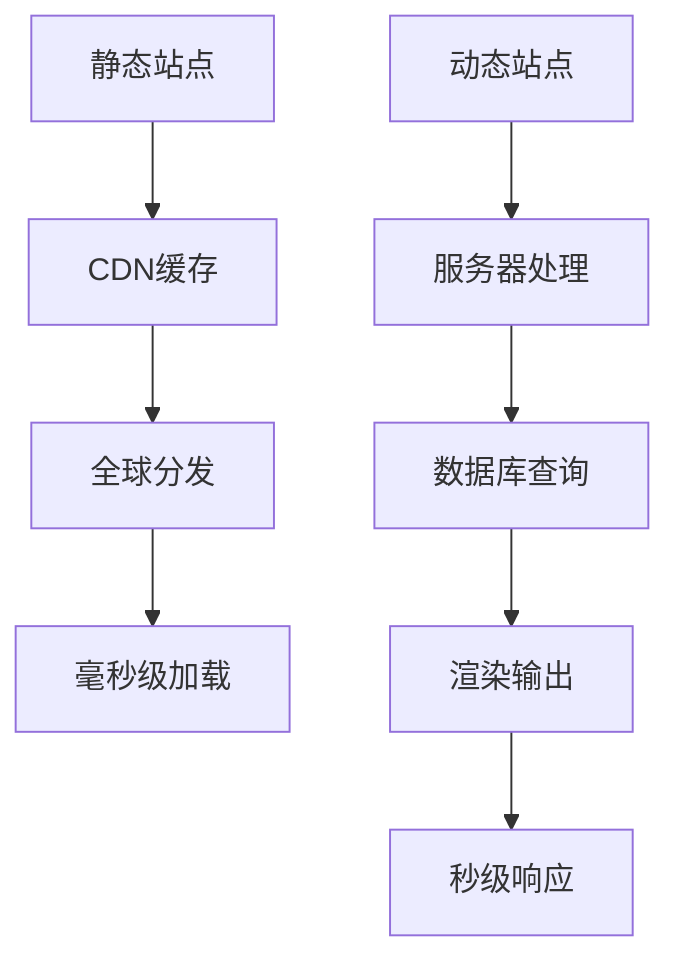

# 静态站点生成器

## 📚 SSG生态系统概览

### 🔧 主流SSG工具对比

| 工具 | 语言 | 模板引擎 | 构建速度 | 生态活跃度 |
|------|------|----------|----------|------------|
| **Next.js** | React | JSX | ⭐⭐⭐⭐ | ⭐⭐⭐⭐⭐ |
| **11ty** | HTML | Jekyll | ⭐⭐⭐ | ⭐⭐⭐⭐ |
| **Hugo** | Go | Go | ⭐⭐⭐⭐⭐ | ⭐⭐⭐ |
| **Gatsby** | React | JSX | ⭐⭐ | ⭐⭐⭐⭐ |
| **VitePress** | Vue | Vue | ⭐⭐⭐⭐⭐ | ⭐⭐⭐ |

### 📊 静态vs动态站点性能



## 🛠️ 核心SSG配置示例

### 📝 Eleventy基础配置

```javascript
// .eleventy.js
module.exports = function(eleventyConfig) {
  // HTML输出优化
  eleventyConfig.addTransform("minify", function(content) {
    return this.outputPath && this.outputPath.endsWith('.html')
      ? htmlmin.minify(content, {
          collapseWhitespace: true,
          removeComments: true,
          useShortDoctype: true
        })
      : content
  })
  
  // 模板数据
  eleventyConfig.addGlobalData("site", {
    name: "HTML学习站",
    url: "https://html-learning.example.com"
  })
  
  return {
    dir: {
      input: "src",
      output: "dist"
    }
  }
}
```

### 🚀 VitePress现代化配置

```javascript
// .vitepress/config.js
export default {
  title: 'HTML知识地图',
  description: '完整的HTML学习体系',
  
  markdown: {
    lineNumbers: true,
    anchor: { level: 2 },
    toc: { level: [1, 2, 3] }
  },
  
  build: {
    rollupOptions: {
      output: {
        manualChunks: {
          'html-guide': ['markdown', 'guide-config']
        }
      }
    }
  }
}
```

## 📄 静态站点HTML策略

### 🎯 SEO优化实现

```html
<!-- 静态生成的优化HTML -->
<!DOCTYPE html>
<html lang="zh-CN">
<head>
    <meta charset="UTF-8">
    <meta name="viewport" content="width=device-width, initial-scale=1.0">
    <title>HTML基础语法 - HTML知识地图</title>
    <meta name="description" content="掌握HTML基础语法规则，构建高质量网页结构">
    
    <!-- Open Graph -->
    <meta property="og:title" content="HTML基础语法">
    <meta property="og:description" content="掌握HTML基础语法规则">
    <meta property="og:type" content="article">
    
    <!-- JSON-LD结构化数据 -->
    <script type="application/ld+json">
    {
      "@context": "https://schema.org",
      "@type": "Article",
      "headline": "HTML基础语法",
      "author": "HTML学习团队",
      "description": "掌握HTML基础语法规则"
    }
    </script>
</head>
<body>
    <!-- 预生成的内容 -->
</body>
</html>
```

### ⚡ 性能优化策略

```javascript
// 自动化性能优化
const performanceOptimizations = {
  // HTML压缩
  minifyHTML: {
    collapseWhitespace: true,
    removeComments: true,
    minifyCSS: true,
    minifyJS: true
  },
  
  // 资源优化
  assetOptimization: {
    inlineCSS: true,      // 关键CSS内联
    lazyLoadImages: true, // 图片懒加载
    preloadCritical: true // 关键资源预载
  },
  
  // PWA功能
  pwaFeatures: {
    serviceWorker: true,
    webAppManifest: true,
    offlineSupport: true
  }
}
```

## 🔗 相关链接

- [[04-4 现代框架对比分析]]
- [[04-6 服务器端渲染SSR]]
- [[SEO性能优化/03-16 页面性能优化]]
- [[现代Web平台/04-9 PWA中的HTML]]
- [[实战项目案例/04-19 博客CMS系统]]

---

*最后更新：2024年* | 📚 静态站点生成最佳实践
