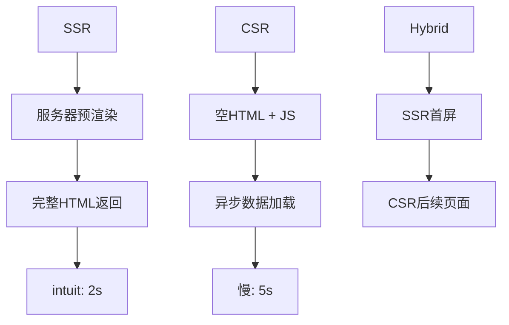

# 服务器端渲染SSR

## 🌐 SSR工作原理与优势

### 📊 SSR vs CSR 性能对比



### ⚡ SSR技术栈对比

| 框架 | 首屏时间 | SEO支持 | 学习曲线 | 生态成熟度 |
|------|----------|---------|----------|------------|
| **Next.js** | 1.5s | ⭐⭐⭐⭐⭐ | ⭐⭐⭐ | ⭐⭐⭐⭐⭐ |
| **Nuxt.js** | 1.2s | ⭐⭐⭐⭐⭐ | ⭐⭐ | ⭐⭐⭐⭐ |
| **Angular Universal** | 1.8s | ⭐⭐⭐⭐ | ⭐⭐⭐⭐ | ⭐⭐⭐ |
| **SvelteKit** | 1.0s | ⭐⭐⭐⭐⭐ | ⭐⭐ | ⭐⭐⭐ |

## 🔧 Next.js HTML优化

### 📝 基础SSR配置

```javascript
// next.config.js
module.exports = {
  // HTML压缩优化
  compress: true,
  
  // 静态优化
  experimental: {
    optimizeCss: true,
    optimizePackageImports: ['react-icons']
  },
  
  // 自定义HTML文档
  async headers() {
    return [
      {
        source: '/(.*)',
        headers: [
          {
            key: 'X-Content-Type-Options',
            value: 'nosniff',
          },
          {
            key: 'X-Frame-Options',
            value: 'DENY',
          }
        ]
      }
    ]
  }
}
```

### 🎯 页面HTML结构

```jsx
// pages/_document.js
import Document, { Head, Html, Main, NextScript } from 'next/document'

class MyDocument extends Document {
  render() {
    return (
      <Html lang="zh-CN">
        <Head>
          <meta charSet="utf-8" />
          <meta name="theme-color" content="#000000" />
          <link rel="preload" href="/fonts/inter.woff2" as="font" crossOrigin="" />
          <script
            dangerouslySetInnerHTML={{
              __html: `
                window.__NEXT_DATA__ = ${JSON.stringify(this.props)};
              `
            }}
          />
        </Head>
        <body>
          <Main />
          <NextScript />
        </body>
      </Html>
    )
  }
}
```

## 🚀 Nuxt.js全栈方案

### 📦 自动HTML优化

```javascript
// nuxt.config.js
export default {
  // HTML头部配置
  app: {
    head: {
      title: 'HTML知识地图',
      meta: [
        { charset: 'utf-8' },
        { name: 'viewport', content: 'width=device-width, initial-scale=1' },
        { property: 'og:title', content: 'HTML知识地图' }
      ],
      link: [
        { rel: 'icon', type: 'image/x-icon', href: '/favicon.ico' }
      ]
    }
  },
  
  // SSR配置
  ssr: true,
  
  // HTML压缩
  htmlMinify: {
    collapseBooleanAttributes: true,
    decodeEntities: true,
    minifyCSS: true,
    minifyJS: true,
    processConditionalComments: true,
    removeEmptyAttributes: true,
    removeRedundantAttributes: true
  },
  
  // 构建优化
  build: {
    extractCSS: true,
    optimization: {
      splitChunks: {
        layouts: true,
        pages: true,
        commons: true
      }
    }
  }
}
```

### 🔄 服务端数据预取

```vue
<!-- pages/[id].vue -->
<template>
  <div>
    <h1>{{ article.title }}</h1>
    <div v-html="article.content"></div>
  </div>
</template>

<script>
export default {
  async asyncData({ params }) {
    const article = await $fetch(`/api/articles/${params.id}`)
    return { article }
  },
  
  head() {
    return {
      title: this.article.title,
      meta: [
        { hid: 'description', name: 'description', content: this.article.excerpt }
      ]
    }
  }
}
</script>
```

## 📈 SSR性能优化

### ⚡ 关键优化指标

```javascript
// 性能监控配置
const performanceConfig = {
  // Core Web Vitals目标
  metrics: {
    LCP: { target: 2500 }, // 最大内容绘制 2.5s
    FID: { target: 100 },   // 首次输入延迟 100ms
    CLS: { target: 0.1 }   // 累积布局偏移 0.1
  },
  
  // SSR特定指标
  ssrMetrics: {
    serverResponseTime: { target: 200 }, // 服务器响应 200ms
    hydrationTime: { target: 500 },      // 客户端注水 500ms
    htmlSize: { target: 50000 }          // HTML大小 50KB
  }
}
```

### 🛠️ HTML缓存策略

```nginx
# nginx.conf - SSR缓存配置
server {
    location / {
        # SSR页面缓存
        proxy_cache ssrcache;
        proxy_cache_valid 200 5m;
        proxy_cache_key $uri$is_args$args;
        
        # 缓存头设置
        add_header X-Cache-Status $upstream_cache_status;
        
        proxy_pass http://ssr_backend;
    }
    
    location ~* \.(html)$ {
        # HTML文件长期缓存
        expires 1h;
        add_header Cache.Control "public, must.revalidate";
    }
}
```

## 🔗 相关链接

- [[04-4 现代框架对比分析]]
- [[04-5 静态站点生成器]]
- [[SEO性能优化/03-16 页面性能优化]]
- [[现代Web平台/04-7 响应式设计深度]]
- [[实战项目案例/04-19 博客CMS系统]]

---

*最后更新：2024年* | 🌐 服务器端渲染现代化实践
