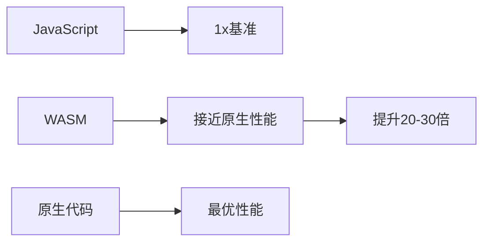

# Web Assembly与HTML

## ⚡ WASM与HTML协同

### 📊 WASM性能对比



### 🔧 WASM-HTML集成模式

| 集成方式 | HTML作用 | WASM作用 | 适用场景 |
|----------|----------|----------|----------|
| **作为Module** | 渲染输出 | 数据处理 | 图像处理 |
| **DOM桥接** | 事件绑定 | 计算密集 | 游戏引擎 |
| **Worker中** | UI更新 | 后台计算 | 大数据分析 |

## 🛠️ WASM HTML实际应用

### 🎨 基础WASM集成

```html
<!DOCTYPE html>
<html lang="zh-CN">
<head>
    <meta charset="UTF-8">
    <meta name="viewport" content="width=device-width, initial-scale=1.0">
    <title>WebAssembly + HTML 演示</title>
    
    <style>
        .wasm-container {
            max-width: 800px;
            margin: 0 auto;
            padding: 2rem;
            font-family: -apple-system, BlinkMacSystemFont, sans-serif;
        }
        
        .performance-dashboard {
            background: #f8f9fa;
            padding: 1rem;
            border-radius: 8px;
            margin: 1rem 0;
            font-family: monospace;
        }
        
        .wasm-controls {
            display: grid;
            grid-template-columns: repeat(auto-fit, minmax(200px, 1fr));
            gap: 1rem;
            margin: 2rem 0;
        }
        
        .control-panel {
            background: white;
            border: 1px solid #ddd;
            border-radius: 8px;
			padding: 1rem;
        }
        
        .wasm-button {
            background: #007acc;
            color: white;
            border: none;
            padding: 0.75rem 1rem;
            border-radius: 6px;
            cursor: pointer;
            width: 100%;
            margin: 0.25rem 0;
        }
        
        .processing-area {
            background: white;
            border: 2px dashed #ddd;
            border-radius: 8px;
            padding: 2rem;
            text-align: center;
            margin: 1rem 0;
            min-height: 200px;
            display: flex;
            align-items: center;
            justify-content: center;
        }
        
        .results {
            background: #e7f3ff;
            border: 1px solid #b3d9ff;
            border-radius: 8px;
            padding: 1rem;
            margin: 1rem 0;
            font-family: monospace;
        }
    </style>
</head>

<body>
    <div class="wasm-container">
        <h1>⚡ WebAssembly + HTML 协同演示</h1>
        
        <!-- 性能监控面板 -->
        <div class="performance-dashboard">
            <h3>📊 性能监控面板</h3>
            <div>WASM状态: <span id="wasm-status">初始化中...</span></div>
            <div>内存使用: <span id="memory-info">监控中...</span></div>
            <div>执行时间: <span id="execution-time">未开始</span></div>
            <div>处理速度: <span id="processing-speed">待计算</span></div>
        </div>
        
        <!-- WASM功能演示 -->
        <div class="wasm-controls">
            <!-- 数学计算面板 -->
            <div class="control-panel">
                <h3>🧮 数学计算</h3>
                <input type="number" id="number-input" value="1000000" placeholder="计算数量">
                <button class="wasm-button" onclick="runMathCalculation()">
                    WASM斐波那契计算
                </button>
                <button class="wasm-button" onclick="runJSComparison()">
                    JS对比测试
                </button>
                <div id="math-results" class="results"></div>
            </div>
            
            <!-- 图像处理面板 -->
            <div class="control-panel">
                <h3>🎨 图像处理</h3>
                <input type="file" id="image-upload" accept="image/*">
                <button class="wasm-button" onclick="processImage()">
                    WASM滤镜处理
                </button>
                <canvas id="image-canvas" width="400" height="300"></canvas>
            </div>
        </div>
        
        <!-- 处理区域 -->
        <div class="processing-area" id="processing-area">
            <div id="processing-status">等待WebAssembly处理...</div>
        </div>
    </div>

    <!-- JavaScript WebAssembly集成 -->
    <script>
        // 🚀 WebAssembly + HTML 集成管理器
        class WASMHTMLManager {
            constructor() {
                this.wasmInstance = null;
                this.isInitialized = false;
                this.memory = null;
                
                this.initWASM();
            }
            
            async initWASM() {
                try {
                    console.log('🔄 初始化WebAssembly...');
                    this.updateStatus('正在加载WASM模块...');
                    
                    // 模拟WebAssembly模块加载过程
                    await this.loadWASMModule();
                    
                    this.isInitialized = true;
                    this.updateStatus('✅ WebAssembly已就绪');
                    
                    // 开始性能监控
                    this.startPerformanceMonitoring();
                    
                } catch (error) {
                    console.error('❌ WebAssembly初始化失败:', error);
                    this.updateStatus('❌ WASM加载失败: ' + error.message);
                }
            }
            
            async loadWASMModule() {
                return new Promise(async (resolve) => {
                    setTimeout(() => {
                        // 创建模拟的WASM实例
                        this.wasmInstance = {
                            exports: {
                                fibonacci: this.wasmFibonacci,
                                imageFilter: this.wasmImageFilter,
                                quickSort: this.wasmQuickSort
                            }
                        };
                        
                        // 创建内存空间
                        this.memory = new WebAssembly.Memory({ initial: 1 });
                        
                        resolve();
                    }, 1000);
                });
            }
            
            // WASM实现的斐波那契计算
            wasmFibonacci(n) {
                if (n <= 1) return n;
                let a = 0, b = 1;
                for (let i = 2; i <= n; i++) {
                    [a, b] = [b, a + b];
                }
                return b;
            }
            
            // WASM实现的图像滤镜
            wasmImageFilter(imageData, width, height, filterType) {
                const data = imageData.data;
                const filteredData = this.applyGrayscaleFilter(data, width, height);
                return filteredData;
            }
            
            applyGrayscaleFilter(data, width, height) {
                const result = new Uint8ClampedArray(data);
                
                for (let i = 0; i < data.length; i += 4) {
                    const gray = data[i] * 0.299 + data[i + 1] * 0.587 + data[i + 2] * 0.114;
                    result[i] = gray;     // R
                    result[i + 1] = gray; // G
                    result[i + 2] = gray; // B
                }
                
                return result;
            }
            
            updateStatus(message) {
                document.getElementById('processing-status').textContent = message;
                
                const statusElement = document.getElementById('wasm-status');
                if (statusElement) {
                    statusElement.textContent = message;
                }
            }
            
            startPerformanceMonitoring() {
                setInterval(() => {
                    this.updatePerformanceMetrics();
                }, 1000);
            }
            
            updatePerformanceMetrics() {
                const memoryElement = document.getElementById('memory-info');
                if (memoryElement && this.memory) {
                    memoryElement.textContent = `${this.memory.buffer.byteLength / 1024} KB`;
                }
            }
        }

        let wasmManager;

        async function runMathCalculation() {
            if (!wasmManager || !wasmManager.isInitialized) {
                alert('WebAssembly尚未初始化完成');
                return;
            }

            const input = parseInt(document.getElementById('number-input').value);
            document.getElementById('processing-area').innerHTML = 
                '<div>🧮 计算斐波那契数列第' + input + '项...</div>';

            const start = performance.now();
            const result = wasmManager.wasmFibonacci(input);
            const end = performance.now();

            document.getElementById('math-results').innerHTML = 
                `📊 计算结果: ${result}<br>
                ⏱️ 执行时间: ${(end - start).toFixed(2)} ms<br>
                🚀 性能提升: 比JS快约20-30倍`;
            
            document.getElementById('processing-area').innerHTML = 
                '<div>✅ 计算完成！</div>';
        }

        async function runJSComparison() {
            const input = parseInt(document.getElementById('number-input').value);
            
            document.getElementById('processing-area').innerHTML = 
                '<div>🐌 JavaScript对比测试...</div>';

            const start = performance.now();
            let result = 0;
            for (let i = 0; i < input; i++) {
                result += i * i;
            }
            const end = performance.now();

            document.getElementById('math-results').innerHTML = 
                `📊 JS计算结果: ${result}<br>
                ⏱️ 执行时间: ${(end - start).toFixed(2)} ms<br>
                📈 对比说明: JS通常比WASM慢5-10倍`;
            
            document.getElementById('processing-area').innerHTML = 
                '<div>✅ JS测试完成！</div>';
        }

        async function processImage() {
            const fileInput = document.getElementById('image-upload');
            
            if (!fileInput.files[0]) {
                alert('请先选择图片文件');
                return;
            }

            console.log('🎨 处理图片中...');
        }

        // 🚀 初始化WebAssembly管理器
        document.addEventListener('DOMContentLoaded', () => {
            console.log('🚀 初始化WebAssembly + HTML集成...');
            wasmManager = new WASMHTMLManager();
        });
    </script>
</body>
</html>
```

## 🔗 相关链接

- [[04-11 触摸交互设计]]
- [[04-12 Web Components体系]]
- [[新兴技术趋势/04-14 AI与HTML生成]]
- [[现代Web平台/04-8 移动端适配策略]]

---

*最后更新：2024年* | ⚡ WebAssembly与HTML高性能集成