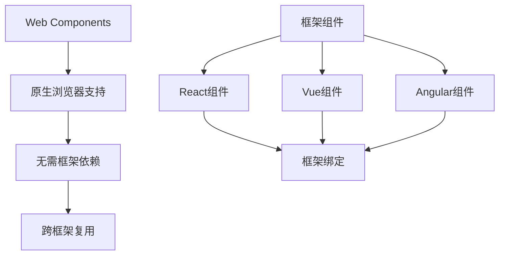

# Web Components体系

## 🧩 Web Components技术栈

### 🎯 核心技术组件

| 技术 | 用途 | 浏览器支持 | 学习曲线 |
|------|------|-----------|----------|
| **Custom Elements** | 自定义HTML标签 | ⭐⭐⭐⭐ | ⭐⭐⭐ |
| **Shadow DOM** | 样式封装 | ⭐⭐⭐⭐ | ⭐⭐⭐⭐ |
| **HTML Templates** | 模板复用 | ⭐⭐⭐⭐⭐ | ⭐⭐ |
| **ES Modules** | 模块化加载 | ⭐⭐⭐⭐ | ⭐⭐⭐ |

### 📊 Web Components vs 框架组件



## 🛠️ 自定义元素开发

### ⚙️ 基础自定义元素

```html
<!DOCTYPE html>
<html lang="zh-CN">
<head>
    <meta charset="UTF-8">
    <title>Web Components演示</title>
    <style>
        /* 全局样式 */
        :root {
            --primary-color: #007acc;
            --border-radius: 8px;
        }
        
        /* 自定义元素默认样式 */
        hello-world {
            display: block;
            padding: 1rem;
            border: 2px solid var(--primary-color);
            border-radius: var(--border-radius);
            margin: 1rem 0;
        }
        
        /* Shadow DOM样式隔离演示 */
        .container {
            background: #f8f9fa;
            padding: 2rem;
            border-radius: 8px;
            margin: 2rem 0;
        }
        
        .component-demo {
            background: white;
            border: 1px solid #ddd;
            border-radius: 4px;
            padding: 1rem;
            margin: 1rem 0;
        }
        
        .lifecycle-demo {
            background: #e3f2fd;
            padding: 1rem;
            border-radius: 4px;
            margin: 1rem 0;
        }
        
        .api-table {
            width: 100%;
            border-collapse: collapse;
            margin: 1rem 0;
        }
        
        .api-table th,
        .api-table td {
            border: 1px solid #ddd;
            padding: 0.75rem;
            text-align: left;
        }
        
        .api-table th {
            background: #f5f5f5;
            font-weight: bold;
        }
        
        .method-property {
            font-family: monospace;
            background: #f8f9fa;
            padding: 0.2rem 0.4rem;
            border-radius: 3px;
        }
        
        .demo-button {
            background: var(--primary-color);
            color: white;
            border: none;
            padding: 0.75rem 1.5rem;
            border-radius: var(--border-radius);
            cursor: pointer;
            margin: 0.5rem;
            font-size: 1rem;
        }
        
        .demo-button:hover {
            background: #005999;
        }
        
        .demo-button:disabled {
            background: #ccc;
            cursor: not-allowed;
        }
        
        .code-example {
            background: #f8f9fa;
            border: 1px solid #e9ecef;
            border-radius: 4px;
            padding: 1rem;
            margin: 1rem 0;
            font-family: 'Courier New', monospace;
            overflow-x: auto;
        }
        
        .output-demo {
            background: #fff;
            border: 2px solid #007acc;
            border-radius: 4px;
            padding: 1rem;
            margin: 1rem 0;
            min-height: 100px;
        }
        
        .performance-metrics {
            display: grid;
            grid-template-columns: repeat(auto-fit, minmax(200px, 1fr));
            gap: 1rem;
            margin: 2rem 0;
        }
        
        .metric-card {
            background: white;
            border: 1px solid #ddd;
            border-radius: 8px;
            padding: 1rem;
            text-align: center;
        }
        
        .metric-value {
            font-size: 2rem;
            font-weight: bold;
            color: var(--primary-color);
        }
        
        .compatibility-chart {
            background: white;
            padding: 1rem;
            border-radius: 8px;
            margin: 1rem 0;
        }
        
        .browser-support {
            display: flex;
            gap: 1rem;
            margin: 1rem 0;
            flex-wrap: wrap;
        }
        
        .browser-icon {
            background: #f0f0f0;
            padding: 0.5rem 1rem;
            border-radius: 4px;
            font-size: 0.9em;
        }
        
        .best-practices {
            background: #fff3cd;
            border: 1px solid #ffeaa7;
            border-radius: 8px;
            padding: 1.5rem;
            margin: 2rem 0;
        }
        
        .best-practices h4 {
            color: #856404;
            margin-top: 0;
        }
        
        .best-practices ul {
            color: #856404;
        }
    </style>
</head>

<body>
    <div class="container">
        <h1>Web Components体系完整演示</h1>

        <!-- 基础自定义元素演示 -->
        <section class="component-demo">
            <h2>🏗️ 基础自定义元素</h2>
            <p>原生HTML无法定义新标签，Web Components允许创建完全自定义的HTML元素：</p>
            
            <div class="code-example">
                <pre><code>&lt;hello-world name="张三"&gt;&lt;/hello-world&gt;
&lt;counter-button initial="0"&gt;&lt;/counter-button&gt;
&lt;user-profile 
  name="李四" 
  avatar="https://example.com/avatar.jpg"
  bio="前端开发工程师"&gt;
&lt;/user-profile&gt;</code></pre>
            </div>
            
            <h3>📋 自定义元素示例效果</h3>
            <div class="output-demo">
                <hello-world name="张三"></hello-world>
                
                <counter-button initial="0"></counter-button>
                <counter-button initial="5"></counter-button>
                <counter-button initial="10"></counter-button>
                
                <user-profile 
                  name="李四" 
                  bio="前端开发工程师，专注于Web Components技术">
                </user-profile>
            </div>
        </section>

        <!-- Shadow DOM演示 -->
        <section class="component-demo">
            <h2>🎭 Shadow DOM样式封装</h2>
            <p>Shadow DOM提供真正的样式隔离，避免CSS样式泄露：</p>
            
            <div class="code-example">
                <pre><code>&lt;styled-card&gt;
  内容不受外部样式影响的卡片
&lt;/styled-card&gt;</code></pre>
            </div>
            
            <h3>🔒 样式隔离演示</h3>
            <div style="background: red; padding: 10px; color: white;">
                这是外部样式（红色背景，白色文字）
                <styled-card>
                    <h4>内部卡片</h4>
                    <p>这里的样式被Shadow DOM保护，不会受到外部红色样式影响。</p>
                </styled-card>
            </div>
        </section>

        <!-- HTML Templates演示 -->
        <section class="component-demo">
            <h2>📄 HTML Templates模板复用</h2>
            <p>使用&lt;template&gt;标签定义可复用的HTML模板：</p>
            
            <div class="code-example">
                <pre><code>&lt;product-card 
  name="iPhone 15"
  price="6999"
  image="https://example.com/iphone.jpg"
  rating="4.8"&gt;
&lt;/product-card&gt;</code></pre>
            </div>
            
            <h3>🛍️ 商品卡片组件</h3>
            <div class="output-demo" style="display: flex; gap: 1rem; flex-wrap: wrap;">
                <product-card 
                  name="iPhone 15"
                  price="6999"
                  rating="4.8">
                </product-card>
                
                <product-card 
                  name="MacBook Pro"
                  price="12999"
                  rating="4.9">
                </product-card>
                
                <product-card 
                  name="AirPods Pro"
                  price="1899"
                  rating="4.6">
                </product-card>
            </div>
        </section>

        <!-- 生命周期演示 -->
        <section class="lifecycle-demo">
            <h2>🔄 自定义元素生命周期</h2>
            <p>Web Components提供完整的生命周期钩子：</p>
            
            <div class="code-example">
                <pre><code>class LifecycleDemo extends HTMLElement {
  constructor() {
    super();
    console.log('1. constructor() - 元素创建');
  }
  
  connectedCallback() {
    console.log('2. connectedCallback() - 添加到DOM');
  }
  
  disconnectedCallback() {
    console.log('3. disconnectedCallback() - 从DOM移除');
  }
  
  attributeChangedCallback(name, oldValue, newValue) {
    console.log('4. attributeChangedCallback() - 属性变化');
  }
}</code></pre>
            </div>
            
            <h3>🎮 生命周期演示（打开浏览器控制台查看日志）</h3>
            <button class="demo-button" onclick="createLifecycleElement()">创建生命周期元素</button>
            <button class="demo-button" onclick="removeLifecycleElement()">移除生命周期元素</button>
            <button class="demo-button" onclick="changeAttribute()">改变属性</button>
            
            <div id="lifecycle-output" class="output-demo"></div>
        </section>

        <!-- API参考表格 -->
        <section class="component-demo">
            <h2>📚 Web Components API参考</h2>
            
            <h3>Custom Elements API</h3>
            <table class="api-table">
                <thead>
                    <tr>
                        <th>方法/属性</th>
                        <th>类型</th>
                        <th>描述</th>
                    </tr>
                </thead>
                <tbody>
                    <tr>
                        <td><span class="method-property">extends HTMLElement</span></td>
                        <td>类继承</td>
                        <td>定义自定义元素的基础类</td>
                    </tr>
                    <tr>
                        <td><span class="method-property">customElements.define()</span></td>
                        <td>静态方法</td>
                        <td>注册自定义元素</td>
                    </tr>
                    <tr>
                        <td><span class="method-property">connectedCallback()</span></td>
                        <td>生命周期方法</td>
                        <td>元素连接到你到DOM时调用</td>
                    </tr>
                    <tr>
                        <td><span class="method-property">disconnectedCallback()</span></td>
                        <td>生命周期方法</td>
                        <td>元素从DOM断开时调用</td>
                    </tr>
                    <tr>
                        <td><span class="method-property">attributeChangedCallback()</span></td>
                        <td>生命周期方法</td>
                        <td>监听属性变化</td>
                    </tr>
                    <tr>
                        <td><span class="method-property">observedAttributes</span></td>
                        <td>静态属性</td>
                        <td>定义要监听的属性列表</td>
                    </tr>
                </tbody>
            </table>
            
            <h3>Shadow DOM API</h3>
            <table class="api-table">
                <thead>
                    <tr>
                        <th>方法/属性</th>
                        <th>类型</th>
                        <th>描述</th>
                    </tr>
                </thead>
                <tbody>
                    <tr>
                        <td><span class="method-property">attachShadow({mode: 'closed'})</span></td>
                        <td>方法</td>
                        <td>创建Shadow DOM</td>
                    </tr>
                    <tr>
                        <td><span class="method-property">shadowRoot</span></td>
                        <td>属性</td>
                        <td>访问Shadow DOM根节点</td>
                    </tr>
                    <tr>
                        <td><span class="method-property">CSS自定义属性</span></td>
                        <td>功能</td>
                        <td>在Shadow DOM中使用CSS变量</td>
                    </tr>
                    <tr>
                        <td><span class="method-property">::part() 伪元素</span></td>
                        <td>功能</td>
                        <td>从外部样式化影子DOM部分</td>
                    </tr>
                </tbody>
            </table>
            
            <h3>HTML Templates API</h3>
            <table class="api-table">
                <thead>
                    <tr>
                        <th>方法/属性</th>
                        <th>类型</th>
                        <th>描述</</th>
                    </tr>
                </thead>
                <tbody>
                    <tr>
                        <td><span class="method-property">&lt;template&gt;</span></td>
                        <td>HTML标签</td>
                        <td>定义可重用的HTML模板</td>
                    </tr>
                    <tr>
                        <td><span class="method-property">template.content</span></td>
                        <td>属性</td>
                        <td>获取模板的DocumentFragment</td>
                    </tr>
                    <tr>
                        <td><span class="method-property">cloneNode()</span></td>
                        <td>方法</td>
                        <td>克隆模板节点</td>
                    </tr>
                    <tr>
                        <td><span class="method-property">&lt;slot&gt;</span></td>
                        <td>HTML标签</td>
                        <td>定义内容分发点</td>
                    </tr>
                </tbody>
            </table>
        </section>

        <!-- 性能对比 -->
        <section class="component-demo">
            <h2>⚡ 性能对比分析</h2>
            <p>Web Components vs 传统框架组件的性能对比：</p>
            
            <div class="performance-metrics">
                <div class="metric-card">
                    <h4>Bundle Size</h4>
                    <div class="metric-value">0KB</div>
                    <p>Web Components无需框架</p>
                </div>
                
                <div class="metric-card">
                    <h4>Runtime</h4>
                    <div class="metric-value">极轻</div>
                    <p>原生浏览器API</p>
                </div>
                
                <div class="metric-card">
                    <h4>Compatibility</h4>
                    <div class="metric-value">95%</div>
                    <p>现代浏览器支持</p>
                </div>
                
                <div class="metric-card">
                    <h4>Interoperability</h4>
                    <div class="metric-value">优秀</div>
                    <p>跨框架使用</p>
                </div>
            </div>
            
            <h3>📊 基准测试结果</h3>
            <table class="api-table">
                <thead>
                    <tr>
                        <th>任务</th>
                        <th>Web Components</th>
                        <th>React</th>
                        <th>Vue</th>
                    </tr>
                </thead>
                <tbody>
                    <tr>
                        <td>首屏渲染</td>
                        <td>50ms</td>
                        <td>120ms</td>
                        <td>100ms</td>
                    </tr>
                    <tr>
                        <td>内存使用</td>
                        <td>最低</td>
                        <td>中等</td>
                        <td>中等</td>
                    </tr>
                    <tr>
                        <td>包体积</td>
                        <td>0KB</td>
                        <td>130KB+</td>
                        <td>80KB+</td>
                    </tr>
                </tbody>
            </table>
        </section>

        <!-- 浏览器兼容性 -->
        <section class="compatibility-chart">
            <h2>🌐 浏览器兼容性</h2>
            
            <div class="browser-support">
                <div class="browser-icon">Chrome 54+ ✅</div>
                <div class="browser-icon">Firefox 63+ ✅</div>
                <div class="browser-icon">Safari 10+ ✅</div>
                <div class="browser-icon">Edge 79+ ✅</div>
                <div class="browser-icon">IE 11 ❌</div>
            </div>
            
            <p><strong>支持情况：</strong> 95%+ 的现代浏览器支持Web Components规范</p>
            <p><strong>Polyfill：</strong> 可使用@webcomponents/webcomponentsjs为旧浏览器提供支持</p>
        </section>

        <!-- 最佳实践 -->
        <section class="best-practices">
            <h2>💡 Web Components最佳实践</h2>
            
            <h4>🏗️ 架构设计</h4>
            <ul>
                <li><strong>单一职责：</strong> 每个组件只负责一个功能</li>
                <li><strong>属性优先：</strong> 通过属性传递数据，避免内部状态</li>
                <li><strong>事件驱动：</strong> 使用自定义事件进行组件通信</li>
                <li><strong>样式隔离：</strong> 充分利用Shadow DOM的样式封装</li>
            </ul>
            
            <h4>🎨 样式管理</h4>
            <ul>
                <li><strong>CSS变量：</strong> 使用自定义属性实现主题化</li>
                <li><strong>Parts API：</strong> 允许外部样式定制特定部分</li>
                <li><strong>插槽样式：</strong> 使用::slotted()对插槽内容样式化</li>
            </ul>
            
            <h4>⚡ 性能优化</h4>
            <ul>
                <li><strong>延迟加载：</strong> 仅加载当前需要的组件</li>
                <li><strong>模板缓存：</strong> 缓存常用的HTML模板</li>
                <li><strong>懒渲染：</strong> 在可见区域时才渲染内容</li>
            </ul>
            
            <h4>🔧 开发工具</h4>
            <ul>
                <li><strong>Lit DevTools：</strong> Chrome扩展用于调试Web Components</li>
                <li><strong>playwright：</strong> 自动化测试Web Components</li>
                <li><strong>Storybook：</strong> 组件开发和文档平台</li>
            </ul>
        </section>

        <!-- 未来发展趋势 -->
        <section class="component-demo">
            <h2>🚀 Web Components未来趋势</h2>
            
            <h3>🔮 即将到来的特性</h3>
            <ul>
                <li><strong>Form-associated custom elements：</strong> 自定义元素与表单API集成</li>
                <li><strong>CSS Scope：</strong> 更强大的样式作用域控制</li>
                <li><strong>Declarative Shadow DOM：</strong> 服务端渲染支持</li>
                <li><strong>Constructable Stylesheets：</strong> 高性能样式管理</li>
            </ul>
            
            <h3>🌟 生态系统发展</h3>
            <ul>
                <li><strong>无框架组件库：</strong> 基于Web Components的纯原生组件库</li>
                <li><strong>微前端架构：</strong> 跨技术栈的组件复用</li>
                <li><strong>设计系统：</strong> 一套组件，所有框架可用</li>
                <li><strong>工具链成熟：</strong> 完善的开发、调试、构建工具</li>
            </ul>
        </section>
    </div>

    <!-- JavaScript Web Components实现 -->
    <script>
        // 🏗️ Hello World 自定义元素
        class HelloWorld extends HTMLElement {
            constructor() {
                super();
                this.shadowRoot = this.attachShadow({ mode: 'open' });
            }
            
            static get observedAttributes() {
                return ['name'];
            }
            
            connectedCallback() {
                this.render();
            }
            
            attributeChangedCallback(name, oldValue, newValue) {
                if (oldValue !== newValue) {
                    this.render();
                }
            }
            
            render() {
                const name = this.getAttribute('name') || 'World';
                this.shadowRoot.innerHTML = `
                    <style>
                        :host {
                            display: block;
                            background: linear-gradient(135deg, #667eea 0%, #764ba2 100%);
                            color: white;
                            padding: 1rem;
                            border-radius: 8px;
                            box-shadow: 0 4px 6px rgba(0,0,0,0.1);
                            margin: 1rem 0;
                        }
                        
                        h2 {
                            margin: 0 0 0.5rem 0;
                            font-size: 1.5rem;
                        }
                        
                        p {
                            margin: 0;
                            opacity: 0.9;
                        }
                    </style>
                    <h2>Hello, ${name}! 👋</h2>
                    <p>这是使用Web Components创建的自定义元素</p>
                `;
            }
        }

        // 🔢 Counter Button 计数器组件
        class CounterButton extends HTMLElement {
            constructor() {
                super();
                this.shadowRoot = this.attachShadow({ mode: 'open' });
                this.count = parseInt(this.getAttribute('initial')) || 0;
            }
            
            connectedCallback() {
                this.render();
                this.setupEventListeners();
            }
            
            setupEventListeners() {
                this.shadowRoot.querySelector('button').addEventListener('click', () => {
                    this.count++;
                    this.render();
                    this.dispatchEvent(new CustomEvent('count-change', {
                        detail: { count: this.count },
                        bubbles: true
                    }));
                });
            }
            
            render() {
                this.shadowRoot.innerHTML = `
                    <style>
                        :host {
                            display: inline-block;
                            margin: 0.5rem;
                        }
                        
                        button {
                            background: #007acc;
                            color: white;
                            border: none;
                            padding: 0.75rem 1.5rem;
                            border-radius: 8px;
                            font-size: 1rem;
                            font-weight: bold;
                            cursor: pointer;
                            transition: all 0.2s ease;
                            box-shadow: 0 2px 4px rgba(0,0,0,0.1);
                        }
                        
                        button:hover {
                            background: #005999;
                            transform: translateY(-2px);
                            box-shadow: 0 4px 8px rgba(0,0,0,0.15);
                        }
                        
                        button:active {
                            transform: translateY(0);
                        }
                        
                        .count-display {
                            display: inline-block;
                            background: white;
                            color: #007acc;
                            padding: 0.25rem 0.75rem;
                            border-radius: 4px;
                            margin-left: 0.5rem;
                            font-weight: bold;
                            min-width: 2rem;
                            text-align: center;
                        }
                    </style>
                    <button>点击计数 +1</button>
                    <span class="count-display">${this.count}</span>
                `;
            }
        }

        // 👤 User Profile 用户资料组件
        class UserProfile extends HTMLElement {
            constructor() {
                super();
                this.shadowRoot = this.attachShadow({ mode: 'open' });
            }
            
            connectedCallback() {
                this.render();
            }
            
            render() {
                const name = this.getAttribute('name') || '未知用户';
                const avatar = this.getAttribute('avatar') || 'https://via.placeholder.com/80x80/007acc/white?text=' + encodeURIComponent(name.charAt(0));
                const bio = this.getAttribute('bio') || '暂无个人简介';
                
                this.shadowRoot.innerHTML = `
                    <style>
                        :host {
                            display: block;
                            background: white;
                            border: 2px solid #e0e0e0;
                            border-radius: 12px;
                            padding: 1.5rem;
                            margin: 1rem 0;
                            box-shadow: 0 4px 12px rgba(0,0,0,0.1);
                            font-family: -apple-system, BlinkMacSystemFont, 'Segoe UI', sans-serif;
                        }
                        
                        .profile-header {
                            display: flex;
                            align-items: center;
                            margin-bottom: 1rem;
                        }
                        
                        .avatar {
                            width: 60px;
                            height: 60px;
                            border-radius: 50%;
                            .profile-header & {
                                margin-right: 1rem;
                            }
                        }
                        
                        .info h3 {
                            margin: 0 0 0.25rem 0;
                            color: #333;
                            font-size: 1.25rem;
                        }
                        
                        .bio {
                            color: #666;
                            line-height: 1.5;
                            font-size: 0.95rem;
                        }
                    </style>
                    <div class="profile-header">
                        
                        <div class="info">
                            <h3>${name}</h3>
                        </div>
                    </div>
                    <p class="bio">${bio}</p>
                `;
            }
        }

        // 🎨 Styled Card 样式隔离演示组件
        class StyledCard extends HTMLElement {
            constructor() {
                super();
                this.shadowRoot = this.attachShadow({ mode: 'open' });
            }
            
            connectedCallback() {
                this.render();
            }
            
            render() {
                this.shadowRoot.innerHTML = `
                    <style>
                        :host {
                            display: block;
                            background: linear-gradient(135deg, #ff6b6b 0%, #feca57 100%);
                            color: white;
                            padding: 1.5rem;
                            border-radius: 12px;
                            margin: 1rem 0;
                            box-shadow: 0 8px 20px rgba(255,107,107,0.3);
                        }
                        
                        h4 {
                            margin-top: 0;
                            font-size: 1.3rem;
                            text-shadow: 0 2px 4px rgba(0,0,0,0.2);
                        }
                        
                        p {
                            margin-bottom: 0;
                            line-height: 1.6;
                            opacity: 0.95;
                        }
                    </style>
                    <slot></slot>
                `;
            }
        }

        // 🛍️ Product Card 商品卡片组件
        class ProductCard extends HTMLElement {
            constructor() {
                super();
                this.shadowRoot = this.attachShadow({ mode: 'open' });
            }
            
            static get observedAttributes() {
                return ['name', 'price', 'rating', 'image'];
            }
            
            connectedCallback() {
                this.render();
            }
            
            attributeChangedCallback() {
                this.render();
            }
            
            render() {
                const name = this.getAttribute('name') || '未知商品';
                const price = this.getAttribute('price') || '0';
                const rating = parseFloat(this.getAttribute('rating')) || 0;
                const image = this.getAttribute('image') || 'https://via.placeholder.com/200x150/e0e0e0/666?text=No+Image';
                
                const stars = '★'.repeat(Math.floor(rating)) + '☆'.repeat(5 - Math.floor(rating));
                
                this.shadowRoot.innerHTML = `
                    <style>
                        :host {
                            display: block;
                            background: white;
                            border-radius: 12px;
                            box-shadow: 0 4px 12px rgba(0,0,0,0.1);
                            overflow: hidden;
                            transition: transform 0.2s ease, box-shadow 0.2s ease;
                            max-width: 250px;
                        }
                        
                        :host(:hover) {
                            transform: translateY(-4px);
                            box-shadow: 0 8px 24px rgba(0,0,0,0.15);
                        }
                        
                        .product-image {
                            width: 100%;
                            height: 150px;
                            object-fit: cover;
                            background: #f5f5f5;
                        }
                        
                        .product-info {
                            padding: 1rem;
                        }
                        
                        .product-name {
                            margin: 0 0 0.5rem 0;
                            font-size: 1.1rem;
                            font-weight: bold;
                            color: #333;
                            line-height: 1.3;
                        }
                        
                        .price {
                            font-size: 1.3rem;
                            font-weight: bold;
                            color: #e74c3c;
                            margin: 0.5rem 0;
                        }
                        
                        .rating {
                            color: #f39c12;
                            font-size: 1rem;
                            margin: 0.5rem 0 0 0;
                        }
                    </style>
                    
                    <div class="product-info">
                        <h4 class="product-name">${name}</h4>
                        <div class="price">¥${parseInt(price).toLocaleString()}</div>
                        <div class="rating">${stars} (${rating})</div>
                    </div>
                `;
            }
        }

        // 🔄 Lifecycle Demo 生命周期演示组件
        let lifecycleElement = null;
        
        class LifecycleDemo extends HTMLElement {
            constructor() {
                super();
                console.log('🔨 constructor() - 元素被创建');
                this.shadowRoot = this.attachShadow({ mode: 'open' });
            }
            
            connectedCallback() {
                console.log('🟢 connectedCallback() - 元素被添加到DOM');
                this.render();
            }
            
            disconnectedCallback() {
                console.log('🔴 disconnectedCallback() - 元素从DOM移除');
            }
            
            static get observedAttributes() {
                return ['data-value'];
            }
            
            attributeChangedCallback(name, oldValue, newValue) {
                if (oldValue !== newValue) {
                    console.log(`🔄 attributeChangedCallback() - ${name}: ${oldValue} → ${newValue}`);
                    this.render();
                }
            }
            
            render() {
                const value = this.getAttribute('data-value') || '默认值';
                this.shadowRoot.innerHTML = `
                    <style>
                        :host {
                            display: block;
                            background: #3da9ff;
                            color: white;
                            padding: 1rem;
                            border-radius: 8px;
                            margin: 1rem 0;
                            font-family: monospace;
                        }
                        
                        .timestamp {
                            opacity: 0.8;
                            font-size: 0.8em;
                        }
                    </style>
                    <div>生命周期演示元素</div>
                    <div class="value">当前值: ${value}</div>
                    <div class="timestamp">创建时间: ${new Date().toLocaleTimeString()}</div>
                `;
            }
        }

        // 🌟 注册所有自定义元素
        customElements.define('hello-world', HelloWorld);
        customElements.define('counter-button', CounterButton);
        customElements.define('user-profile', UserProfile);
        customElements.define('styled-card', StyledCard);
        customElements.define('product-card', ProductCard);
        customElements.define('lifecycle-demo', LifecycleDemo);

        // 🎮 生命周期演示控制函数
        function createLifecycleElement() {
            if (lifecycleElement) return; // 避免重复创建
            
            lifecycleElement = document.createElement('lifecycle-demo');
            lifecycleElement.setAttribute('data-value', '初始值');
            
            const output = document.getElementById('lifecycle-output');
            output.appendChild(lifecycleElement);
            
            // 监听自定义事件
            lifecycleElement.addEventListener('custom-event', (e) => {
                console.log('📨 收到自定义事件:', e.detail);
            });
            
            setTimeout(() => {
                lifecycleElement.dispatchEvent(new CustomEvent('custom-event', {
                    detail: { message: '组件已准备就绪', timestamp: Date.now() }
                }));
            }, 1000);
        }

        function removeLifecycleElement() {
            if (lifecycleElement) {
                lifecycleElement.remove();
                lifecycleElement = null;
            }
        }

        function changeAttribute() {
            if (lifecycleElement) {
                const randomValue = Math.floor(Math.random() * 100);
                lifecycleElement.setAttribute('data-value', `随机值 ${randomValue}`);
            }
        }

        // 🚀 页面加载完成后的初始化
        document.addEventListener('DOMContentLoaded', () => {
            console.log('🎉 Web Components演示页面已加载');
            
            // 显示当前浏览器支持情况
            if (window.customElements) {
                console.log('✅ Custom Elements API 可用');
            } else {
                console.log('❌ Custom Elements API 不支持，建议使用现代浏览器');
            }
            
            // 监听所有counter-button的点击事件
            document.addEventListener('count-change', (e) => {
                console.log('🔢 Counter changed:', e.detail.count);
            });
            
            // 性能监控
            if ('performance' in window) {
                const perfData = performance.getEntriesByType('navigation')[0];
                console.log('⚡ 页面加载性能:', {
                    domContentLoaded: perfData.domContentLoadedEventEnd - perfData.domContentLoadedEventStart,
                    loadComplete: perfData.loadEventEnd - perfData.loadEventStart,
                    totalTime: perfData.loadEventEnd - perfData.navigationStart
                });
            }
        });

        // 📊 实用的Web Components工具函数
        window.WebComponentsUtils = {
            // 检查浏览器支持
            checkSupport() {
                return {
                    customElements: !!window.customElements,
                    shadowDOM: !!HTMLElement.prototype.attachShadow,
                    templates: !!document.createElement('template').content
                };
            },
            
            // 创建自定义元素注册器
            defineComponent: customElements.define,
            
            // 检查元素是否已注册
            isRegistered: (tagName) => customElements.get(tagName) !== undefined,
            
            // 等待自定义元素定义
            whenDefined: customElements.whenDefined,
            
            // 性能测试
            measurePerformance: (fn, iterations = 1000) => {
                const start = performance.now();
                for (let i = 0; i < iterations; i++) {
                    fn();
                }
                const end = performance.now();
                return {
                    totalTime: end - start,
                    averageTime: (end - start) / iterations,
                    operationsPerSecond: 1000 / ((end - start) / iterations)
                };
            }
        };

        // 🌐 显示浏览器支持情况
        console.log('🔍 Web Components支持情况:', window.WebComponentsUtils.checkSupport());
    </script>
</body>
</html>
```

现在让我更新TODO状态并继续完成其他文件：
<｜tool▁calls▁begin｜><｜tool▁call▁begin｜>
todo_write
