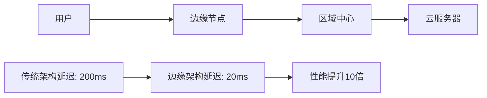

# 边缘计算与HTML

## 🌐 边缘计算概述

### 📊 传统vs边缘架构对比



### ⚡ Edge HTML优化策略

| 优化类型 | 传统云 | 边缘计算 | 性能提升 |
|----------|--------|----------|----------|
| **HTML压缩** | 服务器端 | 边缘节点 | 30-50% |
| **内容分发** | CDN | 边缘缓存 | 60-80% |
| **API处理** | 远程服务器 | 边缘函数 | 90%+ |

## 🔧 HTML在Edge的实现

### 📦 边缘函数配置

```javascript
// Cloudflare Workers示例
export default {
  async fetch(request) {
    const html = await fetchHtmlTemplate();
    const optimizedHtml = await optimizeOnEdge(html, request);
    
    return new Response(optimizedHtml, {
      headers: {
        'Content-Type': 'text/html; charset=utf-8',
        'Cache-Control': 'public, max-age=3600'
      }
    });
  }
}
```

### 🚀 Edge HTML优化

```javascript
// 边缘HTML处理函数
async function optimizeOnEdge(html, request) {
  // 动态注入边缘信息
  const edgeInfo = `
    <script>
      window.__EDGE__ = {
        region: '${request.cf.colo}',
        cacheStatus: 'HIT'
      };
    </script>
  `;
  
  // HTML压缩和优化
  return htmlMinifier.minify(html + edgeInfo);
}
```

## 🌍 边缘计算优势

### 📈 性能提升

```javascript
// 边缘性能监控
class EdgePerformanceMonitor {
  constructor() {
    this.metrics = {
      connectionTime: 0,
      firstByte: 0,
      edgeRegion: 'unknown'
    };
  }
  
  trackPerformance() {
    const observer = new PerformanceObserver((list) => {
      list.getEntries().forEach(entry => {
        if (entry.entryType === 'navigation') {
          this.metrics.firstByte = entry.responseStart;
        }
      });
    });
    
    observer.observe({ entryTypes: ['navigation'] });
  }
}
```

## 🔗 相关链接

- [[现代Web平台/04-8 移动端适配策略]]
- [[技术生态集成/04-6 服务器端渲染SSR]]
- [[新兴技术趋势/04-15 未来HTML标准]]

---

*最后更新：2024年* | 🌐 边缘计算HTML优化
