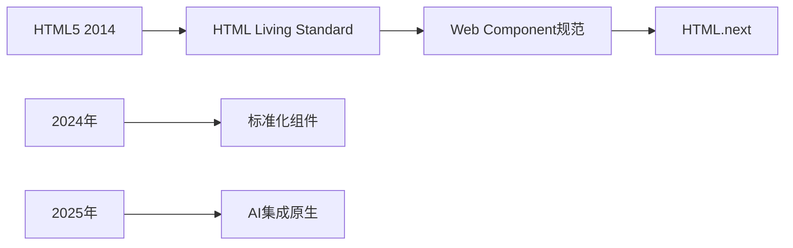

# 未来HTML标准

## 🚀 W3C HTML发展趋势

### 📊 HTML标准演进路线



### ⚡ 即将到来的HTML特性

| 特性 | 状态 | 浏览器支持 | 预期发布时间 |
|------|------|-----------|--------------|
| **HTML Modules** | 草案 | ⭐⭐ | 2025 |
| **Native CSS Scope** | 实验 | ⭐⭐⭐ | 2024 |
| **Form-associated CE** | 已实现 | ⭐⭐⭐⭐ | 2024 |
| **Declarative Shadow DOM** | 实验 | ⭐⭐ | 2025 |

## 🔮 HTML Modules

### 📦 模块化HTML提案

```html
<!-- 未来HTML模块语法 -->
<script type="module">
  import { html } from '/module.html';
  
  const template = html`
    <div class="component">
      <h2>模块化HTML</h2>
      <p>这是原生模块系统支持</p>
    </div>
  `;
</script>

<!-- 内联模块定义 -->
<module id="user-card">
  <template>
    <style>
      .card { background: white; border-radius: 8px; }
    </style>
    <div class="card">
      <h3 id="name"></h3>
      <p id="bio"></p>
    </div>
  </template>
  
  <script>
    class UserCard extends HTMLElement {
      constructor() {
        super();
        this.attachShadow({ mode: 'open' });
        this.shadowRoot.appendChild(template.content.cloneNode(true));
      }
      
      connectedCallback() {
        this.shadowRoot.getElementById('name').textContent = this.name;
        this.shadowRoot.getElementById('bio').textContent = this.bio;
      }
      
      static get observedAttributes() {
        return ['name', 'bio'];
      }
    }
    
    customElements.define('user-card', UserCard);
  </script>
</module>
```

## 🎯 原生CSS作用域

### 🔒 CSS Scope支持

```html
<!-- 未来原生CSS作用域 -->
<div scoped>
  <style>
    /* 此样式仅作用于scoped div内部 */
    .card {
      background: white;
      border: 1px solid #ddd;
    }
  </style>
  
  <div class="card">作用域内的卡片</div>
</div>

<!-- 外部不受影响 -->
<div class="card">外部卡片，样式不影响</div>
```

## 🌐 未来Web平台

### 📱 增强的移动体验

```html
<!-- 未来移动端HTML特性 -->
<div class="touch-surface">
  <!-- 原生手势支持 -->
  <nav gesture="swipe-right">
    <a href="/prev">上一个</a>
  </nav>
  
  <!-- 自动适配输入法 -->
  <input type="text" ime-mode="auto">
  
  <!-- 原生震动反馈 -->
  <button feedback="haptic">点击反馈</button>
</div>

<!-- 环境感知 -->
<meta name="ambient-light" content="auto-brightness">
<meta name="device-orientation" content="adaptive-layout">
```

## 🔗 相关链接

- [[04-12 Web Components体系]]
- [[04-13 边缘计算与HTML]]
- [[04-14 AI与HTML生成]]
- [[现代Web平台/04-8 移动端适配策略]]

---

*最后更新：2024年* | 🔮 HTML未来标准预览
