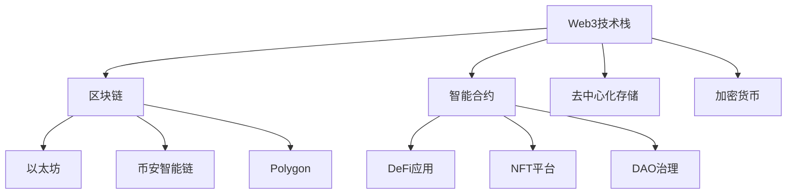

# Web3与HTML

## 🌐 Web3技术概览

### 📊 Web3生态系统



### ⚡ Web3 HTML集成模式

| 技术类型 | HTML作用 | Web3组件 | 应用场景 |
|----------|----------|----------|----------|
| **Web3钱包** | UI界面 | MetaMask集成 | 用户认证 |
| **智能合约** | 数据显示 | Ethers.js | 交易操作 |
| **NFT展示** | 可视化 | IPFS存储 | 数字资产 |
| **DEX交易** | 交易界面 | Web3.js | 去中心化交易 |

## 🔧 Web3钱包集成

### 📝 MetaMask连接示例

```html
<!DOCTYPE html>
<html lang="zh-CN">
<head>
    <meta charset="UTF-8">
    <meta name="viewport" content="width=device-width, initial-scale=1.0">
    <title>Web3 HTML应用</title>
    <script src="https://cdn.ethers.io/lib/ethers-5.2.umd.min.js"></script>
    
    <style>
        .web3-container {
            max-width: 800px;
            margin: 0 auto;
            padding: 2rem;
            font-family: -apple-system, BlinkMacSystemFont, sans-serif;
        }
        
        .wallet-section {
            background: #f8f9fa;
            border-radius: 12px;
            padding: 2rem;
            margin: 2rem 0;
        }
        
        .web3-button {
            background: linear-gradient(135deg, #667eea 0%, #764ba2 100%);
            color: white;
            border: none;
            padding: 1rem 2rem;
            border-radius: 8px;
            font-size: 1rem;
            cursor: pointer;
            transition: transform 0.2s ease;
            margin: 0.5rem;
        }
        
        .web3-button:hover {
            transform: translateY(-2px);
        }
        
        .web3-button:disabled {
            background: #ccc;
            cursor: not-allowed;
        }
        
        .wallet-info {
            background: white;
            border: 1px solid #ddd;
            border-radius: 8px;
            padding: 1rem;
            margin: 1rem 0;
        }
        
        .nft-gallery {
            display: grid;
            grid-template-columns: repeat(auto-fit, minmax(200px, 1fr));
            gap: 1rem;
            margin: 2rem 0;
        }
        
        .nft-card {
            background: white;
            border: 1px solid #ddd;
            border-radius: 12px;
            padding: 1rem;
            text-align: center;
            transition: transform 0.2s ease;
        }
        
        .nft-card:hover {
            transform: translateY(-4px);
        }
        
        .nft-image {
            width: 100%;
            height: 200px;
            object-fit: cover;
            border-radius: 8px;
            margin-bottom: 1rem;
        }
        
        .transaction-status {
            background: #e7f3ff;
            border: 1px solid #b3d9ff;
            border-radius: 8px;
            padding: 1rem;
            margin: 1rem 0;
            font-family: monospace;
        }
        
        .defi-dashboard {
            background: white;
            border: 1px solid #ddd;
            border-radius: 12px;
            padding: 2rem;
            margin: 1rem 0;
        }
        
        .token-balance {
            display: flex;
            justify-content: space-between;
            align-items: center;
            padding: 1rem;
            background: #f8f9fa;
            border-radius: 8px;
            margin: 0.5rem 0;
        }
        
        .dao-proposal {
            background: white;
            border: 1px solid #ddd;
            border-radius: 8px;
            padding: 1rem;
            margin: 1rem 0;
        }
        
        .proposal-voting {
            display: flex;
            gap: 1rem;
            margin: 1rem 0;
        }
        
        .vote-button {
            flex: 1;
            padding: 0.75rem;
            border: none;
            border-radius: 6px;
            cursor: pointer;
            font-weight: bold;
        }
        
        .vote-yes {
            background: #28a745;
            color: white;
        }
        
        .vote-no {
            background: #dc3545;
            color: white;
        }
    </style>
</head>

<body>
    <div class="web3-container">
        <h1>🌐 Web3 + HTML 应用演示</h1>
        
        <!-- Web3钱包连接 -->
        <section class="wallet-section">
            <h2>👛 Web3钱包集成</h2>
            <div id="wallet-status">
                <button class="web3-button" onclick="connectWallet()">
                    连接MetaMask钱包
                </button>
            </div>
            
            <div class="wallet-info" id="wallet-info" style="display: none;">
                <h3>钱包信息</h3>
                <div id="account-info"></div>
                <div id="network-info"></div>
                <div id="balance-info"></div>
                
                <button class="web3-button" onclick="disconnectWallet()">
                    断开连接
                </button>
            </div>
        </section>

        <!-- NFT展示 -->
        <section>
            <h2>🎨 NFT画廊</h2>
            <button class="web3-button" onclick="loadNFTs()">
                加载我的NFT
            </button>
            
            <div class="nft-gallery" id="nft-gallery">
                <!-- NFT卡片将通过JavaScript动态生成 -->
            </div>
        </section>

        <!-- DeFi交易 -->
        <section class="defi-dashboard">
            <h2>💰 DeFi交易面板</h2>
            
            <div class="token-balance">
                <span>ETH余额:</span>
                <span id="eth-balance">连接钱包查看</span>
            </div>
            
            <div class="token-balance">
                <span>USDC余额:</span>
                <span id="usdc-balance">连接钱包查看</span>
            </div>
            
            <div>
                <h3>代币交换</h3>
                <input type="number" id="swap-amount" placeholder="输入数量" style="width: 100%; padding: 0.5rem; margin: 0.5rem 0;">
                <select id="from-token" style="width: 100%; padding: 0.5rem; margin: 0.5rem 0;">
                    <option value="ETH">ETH</option>
                    <option value="USDC">USDC</option>
                    <option value="BTC">BTC</option>
                </select>
                <button class="web3-button" onclick="swapTokens()">交换代币</button>
            </div>
        </section>

        <!-- DAO治理 -->
        <section>
            <h2>🏛️ DAO治理平台</h2>
            
            <div class="dao-proposal">
                <h3>提案 #001: 升级协议版本</h3>
                <p>提议将协议从v1.0升级到v2.0，增加更多功能和安全特性</p>
                <div>
                    <strong>投票截止时间:</strong> <span id="proposal-deadline">2024-12-31 23:59:59</span>
                </div>
                <div class="proposal-voting">
                    <button class="vote-button vote-yes" onclick="voteProposal(true)">
                        ✅ 赞成
                    </button>
                    <button class="vote-button vote-no" onclick="voteProposal(false)">
                        ❌ 反对
                    </button>
                </div>
                <div class="transaction-status" id="proposal-status">
                    等待钱包连接以进行投票...
                </div>
            </div>
        </section>

        <!-- 交易状态显示 -->
        <section>
            <h2>📊 交易状态</h2>
            <div class="transaction-status" id="transaction-log">
                暂无交易记录...
            </div>
        </section>
    </div>

    <!-- Web3 JavaScript 集成 -->
    <script>
        // 🌐 Web3应用管理器
        class Web3AppManager {
            constructor() {
                this.provider = null;
                this.signer = null;
                this.account = null;
                this.network = null;
                this.isConnected = false;
                
                this.initWeb3();
            }
            
            async initWeb3() {
                // 检查MetaMask
                if (typeof window.ethereum !== 'undefined') {
                    console.log('✅ MetaMask已安装');
                    this.provider = new ethers.providers.Web3Provider(window.ethereum);
                    
                    // 监听账户变化
                    window.ethereum.on('accountsChanged', (accounts) => {
                        this.handleAccountsChanged(accounts);
                    });
                    
                    // 监听网络变化
                    window.ethereum.on('chainChanged', (chainId) => {
                        this.handleChainChanged(chainId);
                    });
                } else {
                    console.log('❌ MetaMask未安装');
                    document.getElementById('wallet-status').innerHTML = 
                        '<p>请安装MetaMask钱包才能使用Web3功能</p>';
                }
            }
            
            async connectWallet() {
                try {
                    if (!this.provider) {
                        alert('请先安装MetaMask钱包');
                        return;
                    }
                    
                    console.log('🔄 请求用户授权...');
                    
                    // 请求连接钱包
                    const accounts = await window.ethereum.request({
                        method: 'eth_requestAccounts'
                    });
                    
                    if (accounts.length > 0) {
                        this.account = accounts[0];
                        this.signer = this.provider.getSigner();
                        
                        // 获取网络信息
                        const network = await this.provider.getNetwork();
                        this.network = network;
                        
                        this.isConnected = true;
                        
                        // 更新UI
                        this.updateWalletUI();
                        
                        await this.loadAccountData();
                        
                        console.log('🎉 钱包连接成功:', this.account);
                    }
                    
                } catch (error) {
                    console.error('❌ 钱包连接失败:', error);
                    this.logTransaction(`连接钱包失败: ${error.message}`, 'error');
                }
            }
            
            async loadAccountData() {
                if (!this.isConnected) return;
                
                try {
                    // 获取ETH余额
                    const ethBalance = await this.signer.getBalance();
                    const ethBalanceFormatted = ethers.utils.formatEther(ethBalance);
                    
                    document.getElementById('eth-balance').textContent = 
                        `${parseFloat(ethBalanceFormatted).toFixed(4)} ETH`;
                    
                    // 更新account info
                    document.getElementById('account-info').innerHTML = 
                        `<strong>账户地址:</strong> ${this.account}<br>
                         <strong>余额:</strong> ${parseFloat(ethBalanceFormatted).toFixed(4)} ETH`;
                    
                    document.getElementById('network-info').innerHTML = 
                        `<strong>网络:</strong> ${this.network.name} (${this.network.chainId})`;
                    
                    // 模拟USDC余额（实际需要从合约获取）
                    document.getElementById('usdc-balance').textContent = 
                        `${(Math.random() * 1000).toFixed(2)} USDC`;
                        
                } catch (error) {
                    console.error('加载账户数据失败:', error);
                }
            }
            
            updateWalletUI() {
                // 显示钱包信息
                document.getElementById('wallet-info').style.display = 'block';
                
                // 更新连接按钮状态
                document.querySelector('[onclick="connectWallet()"]').style.display = 'none';
                
                // 更新页面标题显示连接状态
                document.title = `Web3 App - ${this.account.slice(0, 6)}...${this.account.slice(-4)}`;
            }
            
            disconnectWallet() {
                this.isConnected = false;
                this.account = null;
                this.signer = null;
                
                // 隐藏钱包信息
                document.getElementById('wallet-info').style.display = 'none';
                
                // 显示连接按钮
                document.querySelector('[onclick="connectWallet()"]').style.display = 'inline-block';
                
                // 重置余额显示
                document.getElementById('eth-balance').textContent = '连接钱包查看';
                document.getElementById('usdc-balance').textContent = '连接钱包查看';
                
                console.log('📱 钱包已断开连接');
            }
            
            async swapTokens() {
                if (!this.isConnected) {
                    alert('请先连接钱包');
                    return;
                }
                
                const amount = document.getElementById('swap-amount').value;
                const fromToken = document.getElementById('from-token').value;
                
                if (!amount || amount <= 0) {
                    alert('请输入有效的交换数量');
                    return;
                }
                
                try {
                    this.logTransaction(`开始交换 ${amount} ${fromToken}...`, 'pending');
                    
                    // 模拟代币交换交易
                    const tx = await this.simulateSwap(fromToken, amount);
                    
                    this.logTransaction(`交易已提交: ${tx.hash}`, 'success');
                    
                } catch (error) {
                    this.logTransaction(`交换失败: ${error.message}`, 'error');
                }
            }
            
            async simulateSwap(fromToken, amount) {
                // 模拟交易处理时间
                await new Promise(resolve => setTimeout(resolve, 2000));
                
                // 返回模拟的交易对象
                return {
                    hash: '0x' + Math.random().toString(16).substr(2, 64),
                    from: this.account,
                    gasLimit: 21000
                };
            }
            
            async voteProposal(support) {
                if (!this.isConnected) {
                    this.updateProposalStatus('请先连接钱包才能投票', 'warning');
                    return;
                }
                
                try {
                    this.updateProposalStatus('提交投票交易中...', 'pending');
                    
                    // 模拟投票交易
                    const tx = await this.simulateVote(support);
                    
                    const result = support ? '赞成' : '反对';
                    this.updateProposalStatus(`投票成功！您的选择: ${result}`, 'success');
                    
                    console.log('🗳️ 投票交易:', tx);
                    
                } catch (error) {
                    this.updateProposalStatus(`投票失败: ${error.message}`, 'error');
                }
            }
            
            async simulateVote(support) {
                // 模拟投票处理时间
                await new Promise(resolve => setTimeout(resolve, 3000));
                
                return {
                    hash: '0x' + Math.random().toString(16).substr(2, 64),
                    from: this.account,
                    value: support ? 'FOR' : 'AGAINST'
                };
            }
            
            updateProposalStatus(message, type) {
                const statusEl = document.getElementById('proposal-status');
                statusEl.textContent = message;
                
                statusEl.className = `transaction-status ${type}`;
                if (type === 'pending') statusEl.style.background = '#fff3cd';
                if (type === 'success') statusEl.style.background = '#d4edda';
                if (type === 'error') statusEl.style.background = '#f8d7da';
                if (type === 'warning') statusEl.style.background = '#fff3cd';
            }
            
            async loadNFTs() {
                if (!this.isConnected) {
                    alert('请先连接钱包');
                    return;
                }
                
                try {
                    this.logTransaction('加载NFT资产中...', 'pending');
                    
                    // 模拟NFT数据获取
                    const nfts = await this.simulateLoadNFTs();
                    
                    this.displayNFTs(nfts);
                    this.logTransaction(`成功加载 ${nfts.length} 个NFT`, 'success');
                    
                } catch (error) {
                    this.logTransaction(`加载NFT失败: ${error.message}`, 'error');
                }
            }
            
            async simulateLoadNFTs() {
                // 模拟API调用延迟
                await new Promise(resolve => setTimeout(resolve, 1500));
                
                // 返回模拟NFT数据
                return [
                    {
                        id: 1,
                        name: "Bored Ape #1234",
                        image: "https://via.placeholder.com/300x300/ff6b6b/white?text=Bored+Ape",
                        description: "独一无二的猿猴NFT",
                        value: "0.5 ETH"
                    },
                    {
                        id: 2,
                        name: "CryptoPunk #9876",
                        image: "https://via.placeholder.com/300x300/4ecdc4/white?text=CryptoPunk",
                        description: "经典加密朋克",
                        value: "2.1 ETH"
                    },
                    {
                        id: 3,
                        name: "Art Block #555",
                        image: "https://via.placeholder.com/300x300/45b7d1/white?text=Art+Block",
                        description: "生成艺术NFT",
                        value: "1.8 ETH"
                    }
                ];
            }
            
            displayNFTs(nfts) {
                const gallery = document.getElementById('nft-gallery');
                gallery.innerHTML = '';
                
                nfts.forEach(nft => {
                    const nftCard = document.createElement('div');
                    nftCard.className = 'nft-card';
                    
                    nftCard.innerHTML = `
                        
                        <h3>${nft.name}</h3>
                        <p>${nft.description}</p>
                        <p><strong>价值:</strong> ${nft.value}</p>
                        <button class="web3-button" onclick="viewNFT(${nft.id})">查看详情</button>
                    `;
                    
                    gallery.appendChild(nftCard);
                });
            }
            
            logTransaction(message, type) {
                const logEl = document.getElementById('transaction-log');
                const timestamp = new Date().toLocaleTimeString();
                
                const logEntry = document.createElement('div');
                logEntry.innerHTML = `<span style="color: #666;">[${timestamp}]</span> ${message}`;
                
                if (type === 'error') {
                    logEntry.style.color = '#dc3545';
                } else if (type === 'success') {
                    logEntry.style.color = '#28a745';
                } else if (type === 'pending') {
                    logEntry.style.color = '#ffc107';
                }
                
                logEl.appendChild(logEntry);
                logEl.scrollTop = logEl.scrollHeight;
                
                console.log(`📊 交易日志 [${type}]:`, message);
            }
            
            handleAccountsChanged(accounts) {
                if (accounts.length === 0) {
                    this.disconnectWallet();
                } else {
                    this.account = accounts[0];
                    this.signer = this.provider.getSigner();
                    this.loadAccountData();
                }
            }
            
            handleChainChanged(chainId) {
                // 网络切换时的处理逻辑
                location.reload();
            }
        }

        // 🌐 全局Web3函数
        let web3App;

        async function connectWallet() {
            await web3App.connectWallet();
        }

        function disconnectWallet() {
            web3App.disconnectWallet();
        }

        async function loadNFTs() {
            await web3App.loadNFTs();
        }

        async function swapTokens() {
            await web3App.swapTokens();
        }

        async function voteProposal(support) {
            await web3App.voteProposal(support);
        }

        function viewNFT(nftId) {
            alert(`查看NFT #${nftId} 的详细信息`);
        }

        // 🚀 初始化Web3应用
        document.addEventListener('DOMContentLoaded', () => {
            console.log('🌐 初始化Web3 HTML应用...');
            web3App = new Web3AppManager();
            
            // 检查Web3支持
            if (window.ethereum) {
                console.log('✅ Web3环境检测通过');
            } else {
                console.log('❌ 请安装MetaMask或其他Web3钱包');
            }
        });
    </script>
</body>
</html>
```

## 🔗 相关链接

- [[04-15 未来HTML标准]]
- [[04-14 AI与HTML生成]]
- [[04-12 Web Components体系]]
- [[现代Web平台/04-9 PWA中的HTML]]

---

*最后更新：2024年* | 🌐 Web3与HTML去中心化应用
