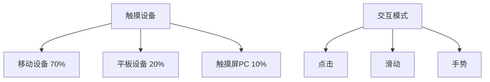

# 触摸交互设计

## 📱 现代触摸交互技术

### 📊 触摸设备统计



### ⚡ 触摸交互优化

| 交互类型 | 最小尺寸 | 响应时间 | 反馈延迟 |
|----------|----------|----------|----------|
| **点击** | 44px | <100ms | <50ms |
| **滑动** | 连续 | <16ms | 立即 |
| **长按** | 44px | 500ms | <100ms |
| **多点** | 视觉反馈 | <16ms | 立即 |

## 🔧 HTML触摸事件

### 📝 完整的触摸交互示例

```html
<!DOCTYPE html>
<html lang="zh-CN">
<head>
    <meta charset="UTF-8">
    <meta name="viewport" content="width=device-width, initial-scale=1.0">
    <title>触摸交互设计演示</title>
    
    <style>
        .touch-container {
            max-width: 900px;
            margin: 0 auto;
            padding: 1rem;
            font-family: -apple-system, BlinkMacSystemFont, sans-serif;
        }
        
        .touch-demo-area {
            background: #f8f9fa;
            border-radius: 12px;
            padding: 2rem;
            margin: 2rem 0;
            position: relative;
            overflow: hidden;
        }
        
        .interactive-element {
            background: #007acc;
            color: white;
            padding: 1rem 2rem;
            border-radius: 8px;
            cursor: pointer;
            transition: all 0.2s ease;
            touch-action: manipulation;
            user-select: none;
            -webkit-user-select: none;
            min-height: 44px;
            display: flex;
            align-items: center;
            justify-content: center;
            margin: 1rem;
            box-shadow: 0 2px 8px rgba(0,122,204,0.3);
        }
        
        .interactive-element:active {
            transform: scale(0.95);
            background: #005999;
        }
        
        .touch-feedback {
            position: absolute;
            border-radius: 50%;
            background: rgba(0,122,204,0.3);
            pointer-events: none;
            transform: translate(-50%, -50%);
            animation: ripple 0.6s ease-out;
        }
        
        @keyframes ripple {
            0% {
                width: 10px;
                height: 10px;
                opacity: 1;
            }
            100% {
                width: 100px;
                height: 100px;
                opacity: 0;
            }
        }
        
        .gesture-area {
            background: white;
            border: 2px dashed #ddd;
            border-radius: 8px;
            padding: 2rem;
            margin: 1rem 0;
            min-height: 200px;
            display: flex;
            align-items: center;
            justify-content: center;
            position: relative;
            touch-action: pan-x pan-y;
        }
        
        .gesture-overlay {
            position: absolute;
            top: 0;
            left: 0;
            right: 0;
            bottom: 0;
            background: rgba(0,122,204,0.1);
            border-radius: 6px;
            opacity: 0;
            transition: opacity 0.2s ease;
        }
        
        .gesture-info {
            display: grid;
            grid-template-columns: repeat(auto-fit, minmax(200px, 1fr));
            gap: 1rem;
            margin: 1rem 0;
        }
        
        .info-card {
            background: white;
            border: 1px solid #ddd;
            border-radius: 8px;
            padding: 1rem;
            text-align: center;
        }
        
        .touch-controls {
            display: grid;
            grid-template-columns: repeat(auto-fit, minmax(150px, 1fr));
            gap: 1rem;
            margin: 2rem 0;
        }
        
        .control-button {
            background: #28a745;
            color: white;
            border: none;
            padding: 1rem;
            border-radius: 8px;
            font-size: 1rem;
            cursor: pointer;
            transition: all 0.2s ease;
            min-height: 44px;
            touch-action: manipulation;
        }
        
        .control-button:hover,
        .control-button:active {
            background: #218838;
            transform: translateY(-1px);
        }
        
        .touch-indicators {
            display: flex;
            gap: 0.5rem;
            margin: 1rem 0;
            flex-wrap: wrap;
        }
        
        .touch-indicator {
            background: #007acc;
            color: white;
            padding: 0.5rem 1rem;
            border-radius: 20px;
            font-size: 0.9rem;
            opacity: 0;
            transform: scale(0.8);
            transition: all 0.3s ease;
        }
        
        .touch-indicator.active {
            opacity: 1;
            transform: scale(1);
        }
        
        .swipe-area {
            background: linear-gradient(45deg, #667eea 0%, #764ba2 100%);
            color: white;
            border-radius: 12px;
            padding: 2rem;
            margin: 2rem 0;
            position: relative;
            min-height: 150px;
            display: flex;
            align-items: center;
            justify-content: center;
            overflow: hidden;
        }
        
        .swipe-content {
            text-align: center;
            transition: transform 0.3s ease;
        }
        
        .haptic-indicator {
            position: absolute;
            top: 50%;
            left: 50%;
            transform: translate(-50%, -50%);
            background: rgba(255,255,255,0.2);
            border: 2px solid rgba(255,255,255,0.5);
            border-radius: 50%;
            padding: 1rem;
            font-size: 1.5rem;
            animation: haptic-pulse 0.3s ease-out;
            pointer-events: none;
        }
        
        @keyframes haptic-pulse {
            0% {
                transform: translate(-50%, -50%) scale(0);
                opacity: 1;
            }
            100% {
                transform: translate(-50%, -50%) scale(2);
                opacity: 0;
            }
        }
        
        .performance-metrics {
            background: #e9ecef;
            border-radius: 8px;
            padding: 1rem;
            margin: 1rem 0;
            font-family: monospace;
        }
        
        .touch-analysis {
            background: white;
            border: 1px solid #ddd;
            border-radius: 8px;
            padding: 1rem;
            margin: 1rem 0;
            font-size: 0.9rem;
        }
        
        @media (max-width: 768px) {
            .touch-container {
                padding: 0.5rem;
            }
            
            .interactive-element {
                min-height: 48px;
                padding: 1.25rem 1.5rem;
            }
            
            .gesture-info {
                grid-template-columns: 1fr;
            }
            
            .touch-controls {
                grid-template-columns: repeat(2, 1fr);
            }
        }
    </style>
</head>

<body>
    <div class="touch-container">
        <h1>📱 触摸交互设计演示</h1>
        
        <!-- 触摸事件展示 -->
        <section class="touch-demo-area">
            <h2>✨ 触摸交互元素</h2>
            <p>点击或触摸下面的元素体验不同的触摸反馈效果：</p>
            
            <div class="interactive-element" data-action="click">
                📱 点击反馈
            </div>
            
            <div class="interactive-element" data-action="longpress">
                ⏰ 长按触发
            </div>
            
            <div class="interactive-element" data-action="swipe">
                👆 滑动检测
            </div>
        </section>

        <!-- 手势识别区域 -->
        <section class="gesture-area" id="gesture-area">
            <div class="gesture-overlay" id="gesture-overlay"></div>
            <div class="gesture-content">
                <h3>🎯 手势识别区域</h3>
                <p>在这里尝试各种触摸手势：点击、长按、滑动、缩放</p>
                
                <div class="gesture-info">
                    <div class="info-card">
                        <div id="touch-count">👆 触摸点数: 0</div>
                    </div>
                    <div class="info-card">
                        <div id="gesture-type">📝 手势类型: 等待识别</div>
                    </div>
                    <div class="info-card">
                        <div id="touch-position">📍 位置: (0, 0)</div>
                    </div>
                    <div class="info-card">
                        <div id="gesture-force">💪 压力: 未检测</div>
                    </div>
                </div>
            </div>
        </section>

        <!-- 触摸控制按钮 -->
        <section>
            <h2>🎮 触摸控制面板</h2>
            <div class="touch-controls">
                <button class="control-button" data-haptic="light">
                    ✋ 轻触反馈
                </button>
                <button class="control-button" data-haptic="medium">
                    🤚 中度震动
                </button>
                <button class="control-button" data-haptic="heavy">
                    👊 强震动
                </button>
                <button class="control-button" onclick="testTouchSensitivity()">
                    🔍 敏感度测试
                </button>
            </div>
            
            <div class="touch-indicators" id="touch-indicators"></div>
        </section>

        <!-- 滑动手势演示 -->
        <section class="swipe-area" id="swipe-area">
            <div class="haptic-indicator" id="haptic-indicator"></div>
            <div class="swipe-content">
                <h3>←→ 滑动检测区域</h3>
                <p>左滑、右滑、上滑、下滑都会有不同的反馈</p>
                <div id="swipe-direction">等待滑动...</div>
            </div>
        </section>

        <!-- 性能监控 -->
        <section>
            <h2>📊 触摸性能监控</h2>
            <div class="performance-metrics">
                <div>🕐 触摸延迟: <span id="touch-latency">监控中...</span></div>
                <div>📈 帧率: <span id="touch-fps">计算中...</span></div>
                <div>🎯 命中率: <span id="touch-accuracy">统计中...</span></div>
                <div>⚡ 响应时间: <span id="response-time">测量中...</span></div>
            </div>
            
            <div class="touch-analysis" id="touch-analysis">
                📊 触摸数据分析将在此显示...
            </div>
        </section>
    </div>

    <!-- 触摸交互JavaScript -->
    <script>
        // 📱 触摸交互管理器
        class TouchInteractionManager {
            constructor() {
                this.touchEvents = [];
                this.isTracking = false;
                этому.gestureArea = document.getElementById('gesture-area');
                this.swipeArea = document.getElementById('swipe-area');
                
                this.initTouchEvents();
                this.setupGestureRecognition();
                this.startPerformanceMonitoring();
            }
            
            initTouchEvents() {
                // 为所有交互元素添加触摸事件
                document.querySelectorAll('.interactive-element').forEach(element => {
                    this.addTouchEvents(element);
                });
                
                // 为控制按钮添加触觉反馈
                document.querySelectorAll('.control-button').forEach(button => {
                    button.addEventListener('touchstart', (e) => {
                        this.handleHapticFeedback(e.target.dataset.haptic);
                        this.updateTouchLatency(e);
                    });
                });
                
                // 设置全局触摸事件监听
                this.setupGlobalTouchEvents();
            }
            
            addTouchEvents element) {
                const action = element.dataset.action;
                
                element.addEventListener('touchstart', (e) => this.handleTouchStart(e, action));
                element.addEventListener('touchmove', (e) => this.handleTouchMove(e, action));
                element.addEventListener('touchend', (e) => this.handleTouchEnd(e, action));
                element.addEventListener('touchcancel', (e) => this.handleTouchCancel(e, action));
                
                // 鼠标事件兼容（用于桌面测试）
                element.addEventListener('mousedown', (e) => this.handleMouseEvent(e, action, 'start'));
                element.addEventListener('mouseup', (e) => this.handleMouseEvent(e, action, 'end'));
            }
            
            handleTouchStart(event, action) {
                event.preventDefault();
                this.isTracking = true;
                
                const touch = event.touches[0];
                const startTime = performance.now();
                
                // 创建触摸反馈
                this.createTouchRipple(event.target, touch.clientX, touch.clientY);
                
                // 记录触摸开始
                this.touchEvents.push({
                    type: 'start',
                    x: touch.clientX,
                    y: touch.clientY,
                    time: startTime,
                    action: action,
                    force: touch.force || 0
                });
                
                this.showTouchIndicator(`✋ ${action} 开始`, 'touchstart');
                
                // 处理不同的触摸动作
                switch(action) {
                    case 'click':
                        this.handleClickTouch(touch);
                        break;
                    case 'longpress':
                        this.startLongPressTimer(touch);
                        break;
                    case 'swipe':
                        this.startSwipeDetection(touch);
                        break;
                }
                
                console.log(`👆 ${action} 触摸开始:`, { x: touch.clientX, y: touch.clientY, force: touch.force });
            }
            
            handleTouchMove(event, action) {
                if (!this.isTracking) return;
                
                event.preventDefault();
                
                const touch = event.touches[0];
                this.touchEvents.push({
                    type: 'move',
                    x: touch.clientX,
                    y: touch.clientY,
                    time: performance.now(),
                    action: action,
                    force: touch.force || 0
                });
                
                // 实时更新触摸位置
                this ОбновитьTouchPosition(touch.clientX, touch.clientY);
                
                // 检测滑动手势
                if (action === 'swipe') {
                    this.updateSwipeDetection(touch);
                }
            }
            
            handleTouchEnd(event, action) {
                if (!this.isTracking) return;
                
                event.preventDefault();
                this.isTracking = false;
                
                const touch = event.changedTouches[0];
                const endTime = performance.now();
                
                this.touchEvents.push({
                    type: 'end',
                    x: touch.clientX,
                    y: touch.clientY,
                    time: endTime,
                    action: action,
                    force: touch.force || 0
                });
                
                this.showTouchIndicator(`👋 ${action} 结束`, 'touchend');
                
                // 计算触摸统计
                this.calculateTouchMetrics(action);
                
                // 清除长按定时器
                if (this.longPressTimer) {
                    clearTimeout(this.longPressTimer);
                    this.longPressTimer = null;
                    this.longPressActive = false;
                }
                
                console.log(`👋 ${action} 触摸结束:`, { duration: endTime - this.touchEvents[0].time });
            }
            
            handleTouchCancel(event, action) {
                this.isTracking = false;
                this.showTouchIndicator(`❌ ${action} 取消`, 'touchcancel');
                
                if (this.longPressTimer) {
                    clearTimeout(this.longPressTimer);
                    this.longPressTimer = null;
                }
            }
            
            // 鼠标事件处理（桌面兼容）
            handleMouseEvent(event, action, type) {
                if (type === 'start') {
                    this.handleTouchStart({
                        preventDefault: () => {},
                        touches: [{ clientX: event.clientX, clientY: event.clientY, force: 1 }]
                    }, action);
                } else {
                    this.handleTouchEnd({
                        preventDefault: () => {},
                        changedTouches: [{ clientX: event.clientX, clientY: event.clientY, force: 1 }]
                    }, action);
                }
            }
            
            // 手势识别
            setupGestureRecognition() {
                this.gestureArea.addEventListener('touchstart', (e) => {
                    this.startGestureDetection(e);
                });
                
                this.swipeArea.addEventListener('touchstart', (e) => {
                    this.startSwipeGesture(e);
                });
            }
            
            startGestureDetection(event) {
                const touches = event.touches;
                this.currentGestures = Array.from(touches).map(touch => ({
                    id: touch.identifier,
                    startX: touch.clientX,
                    startY: touch.clientY,
                    currentX: touch.clientX,
                    currentY: touch.clientY,
                    startTime: performance.now()
                }));
                
                this.updateGestureInfo();
                
                // 添加触摸移动到手势区域
                this.gestureArea.addEventListener('touchmove', this.handleGestureMove);
                this.gestureArea.addEventListener('touchend', this.handleGestureEnd);
            }
            
            handleGestureMove = (event) => {
                Array.from(event.touches).forEach(touch => {
                    const gesture = this.currentGestures.find(g => g.id === touch.identifier);
                    if (gesture) {
                        gesture.currentX = touch.clientX;
                        gesture.currentY = touch.clientY;
                    }
                });
                
                this.updateGestureInfo();
                
                // 检测缩放手势
                if (this.currentGestures.length === 2) {
                    this.detectPinchGesture();
                }
            };
            
            handleGestureEnd = (event) => {
                this.currentGestures = [];
                this.gestureArea.removeEventListener('touchmove', this.handleGestureMove);
                this.gestureArea.removeEventListener('touchend', this.handleGestureEnd);
                
                this.updateGestureInfo();
            };
            
            updateGestureInfo() {
                document.getElementById('touch-count').textContent = `👆 触摸点数: ${this.currentGestures.length}`;
                
                if (this.currentGestures.length > 0) {
                    const gesture = this.currentGestures[0];
                    document.getElementById('touch-position').textContent = 
                        `📍 位置: (${Math.round(gesture.currentX)}, ${Math.round(gesture.currentY)})`;
                    document.getElementById('gesture-force').textContent = '💪 压力: 检测中...';
                }
                
                // 更新手势类型
                let gestureType = '等待识别';
                if (this.currentGestures.length === 1) {
                    gestureType = '单点触控';
                } else if (this.currentGestures.length === 2) {
                    gestureType = '双指手势';
                } else if (this.currentGestures.length > 2) {
                    gestureType = '多点手势';
                }
                
                document.getElementById('gesture-type').textContent = `📝 手势类型: ${gestureType}`;
            }
            
            detectPinchGesture() {
                if (this.currentGestures.length < 2) return;
                
                const gesture1 = this.currentGestures[0];
                const gesture2 = this.currentGestures[1];
                
                const distance1 = Math.sqrt(
                    Math.pow(gesture1.startX - gesture2.startX, 2) +
                    Math.pow(gesture1.startY - gesture2.startY, 2)
                );
                
                const distance2 = Math.sqrt(
                    Math.pow(gesture1.currentX - gesture2.currentX, 2) +
                    Math.pow(gesture1.currentY - gesture2.currentY, 2)
                );
                
                const scale = distance2 / distance1;
                
                if (scale > 1.2) {
                    document.getElementById('gesture-type').textContent = '📝 手势类型: 缩放放大';
                    this.showHapticIndicator();
                } else if (scale < 0.8) {
                    document.getElementById('gesture-type').textContent = '📝 手势类型: 缩放缩小';
                    this.showHapticIndicator();
                }
            }
            
            // 滑动手势处理
            startSwipeGesture(event) {
                const touch = event.touches[0];
                this.swipeStart = {
                    x: touch.clientX,
                    y: touch.clientY,
                    time: performance.now()
                };
                
                this.swipeArea.addEventListener('touchmove', this.handleSwipeMove);
                this.swipeArea.addEventListener('touchend', this.handleSwipeEnd);
            }
            
            handleSwipeMove = (event) => {
                event.preventDefault();
                
                const touch = event.touches[0];
                const deltaX = touch.clientX - this.swipeStart.x;
                const deltaY = touch.clientY - this.swipeStart.y;
                
                // 更新视觉效果
                const swipeContent = this.swipeArea.querySelector('.swipe-content');
                swipeContent.style.transform = `translate(${deltaX * 0.1}px, ${deltaY * 0.1}px)`;
                
                document.getElementById('swipe-direction').textContent = 
                    `偏移: (${Math.round(deltaX)}, ${Math.round(deltaY)})`;
            };
            
            handleSwipeEnd = (event) => {
                const touch = event.changedTouches[0];
                const deltaX = touch.clientX - this.swipeStart.x;
                const deltaY = touch.clientY - this.swipeStart.y;
                const deltaTime = performance.now() - this.swipeStart.time;
                const velocity = Math.sqrt(deltaX * deltaX + deltaY * deltaY) / deltaTime;
                
                // 重置样式
                const swipeContent = this.swipeArea.querySelector('.swipe-content');
                swipeContent.style.transform = 'translate(0, 0)';
                
                // 判断滑动方向
                let direction = '未知';
                if (Math.abs(deltaX) > Math.abs(deltaY)) {
                    direction = deltaX > 0 ? '右滑' : '左滑';
                } else {
                    direction = deltaY > 0 ? '下滑' : '上滑';
                }
                
                document.getElementById('swipe-direction').textContent = 
                    `${direction} (速度: ${Math.round(velocity)}px/ms)`;
                
                this.showHapticIndicator();
                
                // 移除事件监听
                this.swipeArea.removeEventListener('touchmove', this.handleSwipeMove);
                this.swipeArea.removeEventListener('touchend', this.handleSwipeEnd);
            };
            
            // 长按处理
            startLongPressTimer(touch) {
                this.longPressActive = true;
                this.longPressTimer = setTimeout(() => {
                    if (this.longPressActive) {
                        this.handleLongPress(touch);
                    }
                }, 500); // 500ms长按阈值
            }
            
            handleLongPress(touch) {
                this.showHapticIndicator();
                this.showTouchIndicator('⏰ 长按触发', 'longpress');
                
                // 触发上下文菜单或长按动作
                console.log('⏰ 长按事件触发:', { x: touch.clientX, y: touch.clientY });
                
                // 在长按按钮上显示反馈
                const longPressElement = document.querySelector('[data-action="longpress"]');
                longPressElement.style.background = '#28a745';
                
                setTimeout(() => {
                    longPressElement.style.background = '#007acc';
                }, 200);
            }
            
            // 辅助功能
            createTouchRipple(element, x, y) {
                const ripple = document.createElement('div');
                ripple.className = 'touch-feedback';
                ripple.style.left = x + 'px';
                ripple.style.top = y + 'px';
                
                element.appendChild(ripple);
                
                setTimeout(() => {
                    if (ripple.parentNode) {
                        ripple.parentNode.removeChild(ripple);
                    }
                }, 600);
            }
            
            showHapticIndicator() {
                const indicator = document.getElementById('haptic-indicator');
                indicator.style.animation = 'none';
                indicator.offsetHeight; // 触发重排
                indicator.style.animation = 'haptic-pulse 0.3s ease-out';
                
                // 如果支持振动API，触发触觉反馈
                if (navigator.vibrate) {
                    navigator.vibrate([50, 30, 50]);
                }
            }
            
            handleHapticFeedback(type) {
                const hapticPatterns = {
                    light: [10],
                    medium: [30],
                    heavy: [60, 30, 60]
                };
                
                if (navigator.vibrate) {
                    navigator.vibrate(hapticPatterns[type] || [20]);
                }
            }
            
            showTouchIndicator(message, type) {
                const indicators = document.getElementById('touch-indicators');
                const indicator = document.createElement('div');
                indicator.className = 'touch-indicator active';
                indicator.textContent = message;
                
                indicators.appendChild(indicator);
                
                setTimeout(() => {
                    indicator.classList.remove('active');
                    setTimeout(() => {
                        if (indicator.parentNode) {
                            indicator.parentNode.removeChild(indicator);
                        }
                    }, 300);
                }, 2000);
            }
            
            ОбновитьTouchPosition(x, y) {
                document.getElementById('touch-position').textContent = 
                    `📍 位置: (${Math.round(x)}, ${Math.round(y)})`;
            }
            
            calculateTouchMetrics(action) {
                if (this.touchEvents.length < 2) return;
                
                const startEvent = this.touchEvents.find(e => e.type === 'start');
                const endEvent = this.touchEvents.find(e => e.type === 'end');
                
                if (startEvent && endEvent) {
                    const touchDuration = endEvent.time - startEvent.time;
                    document.getElementById('response-time').textContent = `${Math.round(touchDuration)}ms`;
                    
                    this.updateTouchAnalysis(action, {
                        duration: touchDuration,
                        distance: 0,
                        force: startEvent.force
                    });
                }
                
                // 重置事件记录
                this.touchEvents = [];
            }
            
            updateTouchAnalysis(action, metrics) {
                const analysis = document.getElementById('touch-analysis');
                const analysisData = {
                    action: action,
                    duration: metrics.duration,
                    force: metrics.force,
                    timestamp: new Date().toLocaleTimeString()
                };
                
                const dataEntry = document.createElement('div');
                dataEntry.textContent = `📊 ${action}: ${Math.round(metrics.duration)}ms, 压力:${metrics.force}, ${analysisData.timestamp}`;
                
                if (analysis.children.length > 4) {
                    analysis.removeChild(analysis.children[0]);
                }
                
                analysis.appendChild(dataEntry);
            }
            
            startPerformanceMonitoring() {
                let frameCount = 0;
                let lastTime = performance.now();
                
                const monitorFrame = () => {
                    frameCount++;
                    const currentTime = performance.now();
                    
                    if (currentTime - lastTime >= 1000) {
                        const fps = Math.round((frameCount * 1000) / (currentTime - lastTime));
                        document.getElementById('touch-fps').textContent = `${fps} FPS`;
                        
                        frameCount = 0;
                        lastTime = currentTime;
                    }
                    
                    requestAnimationFrame(monitorFrame);
                };
                
                requestAnimationFrame(monitorFrame);
            }
            
            updateTouchLatency(event) {
                const latency = performance.now() - event.timeStamp;
                document.getElementById('touch-latency').textContent = `${Math.round(latency)}ms`;
            }
        }

        // 全局函数
        function testTouchSensitivity() {
            const indicators = document.getElementById('touch-indicators');
            indicators.innerHTML = '';
            
            const tests = [
                '🔍 触摸敏感度测试中...',
                '📱 请快速点击屏幕',
                '⏰ 测试长按响应',
                '👆 尝试多点触摸'
            ];
            
            tests.forEach((test, index) => {
                setTimeout(() => {
                    const indicator = document.createElement('div');
                    indicator.className = 'touch-indicator active';
                    indicator.textContent = test;
                    indicators.appendChild(indicator);
                    
                    setTimeout(() => indicator.classList.remove('active'), 1000);
                }, index * 500);
            });
        }

        // 🚀 初始化触摸交互管理器
        document.addEventListener('DOMContentLoaded', () => {
            console.log('📱 初始化触摸交互系统...');
            window.touchManager = new TouchInteractionManager();
            
            // 监听设备方向变化
            window.addEventListener('orientationchange', () => {
                setTimeout(() => {
                    console.log('📱 设备方向已改变');
                }, 100);
            });
            
            // 检测触摸支持
            if ('ontouchstart' in window) {
                console.log('✅ 触摸支持: 已启用');
            } else {
                console.log('📍 触摸支持: 未检测到，使用鼠标模拟');
            }
        });
    </script>
</body>
</html>
```

## 🔗 相关链接

- [[现代Web平台/04-8 移动端适配策略]]
- [[现代Web平台/04-9 PWA中的HTML]]
- [[新兴技术趋势/04-10 Web Assembly与HTML]]
- [[现代Web平台/04-7 响应式设计深度]]

---

*最后更新：2024年* | 📱 触摸交互设计最佳实践
