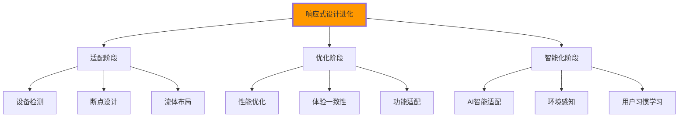

# 响应式设计深度

## 📱 响应式设计的现代理念

### 📊 现代响应式技术生态

**响应式设计已经从单纯适配进化到优化体验**：



## 🎯 现代响应式HTML架构

### 📋 HTML语义化与响应式结合

```html
<!-- ✅ 响应式友好的HTML结构 -->
<!DOCTYPE html>
<html lang="zh-CN">
<head>
    <meta charset="UTF-8">
    <meta name="viewport" content="width=device-width, initial-scale=1.0, user-scalable=yes">
    
    <!-- 性能优化：预加载关键字体 -->
    <link rel="preload" href="fonts/inter-var-woff2.woff2" as="font" type="font/woff2" crossorigin>
    
    <!-- 条件加载：不同设备加载不同CSS -->
    <link rel="stylesheet" href="css/mobile-first.css" media="screen">
    <link rel="stylesheet" href="css/tablet.css" media="screen and (min-width: 768px)">
    <link rel="stylesheet" href="css/desktop.css" media="screen and (min-width: 1024px)">
    
    <!-- 打印样式 -->
    <link rel="stylesheet" href="css/print.css" media="print">
    
    <!-- 减少运动模式 -->
    <style>
        @media (prefers-reduced-motion: reduce) {
            *, *::before, *::after {
                animation-duration: 0.01ms !important;
                animation-iteration-count: 1 !important;
                transition-duration: 0.01ms !important;
                scroll-behavior: auto !important;
            }
        }
    </style>
</head>

<body data-device-type="" data-orientation="" class="responsive-layout">
    <!-- 🔍 响应式导航 -->
    <header class="responsive-header" role="banner">
        <div class="header-container">
            <!-- 品牌标识：移动端可简化 -->
            <div class="brand">
                <a href="/" class="brand-link">
                    
                    
                    <span class="brand-text">IT学院</span>
                </a>
            </div>
            
            <!-- 响应式导航：移动端抽屉式 -->
            <nav class="responsive-navigation" role="navigation" aria-label="主导航">
                <!-- 汉堡菜单按钮 -->
                <button class="mobile-menu-toggle" 
                        aria-expanded="false"
                        aria-controls="main-nav"
                        aria-label="打开主导航菜单">
                    <span class="hamburger-line"></span>
                    <span class="hamburger-line"></span>
                    <span class="hamburger-line"></span>
                </button>
                
                <!-- 主导航菜单 -->
                <ul class="nav-list" id="main-nav">
                    <li class="nav-item">
                        <a href="/" class="nav-link" aria-current="page">首页</a>
                    </li>
                    
                    <!-- 有子菜单的项目 -->
                    <li class="nav-item nav-item--dropdown">
                        <button class="nav-link nav-link--parent" 
                                aria-expanded="false"
                                aria-haspopup="true"
                                aria-controls="products-submenu">
                            产品
                            <svg class="dropdown-icon" aria-hidden="true">
                                <use href="#icon-chevron-down"></use>
                            </svg>
                        </button>
                        
                        <ul class="nav-dropdown" 
                            id="products-submenu"
                            aria-hidden="true"
                            role="menu">
                            <li role="none">
                                <a href="/web-development" class="nav-sublink" role="menuitem">
                                    Web开发
                                </a>
                            </li>
                            <li role="none">
                                <a href="/mobile-apps" class="nav-sublink" role="menuitem">
                                    移动应用
                                </a>
                            </li>
                            <li role="none">
                                <a href="/enterprise" class="nav-sublink" role="menuitem">
                                    企业解决方案
                                </a>
                            </li>
                        </ul>
                    </li>
                    
                    <li class="nav-item">
                        <a href="/about" class="nav-link">关于我们</a>
                    </li>
                    <li class="nav-item">
                        <a href="/contact" class="nav-link">联系我们</a>
                    </li>
                </ul>
                
                <!-- 头部操作：移动端简化 -->
                <div class="header-actions">
                    <button class="search-toggle" aria-label="搜索">
                        <svg class="search-icon"><use href="#icon-search"></use></svg>
                    </button>
                    
                    <!-- 移动端隐藏主CTA -->
                    <a href="/contact" class="btn-contact btn-contact--desktop">
                        免费咨询
                    </a>
                </div>
            </nav>
            
            <!-- 搜索覆盖层：移动端全屏 -->
            <div class="search-overlay" aria-hidden="true">
                <form class="search-form" role="search">
                    <input type="search" 
                           placeholder="搜索课程、讲师或内容..."
                           class="search-input"
                           aria-label="搜索内容">
                    <button type="submit" class="search-submit" aria-label="执行搜索">
                        <svg><use href="#icon-search"></use></svg>
                    </button>
                </form>
                
                <!-- 搜索建议：桌面端显示 -->
                <div class="search-suggestions search-suggestions--desktop">
                    <h3>热门搜索</h3>
                    <ul>
                        <li><a href="/search?q=HTML5">HTML5教程</a></li>
                        <li><a href="/search?q=CSS3">CSS3动画</a></li>
                        <li><a href="/search?q=JavaScript">JavaScript基础</a></li>
                    </ul>
                </div>
            </div>
        </div>
    </header>

    <!-- 📱 响应式主要内容区域 -->
    <main class="responsive-main" role="main">
        <!-- Hero区域：移动端优化 -->
        <section class="hero responsive-hero" aria-labelledby="hero-heading">
            <div class="hero-container">
                <!-- 移动端堆叠布局 -->
                <div class="hero-content">
                    <h1 id="hero-heading">
                        <span class="hero-title--main">创新Web技术</span>
                        <span class="hero-title--sub">驱动未来数字化</span>
                    </h1>
                    
                    <p class="hero-description">
                        掌握前沿的前端开发技术，构建下一代数字化应用。
                        从响应式设计到现代框架，全面提升技能水平。
                    </p>
                    
                    <!-- 响应式CTA按钮组 -->
                    <div class="hero-actions">
                        <a href="/courses" class="btn-hero btn-hero--primary">
                            探索课程
                        </a>
                        <a href="/demo" class="btn-hero btn-hero--secondary">
                            <svg class="play-icon"><use href="#icon-play"></use></svg>
                            观看演示
                        </a>
                    </div>
                    
                    <!-- 关键指标：桌面端横向，移动端纵向 -->
                    <div class="hero-stats">
                        <div class="stat-item">
                            <span class="stat-number" data-count="1000">0</span>
                            <span class="stat-label">学员</span>
                        </div>
                        <div class="stat-item">
                            <span class="stat-number" data-count="50">0</span>
                            <span class="stat-label">课程</span>
                        </div>
                        <div class="stat-item">
                            <span class="stat-number" data-count="98">0</span>
                            <span class="stat-label">% 满意度</span>
                        </div>
                    </div>
                </div>
                
                <!-- Hero视觉：移动端优化 -->
                <div class="hero-visual">
                    <!-- 响应式图片 -->
                    <picture class="hero-image-container">
                        <!-- 小屏幕：简化版 -->
                        <source media="(max-width: 480px)" 
                                srcset="images/hero-mobile-small.webp 400w">
                        
                        <!-- 中等屏幕：标准版 -->
                        <source media="(max-width: 768px)" 
                                srcset="images/hero-tablet.webp 800w">
                        
                        <!-- 大屏幕：完整版 -->
                        <source media="(min-width: 769px)" 
                                srcset="images/hero-desktop.webp 1200w">
                        
                        <!-- 降级方案 -->
                        
                    </picture>
                    
                    <!-- 可交互元素：桌面端显示 -->
                    <div class="hero-interactions hero-interactions--desktop">
                        <button class="floating-card" aria-label="查看课程详情">
                            <span class="card-title">前端基础</span>
                            <span class="card-progress">80%完成</span>
                        </button>
                    </div>
                </div>
            </div>
        </section>

        <!-- 📚 响应式课程卡片网格 -->
        <section class="courses responsive-courses" aria-labelledby="courses-heading">
            <div class="container">
                <header class="section-header">
                    <h2 id="courses-heading">热门课程</h2>
                    <p class="section-description">
                        精心设计的实战课程，助您快速掌握现代Web开发技能
                    </p>
                    
                    <!-- 课程筛选：移动端下拉，桌面端标签 -->
                    <div class="courses-filter">
                        <button class="filter-mobile-toggle btn-secondary">
                            筛选课程
                            <svg><use href="#icon-filter"></use></svg>
                        </button>
                        
                        <div class="filter-tags filter-tags--desktop">
                            <button class="filter-tag active" data-filter="all">全部</button>
                            <button class="filter-tag" data-filter="frontend">前端</button>
                            <button class="filter-tag" data-filter="backend">后端</button>
                            <button class="filter-tag" data-filter="mobile">移动端</button>
                        </div>
                    </div>
                </header>
                
                <!-- 课程网格：响应式布局 -->
                <div class="courses-grid">
                    <article class="course-card">
                        <div class="card-visual">
                            
                            <div class="card-overlay">
                                <button class="btn-play" aria-label="预览课程">
                                    <svg><use href="#icon-play"></use></svg>
                                </button>
                            </div>
                            <div class="card-badge">初级</div>
                        </div>
                        
                        <div class="card-content">
                            <div class="card-category">前端开发</div>
                            <h3 class="card-title">HTML5现代化开发</h3>
                            <p class="card-description">
                                深入学习HTML5语义化标签、API和新特性，
                                掌握现代Web开发核心技术。
                            </p>
                            
                            <!-- 课程元信息 -->
                            <div class="card-meta">
                                <span class="meta-item">
                                    <svg><use href="#icon-clock"></use></svg>
                                    40小时
                                </span>
                                <span class="meta-item">
                                    <svg><use href="#icon-users"></use></svg>
                                    1,200+学员
                                </span>
                            </div>
                            
                            <!-- 评分 -->
                            <div class="card-rating">
                                <div class="stars" aria-label="评分4.8/5">
                                    ⭐⭐⭐⭐⭐
                                    <span class="rating-text">4.8 (256评价)</span>
                                </div>
                            </div>
                            
                            <!-- 价格 -->
                            <div class="card-pricing">
                                <span class="price-current">¥299</span>
                                <span class="price-original">¥599</span>
                                <span class="price-label">限时优惠</span>
                            </div>
                        </div>
                        
                        <div class="card-actions">
                            <button class="btn-add-cart" aria-label="加入购物车">
                                <svg><use href="#icon-cart"></use></svg>
                                加入购物车
                            </button>
                            <button class="btn-heart" aria-label="添加到收藏">
                                <svg><use href="#icon-heart"></use></svg>
                            </button>
                        </div>
                    </article>
                    
                    <!-- 更多课程卡片... -->
                </div>
                
                <!-- 响应式分页 -->
                <nav class="courses-pagination" aria-label="课程分页">
                    <button class="pagination-btn pagination-prev" disabled>
                        <svg><use href="#icon-arrow-left"></use></svg>
                        <span class="pagination-text">上一页</span>
                    </button>
                    
                    <div class="pagination-pages">
                        <button class="pagination-page active" aria-current="page">1</button>
                        <button class="pagination-page">2</button>
                        <button class="pagination-page">3</button>
                        <span class="pagination-ellipsis">...</span>
                        <button class="pagination-page">10</button>
                    </div>
                    
                    <button class="pagination-btn pagination-next">
                        <span class="pagination-text">下一页</span>
                        <svg><use href="#icon-arrow-right"></use></svg>
                    </button>
                </nav>
            </div>
        </section>
    </main>

    <!-- 📄 响应式侧边栏 -->
    <aside class="responsive-sidebar" role="complementary" aria-label="补充内容">
        <!-- 桌面端侧边栏 -->
        <div class="sidebar-content sidebar-content--desktop">
            <div class="widget">
                <h3>最新文章</h3>
                <ul class="widget-list">
                    <li>
                        <a href="/article/html5-tips">
                            <span class="article-title">HTML5开发技巧</span>
                            <span class="article-date">2024-01-15</span>
                        </a>
                    </li>
                    <li>
                        <a href="/article/css-grid-guide">
                            <span class="article-title">CSS Grid完整指南</span>
                            <span class="article-date">2024-01-14</span>
                        </a>
                    </li>
                </ul>
            </div>
            
            <div class="widget">
                <h3>热门标签</h3>
                <div class="tag-cloud">
                    <a href="/tag/html" class="tag-link tag-size-small">HTML</a>
                    <a href="/tag/css" class="tag-link tag-size-large">CSS</a>
                    <a href="/tag/javascript" class="tag-link tag-size-medium">JavaScript</a>
                </div>
            </div>
        </div>
    </aside>

    <!-- 🔧 响应式页脚 -->
    <footer class="responsive-footer" role="contentinfo">
        <div class="footer-container">
            <!-- 页脚主内容区域 -->
            <div class="footer-main">
                <!-- 公司信息：移动端堆叠 -->
                <div class="footer-section">
                    <div class="footer-logo">
                        
                        <p class="footer-tagline">
                            专业的IT技能培训平台，助力职业生涯发展
                        </p>
                    </div>
                    
                    <address class="footer-contact">
                        地址：北京市海淀区中关村大街66号<br>
                        电话：<a href="tel:+86-400-888-0000">400-888-0000</a><br>
                        邮箱：<a href="mailto:contact@it-academy.edu.cn">contact@it-academy.edu.cn</a>
                    </address>
                </div>
                
                <!-- 导航链接：移动端折叠 -->
                <div class="footer-section">
                    <h3>课程分类</h3>
                    <nav aria-label="课程导航">
                        <ul class="footer-nav">
                            <li><a href="/frontend">前端开发</a></li>
                            <li><a href="/backend">后端开发</a></li>
                            <li><a href="/mobile">移动开发</a></li>
                            <li><a href="/data">数据科学</a></li>
                        </ul>
                    </nav>
                </div>
                
                <div class="footer-section">
                    <h3>学习支持</h3>
                    <nav aria-label="支持导航">
                        <ul class="footer-nav">
                            <li><a href="/help">帮助中心</a></li>
                            <li><a href="/community">学习社区</a></li>
                            <li><a href="/mentor">一对一指导</a></li>
                            <li><a href="/certificate">证书考试</a></li>
                        </ul>
                    </nav>
                </div>
                
                <!-- 社交媒体：移动端横向排列 -->
                <div class="footer-section">
                    <h3>关注我们</h3>
                    <div class="social-links">
                        <a href="#" aria-label="微信公众号" class="social-link social-wechat">
                            <svg><use href="#icon-wechat"></use></svg>
                        </a>
                        <a href="#" aria-label="微博" class="social-link social-weibo">
                            <svg><use href="#icon-weibo"></use></svg>
                        </a>
                        <a href="#" aria-label="知乎" class="social-link social-zhihu">
                            <svg><use href="#icon-zhihu"></use></svg>
                        </a>
                        <a href="#" aria-label="B站" class="social-link social-bilibili">
                            <svg><use href="#icon-bilibili"></use></svg>
                        </a>
                    </div>
                    
                    <!-- 移动端CTA -->
                    <div class="mobile-cta">
                        <a href="/download-app" class="btn-app-download">
                            <svg><use href="#icon-download"></use></svg>
                            下载APP
                        </a>
                    </div>
                </div>
            </div>
            
            <!-- 页脚底部：统一样式 -->
            <div class="footer-bottom">
                <div class="footer-copyright">
                    <p>&copy; 2024 IT学院. 保留所有权利.</p>
                    <p class="copyright-details">京ICP备12345678号-1 | 办学许可证号：123456789</p>
                </div>
                
                <nav class="footer-legal" aria-label="法律链接">
                    <ul class="legal-links">
                        <li><a href="/privacy">隐私政策</a></li>
                        <li><a href="/terms">使用条款</a></li>
                        <li><a href="/sitemap">网站地图</a></li>
                    </ul>
                </nav>
                
                <!-- 返回顶部：移动端浮动按钮 -->
                <button class="back-to-top" 
                        aria-label="返回页面顶部"
                        onclick="scrollToTop()">
                    <svg><use href="#icon-arrow-up"></use></svg>
                </button>
            </div>
        </div>
    </footer>

    <!-- JavaScript增强 -->
    <script src="js/responsive-enhancements.js"></script>
</body>
</html>
```

## 📊 现代响应式CSS技术

### 🎨 Container Queries容器查询

```css
/* ✅ 现代容器查询实现 */
.courses-grid {
    container-type: inline-size;
    container-name: courses-grid;
}

.course-card {
    display: grid;
    grid-template-rows: auto 1fr auto;
    gap: 1rem;
    
    /* 基于容器宽度调整布局 */
    @container courses-grid (min-width: 400px) {
        .card-content {
            display: grid;
            grid-template-columns: 1fr auto;
            align-items: start;
        }
        
        .card-pricing {
            text-align: right;
        }
    }
}

/* ✅ 组件响应式设计 */
@container (min-width: 300px) {
    .course-card {
        border-radius: 0.75rem;
        box-shadow: 0 4px 6px rgba(0,0,0,0.1);
    }
}

@container (min-width: 500px) {
    .course-card {
        border-radius: 1rem;
        box-shadow: 0 8px 25px rgba(0,0,0,0.15);
    }
    
    .card-visual img {
        border-radius: 0.75rem;
    }
}

/* ✅ 现代布局技术 */
.responsive-hero {
    display: grid;
    grid-template-areas: "content visual";
    grid-template-columns: 1fr 1fr;
    gap: 3rem;
    align-items: center;
    min-height: 70vh;
    padding: 2rem;
}

/* 响应式网格区域调整 */
@media (max-width: 768px) {
    .responsive-hero {
        grid-template-areas: "content"
                             "visual";
        grid-template-columns: 1fr;
        gap: 2rem;
        min-height: 50vh;
    }
}

/* ✅ 智能断点系统 */
:root {
    --breakpoint-xs: 480px;
    --breakpoint-sm: 640px;
    --breakpoint-md: 768px;
    --breakpoint-lg: 1024px;
    --breakpoint-xl: 1280px;
    --breakpoint-2xl: 1536px;
}

/* CSS自定义属性响应式 */
.navigation {
    --nav-direction: column;
    --nav-gap: 1rem;
    --nav-padding: 1rem;
}

@media (min-width: 768px) {
    .navigation {
        --nav-direction: row;
        --nav-gap: 2rem;
        --nav-padding: 1.5rem;
    }
}

.nav-list {
    display: flex;
    flex-direction: var(--nav-direction);
    gap: var(--nav-gap);
    padding: var(--nav-padding);
}

/* ✅ 级联布局规范 */
.courses-section {
    display: grid;
    grid-template-columns: [sidebar-start] minmax(280px, 1fr) [sidebar-end] 
                           minmax(0, 1fr) [main-end];
    gap: 2rem;
    min-height: 100vh;
}

.courses-main {
    grid-column: main;
    display: flex;
    flex-direction: column;
    gap: 2rem;
}

.courses-sidebar {
    grid-column: sidebar;
    
    /* 小屏幕时隐藏侧边栏 */
    @media (max-width: 1024px) {
        display: none;
    }
}

/* ✅ 现代滚动体验 */
html {
    scroll-behavior: smooth;
}

@media (prefers-reduced-motion: no-preference) {
    html {
        scroll-behavior: smooth;
    }
}

/* 自定义滚动条 */
::-webkit-scrollbar {
    width: 8px;
}

::-webkit-scrollbar-track {
    background: #f1f1f1;
}

::-webkit-scrollbar-thumb {
    background: #c1c1c1;
    border-radius: 4px;
}

::-webkit-scrollbar-thumb:hover {
    background: #a1a1a1;
}

/* ✅ 焦点管理 */
.sr-only {
    position: absolute;
    width: 1px;
    height: 1px;
    padding: 0;
    margin: -1px;
    overflow: hidden;
    clip: rect(0, 0, 0, 0);
    white-space: nowrap;
    border: 0;
}

.skip-link {
    position: absolute;
    top: -40px;
    left: 6px;
    background: #000;
    color: #fff;
    padding: 8px;
    text-decoration: none;
    z-index: 1000;
}

.skip-link:focus {
    top: 6px;
}

/* 触摸友好设计 */
@media (hover: none) and (pointer: coarse) {
    .btn-minimum {
        min-height: 44px;
        min-width: 44px;
        padding: 12px;
    }
    
    .hover-interactive {
        /* 移除悬浮依赖的交互 */
        opacity: 1;
    }
}
```

---

**🔗 响应式设计深化**：
- 移动端适配：`[[04-8 移动端适配策略]]`
- PWA应用：`[[04-9 PWA中的HTML]]`
- 框架集成：`[[04-4 现代框架对比分析]]`
