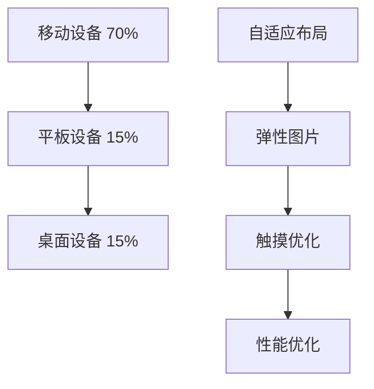

# 移动端适配策略

## 📱 移动优先设计理念

### 📊 设备适配统计



### 🎯 HTML移动适配核心

| 适配技术 | 兼容性 | 性能影响 | 开发复杂度 |
|----------|--------|----------|------------|
| **Viewport** | ⭐⭐⭐⭐⭐ | ⭐⭐⭐⭐⭐ | ⭐ |
| **Flexbox** | ⭐⭐⭐⭐ | ⭐⭐⭐⭐ | ⭐⭐⭐ |
| **Grid布局** | ⭐⭐⭐⭐ | ⭐⭐⭐⭐⭐ | ⭐⭐⭐⭐ |
| **媒体查询** | ⭐⭐⭐⭐⭐ | ⭐⭐⭐⭐ | ⭐⭐⭐ |

## 🔧 Viewport与Meta配置

### 📱 完整移动端配置

```html
<!DOCTYPE html>
<html lang="zh-CN">
<head>
    <meta charset="UTF-8">
    <!-- 基础移动端viewport设置 -->
    <meta name="viewport" content="width=device-width, initial-scale=1.0, user-scalable=no">
    
    <!-- 移动端优化meta -->
    <meta name="mobile-web-app-capable" content="yes">
    <meta name="apple-mobile-web-app-capable" content="yes">
    <meta name="apple-mobile-web-app-status-bar-style" content="black-translucent">
    
    <!-- PWA相关meta -->
    <meta name="theme-color" content="#007acc">
    <meta name="msapplication-TileColor" content="#007acc">
    
    <!-- 预加载关键资源 -->
    <link rel="preload" href="/css/mobile-critical.css" as="style">
    <link rel="preload" href="/fonts/inter-mobile.woff2" as="font" crossorigin>
    
    <title>移动优化HTML页面</title>
    
    <style>
        /* 移动优先CSS框架 */
        :root {
            --mobile-gap: 1rem;
            --mobile-font-size: 16px;
            --mobile-line-height: 1.5;
        }
        
        * {
            box-sizing: border-box;
        }
        
        body {
            margin: 0;
            font-family: -apple-system, BlinkMacSystemFont, sans-serif;
            font-size: var(--mobile-font-size);
            line-height: var(--mobile-line-height);
            -webkit-font-smoothing: antialiased;
            -moz-osx-font-smoothing: grayscale;
        }
        
        .mobile.container {
            padding: var(--mobile-gap);
            max-width: 100vw;
            overflow-x: hidden;
        }
        
        /* 移动端网格布局 */
        .mobile-grid {
            display: grid;
            grid-template-columns: 1fr;
            gap: var(--mobile-gap);
        }
        
        /* 移动端卡片样式 */
        .mobile-card {
            background: white;
            border-radius: 12px;
            padding: var(--mobile-gap);
            box-shadow: 0 2px 8px rgba(0,0,0,0.1);
            margin-bottom: var(--mobile-gap);
        }
        
        /* 触摸友好的按钮 */
        .mobile-button {
            display: block;
            width: 100%;
            padding: 18px;
            background: #007acc;
            color: white;
            border: none;
            border-radius: 12px;
            font-size: 1.1rem;
            font-weight: 600;
            cursor: pointer;
            transition: all 0.2s ease;
            -webkit-tap-highlight-color: transparent;
        }
        
        .mobile-button:hover,
        .mobile-button:active {
            background: #005999;
            transform: translateY(-2px);
        }
        
        /* 移动端图片优化 */
        .mobile-image {
            width: 100%;
            height: auto;
            border-radius: 8px;
            object-fit: cover;
        }
        
        /* 移动端导航 */
        .mobile-nav {
            position: sticky;
            top: 0;
            background: white;
            border-bottom: 1px solid #e0e0e0;
            z-index: 100;
            padding: var(--mobile-gap);
        }
        
        .mobile-nav .nav-back {
            background: none;
            border: none;
            font-size: 1.2rem;
            cursor: pointer;
            padding: 8px;
            -webkit-tap-highlight-color: transparent;
        }
        
        /* 移动端输入框 */
        .mobile-input {
            width: 100%;
            padding: 16px;
            border: 2px solid #e0e0e0;
            border-radius: 12px;
            font-size: 16px; /* 防止iOS缩放 */
            transition: border-color 0.2s ease;
        }
        
        .mobile-input:focus {
            outline: none;
            border-color: #007acc;
        }
        
        /* 移动端列表 */
        .mobile-list {
            list-style: none;
            padding: 0;
            margin: 0;
        }
        
        .mobile-list-item {
            padding: 16px;
            border-bottom: 1px solid #f0f0f0;
            cursor: pointer;
            transition: background-color 0.2s ease;
            -webkit-tap-highlight-color: transparent;
        }
        
        .mobile-list-item:hover,
        .mobile-list-item:active {
            background-color: #f8f9fa;
        }
        
        /* 平板适配 */
        @media (min-width: 768px) {
            :root {
                --mobile-gap: 2rem;
            }
            
            .mobile-grid {
                grid-template-columns: repeat(2, 1fr);
            }
            
            .mobile-nav {
                padding: calc(var(--mobile-gap) * 0.75);
            }
        }
        
        /* 桌面端适配 */
        @media (min-width: 1024px) {
            .mobile-grid {
                grid-template-columns: repeat(3, 1fr);
                gap: 2rem;
            }
            
            .mobile.container {
                max-width: 1200px;
                margin: 0 auto;
                padding: 2rem;
            }
        }
    </style>
</head>

<body>
    <div class="mobile.container">
        <!-- 移动端导航 -->
        <nav class="mobile-nav">
            <div style="display: flex; align-items: center; justify-content: space-between;">
                <button class="nav-back" onclick="goBack()">← 返回</button>
                <h1 style="margin: 0; font-size: 1.3rem;">移动优化页面</h1>
                <span style="width: 24px;"></span> <!-- 占位符平衡布局 -->
            </div>
        </nav>

        <!-- 主要内容区域 -->
        <main>
            <!-- 欢迎卡片 -->
            <div class="mobile-card">
                <h2>移动优先设计</h2>
                <p>这个页面采用移动优先的设计策略，确保在所有设备上都有良好的用户体验。</p>
                
                <div style="margin: 1.5rem 0;">
                    <strong>核心特性：</strong>
                    <ul style="margin: 0.5rem 0;">
                        <li>响应式viewport配置</li>
                        <li>触摸友好的交互元素</li>
                        <li>优化的移动端性能</li>
                        <li>渐进式增强设计</li>
                    </ul>
                </div>
                
                <button class="mobile-button" onclick="showMobileFeatures()">
                    查看移动特性
                </button>
            </div>

            <!-- 功能展示网格 -->
            <div class="mobile-grid">
                <div class="mobile-card">
                    <h3>📱 Touch优化</h3>
                    
                    <p>优化触摸目标大小和交互反馈</p>
                </div>
                
                <div class="mobile-card">
                    <h3>⚡ 性能优化</h3>
                    
                    <p>减少加载时间和资源使用</p>
                </div>
                
                <div class="mobile-card">
                    <h3>🎨 响应式布局</h3>
                    
                    <p>自适应不同屏幕尺寸</p>
                </div>
            </div>

            <!-- 移动端表单示例 -->
            <div class="mobile-card">
                <h3>移动端表单优化</h3>
                
                <form class="mobile-form">
                    <div style="margin-bottom: 1rem;">
                        <label for="mobile-email">邮箱地址</label>
                        <input 
                            type="email" 
                            id="mobile-email" 
                            class="mobile-input" 
                            placeholder="请输入邮箱地址"
                            autocomplete="email">
                    </div>
                    
                    <div style="margin-bottom: 1.5rem;">
                        <label for="mobile-message">反馈信息</label>
                        <textarea 
                            id="mobile-message" 
                            class="mobile-input" 
                            rows="4" 
                            placeholder="请输入您的反馈"></textarea>
                    </div>
                    
                    <button class="mobile-button" onclick="submitMobileForm(event)">
                        提交反馈
                    </button>
                </form>
            </div>

            <!-- 移动端列表示例 -->
            <div class="mobile-card">
                <h3>移动端交互列表</h3>
                
                <ul class="mobile-list">
                    <li class="mobile-list-item" onclick="handleListItem(1)">
                        <strong>通知中心</strong>
                        <br>
                        <small style="color: #666;">管理您的应用通知设置</small>
                    </li>
                    <li class="mobile-list-item" onclick="handleListItem(2)">
                        <strong>账户设置</strong>
                        <br>
                        <small style="color: #666;">更新个人信息和偏好</small>
                    </li>
                    <li class="mobile-list-item" onclick="handleListItem(3)">
                        <strong>隐私控制</strong>
                        <br>
                        <small style="color: #666;">管理数据使用权限</small>
                    </li>
                    <li class="mobile-list-item" onclick="handleListItem(4)">
                        <strong>帮助支持</strong>
                        <br>
                        <small style="color: #666;">获取技术支持和使用指南</small>
                    </li>
                </ul>
            </div>
        </main>

        <!-- 移动端底部导航 -->
        <nav style="position: fixed; bottom: 0; left: 0; right: 0; background: white; border-top: 1px solid #e0e0e0; display: flex; z-index: 100;">
            <button class="mobile-button" style="flex: 1; margin: 0.5rem; padding: 1rem;" onclick="navToSection('home')">
                首页
            </button>
            <button class="mobile-button" style="flex: 1; margin: 0.5rem; padding: 1rem;" onclick="navToSection('features')">
                功能
            </button>
            <button class="mobile-button" style="flex: 1; margin: 0.5rem; padding: 1rem;" onclick="navToSection('settings')">
                设置
            </button>
        </nav>
        
        <!-- 为底部导航预留空间 -->
        <div style="height: 80px;"></div>
    </div>

    <!-- 移动端JavaScript -->
    <script>
        // 📱 移动端适配工具类
        class MobileAdapter {
            constructor() {
                this.deviceInfo = this.detectDevice();
                this.setupMobileOptimizations();
            }
            
            detectDevice() {
                const userAgent = navigator.userAgent.toLowerCase();
                
                return {
                    isMobile: /iphone|ipad|ipod|android|blackberry|windows phone/.test(userAgent),
                    isIOS: /iphone|ipad|ipod/.test(userAgent),
                    isAndroid: /android/.test(userAgent),
                    screenWidth: window.innerWidth,
                    hasTouch: 'ontouchstart' in window,
                    pixelRatio: window.devicePixelRatio || 1
                };
            }
            
            setupMobileOptimizations() {
                // 设置viewport scale
                if (this.deviceInfo.isIOS) {
                    this.preventIOSZoom();
                }
                
                // 优化触摸事件
                if (this.deviceInfo.hasTouch) {
                    this.optimizeTouchEvents();
                }
                
                // 处理视口变化
                this.setupViewportHandling();
            }
            
            preventIOSZoom() {
                // 防止iOS双指缩放
                document.addEventListener('touchstart', (e) => {
                    if (e.touches.length > 1) {
                        e.preventDefault();
                    }
                });
                
                // 防止iOS双击缩放
                let lastTouchEnd = 0;
                document.addEventListener('touchend', (e) => {
                    const now = new Date().getTime();
                    if (now - lastTouchEnd <= 300) {
                        e.preventDefault();
                    }
                    lastTouchEnd = now;
                });
            }
            
            optimizeTouchEvents() {
                // 添加触摸反馈
                const touchElements = document.querySelectorAll('.mobile-button, .mobile-list-item');
                
                touchElements.forEach(element => {
                    element.addEventListener('touchstart', (e) => {
                        element.style.transform = 'scale(0.98)';
                    });
                    
                    element.addEventListener('touchend', (e) => {
                        element.style.transform = '';
                    });
                });
            }
            
            setupViewportHandling() {
                // 监听视口变化
                let resizeTimeout;
                window.addEventListener('resize', () => {
                    clearTimeout(resizeTimeout);
                    resizeTimeout = setTimeout(() => {
                        this.handleViewportChange();
                    }, 100);
                });
                
                // 监听设备方向变化
                window.addEventListener('orientationchange', () => {
                    setTimeout(() => {
                        this.handleViewportChange();
                    }, 100);
                });
            }
            
            handleViewportChange() {
                // 更新设备信息
                this.deviceInfo.screenWidth = window.innerWidth;
                
                // 调整布局
                const grid = document.querySelector('.mobile-grid');
                if (this.deviceInfo.screenWidth >= 1024) {
                    grid.style.gridTemplateColumns = 'repeat(3, 1fr)';
                } else if (this.deviceInfo.screenWidth >= 768) {
                    grid.style.gridTemplateColumns = 'repeat(2, 1fr)';
                } else {
                    grid.style.gridTemplateColumns = '1fr';
                }
                
                console.log('📱 视口已更新:', {
                    width: this.deviceInfo.screenWidth,
                    orientation: this.deviceInfo.screenWidth > window.innerHeight ? 'landscape' : 'portrait'
                });
            }
            
            // 性能优化：图片懒加载
            setupLazyLoading() {
                const images = document.querySelectorAll('img[data-src]');
                
                const imageObserver = new IntersectionObserver((entries) => {
                    entries.forEach(entry => {
                        if (entry.isIntersecting) {
                            const img = entry.target;
                            img.src = img.dataset.src;
                            img.removeAttribute('data-src');
                            imageObserver.unobserve(img);
                        }
                    });
                });
                
                images.forEach(img => imageObserver.observe(img));
            }
        }

        // 🖱️ 移动端交互函数
        function goBack() {
            if (window.history.length > 1) {
                window.history.back();
            } else {
                window.close();
            }
        }

        function showMobileFeatures() {
            alert('移动端特性:\n• 触摸优化交互\n• 响应式布局\n• 高性能加载\n• PWA支持');
        }

        function submitMobileForm(event) {
            event.preventDefault();
            
            const email = document.getElementById('mobile-email').value;
            const message = document.getElementById('mobile-message').value;
            
            if (!email || !message) {
                alert('请填写完整的反馈信息');
                return;
            }
            
            // 模拟表单提交
            const submitButton = event.target;
            const originalText = submitButton.textContent;
            submitButton.textContent = '提交中...';
            submitButton.disabled = true;
            
            setTimeout(() => {
                alert('反馈已提交，感谢您的建议！');
                submitButton.textContent = originalText;
                submitButton.disabled = false;
                
                // 清空表单
                document.getElementById('mobile-email').value = '';
                document.getElementById('mobile-message').value = '';
            }, 1500);
        }

        function handleListItem(index) {
            const itemTitles = [
                '通知中心',
                '账户设置', 
                '隐私控制',
                '帮助支持'
            ];
            
            alert(`${itemTitles[index-1]}: 功能开发中...`);
        }

        function navToSection(section) {
            const sections = {
                'home': '您已进入首页',
                'features': '功能页面加载中...',
                'settings': '设置页面开发中...'
            };
            
            alert(sections[section]);
        }

        // 📊 性能监控
        function trackMobilePerformance() {
            // 监控页面加载性能
            window.addEventListener('load', () => {
                const perfData = performance.getEntriesByType('navigation')[0];
                
                console.log('📱 移动端性能指标:', {
                    DOMContentLoaded: perfData.domContentLoadedEventEnd - perfData.domContentLoadedEventStart,
                    LoadComplete: perfData.loadEventEnd - perfData.loadEventStart,
                    FirstPaint: performance.getEntriesByName('first-paint')[0]?.startTime || 'N/A',
                    FirstContentfulPaint: performance.getEntriesByName('first-contentful-paint')[0]?.startTime || 'N/A'
                });
            });
            
            // 监控网络状态
            if ('connection' in navigator) {
                navigator.connection.addEventListener('change', () => {
                    console.log('📶 网络状态变化:', {
                        effectiveType: navigator.connection.effectiveType,
                        downlink: navigator.connection.downlink,
                        rtt: navigator.connection.rtt
                    });
                });
            }
        }

        // 🚀 初始化移动端适配
        document.addEventListener('DOMContentLoaded', () => {
            console.log('📱 移动端适配系统启动');
            
            // 初始化移动端适配器
            window.mobileAdapter = new MobileAdapter();
            
            // 启动性能监控
            trackMobilePerformance();
            
            // 显示设备信息（开发环境）
            if (location.hostname === 'localhost') {
                console.log('📸 设备信息:', window.mobileAdapter.deviceInfo);
            }
        });
    </script>
</body>
</html>
```

## 🔗 相关链接

- [[04-7 响应式设计深度]]
- [[04-9 PWA中的HTML]]
- [[现代Web平台/SEO性能优化/03-17 移动端SEO适配]]
- [[新兴技术趋势/04-13 边缘计算与HTML]]

---

*最后更新：2024年* | 📱 移动端HTML最佳实践
