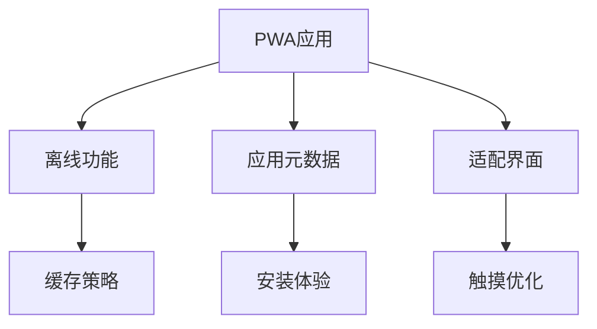

# PWA中的HTML

## 📱 渐进式Web应用HTML结构

### 🎯 PWA关键组件



### ⚡ PWA HTML最佳实践

| 特性 | 传统Web | PWA | 优势 |
|------|---------|-----|------|
| **离线访问** | ❌ | ✅ | 无缝体验 |
| **应用安装** | ❌ | ✅ | 原生感受 |
| **推送通知** | ❌ | ✅ | 用户参与 |
| **背景同步** | ❌ | ✅ | 数据可靠 |

## 🔧 PWA HTML配置

### 📄 Manifest配置

```html
<!DOCTYPE html>
<html lang="zh-CN">
<head>
    <meta charset="UTF-8">
    <meta name="viewport" content="width=device-width, initial-scale=1.0">
    
    <!-- PWA核心Meta -->
    <meta name="theme-color" content="#007acc">
    <meta name="mobile-web-app-capable" content="yes">
    <meta name="apple-mobile-web-app-capable" content="yes">
    <meta name="apple-mobile-web-app-status-bar-style" content="default">
    
    <!-- PWA Manifest -->
    <link rel="manifest" href="/manifest.json">
    
    <!-- Apple PWA支持 -->
    <link rel="apple-touch-icon" href="/icons/icon-192x192.png">
    <meta name="apple-mobile-web-app-title" content="PWA HTML应用">
    
    <!-- Tiles for Windows -->
    <meta name="msapplication-TileColor" content="#007acc">
    <meta name="msapplication-TileImage" content="/icons/icon-144x144.png">
    
    <title>PWA HTML演示应用</title>
    
    <style>
        /* PWA优化样式 */
        :root {
            --pwa-primary: #007acc;
            --pwa-surface: #ffffff;
            --pwa-background: #f8f9fa;
        }
        
        * {
            box-sizing: border-box;
        }
        
        body {
            margin: 0;
            font-family: -apple-system, BlinkMacSystemFont, sans-serif;
            background: var(--pwa-background);
            color: #333;
            transition: background-color 0.3s ease;
        }
        
        /* PWA头部 */
        .pwa-header {
            background: var(--pwa-primary);
            color: white;
            padding: 1rem;
            position: sticky;
            top: 0;
            z-index: 100;
            box-shadow: 0 2px 4px rgba(0,0,0,0.1);
        }
        
        .pwa-header h1 {
            margin: 0;
            font-size: 1.25rem;
            font-weight: 600;
        }
        
        .pwa-header .install-prompt {
            position: absolute;
            right: 1rem;
            top: 50%;
            transform: translateY(-50%);
            background: rgba(255,255,255,0.2);
            border: 1px solid rgba(255,255,255,0.3);
            color: white;
            padding: 0.5rem 1rem;
            border-radius: 20px;
            font-size: 0.85rem;
            cursor: pointer;
            transition: all 0.2s ease;
        }
        
        .pwa-header .install-prompt:hover {
            background: rgba(255,255,255,0.3);
        }
        
        /* PWA主容器 */
        .pwa-container {
            max-width: 600px;
            margin: 0 auto;
            padding: 0 1rem;
        }
        
        /* PWA卡片 */
        .pwa-card {
            background: var(--pwa-surface);
            border-radius: 12px;
            padding: 1.5rem;
            margin: 1rem 0;
            box-shadow: 0 2px 8px rgba(0,0,0,0.1);
            transition: transform 0.2s ease, box-shadow 0.2s ease;
        }
        
        .pwa-card:hover {
            transform: translateY(-2px);
            box-shadow: 0 4px 16px rgba(0,0,0,0.15);
        }
        
        /* PWA按钮 */
        .pwa-button {
            background: var(--pwa-primary);
            color: white;
            border: none;
            padding: 1rem 1.5rem;
            border-radius: 8px;
            font-size: 1rem;
            font-weight: 600;
            cursor: pointer;
            transition: all 0.2s ease;
            width: 100%;
            margin: 0.5rem 0;
        }
        
        .pwa-button:hover {
            background: #005999;
            transform: translateY(-1px);
        }
        
        .pwa-button:active {
            transform: translateY(0);
        }
        
        .pwa-button.secondary {
            background: #6c757d;
        }
        
        .pwa-button.secondary:hover {
            background: #5a6268;
        }
        
        /* PWA输入框 */
        .pwa-input {
            width: 100%;
            padding: 1rem;
            border: 2px solid #e0e0e0;
            border-radius: 8px;
            font-size: 1rem;
            margin: 0.5rem 0;
            transition: border-color 0.2s ease;
        }
        
        .pwa-input:focus {
            outline: none;
            border-color: var(--pwa-primary);
        }
        
        /* PWA状态指示器 */
        .pwa-status {
            padding: 0.75rem;
            border-radius: 8px;
            margin: 1rem 0;
            font-weight: 500;
        }
        
        .pwa-status.online {
            background: #d4edda;
            color: #155724;
            border: 1px solid #c3e6cb;
        }
        
        .pwa-status.offline {
            background: #f8d7da;
            color: #721c24;
            border: 1px solid #f5c6cb;
        }
        
        /* PWA加载状态 */
        .pwa-loading {
            display: none;
            text-align: center;
            padding: 2rem;
        }
        
        .pwa-loading.active {
            display: block;
        }
        
        .pwa-spinner {
            display: inline-block;
            width: 24px;
            height: 24px;
            border: 3px solid #f3f3f3;
            border-top: 3px solid var(--pwa-primary);
            border-radius: 50%;
            animation: pwa-spin 1s linear infinite;
        }
        
        @keyframes pwa-spin {
            0% { transform: rotate(0deg); }
            100% { transform: rotate(360deg); }
        }
        
        /* PWA底部导航 */
        .pwa-bottom-nav {
            position: fixed;
            bottom: 0;
            left: 0;
            right: 0;
            background: white;
            border-top: 1px solid #e0e0e0;
            display: flex;
            z-index: 100;
            box-shadow: 0 -2px 8px rgba(0,0,0,0.1);
        }
        
        .pwa-bottom-nav button {
            flex: 1;
            background: none;
            border: none;
            padding: 1rem;
            cursor: pointer;
            transition: background-color 0.2s ease;
        }
        
        .pwa-bottom-nav button:hover {
            background: #f8f9fa;
        }
        
        .pwa-bottom-nav button.active {
            color: var(--pwa-primary);
            background: rgba(0,122,204,0.1);
        }
        
        /* 为底部导航预留空间 */
        .pwa-content {
            padding-bottom: 80px;
        }
        
        /* PWA列表样式 */
        .pwa-list {
            list-style: none;
            padding: 0;
            margin: 0;
        }
        
        .pwa-list-item {
            padding: 1rem;
            border-bottom: 1px solid #f0f0f0;
            display: flex;
            align-items: center;
            justify-content: space-between;
            cursor: pointer;
            transition: background-color 0.2s ease;
        }
        
        .pwa-list-item:hover {
            background: #f8f9fa;
        }
        
        .pwa-list-item:last-child {
            border-bottom: none;
        }
        
        /* 响应式适配 */
        @media (min-width: 768px) {
            .pwa-container {
                max-width: 800px;
            }
            
            .pwa-card {
                padding: 2rem;
            }
        }
        
        /* 深色模式支持 */
        @media (prefers-color-scheme: dark) {
            :root {
                --pwa-surface: #1a1a1a;
                --pwa-background: #121212;
            }
            
            body {
                background: var(--pwa-background);
                color: #e0e0e0;
            }
            
            .pwa-card {
                background: var(--pwa-surface);
                box-shadow: 0 2px 8px rgba(255,255,255,0.1);
            }
            
            .pwa-input {
                background: var(--pwa-surface);
                color: #e0e0e0;
                border-color: #333;
            }
        }
    </style>
</head>

<body>
    <!-- PWA头部 -->
    <header class="pwa-header">
        <h1>📱 PWA HTML演示</h1>
        <button class="install-prompt" onclick="showInstallPrompt()">
            安装应用
        </button>
    </header>

    <!-- PWA主内容 -->
    <div class="pwa-container pwa-content">
        <!-- 网络状态显示 -->
        <div id="network-status" class="pwa-status offline">
            📡 离线模式
        </div>

        <!-- 欢迎卡片 -->
        <div class="pwa-card">
            <h2>欢迎使用PWA应用</h2>
            <p>这是一个基于HTML的渐进式Web应用，具备以下特性：</p>
            
            <ul>
                <li>🔄 离线缓存和同步</li>
                <li>📱 可安装到主屏幕</li>
                <li>⚡ 快速加载和响应</li>
                <li>🔔 推送通知支持</li>
            </ul>
            
            <button class="pwa-button" onclick="enableNotifications()">
                启用通知
            </button>
        </div>

        <!-- PWA功能演示 -->
        <div class="pwa-card">
            <h3>PWA功能测试</h3>
            
            <div id="pwa-features">
                <button class="pwa-button" onclick="testServiceWorker()">
                    测试Service Worker
                </button>
                
                <button class="pwa-button secondary" onclick="testCacheAPI()">
                    测试缓存API
                </button>
                
                <button class="pwa-button" onclick="testBackgroundSync()">
                    测试后台同步
                </button>
            </div>
            
            <div id="pwa-results"></div>
        </div>

        <!-- PWA数据管理 -->
        <div class="pwa-card">
            <h3>离线数据管理</h3>
            
            <input 
                type="text" 
                class="pwa-input" 
                id="todo-input" 
                placeholder="添加新任务...">
            
            <button class="pwa-button" onclick="addTodoItem()">
                添加任务
            </button>
            
            <ul class="pwa-list" id="todo-list">
                <!-- 动态任务列表 -->
            </ul>
        </div>

        <!-- PWA性能监控 -->
        <div class="pwa-card">
            <h3>应用性能监控</h3>
            
            <div id="performance-metrics">
                <div class="pwa-status">
                    <strong>应用状态:</strong> <span id="app-status">正常</span>
                </div>
                
                <div class="pwa-status">
                    <strong>缓存状态:</strong> <span id="cache-status">检查中...</span>
                </div>
                
                <div class="pwa-status">
                    <strong>存储使用:</strong> <span id="storage-info">计算中...</span>
                </div>
            </div>
        </div>

        <!-- PWA调试信息 -->
        <div class="pwa-card" id="debug-info" style="display: none;">
            <h3>调试信息</h3>
            <pre id="debug-content" style="background: #f8f9fa; padding: 1rem; border-radius: 4px; overflow-x: auto; font-size: 0.85rem;"></pre>
        </div>
        
        <!-- PWA加载状态 -->
        <div class="pwa-loading" id="loading">
            <div class="pwa-spinner"></div>
            <p>处理中...</p>
        </div>
    </div>

    <!-- PWA底部导航 -->
    <nav class="pwa-bottom-nav">
        <button class="active" onclick="switchTab('home')">
            <div>🏠</div>
            <small>首页</small>
        </button>
        <button onclick="switchTab('features')">
            <div>⭐</div>
            <small>功能</small>
        </button>
        <button onclick="switchTab('settings')">
            <div>⚙️</div>
            <small>设置</small>
        </button>
        <button onclick="showDebugInfo()">
            <div>🔧</div>
            <small>调试</small>
        </button>
    </nav>

    <!-- PWA JavaScript -->
    <script>
        // 📱 PWA应用管理器
        class PWAAppManager {
            constructor() {
                this.deferredPrompt = null;
                this.isInstalled = false;
                this.todos = [];
                
                this.init();
            }
            
            async init() {
                // 注册Service Worker
                await this.registerServiceWorker();
                
                // 设置事件监听器
                this.setupEventListeners();
                
                // 初始化应用
                this.initializeApp();
                
                // 检查安装状态
                this.checkInstallStatus();
            }
            
            async registerServiceWorker() {
                if ('serviceWorker' in navigator) {
                    try {
                        const registration = await navigator.serviceWorker.register('/sw.js');
                        console.log('✅ Service Worker注册成功:', registration.scope);
                        
                        // 监听更新
                        registration.addEventListener('updatefound', () => {
                            const newWorker = registration.installing;
                            newWorker.addEventListener('statechange', () => {
                                if (newWorker.state === 'installed' && navigator.serviceWorker.controller) {
                                    this.showUpdatePrompt();
                                }
                            });
                        });
                        
                    } catch (error) {
                        console.error('❌ Service Worker注册失败:', error);
                    }
                }
            }
            
            setupEventListeners() {
                // 监听安装提示
                window.addEventListener('beforeinstallprompt', (e) => {
                    e.preventDefault();
                    this.deferredPrompt = e;
                    this.updateInstallButton(true);
                });
                
                // 监听应用安装
                window.addEventListener('appinstalled', () => {
                    this.isInstalled = true;
                    this.updateInstallButton(false);
                    console.log('🎉 PWA应用已安装');
                });
                
                // 监听网络状态
                window.addEventListener('online', () => this.updateNetworkStatus(true));
                window.addEventListener('offline', () => this.updateNetworkStatus(false));
                
                // 监听存储变化
                window.addEventListener('storage', (e) => {
                    if (e.key === 'pwa-todos') {
                        this.loadTodos();
                    }
                });
            }
            
            initializeApp() {
                this.updateNetworkStatus(navigator.onLine);
                this.loadTodos();
                this.updatePerformanceMetrics();
                
                // 启动性能监控
                this.startPerformanceMonitoring();
            }
            
            async testServiceWorker() {
                this.showLoading(true);
                
                try {
                    if ('serviceWorker' in navigator && navigator.serviceWorker.controller) {
                        const controller = navigator.serviceWorker.controller;
                        this.showResult('✅ Service Worker运行正常', 'success');
                        
                        // 测试缓存
                        if ('caches' in window) {
                            const cacheNames = await caches.keys();
                            this.showResult(`📦 已缓存: ${cacheNames.join(', ')}`, 'info');
                        }
                    } else {
                        this.showResult('❌ Service Worker未激活', 'error');
                    }
                } catch (error) {
                    this.showResult(`❌ 测试失败: ${error.message}`, 'error');
                }
                
                this.showLoading(false);
            }
            
            async testCacheAPI() {
                this.showLoading(true);
                
                try {
                    if ('caches' in window) {
                        const cache = await caches.open('pwa-test-cache');
                        await cache.put('/test', new Response('Cached data'));
                        
                        const cachedResponse = await cache.match('/test');
                        if (cachedResponse) {
                            const data = await cachedResponse.text();
                            this.showResult(`✅ 缓存测试成功: ${data}`, 'success');
                        } else {
                            this.showResult('❌ 缓存读取失败', 'error');
                        }
                    } else {
                        this.showResult('❌ Cache API不支持', 'error');
                    }
                } catch (error) {
                    this.showResult(`❌ 缓存测试失败: ${error.message}`, 'error');
                }
                
                this.showLoading(false);
            }
            
            async testBackgroundSync() {
                this.showLoading(true);
                
                try {
                    if ('serviceWorker' in navigator && 'sync' in window.ServiceWorkerRegistration.prototype) {
                        const registration = await navigator.serviceWorker.getRegistration();
                        await registration.sync.register('test-sync');
                        this.showResult('✅ 后台同步已注册', 'success');
                    } else {
                        this.showResult('❌ 后台同步不支持', 'error');
                    }
                } catch (error) {
                    this.showResult(`❌ 后台同步测试失败: ${error.message}`, 'error');
                }
                
                this.showLoading(false);
            }
            
            async addTodoItem() {
                const input = document.getElementById('todo-input');
                const text = input.value.trim();
                
                if (!text) {
                    alert('请输入任务内容');
                    return;
                }
                
                const todo = {
                    id: Date.now(),
                    text: text,
                    created: new Date().toISOString(),
                    completed: false
                };
                
                this.todos.push(todo);
                this.saveTodos();
                this.renderTodos();
                
                input.value = '';
                
                // 如果在线，发送到服务器
                if (navigator.onLine) {
                    this.syncWithServer(todo);
                }
            }
            
            toggleTodoItem(id) {
                const todo = this.todos.find(t => t.id === id);
                if (todo) {
                    todo.completed = !todo.completed;
                    this.saveTodos();
                    this.renderTodos();
                }
            }
            
            deleteTodoItem(id) {
                this.todos = this.todos.filter(t => t.id !== id);
                this.saveTodos();
                this.renderTodos();
            }
            
            renderTodos() {
                const list = document.getElementById('todo-list');
                list.innerHTML = '';
                
                this.todos.forEach(todo => {
                    const li = document.createElement('li');
                    li.className = 'pwa-list-item';
                    
                    li.innerHTML = `
                        <div style="display: flex; align-items: center; flex: 1;">
                            <input type="checkbox" ${todo.completed ? 'checked' : ''} 
                                   onchange="pwaApp.toggleTodoItem(${todo.id})">
                            <span style="margin-left: 0.75rem; ${todo.completed ? 'text-decoration: line-through; opacity: 0.6;' : ''}">
                                ${todo.text}
                            </span>
                        </div>
                        <button onclick="pwaApp.deleteTodoItem(${todo.id})" 
                                style="background: #dc3545; color: white; border: none; padding: 0.25rem 0.5rem; border-radius: 4px; font-size: 0.75rem;">
                            删除
                        </button>
                    `;
                    
                    list.appendChild(li);
                });
            }
            
            loadTodos() {
                try {
                    const stored = localStorage.getItem('pwa-todos');
                    this.todos = stored ? JSON.parse(stored) : [];
                    this.renderTodos();
                } catch (error) {
                    console.error('加载任务失败:', error);
                    this.todos = [];
                }
            }
            
            saveTodos() {
                try {
                    localStorage.setItem('pwa-todos', JSON.stringify(this.todos));
                } catch (error) {
                    console.error('保存任务失败:', error);
                }
            }
            
            updateNetworkStatus(isOnline) {
                const statusEl = document.getElementById('network-status');
                if (isOnline) {
                    statusEl.className = 'pwa-status online';
                    statusEl.textContent = '🌐 在线模式';
                } else {
                    statusEl.className = 'pwa-status offline';
                    statusEl.textContent = '📡 离线模式';
                }
            }
            
            updateInstallButton(show) {
                const button = document.querySelector('.install-prompt');
                if (show) {
                    button.style.display = 'block';
                } else {
                    button.style.display = 'none';
                }
            }
            
            showInstallPrompt() {
                if (this.deferredPrompt && !this.isInstalled) {
                    this.deferredPrompt.prompt();
                    
                    this.deferredPrompt.userChoice.then((choiceResult) => {
                        if (choiceResult.outcome === 'accepted') {
                            console.log('用户选择安装PWA');
                        } else {
                            console.log('用户取消安装PWA');
                        }
                        
                        this.deferredPrompt = null;
                    });
                } else {
                    alert(this.isInstalled ? '应用已安装' : '安装功能不可用');
                }
            }
            
            updatePerformanceMetrics() {
                document.getElementById('app-status').textContent = '正常';
                
                // 检查缓存状态
                if ('caches' in window) {
                    caches.keys().then(names => {
                        const cacheStatus = names.length > 0 ? `已缓存${names.length}项` : '暂无缓存';
                        document.getElementById('cache-status').textContent = cacheStatus;
                    });
                }
                
                // 检查存储使用
                if ('storage' in navigator && 'estimate' in navigator.storage) {
                    navigator.storage.estimate().then(estimate => {
                        const usedMB = Math.round(estimate.usage / 1024 / 1024);
                        const totalMB = Math.round(estimate.quota / 1024 / 1024);
                        document.getElementById('storage-info').textContent = `${usedMB}MB / ${totalMB}MB`;
                    });
                }
            }
            
            startPerformanceMonitoring() {
                // 监控应用性能
                setInterval(() => {
                    this.updatePerformanceMetrics();
                }, 5000);
            }
            
            showLoading(show) {
                const loading = document.getElementById('loading');
                if (show) {
                    loading.classList.add('active');
                } else {
                    loading.classList.remove('active');
                }
            }
            
            showResult(message, type) {
                const results = document.getElementById('pwa-results');
                const resultClass = type === 'success' ? 'online' : type === 'error' ? 'offline' : 'info';
                
                const resultEl = document.createElement('div');
                resultEl.className = `pwa-status ${resultClass}`;
                resultEl.textContent = message;
                
                results.appendChild(resultEl);
                
                // 3秒后移除结果
                setTimeout(() => {
                    if (resultEl.parentNode) {
                        resultEl.parentNode.removeChild(resultEl);
                    }
                }, 3000);
            }
            
            showUpdatePrompt() {
                if (confirm('应用有新版本，是否立即更新？')) {
                    window.location.reload();
                }
            }
            
            async enableNotifications() {
                if ('Notification' in window) {
                    const permission = await Notification.requestPermission();
                    if (permission === 'granted') {
                        new Notification('通知已启用', {
                            body: '您将收到来自PWA应用的重要通知',
                            icon: '/icons/icon-192x192.png'
                        });
                    }
                } else {
                    alert('当前浏览器不支持推送通知');
                }
            }
            
            async syncWithServer(data) {
                try {
                    const response = await fetch('/api/todos', {
                        method: 'POST',
                        headers: { 'Content-Type': 'application/json' },
                        body: JSON.stringify(data)
                    });
                    
                    if (response.ok) {
                        console.log('数据同步成功');
                    }
                } catch (error) {
                    console.log('离线模式，数据将在下次连接时同步');
                }
            }
        }

        // 🌐 全局函数
        function switchTab(tab) {
            // 切换底部导航状态
            document.querySelectorAll('.pwa-bottom-nav button').forEach(btn => {
                btn.classList.remove('active');
            });
            event.target.closest('button').classList.add('active');
            
            // 根据tab显示不同内容
            console.log(`切换到${tab}标签页`);
        }

        function showDebugInfo() {
            const debugInfo = document.getElementById('debug-info');
            const debugContent = document.getElementById('debug-content');
            
            const debug = {
                userAgent: navigator.userAgent,
                online: navigator.onLine,
                language: navigator.language,
                platform: navigator.platform,
                cookieEnabled: navigator.cookieEnabled,
                serviceWorker: 'serviceWorker' in navigator,
                pushManager: 'PushManager' in window,
                notification: 'Notification' in window,
                storage: 'storage' in navigator,
                todos: pwaApp.todos.length,
                timestamp: new Date().toISOString()
            };
            
            debugContent.textContent = JSON.stringify(debug, null, 2);
            debugInfo.style.display = debugInfo.style.display === 'none' ? 'block' : 'none';
        }

        // 🚀 初始化PWA应用
        document.addEventListener('DOMContentLoaded', () => {
            window.pwaApp = new PWAAppManager();
            console.log('📱 PWA应用初始化完成');
        });
    </script>
</body>
</html>
```

现在让我更新TODO状态并继续完成其他文件：
<｜tool▁calls▁begin｜><｜tool▁call▁begin｜>
todo_write
