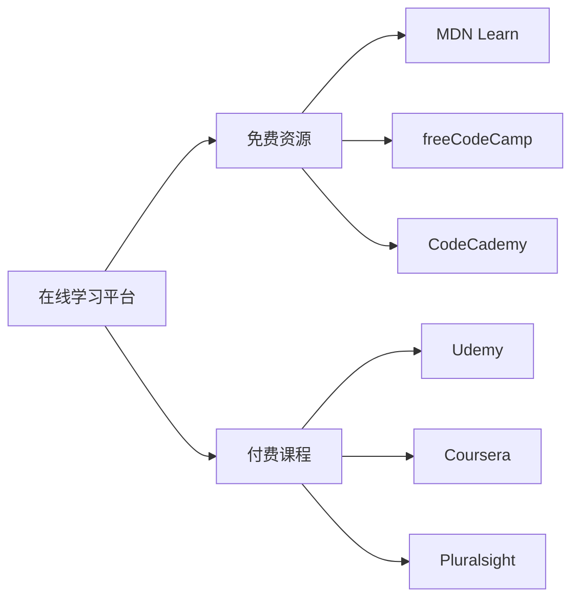

# HTML学习资源汇总

## 📚 权威官方文档

### 🌟 顶级学习资源

| 资源名称 | 网址 | 特点 | 推荐度 |
|----------|------|------|--------|
| **MDN Web Docs** | developer.mozilla.org | Mozilla官方权威文档 | ⭐⭐⭐⭐⭐ |
| **W3Schools** | www.w3schools.com | 互动式学习平台 | ⭐⭐⭐⭐ |
| **W3C HTML规范** | html.spec.whatwg.org | 官方HTML标准 | ⭐⭐⭐⭐⭐ |
| **HTML Living Standard** | html.spec.whatwg.org | 最新HTML规范 | ⭐⭐⭐⭐⭐ |

## 🎓 在线学习平台

### 💻 结构化课程



### 🚀 特色平台

| 平台 | 网址 | 特色功能 | 适合人群 |
|------|------|----------|----------|
| **freeCodeCamp** | freecodecamp.org | 免费完整课程 | 初学者 |
| **Codecademy** | codecademy.com | 交互式学习 | 新手入门 |
| **Coursera** | coursera.org | 大学课程 | 深度学习 |
| **Udemy** | udemy.com | 实用项目 | 职业提升 |

## 🛠️ 开发工具推荐

### 💻 文本编辑器

| 编辑器 | 平台 | 特色功能 | 免费/付费 |
|--------|------|----------|-----------|
| **Visual Studio Code** | 全平台 | 强大的扩展生态 | 免费 |
| **WebStorm** | 全平台 | 专业IDE | 付费 |
| **Sublime Text** | 全平台 | 轻量高效 | 付费 |
| **Atom** | 全平台 | GitHub集成 | 免费 |

### 🔧 浏览器开发工具

| 浏览器 | 开发者工具 | 特色功能 |
|--------|------------|----------|
| **Chrome** | DevTools | JavaScript调试强大 |
| **Firefox** | Developer Tools | CSS网格布局工具 |
| **Edge** | Edge DevTools | WebGL调试 |
| **Safari** | Web Inspector | 性能分析 |

## 📖 优质教程推荐

### 📝 系统化学习路径

```html
<!-- 推荐学习顺序流程图 -->
<div class="learning-path">
    <h3>HTML学习路径</h3>
    <ol>
        <li><a href="basic-syntax">HTML基础语法</a></li>
        <li><a href="elements-tags">常用元素和标签</a></li>
        <li><a href="forms-validation">表单和验证</a></li>
        <li><a href="semantic-html">语义化HTML</a></li>
        <li><a href="accessibility">可访问性设计</a></li>
        <li><a href="seo-optimization">SEO优化</a></li>
        <li><a href="performance">性能优化</a></li>
    </ol>
</div>
```

### 🎥 视频教程推荐

| 教程名称 | 平台 | 讲师 | 时长 | 质量 |
|----------|------|------|------|------|
| **HTML5基础教程** | B站 | 黑马程序员 | 40小时 | ⭐⭐⭐⭐ |
| **Web开发入门** | YouTube | Traversy Media | 25小时 | ⭐⭐⭐⭐⭐ |
| **前端开发实战** | 腾讯课堂 | 李南江 | 35小时 | ⭐⭐⭐⭐ |

## 🎯 实用工具集合

### 🔍 验证和测试工具

| 工具类型 | 工具名称 | 网址 | 用途 |
|----------|----------|------|------|
| **HTML验证** | W3C Validator | validator.w3.org | HTML代码检查 |
| **CSS验证** | CSS Validator | jigsaw.w3.org/css-validator | CSS代码检查 |
| **性能测试** | PageSpeed Insights | pagespeed.web.dev | 页面性能分析 |
| **可访问性** | axe DevTools | developer.deque.com | 无障碍检测 |

### 📱 移动端测试

| 工具 | 功能 | 特点 |
|------|------|------|
| **Chrome DevTools** | 设备模拟 | 内置移动设备模拟 |
| **BrowserStack** | 真实设备测试 | 云测试平台 |
| **Throttling** | 网络模拟 | 模拟慢速网络 |

## 🌐 社区和论坛

### 💬 交流讨论平台

| 社区 | 网址 | 特点 | 活跃度 |
|------|------|------|--------|
| **Stack Overflow** | stackoverflow.com | 技术问答 | 极高 |
| **MDN社区** | developer.mozilla.org | Mozilla官方社区 | 高 |
| **掘金** | juejin.cn | 中文技术社区 | 高 |
| **思否** | segmentfault.com | 中文问答 | 中 |

### 🌟 GitHub宝藏项目

- **awesome-html**: HTML相关资源集合
- **html5-boilerplate**: HTML5项目模板
- **Modernizr**: 功能检测库
- **HTML5-demos**: HTML5演示集合

## 📚 推荐书籍

### 📖 经典HTML书籍

| 书名 | 作者 | 出版社 | 适合程度 |
|------|------|--------|----------|
| **HTML5权威指南** | Adam Freeman | 人民邮电出版社 | 进阶 |
| **HTML与CSS设计指南** | Elizabeth Robins | 机械工业出版社 | 入门 |
| **Web标准化设计** | 阿当 | 清华大学出版社 | 中级 |

## 🎨 优秀网站设计参考

### 🌟 设计灵感网站

| 网站 | 网址 | 特点 |
|------|------|------|
| **Dribbble** | dribbble.com | 设计师作品集 |
| **CSS Design Awards** | cssdesignawards.com | CSS设计奖项 |
| **Awwwards** | awwwards.com | 网页设计认证 |

---

**💡 学习建议**：
1. 从MDN开始，建立正确的基础概念
2. 通过freeCodeCamp进行系统学习
3. 使用Chrome DevTools进行实践
4. 加入Stack Overflow社区解决问题
5. 定期查看最新HTML标准和最佳实践
