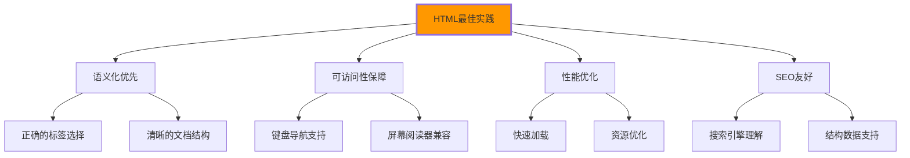

# HTML实战最佳实践

## 🏆 HTML开发的金科玉律

### 📋 必须遵循的原则



## 🎯 语义化标记最佳实践

### ✅ 正确的标签选择策略

| 场景 | 推荐使用 | 避免使用 | 原因 |
|------|----------|----------|------|
| **页面头部** | `<header>` | `<div class="header">` | 语义更明确 |
| **主导航** | `<nav>` | `<div class="nav">` | 导航功能标识 |
| **主要内容** | `<main>` | `<div class="content">` | 内容区域标识 |
| **独立文章** | `<article>` | `<div class="post">` | 内容独立性 |
| **辅助信息** | `<aside>` | `<div class="sidebar">` | 补充内容标识 |
| **章节** | `<section>` | `<div class="section">` | 主题性分组 |
| **联系信息** | `<address>` | `<div class="contact">` | 联系信息专用 |

### 🔧 文档结构优化

```html
<!-- ✅ 优秀的文档结构 -->

<!DOCTYPE html>
<html lang="zh-CN">
<head>
    <!-- 1. 字符编码：最高优先级 -->
    <meta charset="UTF-8">
    
    <!-- 2. 视口设置：移动端必需 -->
    <meta name="viewport" content="width=device-width, initial-scale=1.0">
    
    <!-- 3. 页面标题：SEO核心 -->
    <title>页面标题 - 品牌名称</title>
    
    <!-- 4. 页面描述：搜索摘要 -->
    <meta name="description" content="准确的页面描述，长度160字符以内">
    
    <!-- 5. 关键样式：内联优化渲染 -->
    <style>
        .hero { background: #667eea; }
    </style>
    
    <!-- 6. 其他资源：异步加载 -->
    <link rel="preload" href="main.css" as="style" onload="this.onload=null;this.rel='stylesheet'">
</head>

<body>
    <!-- 页面结构：语义化标签 -->
    <header role="banner">
        <h1>网站标题</h1>
        <nav aria-label="主导航">
            <!-- 导航链接 -->
        </nav>
    </header>
    
    <main role="main">
        <!-- 主要内容 -->
    </main>
    
    <aside role="complementary">
        <!-- 补充内容 -->
    </aside>
    
    <footer role="contentinfo">
        <!-- 页脚信息 -->
    </footer>
    
    <!-- JavaScript：延迟加载 -->
    <script src="main.js" defer></script>
</body>
</html>
```

## 📱 响应式HTML设计

### 🎯 移动优先的HTML结构

```html
<!-- ✅ 响应式友好的HTML -->

<body class="responsive-layout">
    <!-- 移动端友好的导航 -->
    <header class="mobile-first-header">
        <div class="header-brand">
            <h1><a href="/">品牌名称</a></h1>
        </div>
        
        <!-- 汉堡菜单 -->
        <button class="mobile-menu-toggle" 
                aria-expanded="false"
                aria-label="打开导航菜单">
            <span class="hamburger-line"></span>
            <span class="hamburger-line"></span>
            <span class="hamburger-line"></span>
        </button>
        
        <!-- 桌面端导航 -->
        <nav class="desktop-nav" aria-label="主导航">
            <ul>
                <li><a href="/">首页</a></li>
                <li><a href="/products">产品</a></li>
                <li><a href="/about">关于我们</a></li>
                <li><a href="/contact">联系我们</a></li>
            </ul>
        </nav>
    </header>
    
    <!-- 主要内容区域 -->
    <main class="main-content">
        <!-- Hero区域：移动端优化 -->
        <section class="hero-mobile-first">
            <h2>移动端友好标题</h2>
            <p>内容在小屏幕上清晰可读</p>
            
            <!-- 移动端按钮：触摸友好 -->
            <button class="btn-mobile-friendly" 
                    style="min-height: 44px; min-width: 44px;">
                立即行动
            </button>
        </section>
        
        <!-- 信息分组：移动端适配 -->
        <div class="mobile-grid">
            <article class="info-card">
                <h3>卡片标题</h3>
                <p>卡片内容在移动端自适应显示</p>
            </article>
            
            <article class="info-card">
                <h3>卡片标题</h3>
                <p>卡片内容在移动端自适应显示</p>
            </article>
        </div>
    </main>
</body>
```

## ⚡ 性能优化实践

### 🚀 资源加载优化

```html
<!-- ✅ 性能优化的资源加载 -->

<head>
    <!-- DNS预解析：提升连接速度 -->
    <link rel="dns-prefetch" href="//fonts.googleapis.com">
    <link rel="dns-prefetch" href="//cdn.jsdelivr.net">
    
    <!-- 关键资源预连接 -->
    <link rel="preconnect" href="https://fonts.googleapis.com" crossorigin>
    
    <!-- 关键CSS预加载 -->
    <link rel="preload" href="critical.css" as="style" onload="this.onload=null;this.rel='stylesheet'">
    
    <!-- 关键图片预加载 -->
    <link rel="preload" href="hero-image.webp" as="image">
    
    <!-- 非关键CSS：异步加载 -->
    <link rel="stylesheet" href="non-critical.css" media="print" onload="this.media='all'">
</head>

<body>
    <!-- LCP图片优化 -->
    
         fetchpriority="high">     <!-- 高优先级 -->
    
    <!-- 非关键图片懒加载 -->
    
         decoding="async">         <!-- 异步解码 -->
    
    <!-- JavaScript：按需加载 -->
    <script>
    // 用户交互时才加载非关键JavaScript
    document.addEventListener('interaction', () => {
        import('./non-critical-module.js');
    });
    
    // Web Workers：复杂计算
    const worker = new Worker('data-processor.js');
    worker.postMessage(largeDataSet);
    </script>
</body>
```

## ♿ 可访问性实践

### 🎯 无障碍设计要点

```html
<!-- ✅ 可访问性友好的HTML -->

<body>
    <!-- ARIA Landmarks：页面区域标识 -->
    <header role="banner">
        <h1>网站标题</h1>
        
        <!-- 导航：语义化 + ARIA -->
        <nav role="navigation" aria-label="主导航">
            <ul role="menubar">
                <li role="none">
                    <a href="/" role="menuitem" aria-current="page">首页</a>
                </li>
                <li role="none">
                    <button role="menuitem" 
                            aria-expanded="false"
                            aria-haspopup="true">产品</button>
                    <ul role="menu" aria-label="产品子菜单">
                        <li role="none">
                            <a href="/software" role="menuitem">软件产品</a>
                        </li>
                    </ul>
                </li>
            </ul>
        </nav>
    </header>
    
    <main role="main">
        <!-- 表单：完整标签关联 -->
        <form role="form" aria-labelledby="contact-form-title">
            <h2 id="contact-form-title">联系表单</h2>
            
            <fieldset>
                <legend>基本信息</legend>
                
                <div class="form-field">
                    <!-- 标签与输入关联 -->
                    <label for="user-name">姓名 *</label>
                    <input type="text" 
                           id="user-name" 
                           name="username"
                           required
                           aria-describedby="name-help name-error"
                           aria-invalid="false">
                    
                    <!-- 帮助文本 -->
                    <small id="name-help">请输入您的真实姓名</small>
                    
                    <!-- 错误消息：实时更新 -->
                    <div id="name-error" class="error-message" aria-live="polite">
                        <!-- JavaScript动态填充错误信息 -->
                    </div>
                </div>
                
                <div class="form-field">
                    <label for="user-email">邮箱地址 *</label>
                    <input type="email" 
                           id="user-email" 
                           name="email"
                           required
                           aria-describedby="email-help">
                    <small id="email-help">我们将使用此邮箱与您联系</small>
                </div>
                
                <!-- 选项组：清晰的语义 -->
                <fieldset>
                    <legend>感兴趣的服务</legend>
                    <ul role="group" aria-labelledby="services-label">
                        <li>
                            <input type="checkbox" id="web-dev" name="services" value="web">
                            <label for="web-dev">Web开发</label>
                        </li>
                        <li>
                            <input type="checkbox" id="mobile-dev" name="services" value="mobile">
                            <label for="mobile-dev">移动应用开发</label>
                        </li>
                    </ul>
                </fieldset>
            </fieldset>
            
            <!-- 提交按钮：明确的状态 -->
            <div class="form-actions">
                <button type="submit" 
                        class="btn-primary"
                        aria-describedby="submit-help">
                    提交表单
                </button>
                
                <button type="reset" class="btn-secondary">
                    重置
                </button>
                
                <p id="submit-help">提交后我们将尽快与您联系</p>
            </div>
        </form>
    </main>
    
    <footer role="contentinfo">
        <!-- 页脚信息：结构化 -->
        <address>
            <strong>公司名称</strong><br>
            地址：北京市海淀区中关村大街10号<br>
            电话：<a href="tel:+86-400-888-0000">400-888-0000</a><br>
            邮箱：<a href="mailto:contact@company.com">contact@company.com</a>
        </address>
    </footer>
</body>
```

## 🔍 SEO优化实践

### 📊 搜索引擎友好的HTML

```html
<!-- ✅ SEO优化的页面结构 -->

<!DOCTYPE html>
<html lang="zh-CN">
<head>
    <meta charset="UTF-8">
    <meta name="viewport" content="width=device-width, initial-scale=1.0">
    
    <!-- 核心SEO元数据 -->
    <title>专业服务名称 - 详细描述 - 品牌名称</title>
    <meta name="description" content="详细的服务描述，包含核心关键词，长度控制在160字符以内，具有良好的可读性和吸引力。">
    <meta name="keywords" content="核心关键词,长尾关键词,相关词汇">
    <meta name="author" content="作者姓名">
    <meta name="robots" content="index, follow">
    
    <!-- Open Graph：社交媒体优化 -->
    <meta property="og:title" content="社交媒体标题">
    <meta property="og:description" content="社交媒体描述">
    <meta property="og:image" content="https://example.com/image.jpg">
    <meta property="og:url" content="https://example.com/current-page">
    <meta property="og:type" content="website">
    
    <!-- 结构化数据：机器理解 -->
    <script type="application/ld+json">
    {
        "@context": "https://schema.org",
        "@type": "WebPage",
        "name": "页面标题",
        "description": "页面描述",
        "url": "https://example.com/current-page",
        "mainEntity": {
            "@type": "Article",
            "headline": "文章标题",
            "author": {
                "@type": "Organization",
                "name": "作者"
            },
            "datePublished": "2024-01-15",
            "image": "https://example.com/image.jpg"
        }
    }
    </script>
    
    <!-- 规范链接：避免重复内容 -->
    <link rel="canonical" href="https://example.com/canonical-url">
</head>

<body>
    <!-- 网站标识：清晰层次 -->
    <header role="banner">
        <h1 class="site-title">
            <a href="/" title="回到网站首页">品牌名称</a>
        </h1>
        
        <!-- 面包屑：位置导航 -->
        <nav class="breadcrumb" aria-label="当前位置">
            <ol>
                <li><a href="/">首页</a></li>
                <li><a href="/category">分类</a></li>
                <li aria-current="page">当前页面</li>
            </ol>
        </nav>
    </header>
    
    <main role="main">
        <!-- 主要内容：语义明确 -->
        <article itemscope itemtype="https://schema.org/Article">
            <header>
                <!-- 文章标题：h1唯一性 -->
                <h1 itemprop="headline">深入的文章标题</h1>
                
                <!-- 文章元信息 -->
                <div class="article-meta">
                    <time itemprop="datePublished" datetime="2024-01-15">2024年1月15日</time>
                    <span itemprop="author">作者：张三</span>
                    <span>阅读时间：5分钟</span>
                </div>
            </header>
            
            <!-- 文章内容：语义化组织 -->
            <div itemprop="articleBody">
                <section aria-labelledby="intro-heading">
                    <h2 id="intro-heading">文章介绍</h2>
                    <p>文章开头段落，包含关键词...</p>
                </section>
                
                <section aria-labelledby="main-heading">
                    <h2 id="main-heading">主要内容</h2>
                    
                    <h3>重要子标题</h3>
                    <p>详细内容段落...</p>
                    
                    <!-- 相关内容：内部链接 -->
                    <aside class="related-content">
                        <h4>相关阅读</h4>
                        <ul>
                            <li><a href="/related-article-1">相关文章一</a></li>
                            <li><a href="/related-article-2">相关文章二</a></li>
                        </ul>
                    </aside>
                </section>
            </div>
            
            <!-- 文章标签：内容分类 -->
            <footer class="article-footer">
                <div class="article-tags">
                    <span>标签：</span>
                    <a href="/tag/tag1" rel="tag">标签一</a>
                    <a href="/tag/tag2" rel="tag">标签二</a>
                    <a href="/tag/tag3" rel="tag">标签三</a>
                </div>
            </footer>
        </article>
    </main>
    
    <aside role="complementary">
        <!-- 侧边栏：相关链接 -->
        <section class="related-links">
            <h2>推荐阅读</h2>
            <ul>
                <li><a href="/popular-article-1">热门文章一</a></li>
                <li><a href="/popular-article-2">热门文章二</a></li>
                <li><a href="/popular-article-3">热门文章三</a></li>
            </ul>
        </section>
    </aside>
</body>
</html>
```

## 🛠️ 代码质量保证

### ✅ HTML验证检查清单

| 检查项目 | 验证标准 | 工具推荐 |
|----------|----------|----------|
| **语法正确性** | W3C Validator通过 | validator.w3.org |
| **语义化程度** | 使用语义化标签 | Lighthouse SEO |
| **可访问性** | WCAG AA标准 | axe DevTools |
| **SEO优化** | 标题描述完整 | PageSpeed Insights |
| **性能指标** | Core Web Vitals达标 | Google Search Console |

---

**💡 实践总结**：
1. 始终优先使用语义化标签
2. 保持HTML结构的清晰和逻辑性
3. 确保可访问性和SEO优化
4. 注重页面性能和用户体验
5. 定期验证和优化代码质量
