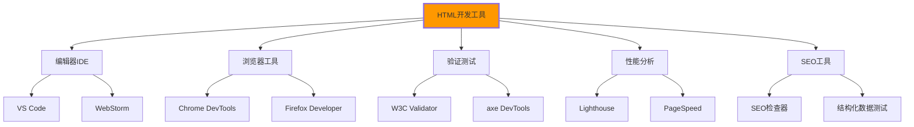

# HTML开发工具推荐

## 🛠️ 必需开发工具生态

### 📊 HTML开发工具矩阵



## 💻 编辑器与IDE

### 🎯 Visual Studio Code套装

| 扩展名 | 功能描述 | 评级 |
|--------|----------|------|
| **HTML Snippets** | 现代HTML标签自动补全 | ⭐⭐⭐⭐⭐ |
| **HTML CSS Support** | CSS智能感知和补全 | ⭐⭐⭐⭐ |
| **Emmet** | HTML快速代码生成 | ⭐⭐⭐⭐⭐ |
| **Auto Rename Tag** | 标签自动重命名 | ⭐⭐⭐⭐ |
| **Bracket Pair Colorizer** | 括号配对着色 | ⭐⭐⭐ |
| **HTML Preview** | 实时HTML预览 | ⭐⭐⭐ |
| **Live Server** | 本地服务器热重载 | ⭐⭐⭐⭐⭐ |

### 🔧 WebStorm专业版功能

```html
<!-- WebStorm智能提示示例 -->
<html>
<head>
    <!-- IDE会提供智能提示 -->
    <title>页面标题</title>
    <!-- CSS类名自动补全 -->
    <link rel="stylesheet" href="styles.css">
</head>
<body>
    <!-- HTML结构提示和错误检查 -->
    <nav class="navigation">
        <!-- JavaScript数据绑定提示 -->
        <ul class="menu" data-menuitems="{menu}">
            <!-- TODO注释自动跟踪 -->
            <li><a href="/">首页</a></li>
            <!-- TODO: 添加产品链接 -->
            <li><a href="/about">关于我们</a></li>
        </ul>
    </nav>
</body>
</html>
```

### 🌟 Sublime Text高配置

**Sublime Text HTML插件包**：

```json
// User/Preferences.sublime-settings
{
    "auto_complete": true,
    "tab_completion": false,
    "smart_indent": true,
    "trim_automatic_white_space": true,
    "ensure_newline_at_eof_on_save": true,
    "default_encoding": "UTF-8",
    "font_face": "FiraCode",
    "font_size": 14
}
```

| 插件名 | 功能 | 快捷键 |
|--------|------|--------|
| **Emmet** | HTML标签快速生成 | `Tab` |
| **HTML-CSS-JS Prettify** | 代码格式化 | `Ctrl+Shift+H` |
| **BracketHighlighter** | 括号高亮 | 自动 |
| **GitGutter** | Git变更标记 | 自动 |
| **Color Highlighter** | 颜色值高亮 | 自动 |

## 🔍 HTML验证与调试工具

### ✅ W3C Markup Validator

**在线验证**：`https://validator.w3.org/`

```bash
# 命令行验证工具安装
npm install -g html-validate

# 验证HTML文件
html-validate index.html

# 配置文件：.htmlvalidate.json
{
    "rules": {
        "no-missing-alt": "error",
        "no-redundant-for": "error",
        "require-sri": "warn",
        "no-implicit-close": "error"
    }
}
```

### ♿ 可访问性检测工具

**axe DevTools使用**：

```javascript
// 浏览器控制台中运行
axe.run({
    exclude: ['.advertisement', '[data-testid="ignore-section"]']
}).then(results => {
    console.log('无障碍问题:', results.violations);
    results.violations.forEach(violation => {
        console.log(`问题: ${violation.description}`);
        console.log(`元素: ${violation.nodes[0].target}`);
        console.log(`解决方案: ${violation.help}`);
    });
});

// Chrome扩展：axe DevTools自动检测
// Firefox扩展：axe DevTools
```

| 工具名 | 检测范围 | 免费/付费 |
|--------|----------|----------|
| **axe DevTools** | WCAG 2.1 AA | 免费 |
| **WAVE** | Web无障碍评估 | 免费 |
| **Lighthouse可访问性** | 综合检测 | 免费 |
| **AChecker** | 在线检测工具 | 免费 |
| **Tenon** | 企业级检测 | 付费 |

## ⚡ 性能分析工具

### 🚀 Lighthouse审计套件

**Chrome DevTools集成**：

```bash
# 使用Google PageSpeed Insights API
curl -X POST -H "Content-Type: application/json" \
  -d '{"url":"https://example.com"}' \
  "https://www.googleapis.com/pagespeedonline/v5/runPagespeed"

# CLI命令安装
npm install -g @lhci/cli

# 本地审计
lighthouse https://example.com --chrome-flags="--headless" --output=html --output-path=./report.html
```

**Core Web Vitals监控**：

```javascript
// Web Vitals监控脚本
import {getLCP, getFID, getCLS} from 'web-vitals';

function sendToAnalytics(metric) {
    // 发送到分析平台
    ga('send', 'event', 'Web Vitals', metric.name, metric.value);
}

getLCP(sendToAnalytics);
getFID(sendToAnalytics);  
getCLS(sendToAnalytics);
```

### 📊 性能测试工具对比

| 工具 | 特点 | 最佳适用场墨 |
|------|------|-------------|
| **Google PageSpeed Insights** | Google官方，权威性高 | SEO优化验证 |
| **GTmetrix** | 详细报告，A/B测试 | 性能对比分析 |
| **WebPageTest** | 多地点测试，瀑布图详细 | 全球性能分析 |
| **Pingdom** | 持续监控，警报功能 | 生产环境监控 |
| **Calibre** | 人工和自动化综合 | 全面性能审计 |

## 🔍 SEO检测工具

### 📈 SEO分析套件

**Google Search Console集成**：

```html
<!-- 网站验证代码 -->
<meta name="google-site-verification" content="your-verification-code">
```

**结构化数据测试工具**：

```javascript
// JSON-LD结构化数据检测
const schemaTestData = {
    "@context": "https://schema.org",
    "@type": "WebPage",
    "name": "页面标题",
    "description": "页面描述",
    "url": "https://example.com/page"
};

// Google结构化数据测试工具验证
fetch('https://search.google.com/test/rich-results', {
    method: 'POST',
    body: JSON.stringify(schemaTestData)
}).then(response => response.json())
  .then(data => console.log('结构化数据测试结果:', data));
```

| SEO工具 | 功能特点 | 推荐指数 |
|---------|----------|----------|
| **Google Search Console** | 官方SEO数据 | ⭐⭐⭐⭐⭐ |
| **Screaming Frog SEO** | 综合爬虫分析 | ⭐⭐⭐⭐⭐ |
| **Ahrefs** | 链接和关键词分析 | ⭐⭐⭐⭐ |
| **SEMrush** | 竞品比较分析 | ⭐⭐⭐⭐ |
| **Schema.org测试器** | 结构化数据验证 | ⭐⭐⭐⭐⭐ |

## 🎨 设计与原型工具

### 🎯 设计体系工具

**Figma HTML标注插件**：

```css
/* Figma生成的CSS代码 */
.button-primary {
    background-color: #0066CC;
    border-radius: 8px;
    color: #FFFFFF;
    font-family: 'PingFang SC', sans-serif;
    font-size: 16px;
    font-weight: 500;
    height: 48px;
    width: auto;
}
```

**Adobe XD开发交接**：

| 设计元素 | 转换为HTML | CSS属性 |
|----------|------------|----------|
| 矩形 → | `<div>` | `background-color`, `width`, `height` |
| 文字 → | `<p>`, `<h1-h6>` | `font-family`, `font-size`, `color` |
| 图片 → | `` | `src`, `alt`, `width`, `height` |
| 按钮 → | `<button>` | `background`, `border-radius`, `padding` |

### 🔧 协作开发工具

**Git + GitHub集成**：

```bash
# HTML项目Git配置
git init
git add .
git commit -m "初始HTML项目结构"
git remote add origin https://github.com/username/html-project.git
git push -u origin main

# .gitignore配置
echo "node_modules/" >> .gitignore
echo ".DS_Store" >> .gitignore  
echo "*.log" >> .gitignore
```

## 🔧 构建和部署工具

### ⚡ 现代构建工具链

**Vite HTML开发环境**：

```javascript
// vite.config.js
export default {
    plugins: [
        html({
            minify: {
                removeComments: true,
                collapseWhitespace: true,
                removeAttributeQuotes: true
            }
        })
    ],
    build: {
        rollupOptions: {
            input: 'index.html'
        }
    }
}
```

**Webpack HTML处理**：

```javascript
// webpack.config.js
module.exports = {
    module: {
        rules: [
            {
                test: /\.html$/,
                use: {
                    loader: 'html-loader',
                    options: {
                        minimize: true,
                        removeComments: true,
                        collapseWhitespace: true
                    }
                }
            }
        ]
    }
}
```

| 工具类型 | 工具名 | 优势 | 学习曲线 |
|----------|--------|------|----------|
| **构建工具** | Vite | 快速热重载 | 简单 |
| **构建工具** | Webpack | 高度可配置 | 中等 |
| **任务运行器** | Gulp | 流式处理 | 简单 |
| **包管理器** | npm/yarn | 生态系统完善 | 简单 |
| **代码检查** | ESLint + html plugin | 规则可配置 | 中等 |

---

**🚀 工具使用建议**：
1. **新手阶段**：VS Code + Chrome DevTools + W3C Validator
2. **进阶阶段**：WebStorm + Lighthouse + axe DevTools  
3. **专业阶段**：自定义工具链 + CI/CD集成 + 性能监控
4. **团队协作**：统一开发环境 + 代码规范 + 自动化检测
