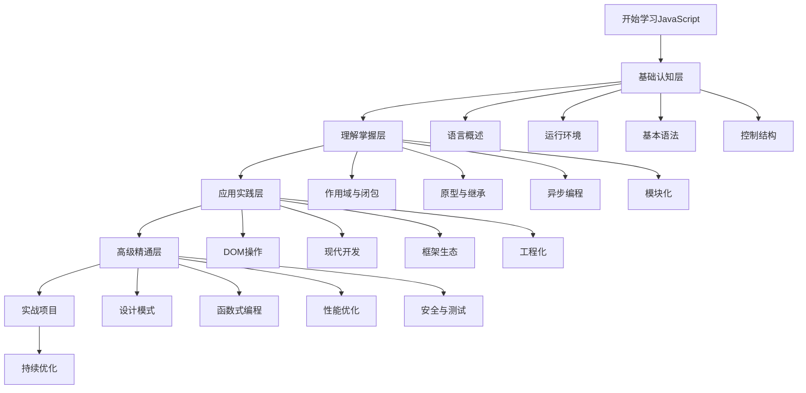

# JavaScript学习路径图

## 学习路径概览

## 学习阶段规划

### 第一阶段：基础认知层 (2-3周)
- **目标**: 建立JavaScript基础概念
- **重点**: 语法规则、数据类型、控制结构
- **实践**: 基础语法练习
- **检查点**: [[00-学习指南/05-学习检查清单#基础认知层检查]]

### 第二阶段：理解掌握层 (3-4周)
- **目标**: 深入理解JavaScript核心机制
- **重点**: 作用域、原型、异步、模块化
- **实践**: 概念验证项目
- **检查点**: [[00-学习指南/05-学习检查清单#理解掌握层检查]]

### 第三阶段：应用实践层 (4-6周)
- **目标**: 掌握实际开发技能
- **重点**: DOM操作、现代开发、框架使用
- **实践**: 完整项目开发
- **检查点**: [[00-学习指南/05-学习检查清单#应用实践层检查]]

### 第四阶段：高级精通层 (持续学习)
- **目标**: 成为JavaScript专家
- **重点**: 设计模式、性能优化、架构设计
- **实践**: 开源项目贡献
- **检查点**: [[00-学习指南/05-学习检查清单#高级精通层检查]]

## 学习建议

### 费曼学习法应用
1. **概念解释**: 用自己的话解释每个概念
2. **简化表达**: 用最简单的语言描述复杂概念
3. **类比理解**: 用生活中的例子理解抽象概念
4. **教学他人**: 尝试向他人解释所学内容

### 刻意练习策略
1. **目标明确**: 每次学习都有具体目标
2. **及时反馈**: 通过代码运行获得即时反馈
3. **突破舒适区**: 挑战稍微超出当前能力的内容
4. **持续改进**: 定期回顾和优化学习方法

## 相关链接
- [[00-学习指南/02-知识体系总览]] - 完整知识地图
- [[00-学习指南/03-学习建议]] - 详细学习策略
- [[00-学习指南/04-进度跟踪]] - 学习进度管理
- [[00-学习指南/05-学习检查清单]] - 各阶段检查标准
