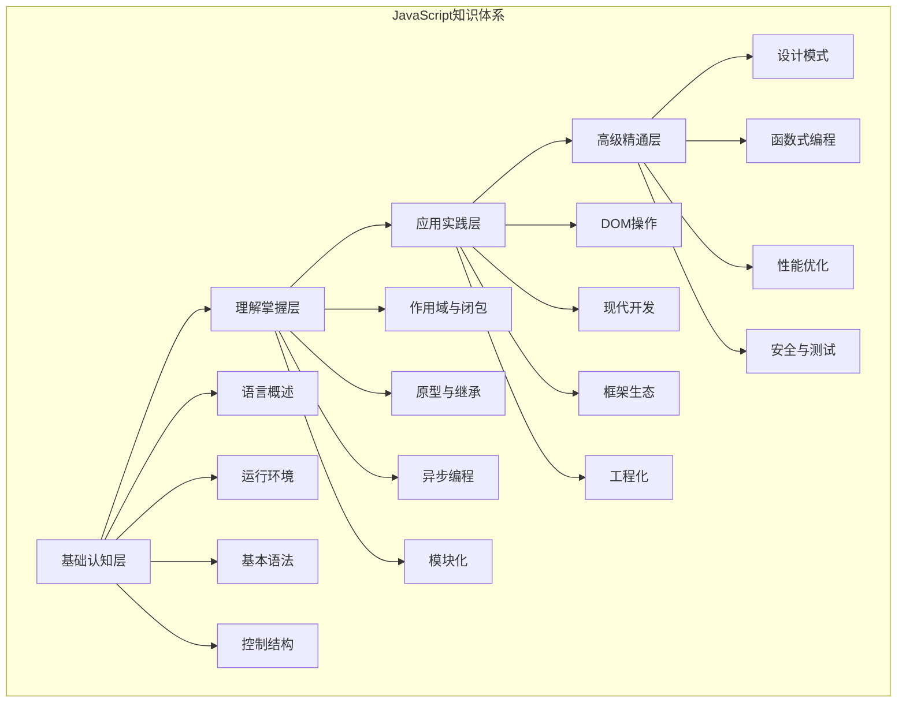
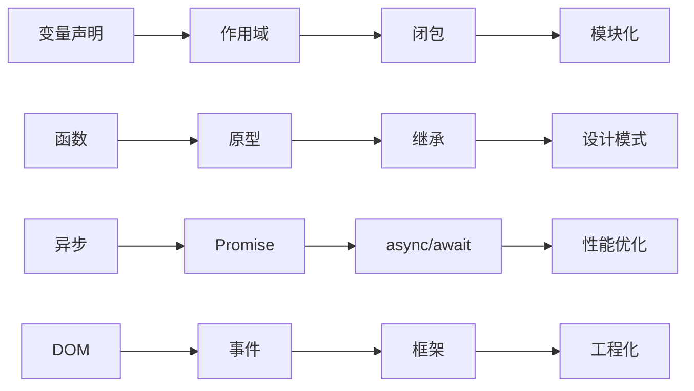

# JavaScript知识体系总览

## 知识体系架构

## 知识层级详解

### 基础认知层 (Foundation Layer)
**目标**: 建立JavaScript基础认知框架

| 模块 | 核心概念 | 学习重点 | 实践目标 |
|------|----------|----------|----------|
| [[01-基础认知层/01-语言概述]] | 语言特性、版本演进 | 理解JavaScript本质 | 掌握语言发展脉络 |
| [[01-基础认知层/02-运行环境]] | 浏览器、Node.js | 环境差异理解 | 配置开发环境 |
| [[01-基础认知层/03-基本语法]] | 变量、数据类型、运算符 | 语法规则掌握 | 编写基础代码 |
| [[01-基础认知层/04-控制结构]] | 条件、循环、跳转 | 程序流程控制 | 实现逻辑判断 |

### 理解掌握层 (Understanding Layer)
**目标**: 深入理解JavaScript核心机制

| 模块 | 核心概念 | 学习重点 | 实践目标 |
|------|----------|----------|----------|
| [[02-理解掌握层/01-作用域与闭包]] | 作用域链、闭包机制 | 内存管理理解 | 避免内存泄漏 |
| [[02-理解掌握层/02-原型与继承]] | 原型链、继承模式 | 面向对象理解 | 设计类继承 |
| [[02-理解掌握层/03-异步编程]] | Promise、async/await | 异步处理机制 | 处理异步操作 |
| [[02-理解掌握层/04-模块化]] | ES6模块、加载机制 | 代码组织方式 | 模块化开发 |

### 应用实践层 (Application Layer)
**目标**: 掌握实际开发技能

| 模块 | 核心概念 | 学习重点 | 实践目标 |
|------|----------|----------|----------|
| [[03-应用实践层/01-DOM操作]] | DOM API、事件处理 | 页面交互实现 | 动态页面开发 |
| [[03-应用实践层/02-现代开发]] | ES6+、TypeScript | 现代语法使用 | 类型安全开发 |
| [[03-应用实践层/03-框架生态]] | React、Vue、Angular | 框架选择使用 | 单页应用开发 |
| [[03-应用实践层/04-工程化]] | 构建工具、代码规范 | 开发流程优化 | 工程化项目 |

### 高级精通层 (Mastery Layer)
**目标**: 成为JavaScript专家

| 模块 | 核心概念 | 学习重点 | 实践目标 |
|------|----------|----------|----------|
| [[04-高级精通层/01-设计模式]] | 创建型、结构型、行为型 | 代码设计优化 | 架构设计能力 |
| [[04-高级精通层/02-函数式编程]] | 纯函数、高阶函数 | 函数式思维 | 函数式开发 |
| [[04-高级精通层/03-性能优化]] | 内存管理、性能监控 | 性能调优技能 | 高性能应用 |
| [[04-高级精通层/04-安全与测试]] | 安全防护、测试策略 | 质量保证体系 | 企业级开发 |

## 知识点关联图

## 学习路径建议

### 线性学习路径
1. **基础认知层** → **理解掌握层** → **应用实践层** → **高级精通层**
2. 适合：初学者、系统性学习

### 项目驱动路径
1. **基础认知层** → **应用实践层** → **理解掌握层** → **高级精通层**
2. 适合：有编程基础、实践导向

### 问题驱动路径
1. **应用实践层** → **理解掌握层** → **基础认知层** → **高级精通层**
2. 适合：有经验开发者、问题解决导向

## 相关链接
- [[计算机/开发学习/语言/Javascript/00-学习指南/01-学习路径图]] - 详细学习路径
- [[00-学习指南/03-学习建议]] - 学习策略建议
- [[00-学习指南/04-进度跟踪]] - 进度管理工具
- [[00-学习指南/05-学习检查清单]] - 学习检查标准
