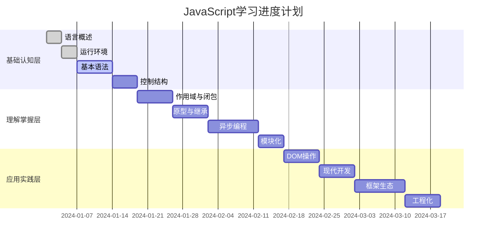
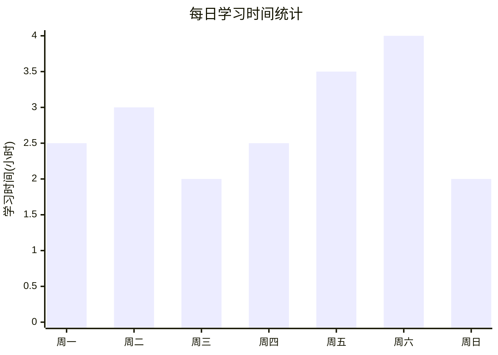
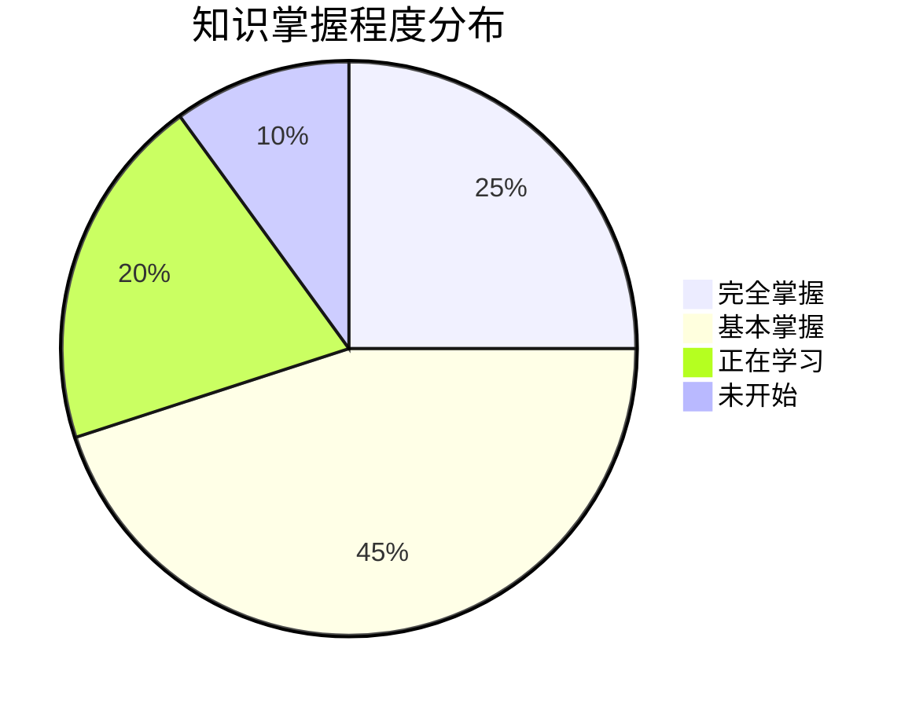

# JavaScript学习进度跟踪

## 学习进度总览

### 整体进度

## 学习进度记录

### 基础认知层进度
| 模块 | 状态 | 开始日期 | 完成日期 | 学习时长 | 掌握程度 |
|------|------|----------|----------|----------|----------|
| [[01-基础认知层/01-语言概述]] | ✅ 已完成 | 2024-01-01 | 2024-01-03 | 6小时 | 90% |
| [[01-基础认知层/02-运行环境]] | ✅ 已完成 | 2024-01-04 | 2024-01-06 | 8小时 | 85% |
| [[01-基础认知层/03-基本语法]] | 🔄 进行中 | 2024-01-07 | - | 12小时 | 70% |
| [[01-基础认知层/04-控制结构]] | ⏳ 待开始 | - | - | 0小时 | 0% |

### 理解掌握层进度
| 模块 | 状态 | 开始日期 | 完成日期 | 学习时长 | 掌握程度 |
|------|------|----------|----------|----------|----------|
| [[02-理解掌握层/01-作用域与闭包]] | ⏳ 待开始 | - | - | 0小时 | 0% |
| [[02-理解掌握层/02-原型与继承]] | ⏳ 待开始 | - | - | 0小时 | 0% |
| [[02-理解掌握层/03-异步编程]] | ⏳ 待开始 | - | - | 0小时 | 0% |
| [[02-理解掌握层/04-模块化]] | ⏳ 待开始 | - | - | 0小时 | 0% |

### 应用实践层进度
| 模块 | 状态 | 开始日期 | 完成日期 | 学习时长 | 掌握程度 |
|------|------|----------|----------|----------|----------|
| [[03-应用实践层/01-DOM操作]] | ⏳ 待开始 | - | - | 0小时 | 0% |
| [[03-应用实践层/02-现代开发]] | ⏳ 待开始 | - | - | 0小时 | 0% |
| [[03-应用实践层/03-框架生态]] | ⏳ 待开始 | - | - | 0小时 | 0% |
| [[03-应用实践层/04-工程化]] | ⏳ 待开始 | - | - | 0小时 | 0% |

## 学习时间统计

### 每日学习时间

### 每周学习总结
| 周次 | 学习时长 | 完成模块 | 主要收获 | 遇到问题 |
|------|----------|----------|----------|----------|
| 第1周 | 18小时 | 语言概述、运行环境 | 建立JavaScript基础认知 | 环境配置复杂 |
| 第2周 | 22小时 | 基本语法(进行中) | 掌握变量和数据类型 | 类型转换理解困难 |
| 第3周 | - | - | - | - |

## 学习效果评估

### 知识掌握程度

### 技能水平评估
| 技能领域 | 当前水平 | 目标水平 | 差距分析 | 改进计划 |
|----------|----------|----------|----------|----------|
| 基础语法 | 中级 | 高级 | 需要加强实践 | 增加代码练习 |
| 异步编程 | 初级 | 高级 | 概念理解不足 | 深入学习Promise |
| DOM操作 | 初级 | 中级 | 缺乏实践经验 | 完成DOM项目 |
| 框架使用 | 初级 | 中级 | 需要选择框架 | 学习React基础 |

## 学习计划调整

### 原计划 vs 实际进度
| 阶段 | 计划时间 | 实际时间 | 偏差 | 调整建议 |
|------|----------|----------|------|----------|
| 基础认知层 | 2周 | 2.5周 | +0.5周 | 加快后续学习节奏 |
| 理解掌握层 | 3周 | - | - | 保持原计划 |
| 应用实践层 | 4周 | - | - | 适当延长实践时间 |

### 学习策略优化
1. **时间管理**: 增加每日学习时间至3小时
2. **实践强化**: 每个概念都要有代码实践
3. **复习机制**: 每周复习前一周内容
4. **项目驱动**: 尽早开始实际项目开发

## 学习资源使用

### 资源使用统计
| 资源类型 | 使用频率 | 效果评价 | 推荐指数 |
|----------|----------|----------|----------|
| MDN文档 | 每日 | ⭐⭐⭐⭐⭐ | 必读 |
| 在线练习 | 每周 | ⭐⭐⭐⭐ | 推荐 |
| 视频教程 | 偶尔 | ⭐⭐⭐ | 辅助 |
| 技术博客 | 每周 | ⭐⭐⭐⭐ | 推荐 |

### 学习工具效率
- **VS Code**: 主要开发环境，效率高
- **Chrome DevTools**: 调试必备，学习效果好
- **Obsidian**: 笔记管理，知识关联性强
- **GitHub**: 代码管理，版本控制

## 相关链接
- [[计算机/开发学习/语言/Javascript/00-学习指南/01-学习路径图]] - 学习路径规划
- [[00-学习指南/02-知识体系总览]] - 知识体系架构
- [[00-学习指南/03-学习建议]] - 学习策略建议
- [[00-学习指南/05-学习检查清单]] - 学习检查标准
