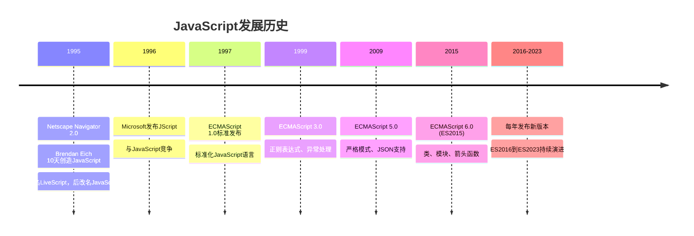
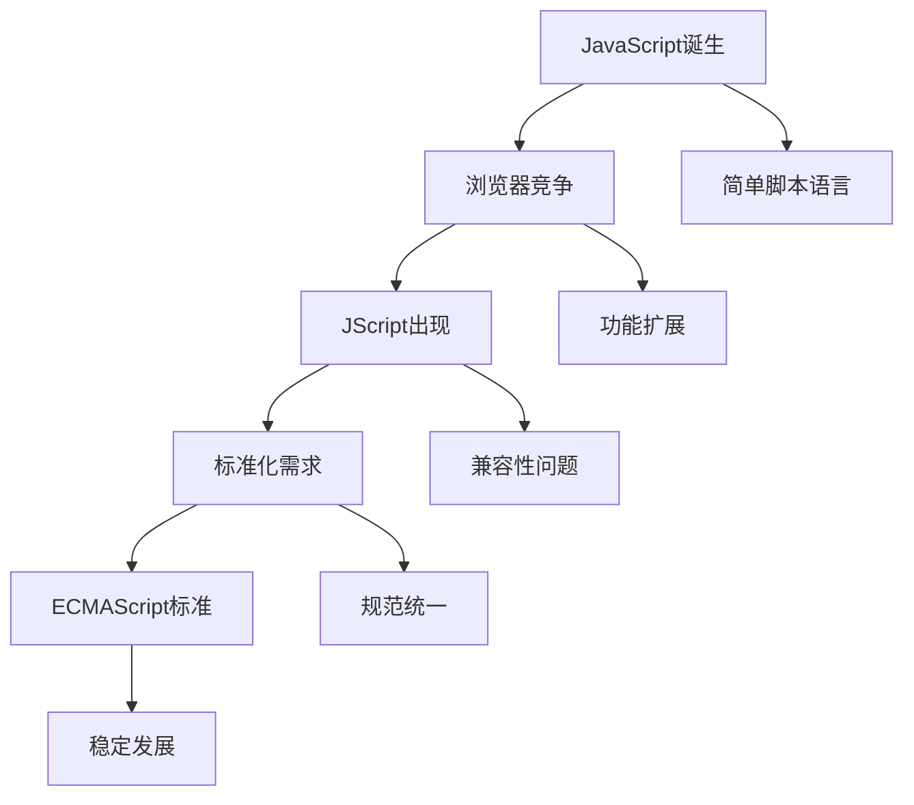

# JavaScript发展历史

## 历史时间线

## 关键历史节点

### 1995年：JavaScript诞生
**背景**: 互联网快速发展，需要动态网页交互
**创造者**: Brendan Eich (Netscape公司)
**设计目标**: 
- 简单易学的脚本语言
- 能够操作DOM元素
- 提供基本的编程功能

**重要特点**:
- 10天内完成设计
- 借鉴了Java、C、Scheme等语言特性
- 最初名为LiveScript，后改名JavaScript

### 1997年：ECMAScript标准化
**标准化组织**: ECMA International
**标准名称**: ECMA-262
**重要意义**: 
- 统一了JavaScript语言规范
- 避免了浏览器兼容性问题
- 为后续发展奠定基础

### 2009年：ES5发布
**主要特性**:
- 严格模式 (strict mode)
- JSON对象支持
- 数组方法增强
- 函数绑定 (bind)

**影响**: 成为现代JavaScript的基础

### 2015年：ES6 (ES2015) 革命
**重大变革**:
- 类 (class) 语法
- 模块 (module) 系统
- 箭头函数
- 解构赋值
- Promise对象
- 模板字符串

**意义**: 标志着JavaScript进入现代发展阶段

## 版本演进对比

| 版本 | 发布时间 | 主要特性 | 影响程度 |
|------|----------|----------|----------|
| ES1 | 1997 | 基础语法 | 奠定基础 |
| ES2 | 1998 | 国际化支持 | 影响较小 |
| ES3 | 1999 | 正则表达式、异常处理 | 重要更新 |
| ES4 | 废弃 | 过于激进 | 未发布 |
| ES5 | 2009 | 严格模式、JSON | 现代基础 |
| ES6 | 2015 | 类、模块、箭头函数 | 革命性更新 |
| ES2016+ | 2016-2023 | 渐进式改进 | 持续优化 |

## 技术发展脉络

### 早期阶段 (1995-2005)

**特点**:
- 主要用于简单的网页交互
- 浏览器兼容性问题严重
- 缺乏统一的开发工具

### 成熟阶段 (2005-2015)
**重要事件**:
- Ajax技术兴起
- jQuery库流行
- Node.js出现
- 前端工程化开始

**技术特点**:
- 从脚本语言发展为编程语言
- 开始用于复杂应用开发
- 工具链逐渐完善

### 现代阶段 (2015-至今)
**技术革命**:
- ES6+语法现代化
- 前端框架生态繁荣
- 全栈开发能力
- 移动端开发支持

## 影响JavaScript发展的关键人物

### Brendan Eich
- **贡献**: JavaScript语言创造者
- **影响**: 奠定了JavaScript的基础设计
- **现状**: 继续参与Web标准制定

### Douglas Crockford
- **贡献**: JSON格式发明者
- **影响**: 推动了JavaScript的标准化
- **著作**: 《JavaScript: The Good Parts》

### Ryan Dahl
- **贡献**: Node.js创造者
- **影响**: 将JavaScript扩展到服务器端
- **意义**: 实现了JavaScript全栈开发

## 相关链接
- [[01-基础认知层/01-语言概述/02-语言特性与优势]] - JavaScript语言特点
- [[01-基础认知层/01-语言概述/03-与其他语言对比]] - 语言对比分析
- [[01-基础认知层/01-语言概述/04-版本演进(ES5-ES2023)]] - 详细版本特性
- [[01-基础认知层/01-语言概述/05-版本兼容性指南]] - 兼容性解决方案
