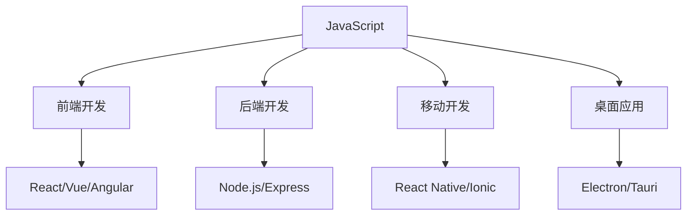
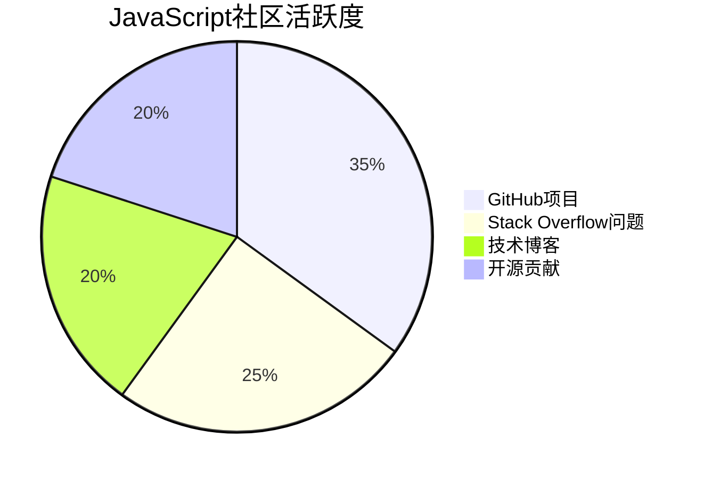

# JavaScript语言特性与优势

## 核心语言特性

### 1. 动态类型系统
```javascript
// 变量类型在运行时确定
let variable = 42;        // number
variable = "Hello";       // string
variable = true;          // boolean
variable = { name: "JS" }; // object
```

**特点**:
- 运行时类型检查
- 类型自动转换
- 灵活性高，开发效率快

### 2. 原型继承机制
```javascript
// 基于原型的继承
function Person(name) {
    this.name = name;
}

Person.prototype.greet = function() {
    return `Hello, I'm ${this.name}`;
};

const person = new Person("Alice");
console.log(person.greet()); // "Hello, I'm Alice"
```

**特点**:
- 灵活的继承方式
- 动态添加属性和方法
- 内存效率高

### 3. 函数式编程支持
```javascript
// 高阶函数
const numbers = [1, 2, 3, 4, 5];
const doubled = numbers.map(x => x * 2);
const filtered = numbers.filter(x => x > 2);

// 闭包
function createCounter() {
    let count = 0;
    return function() {
        return ++count;
    };
}
```

**特点**:
- 函数是一等公民
- 支持闭包
- 函数式编程范式

### 4. 异步编程模型
```javascript
// Promise
fetch('/api/data')
    .then(response => response.json())
    .then(data => console.log(data))
    .catch(error => console.error(error));

// async/await
async function fetchData() {
    try {
        const response = await fetch('/api/data');
        const data = await response.json();
        return data;
    } catch (error) {
        console.error(error);
    }
}
```

**特点**:
- 非阻塞I/O操作
- 事件驱动编程
- 支持并发处理

## 语言优势分析

### 1. 全栈开发能力


**优势**:
- 一套语言，多端开发
- 代码复用率高
- 学习成本相对较低

### 2. 生态系统丰富
| 领域 | 主要工具/框架 | 优势 |
|------|---------------|------|
| 前端框架 | React, Vue, Angular | 组件化开发 |
| 构建工具 | Webpack, Vite, Rollup | 模块化打包 |
| 测试框架 | Jest, Mocha, Cypress | 完整测试方案 |
| 开发工具 | ESLint, Prettier, TypeScript | 代码质量保证 |

### 3. 社区活跃度高


**优势**:
- 问题解决资源丰富
- 持续的技术更新
- 大量的学习资源

### 4. 性能持续优化
**V8引擎优化**:
- JIT编译技术
- 垃圾回收优化
- 内存管理改进

**性能对比**:
| 操作 | JavaScript | Python | Java |
|------|------------|--------|------|
| 数值计算 | 快 | 慢 | 快 |
| 字符串处理 | 快 | 中等 | 快 |
| 内存使用 | 中等 | 高 | 中等 |

## 语言设计哲学

### 1. 简单易学
```javascript
// 简单的语法
console.log("Hello World");

// 直观的对象操作
const obj = { name: "JS" };
obj.age = 25;
console.log(obj.name); // "JS"
```

### 2. 灵活性强
```javascript
// 多种编程范式
// 面向对象
class Calculator {
    add(a, b) { return a + b; }
}

// 函数式
const add = (a, b) => a + b;

// 过程式
function add(a, b) {
    return a + b;
}
```

### 3. 渐进增强
```javascript
// 基础功能
function basicFunction() {
    return "basic";
}

// 增强功能
function enhancedFunction() {
    return basicFunction() + " enhanced";
}
```

## 应用场景分析

### 1. Web前端开发
**优势**:
- 原生浏览器支持
- 丰富的DOM API
- 强大的事件处理

**应用**:
- 单页应用 (SPA)
- 响应式网页
- 交互式界面

### 2. 服务器端开发
**优势**:
- 非阻塞I/O
- 事件驱动架构
- 高并发处理

**应用**:
- Web API服务
- 实时应用
- 微服务架构

### 3. 移动应用开发
**优势**:
- 跨平台开发
- 热更新能力
- 开发效率高

**应用**:
- 混合应用
- 跨平台应用
- 快速原型开发

## 语言局限性

### 1. 类型安全
```javascript
// 运行时错误
let result = "5" + 3; // "53" (字符串)
let result2 = "5" - 3; // 2 (数字)
```

**解决方案**:
- TypeScript类型检查
- 严格模式使用
- 代码规范工具

### 2. 性能限制
**问题**:
- 解释执行速度
- 内存管理复杂
- 单线程限制

**优化**:
- Web Workers多线程
- 性能监控工具
- 代码优化技巧

## 相关链接
- [[01-基础认知层/01-语言概述/01-JavaScript发展历史]] - 历史发展脉络
- [[01-基础认知层/01-语言概述/03-与其他语言对比]] - 语言对比分析
- [[01-基础认知层/01-语言概述/04-版本演进(ES5-ES2023)]] - 版本特性演进
- [[01-基础认知层/01-语言概述/05-版本兼容性指南]] - 兼容性解决方案
