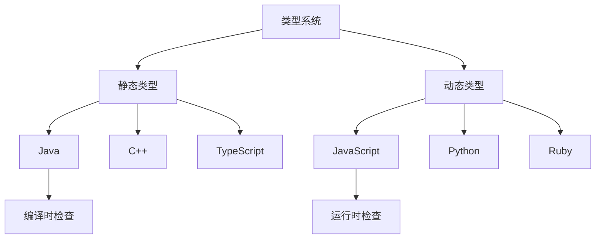
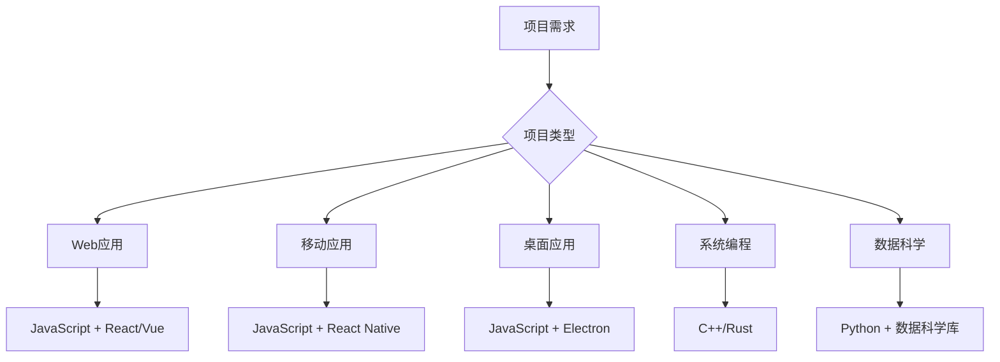

# JavaScript与其他语言对比

## 语言分类对比

### 编程范式支持
| 语言 | 面向对象 | 函数式 | 过程式 | 声明式 |
|------|----------|--------|--------|--------|
| JavaScript | ✅ | ✅ | ✅ | ✅ |
| Java | ✅ | ❌ | ✅ | ❌ |
| Python | ✅ | ✅ | ✅ | ❌ |
| C++ | ✅ | ❌ | ✅ | ❌ |
| Haskell | ❌ | ✅ | ❌ | ✅ |

### 类型系统对比


## 详细语言对比

### JavaScript vs Java

#### 语法对比
```javascript
// JavaScript
class Person {
    constructor(name) {
        this.name = name;
    }
    
    greet() {
        return `Hello, ${this.name}`;
    }
}

const person = new Person("Alice");
console.log(person.greet());
```

```java
// Java
public class Person {
    private String name;
    
    public Person(String name) {
        this.name = name;
    }
    
    public String greet() {
        return "Hello, " + name;
    }
}

Person person = new Person("Alice");
System.out.println(person.greet());
```

#### 特性对比表
| 特性 | JavaScript | Java | 优势方 |
|------|------------|------|--------|
| 类型系统 | 动态类型 | 静态类型 | 各有利弊 |
| 编译方式 | 解释执行 | 编译执行 | Java性能更好 |
| 内存管理 | 自动GC | 自动GC | 相当 |
| 跨平台 | 是 | 是 | 相当 |
| 学习曲线 | 简单 | 中等 | JavaScript |
| 企业应用 | 是 | 是 | Java更成熟 |

### JavaScript vs Python

#### 语法对比
```javascript
// JavaScript
const numbers = [1, 2, 3, 4, 5];
const doubled = numbers.map(x => x * 2);
const filtered = numbers.filter(x => x > 2);

// 异步处理
async function fetchData() {
    const response = await fetch('/api/data');
    return response.json();
}
```

```python
# Python
numbers = [1, 2, 3, 4, 5]
doubled = [x * 2 for x in numbers]
filtered = [x for x in numbers if x > 2]

# 异步处理
import asyncio
async def fetch_data():
    async with aiohttp.ClientSession() as session:
        async with session.get('/api/data') as response:
            return await response.json()
```

#### 应用场景对比
| 场景 | JavaScript | Python | 推荐选择 |
|------|------------|--------|----------|
| Web前端 | ✅ 原生支持 | ❌ 不适用 | JavaScript |
| Web后端 | ✅ Node.js | ✅ Django/Flask | 各有所长 |
| 数据科学 | ❌ 有限支持 | ✅ 生态丰富 | Python |
| 机器学习 | ❌ 支持有限 | ✅ 主流选择 | Python |
| 自动化脚本 | ✅ 跨平台 | ✅ 简洁易用 | Python |
| 移动开发 | ✅ React Native | ❌ 支持有限 | JavaScript |

### JavaScript vs C++

#### 性能对比

```mermaid
xychart-beta
    title "性能对比 (相对值)"
    x-axis ["启动时间", "内存使用", "执行速度", "开发效率"]
    y-axis "性能指标" 0 --> 100
    bar [20, 60, 30, 90]
    bar [80, 40, 95, 30]
```


#### 特性对比
| 特性 | JavaScript | C++ | 适用场景 |
|------|------------|-----|----------|
| 执行速度 | 中等 | 很快 | C++适合高性能计算 |
| 内存控制 | 自动管理 | 手动管理 | JavaScript更安全 |
| 类型安全 | 运行时检查 | 编译时检查 | C++更严格 |
| 开发效率 | 高 | 低 | JavaScript开发更快 |
| 系统编程 | 不支持 | 支持 | C++适合系统级开发 |
| Web开发 | 原生支持 | 需要框架 | JavaScript更适合 |

## 语言选择指南

### 项目类型选择


### 学习路径建议

#### 初学者路径
1. **JavaScript** → Web开发基础
2. **Python** → 数据科学和自动化
3. **Java/C++** → 系统编程和性能优化

#### 专业开发者路径
1. **JavaScript** → 全栈开发
2. **TypeScript** → 类型安全
3. **Go/Rust** → 系统编程
4. **Python** → 数据科学

## 语言生态系统对比

### 包管理器
| 语言 | 包管理器 | 包数量 | 更新频率 |
|------|----------|--------|----------|
| JavaScript | npm | 200万+ | 每日 |
| Python | pip | 40万+ | 每日 |
| Java | Maven | 50万+ | 每周 |
| C++ | Conan | 5万+ | 每月 |

### 开发工具
| 工具类型 | JavaScript | Python | Java | C++ |
|----------|------------|--------|------|-----|
| IDE | VS Code, WebStorm | PyCharm, VS Code | IntelliJ, Eclipse | Visual Studio, CLion |
| 调试器 | Chrome DevTools | pdb, PyCharm | JDB, IntelliJ | GDB, Visual Studio |
| 测试框架 | Jest, Mocha | pytest, unittest | JUnit, TestNG | Google Test, Catch2 |
| 代码检查 | ESLint | pylint, flake8 | Checkstyle, SpotBugs | cppcheck, clang-tidy |

## 性能基准测试

### 计算性能对比
```javascript
// JavaScript - 斐波那契数列
function fibonacci(n) {
    if (n <= 1) return n;
    return fibonacci(n - 1) + fibonacci(n - 2);
}
```

```python
# Python - 斐波那契数列
def fibonacci(n):
    if n <= 1:
        return n
    return fibonacci(n - 1) + fibonacci(n - 2)
```

```cpp
// C++ - 斐波那契数列
int fibonacci(int n) {
    if (n <= 1) return n;
    return fibonacci(n - 1) + fibonacci(n - 2);
}
```

**性能测试结果** (n=35):
| 语言 | 执行时间 | 内存使用 | 相对性能 |
|------|----------|----------|----------|
| C++ | 0.1s | 1MB | 100% |
| Python | 2.5s | 5MB | 4% |
| JavaScript | 0.8s | 3MB | 12.5% |

## 相关链接
- [[01-基础认知层/01-语言概述/01-JavaScript发展历史]] - 历史发展脉络
- [[01-基础认知层/01-语言概述/02-语言特性与优势]] - JavaScript特点分析
- [[01-基础认知层/01-语言概述/04-版本演进(ES5-ES2023)]] - 版本特性演进
- [[01-基础认知层/01-语言概述/05-版本兼容性指南]] - 兼容性解决方案
