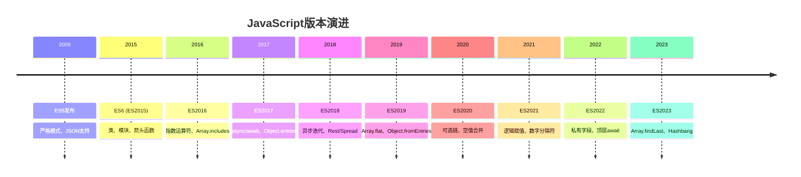

# JavaScript版本演进 (ES5-ES2023)

## 版本演进时间线



## ES5 (2009) - 现代基础

### 主要特性
```javascript
// 严格模式
"use strict";
function strictFunction() {
    // 更严格的错误检查
    undeclaredVariable = 42; // 抛出错误
}

// JSON支持
const data = JSON.parse('{"name": "John", "age": 30}');
const jsonString = JSON.stringify(data);

// 数组方法增强
const numbers = [1, 2, 3, 4, 5];
const doubled = numbers.map(x => x * 2);
const filtered = numbers.filter(x => x > 2);
const sum = numbers.reduce((acc, x) => acc + x, 0);

// 函数绑定
const obj = { name: "JavaScript" };
function greet() {
    return `Hello, ${this.name}`;
}
const boundGreet = greet.bind(obj);
```

### 重要改进
| 特性 | 描述 | 影响 |
|------|------|------|
| 严格模式 | 更严格的错误检查 | 提高代码质量 |
| JSON对象 | 原生JSON支持 | 简化数据交换 |
| 数组方法 | map, filter, reduce等 | 函数式编程支持 |
| 函数绑定 | bind方法 | 更好的this控制 |

## ES6 (ES2015) - 革命性更新

### 核心特性

#### 1. 类语法
```javascript
// ES6类
class Person {
    constructor(name, age) {
        this.name = name;
        this.age = age;
    }
    
    greet() {
        return `Hello, I'm ${this.name}`;
    }
    
    static createAdult(name) {
        return new Person(name, 18);
    }
}

class Student extends Person {
    constructor(name, age, grade) {
        super(name, age);
        this.grade = grade;
    }
    
    study() {
        return `${this.name} is studying`;
    }
}
```

#### 2. 模块系统
```javascript
// math.js
export const PI = 3.14159;
export function add(a, b) {
    return a + b;
}

export default class Calculator {
    multiply(a, b) {
        return a * b;
    }
}

// main.js
import Calculator, { PI, add } from './math.js';
const calc = new Calculator();
console.log(calc.multiply(2, 3)); // 6
```

#### 3. 箭头函数
```javascript
// 传统函数
function traditionalAdd(a, b) {
    return a + b;
}

// 箭头函数
const arrowAdd = (a, b) => a + b;

// 复杂箭头函数
const processData = (data) => {
    return data
        .filter(item => item.active)
        .map(item => ({
            ...item,
            processed: true
        }));
};
```

#### 4. 解构赋值
```javascript
// 数组解构
const [first, second, ...rest] = [1, 2, 3, 4, 5];

// 对象解构
const person = { name: "Alice", age: 30, city: "New York" };
const { name, age, city = "Unknown" } = person;

// 函数参数解构
function greet({ name, age }) {
    return `Hello, ${name}, you are ${age} years old`;
}
```

#### 5. Promise对象
```javascript
// Promise基础
const fetchData = () => {
    return new Promise((resolve, reject) => {
        setTimeout(() => {
            resolve("Data fetched successfully");
        }, 1000);
    });
};

// Promise链
fetchData()
    .then(data => {
        console.log(data);
        return "Processed: " + data;
    })
    .then(processedData => {
        console.log(processedData);
    })
    .catch(error => {
        console.error(error);
    });
```

### ES6特性对比表
| 特性类别 | 主要特性 | 重要性 | 使用频率 |
|----------|----------|--------|----------|
| 语法糖 | 类、箭头函数、解构 | ⭐⭐⭐⭐⭐ | 极高 |
| 模块系统 | import/export | ⭐⭐⭐⭐⭐ | 极高 |
| 异步处理 | Promise | ⭐⭐⭐⭐⭐ | 极高 |
| 数据结构 | Set、Map | ⭐⭐⭐⭐ | 高 |
| 字符串 | 模板字符串 | ⭐⭐⭐⭐ | 高 |

## ES2016-ES2019 - 渐进改进

### ES2016
```javascript
// 指数运算符
const power = 2 ** 8; // 256

// Array.includes
const fruits = ['apple', 'banana', 'orange'];
console.log(fruits.includes('apple')); // true
```

### ES2017
```javascript
// async/await
async function fetchUserData(userId) {
    try {
        const response = await fetch(`/api/users/${userId}`);
        const user = await response.json();
        return user;
    } catch (error) {
        console.error('Error fetching user:', error);
    }
}

// Object.entries
const obj = { a: 1, b: 2, c: 3 };
for (const [key, value] of Object.entries(obj)) {
    console.log(`${key}: ${value}`);
}
```

### ES2018
```javascript
// 异步迭代
async function* asyncGenerator() {
    yield 1;
    yield 2;
    yield 3;
}

for await (const value of asyncGenerator()) {
    console.log(value);
}

// Rest/Spread属性
const { a, b, ...rest } = { a: 1, b: 2, c: 3, d: 4 };
const newObj = { ...rest, e: 5 };
```

### ES2019
```javascript
// Array.flat
const nested = [1, [2, 3], [4, [5, 6]]];
const flattened = nested.flat(2); // [1, 2, 3, 4, 5, 6]

// Object.fromEntries
const entries = [['a', 1], ['b', 2], ['c', 3]];
const obj = Object.fromEntries(entries); // { a: 1, b: 2, c: 3 }
```

## ES2020-ES2023 - 现代特性

### ES2020
```javascript
// 可选链操作符
const user = {
    profile: {
        name: "John",
        address: {
            street: "123 Main St"
        }
    }
};

const street = user?.profile?.address?.street; // "123 Main St"
const phone = user?.profile?.phone; // undefined

// 空值合并操作符
const name = user?.name ?? "Anonymous";
const age = user?.age ?? 18;

// BigInt
const bigNumber = 123456789012345678901234567890n;
const anotherBig = BigInt("123456789012345678901234567890");
```

### ES2021
```javascript
// 逻辑赋值操作符
let x = 1;
x ||= 2; // x = 1 (因为x是真值)
x &&= 3; // x = 3
x ??= 4; // x = 3 (因为x不是null/undefined)

// 数字分隔符
const million = 1_000_000;
const binary = 0b1010_0001;
const hex = 0xFF_EC_DE_5E;
```

### ES2022
```javascript
// 私有字段
class BankAccount {
    #balance = 0;
    
    deposit(amount) {
        this.#balance += amount;
    }
    
    getBalance() {
        return this.#balance;
    }
}

// 顶层await
const data = await fetch('/api/data').then(r => r.json());
console.log(data);
```

### ES2023
```javascript
// Array.findLast
const numbers = [1, 2, 3, 4, 5, 4, 3, 2, 1];
const lastEven = numbers.findLast(x => x % 2 === 0); // 2

// Array.findLastIndex
const lastEvenIndex = numbers.findLastIndex(x => x % 2 === 0); // 7

// Hashbang语法
#!/usr/bin/env node
console.log("This is a Node.js script");
```

## 版本兼容性策略

### 浏览器支持情况
| 特性 | Chrome | Firefox | Safari | Edge |
|------|--------|---------|--------|------|
| ES6 | 51+ | 54+ | 10+ | 14+ |
| ES2017 | 55+ | 52+ | 10.1+ | 79+ |
| ES2020 | 80+ | 72+ | 13.1+ | 80+ |
| ES2022 | 84+ | 90+ | 15+ | 84+ |

### 兼容性解决方案
```javascript
// Babel转译
// 源代码 (ES2020)
const user = { name: "John" };
const name = user?.name ?? "Anonymous";

// 转译后 (ES5)
var user = { name: "John" };
var name = user != null ? user.name : "Anonymous";
```

## 相关链接
- [[01-基础认知层/01-语言概述/01-JavaScript发展历史]] - 历史发展脉络
- [[01-基础认知层/01-语言概述/02-语言特性与优势]] - JavaScript特点分析
- [[01-基础认知层/01-语言概述/03-与其他语言对比]] - 语言对比分析
- [[01-基础认知层/01-语言概述/05-版本兼容性指南]] - 兼容性解决方案
