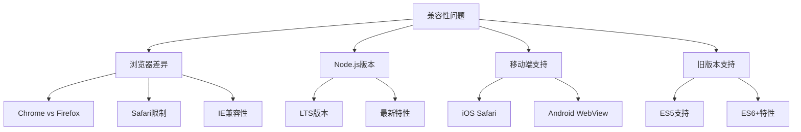
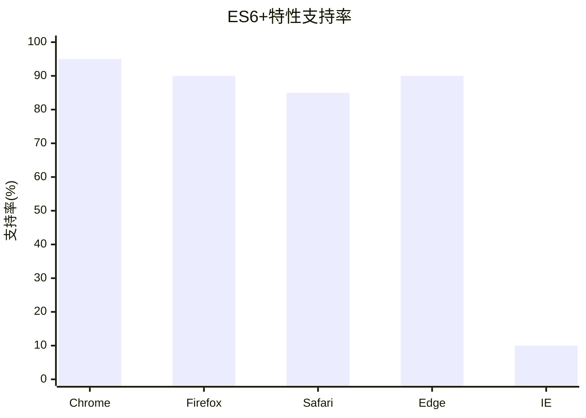

# JavaScript版本兼容性指南

## 兼容性问题概述

### 主要兼容性挑战


### 兼容性影响评估
| 问题类型 | 影响程度 | 解决难度 | 优先级 |
|----------|----------|----------|--------|
| 浏览器差异 | 高 | 中等 | 高 |
| 移动端支持 | 高 | 高 | 高 |
| 旧版本支持 | 中等 | 低 | 中等 |
| Node.js版本 | 低 | 低 | 低 |

## 浏览器兼容性

### 主流浏览器支持情况


### 关键特性兼容性表
| 特性 | Chrome | Firefox | Safari | Edge | IE | 移动端支持 |
|------|--------|---------|--------|------|----|-----------|
| ES6类 | 49+ | 45+ | 10+ | 13+ | ❌ | iOS 10+ |
| 箭头函数 | 45+ | 22+ | 10+ | 12+ | ❌ | iOS 10+ |
| Promise | 32+ | 29+ | 8+ | 12+ | ❌ | iOS 8+ |
| async/await | 55+ | 52+ | 10.1+ | 14+ | ❌ | iOS 10.3+ |
| 可选链 | 80+ | 72+ | 13.1+ | 80+ | ❌ | iOS 13.4+ |
| 空值合并 | 80+ | 72+ | 13.1+ | 80+ | ❌ | iOS 13.4+ |

### 兼容性检测方法
```javascript
// 特性检测
function supportsES6() {
    try {
        new Function('(a = 0) => a');
        return true;
    } catch (e) {
        return false;
    }
}

// 浏览器检测
function getBrowserInfo() {
    const ua = navigator.userAgent;
    const browsers = {
        Chrome: /Chrome\/(\d+)/,
        Firefox: /Firefox\/(\d+)/,
        Safari: /Version\/(\d+).*Safari/,
        Edge: /Edg\/(\d+)/,
        IE: /MSIE (\d+)|Trident.*rv:(\d+)/
    };
    
    for (const [name, regex] of Object.entries(browsers)) {
        const match = ua.match(regex);
        if (match) {
            return { name, version: match[1] || match[2] };
        }
    }
    return { name: 'Unknown', version: 'Unknown' };
}
```

## 解决方案策略

### 1. Polyfill方案
```javascript
// Promise polyfill
if (!window.Promise) {
    window.Promise = require('es6-promise').Promise;
}

// Array.includes polyfill
if (!Array.prototype.includes) {
    Array.prototype.includes = function(searchElement, fromIndex) {
        return this.indexOf(searchElement, fromIndex) !== -1;
    };
}

// Object.assign polyfill
if (!Object.assign) {
    Object.assign = function(target, ...sources) {
        sources.forEach(source => {
            Object.keys(source).forEach(key => {
                target[key] = source[key];
            });
        });
        return target;
    };
}
```

### 2. Babel转译
```javascript
// .babelrc配置
{
    "presets": [
        ["@babel/preset-env", {
            "targets": {
                "browsers": [
                    "> 1%",
                    "last 2 versions",
                    "not ie <= 8"
                ]
            },
            "useBuiltIns": "usage",
            "corejs": 3
        }]
    ],
    "plugins": [
        "@babel/plugin-proposal-optional-chaining",
        "@babel/plugin-proposal-nullish-coalescing-operator"
    ]
}
```

### 3. 条件加载
```javascript
// 动态导入
async function loadModernFeatures() {
    if (supportsES6()) {
        const { modernModule } = await import('./modern-module.js');
        return modernModule;
    } else {
        const { legacyModule } = await import('./legacy-module.js');
        return legacyModule;
    }
}

// 特性检测加载
function loadPolyfills() {
    const polyfills = [];
    
    if (!window.fetch) {
        polyfills.push(import('whatwg-fetch'));
    }
    
    if (!window.Promise) {
        polyfills.push(import('es6-promise'));
    }
    
    return Promise.all(polyfills);
}
```

## 移动端兼容性

### iOS Safari限制
```javascript
// iOS Safari特殊处理
const isIOS = /iPad|iPhone|iPod/.test(navigator.userAgent);
const isSafari = /Safari/.test(navigator.userAgent) && !/Chrome/.test(navigator.userAgent);

if (isIOS && isSafari) {
    // iOS Safari特殊处理
    document.addEventListener('touchstart', function() {}, { passive: true });
    
    // 修复iOS Safari的viewport问题
    const viewport = document.querySelector('meta[name="viewport"]');
    if (viewport) {
        viewport.content = 'width=device-width, initial-scale=1.0, maximum-scale=1.0, user-scalable=no';
    }
}
```

### Android WebView兼容性
```javascript
// Android WebView检测
const isAndroid = /Android/.test(navigator.userAgent);
const isWebView = /wv/.test(navigator.userAgent);

if (isAndroid && isWebView) {
    // Android WebView特殊处理
    // 禁用某些特性或提供替代方案
    if (!window.DeviceMotionEvent) {
        console.warn('DeviceMotionEvent not supported');
    }
}
```

## Node.js兼容性

### 版本支持策略
```javascript
// package.json engines字段
{
    "engines": {
        "node": ">=14.0.0",
        "npm": ">=6.0.0"
    }
}

// 运行时版本检查
const nodeVersion = process.version;
const majorVersion = parseInt(nodeVersion.slice(1).split('.')[0]);

if (majorVersion < 14) {
    console.error('Node.js version 14+ required');
    process.exit(1);
}
```

### LTS版本支持
| Node.js版本 | LTS状态 | ES6+支持 | 推荐使用 |
|-------------|---------|----------|----------|
| 16.x | LTS | 完整 | ✅ 推荐 |
| 18.x | LTS | 完整 | ✅ 最新 |
| 20.x | Current | 完整 | ⚠️ 测试中 |

## 兼容性测试

### 自动化测试
```javascript
// 兼容性测试套件
const compatibilityTests = {
    // ES6特性测试
    testES6Features() {
        const tests = [
            () => typeof Symbol !== 'undefined',
            () => typeof Map !== 'undefined',
            () => typeof Set !== 'undefined',
            () => typeof Promise !== 'undefined',
            () => typeof Proxy !== 'undefined'
        ];
        
        return tests.every(test => test());
    },
    
    // 现代API测试
    testModernAPIs() {
        const tests = [
            () => typeof fetch !== 'undefined',
            () => typeof IntersectionObserver !== 'undefined',
            () => typeof ResizeObserver !== 'undefined'
        ];
        
        return tests.every(test => test());
    }
};
```

### 手动测试清单
- [ ] 主流浏览器测试 (Chrome, Firefox, Safari, Edge)
- [ ] 移动端测试 (iOS Safari, Android Chrome)
- [ ] 旧版本浏览器测试 (IE11, 旧版Safari)
- [ ] 不同屏幕尺寸测试
- [ ] 网络环境测试 (慢网络, 离线)

## 最佳实践

### 1. 渐进增强
```javascript
// 基础功能
function basicFunction() {
    // 所有浏览器都支持的基础功能
    return "basic functionality";
}

// 增强功能
function enhancedFunction() {
    if (supportsES6()) {
        // 现代浏览器的高级功能
        return "enhanced functionality";
    }
    return basicFunction();
}
```

### 2. 优雅降级
```javascript
// 现代实现
async function modernFetch(url) {
    try {
        const response = await fetch(url);
        return await response.json();
    } catch (error) {
        throw new Error(`Fetch failed: ${error.message}`);
    }
}

// 降级实现
function legacyFetch(url) {
    return new Promise((resolve, reject) => {
        const xhr = new XMLHttpRequest();
        xhr.onreadystatechange = function() {
            if (xhr.readyState === 4) {
                if (xhr.status === 200) {
                    resolve(JSON.parse(xhr.responseText));
                } else {
                    reject(new Error(`XHR failed: ${xhr.status}`));
                }
            }
        };
        xhr.open('GET', url);
        xhr.send();
    });
}

// 自动选择
const fetchData = window.fetch ? modernFetch : legacyFetch;
```

### 3. 兼容性监控
```javascript
// 错误监控
window.addEventListener('error', function(event) {
    if (event.error && event.error.name === 'SyntaxError') {
        // 可能是兼容性问题
        console.warn('Possible compatibility issue:', event.error);
    }
});

// 性能监控
if (window.performance && window.performance.mark) {
    performance.mark('compatibility-check-start');
    // 执行兼容性检查
    performance.mark('compatibility-check-end');
    performance.measure('compatibility-check', 'compatibility-check-start', 'compatibility-check-end');
}
```

## 相关链接
- [[01-基础认知层/01-语言概述/01-JavaScript发展历史]] - 历史发展脉络
- [[01-基础认知层/01-语言概述/02-语言特性与优势]] - JavaScript特点分析
- [[01-基础认知层/01-语言概述/03-与其他语言对比]] - 语言对比分析
- [[01-基础认知层/01-语言概述/04-版本演进(ES5-ES2023)]] - 版本特性演进
