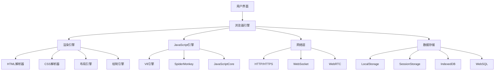
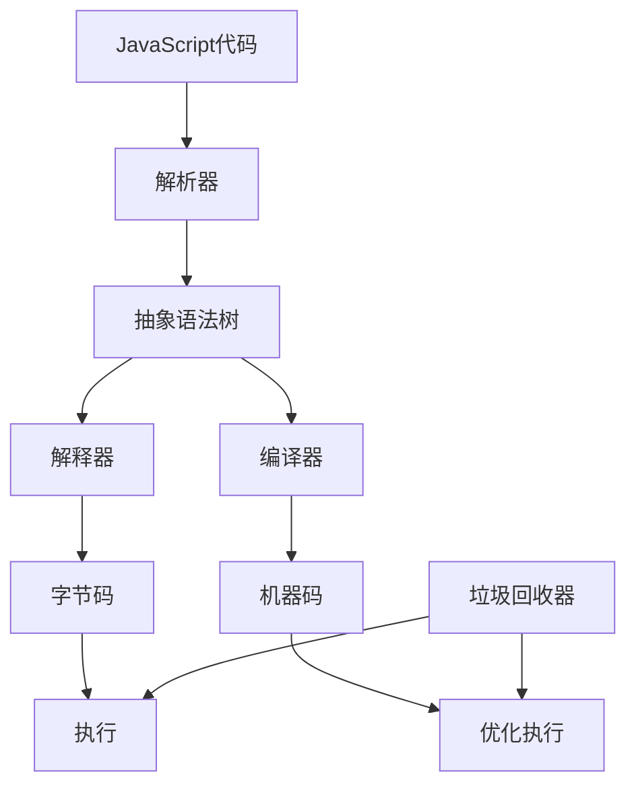

# 浏览器环境

## 浏览器架构概述

### 浏览器核心组件


### 主流浏览器引擎对比
| 浏览器 | 渲染引擎 | JavaScript引擎 | 市场份额 |
|--------|----------|----------------|----------|
| Chrome | Blink | V8 | 65% |
| Firefox | Gecko | SpiderMonkey | 8% |
| Safari | WebKit | JavaScriptCore | 19% |
| Edge | Blink | V8 | 4% |
| Opera | Blink | V8 | 2% |

## JavaScript引擎详解

### V8引擎架构


### 引擎优化技术
```javascript
// 1. 隐藏类优化
function Point(x, y) {
    this.x = x;
    this.y = y;
}

const p1 = new Point(1, 2);
const p2 = new Point(3, 4);
// V8会为Point创建隐藏类，提高属性访问速度

// 2. 内联缓存
function getProperty(obj, prop) {
    return obj[prop];
}
// 引擎会缓存属性访问路径

// 3. 即时编译 (JIT)
function hotFunction() {
    // 被频繁调用的函数会被编译为机器码
    return Math.random() * 100;
}
```

## 浏览器API概览

### DOM API
```javascript
// 元素选择
const element = document.getElementById('myId');
const elements = document.querySelectorAll('.myClass');

// 元素操作
element.textContent = 'Hello World';
element.style.color = 'red';
element.classList.add('active');

// 事件处理
element.addEventListener('click', function(event) {
    console.log('Clicked!', event.target);
});

// 创建元素
const newElement = document.createElement('div');
newElement.innerHTML = '<p>New content</p>';
document.body.appendChild(newElement);
```

### BOM API
```javascript
// 窗口操作
window.open('https://example.com', '_blank');
window.close();

// 定时器
const timeoutId = setTimeout(() => {
    console.log('Timeout executed');
}, 1000);

const intervalId = setInterval(() => {
    console.log('Interval executed');
}, 1000);

// 清除定时器
clearTimeout(timeoutId);
clearInterval(intervalId);

// 位置信息
console.log(window.location.href);
console.log(window.location.pathname);
console.log(window.location.search);

// 历史记录
window.history.back();
window.history.forward();
window.history.pushState({}, '', '/new-path');
```

### 存储API
```javascript
// LocalStorage
localStorage.setItem('key', 'value');
const value = localStorage.getItem('key');
localStorage.removeItem('key');
localStorage.clear();

// SessionStorage
sessionStorage.setItem('sessionKey', 'sessionValue');
const sessionValue = sessionStorage.getItem('sessionKey');

// IndexedDB
const request = indexedDB.open('MyDatabase', 1);
request.onupgradeneeded = function(event) {
    const db = event.target.result;
    const objectStore = db.createObjectStore('customers', { keyPath: 'id' });
    objectStore.createIndex('name', 'name', { unique: false });
};
```

## 浏览器安全模型

### 同源策略
```javascript
// 同源检查
function isSameOrigin(url1, url2) {
    const url1Obj = new URL(url1);
    const url2Obj = new URL(url2);
    
    return url1Obj.protocol === url2Obj.protocol &&
           url1Obj.hostname === url2Obj.hostname &&
           url1Obj.port === url2Obj.port;
}

// CORS跨域请求
fetch('https://api.example.com/data', {
    method: 'GET',
    headers: {
        'Content-Type': 'application/json',
    },
    credentials: 'include' // 包含cookie
})
.then(response => response.json())
.then(data => console.log(data));
```

### 内容安全策略 (CSP)
```html
<!-- HTML中的CSP -->
<meta http-equiv="Content-Security-Policy" 
      content="default-src 'self'; script-src 'self' 'unsafe-inline';">
```

```javascript
// JavaScript中的CSP检查
if (window.trustedTypes) {
    const policy = trustedTypes.createPolicy('myPolicy', {
        createHTML: (string) => {
            // 清理HTML内容
            return string.replace(/<script\b[^<]*(?:(?!<\/script>)<[^<]*)*<\/script>/gi, '');
        }
    });
}
```

## 浏览器性能优化

### 渲染优化
```javascript
// 1. 避免强制同步布局
function avoidForcedLayout() {
    // 错误做法
    element.style.width = '100px';
    const width = element.offsetWidth; // 强制布局
    
    // 正确做法
    element.style.width = '100px';
    requestAnimationFrame(() => {
        const width = element.offsetWidth; // 异步获取
    });
}

// 2. 使用DocumentFragment
function efficientDOMUpdate() {
    const fragment = document.createDocumentFragment();
    
    for (let i = 0; i < 1000; i++) {
        const div = document.createElement('div');
        div.textContent = `Item ${i}`;
        fragment.appendChild(div);
    }
    
    document.body.appendChild(fragment); // 一次性插入
}

// 3. 虚拟滚动
class VirtualScroll {
    constructor(container, itemHeight, items) {
        this.container = container;
        this.itemHeight = itemHeight;
        this.items = items;
        this.visibleItems = Math.ceil(container.clientHeight / itemHeight);
    }
    
    render(startIndex) {
        const endIndex = Math.min(startIndex + this.visibleItems, this.items.length);
        const visibleItems = this.items.slice(startIndex, endIndex);
        
        // 渲染可见项目
        this.container.innerHTML = '';
        visibleItems.forEach(item => {
            const element = document.createElement('div');
            element.textContent = item;
            this.container.appendChild(element);
        });
    }
}
```

### 内存管理
```javascript
// 1. 事件监听器清理
class Component {
    constructor() {
        this.handleClick = this.handleClick.bind(this);
        document.addEventListener('click', this.handleClick);
    }
    
    destroy() {
        document.removeEventListener('click', this.handleClick);
    }
    
    handleClick(event) {
        console.log('Clicked!');
    }
}

// 2. 定时器清理
class TimerManager {
    constructor() {
        this.timers = new Set();
    }
    
    setTimeout(callback, delay) {
        const id = setTimeout(() => {
            callback();
            this.timers.delete(id);
        }, delay);
        
        this.timers.add(id);
        return id;
    }
    
    clearAll() {
        this.timers.forEach(id => clearTimeout(id));
        this.timers.clear();
    }
}

// 3. 弱引用使用
const weakMap = new WeakMap();
const obj = { data: 'important' };
weakMap.set(obj, 'metadata');

// obj被垃圾回收时，weakMap中的条目也会被自动清理
```

## 浏览器调试工具

### Chrome DevTools
```javascript
// 1. 控制台调试
console.log('普通日志');
console.warn('警告信息');
console.error('错误信息');
console.table([{name: 'John', age: 30}, {name: 'Jane', age: 25}]);

// 2. 性能分析
console.time('operation');
// 执行操作
console.timeEnd('operation');

// 3. 内存分析
function analyzeMemory() {
    if (performance.memory) {
        console.log('Used:', performance.memory.usedJSHeapSize);
        console.log('Total:', performance.memory.totalJSHeapSize);
        console.log('Limit:', performance.memory.jsHeapSizeLimit);
    }
}

// 4. 网络监控
fetch('/api/data')
    .then(response => {
        console.log('Response time:', response.headers.get('X-Response-Time'));
        return response.json();
    })
    .then(data => console.log(data));
```

### 性能监控
```javascript
// 1. 页面加载性能
window.addEventListener('load', () => {
    const navigation = performance.getEntriesByType('navigation')[0];
    console.log('DOM Content Loaded:', navigation.domContentLoadedEventEnd - navigation.domContentLoadedEventStart);
    console.log('Load Complete:', navigation.loadEventEnd - navigation.loadEventStart);
});

// 2. 用户交互性能
function measureInteraction() {
    const start = performance.now();
    
    // 执行交互操作
    document.getElementById('button').click();
    
    const end = performance.now();
    console.log(`Interaction took ${end - start} milliseconds`);
}

// 3. 资源加载监控
const observer = new PerformanceObserver((list) => {
    list.getEntries().forEach((entry) => {
        console.log(`${entry.name}: ${entry.duration}ms`);
    });
});

observer.observe({ entryTypes: ['resource'] });
```

## 相关链接
- [[01-基础认知层/02-运行环境/02-Node.js环境]] - Node.js环境详解
- [[01-基础认知层/02-运行环境/03-执行引擎(V8)]] - V8引擎深入分析
- [[01-基础认知层/02-运行环境/04-环境差异对比]] - 环境差异对比
- [[01-基础认知层/02-运行环境/05-环境配置指南]] - 环境配置指南
