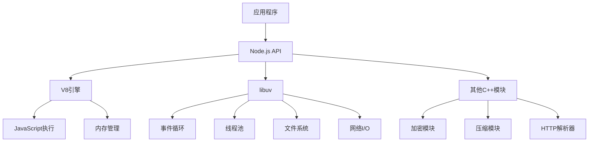

# Node.js环境

## Node.js架构概述

### 核心架构


### 事件驱动架构
```javascript
// 事件循环示例
const fs = require('fs');
const http = require('http');

// 1. 同步代码
console.log('1. 同步代码开始');

// 2. 异步I/O
fs.readFile('file.txt', (err, data) => {
    console.log('3. 文件读取完成');
});

// 3. 定时器
setTimeout(() => {
    console.log('4. 定时器执行');
}, 0);

// 4. HTTP服务器
const server = http.createServer((req, res) => {
    console.log('5. HTTP请求处理');
    res.end('Hello World');
});

server.listen(3000, () => {
    console.log('2. 服务器启动完成');
});

console.log('1. 同步代码结束');
```

## 核心模块系统

### 内置模块
| 模块 | 功能 | 使用场景 |
|------|------|----------|
| `fs` | 文件系统操作 | 文件读写、目录操作 |
| `http` | HTTP服务器/客户端 | Web服务器、API调用 |
| `path` | 路径处理 | 文件路径操作 |
| `url` | URL解析 | URL处理 |
| `crypto` | 加密功能 | 密码哈希、加密解密 |
| `stream` | 流处理 | 大文件处理、数据传输 |
| `events` | 事件系统 | 自定义事件处理 |
| `util` | 工具函数 | 类型检查、继承等 |

### 模块使用示例
```javascript
// 文件系统操作
const fs = require('fs');
const path = require('path');

// 同步文件读取
const data = fs.readFileSync('config.json', 'utf8');
const config = JSON.parse(data);

// 异步文件写入
fs.writeFile('output.txt', 'Hello Node.js', (err) => {
    if (err) throw err;
    console.log('文件写入成功');
});

// 路径操作
const filePath = path.join(__dirname, 'data', 'file.txt');
const ext = path.extname(filePath);
const basename = path.basename(filePath);

// HTTP服务器
const http = require('http');
const server = http.createServer((req, res) => {
    res.writeHead(200, { 'Content-Type': 'text/html' });
    res.end('<h1>Hello Node.js</h1>');
});

server.listen(3000, () => {
    console.log('服务器运行在 http://localhost:3000');
});
```

## 包管理系统

### npm包管理
```javascript
// package.json配置
{
    "name": "my-node-app",
    "version": "1.0.0",
    "description": "My Node.js application",
    "main": "index.js",
    "scripts": {
        "start": "node index.js",
        "dev": "nodemon index.js",
        "test": "jest",
        "build": "webpack"
    },
    "dependencies": {
        "express": "^4.18.0",
        "lodash": "^4.17.21"
    },
    "devDependencies": {
        "nodemon": "^2.0.19",
        "jest": "^28.1.0"
    },
    "engines": {
        "node": ">=14.0.0",
        "npm": ">=6.0.0"
    }
}
```

### 包管理命令
```bash
# 安装依赖
npm install express
npm install --save-dev nodemon
npm install --global typescript

# 更新依赖
npm update
npm outdated

# 安全审计
npm audit
npm audit fix

# 脚本执行
npm run start
npm run dev
npm test
```

### 版本管理策略
```javascript
// 语义化版本控制
const version = {
    major: 1,    // 主版本号：不兼容的API修改
    minor: 2,    // 次版本号：向下兼容的功能性新增
    patch: 3     // 修订号：向下兼容的问题修正
};

// 版本范围
const ranges = {
    exact: "1.2.3",           // 精确版本
    caret: "^1.2.3",          // 兼容版本 (1.x.x)
    tilde: "~1.2.3",          // 近似版本 (1.2.x)
    range: ">=1.2.3 <2.0.0",  // 版本范围
    latest: "*"               // 最新版本
};
```

## 异步编程模式

### 回调函数
```javascript
// 回调地狱问题
fs.readFile('file1.txt', (err, data1) => {
    if (err) throw err;
    fs.readFile('file2.txt', (err, data2) => {
        if (err) throw err;
        fs.readFile('file3.txt', (err, data3) => {
            if (err) throw err;
            console.log(data1 + data2 + data3);
        });
    });
});

// 解决方案：Promise
function readFilePromise(filename) {
    return new Promise((resolve, reject) => {
        fs.readFile(filename, (err, data) => {
            if (err) reject(err);
            else resolve(data);
        });
    });
}

// 使用Promise
readFilePromise('file1.txt')
    .then(data1 => readFilePromise('file2.txt'))
    .then(data2 => readFilePromise('file3.txt'))
    .then(data3 => console.log(data1 + data2 + data3))
    .catch(err => console.error(err));
```

### async/await
```javascript
// 现代异步编程
async function readMultipleFiles() {
    try {
        const data1 = await readFilePromise('file1.txt');
        const data2 = await readFilePromise('file2.txt');
        const data3 = await readFilePromise('file3.txt');
        
        return data1 + data2 + data3;
    } catch (error) {
        console.error('读取文件失败:', error);
        throw error;
    }
}

// 并行处理
async function readFilesParallel() {
    try {
        const [data1, data2, data3] = await Promise.all([
            readFilePromise('file1.txt'),
            readFilePromise('file2.txt'),
            readFilePromise('file3.txt')
        ]);
        
        return data1 + data2 + data3;
    } catch (error) {
        console.error('并行读取失败:', error);
        throw error;
    }
}
```

## 流处理系统

### 流类型
```javascript
const fs = require('fs');
const { Readable, Writable, Transform, PassThrough } = require('stream');

// 1. 可读流
const readableStream = fs.createReadStream('input.txt');

// 2. 可写流
const writableStream = fs.createWriteStream('output.txt');

// 3. 转换流
const transformStream = new Transform({
    transform(chunk, encoding, callback) {
        const transformed = chunk.toString().toUpperCase();
        callback(null, transformed);
    }
});

// 4. 管道连接
readableStream
    .pipe(transformStream)
    .pipe(writableStream)
    .on('finish', () => {
        console.log('文件处理完成');
    });
```

### 自定义流
```javascript
// 自定义可读流
class CounterStream extends Readable {
    constructor(options) {
        super(options);
        this.count = 0;
        this.max = options.max || 10;
    }
    
    _read() {
        if (this.count < this.max) {
            this.push(`数据块 ${this.count++}\n`);
        } else {
            this.push(null); // 结束流
        }
    }
}

// 使用自定义流
const counter = new CounterStream({ max: 5 });
counter.on('data', chunk => {
    console.log('接收到:', chunk.toString());
});

counter.on('end', () => {
    console.log('流结束');
});
```

## 错误处理

### 错误类型
```javascript
// 1. 同步错误
try {
    const data = JSON.parse('invalid json');
} catch (error) {
    console.error('JSON解析错误:', error.message);
}

// 2. 异步错误
fs.readFile('nonexistent.txt', (err, data) => {
    if (err) {
        console.error('文件读取错误:', err.message);
        return;
    }
    console.log(data);
});

// 3. Promise错误
readFilePromise('nonexistent.txt')
    .then(data => console.log(data))
    .catch(error => console.error('Promise错误:', error.message));

// 4. async/await错误
async function handleError() {
    try {
        const data = await readFilePromise('nonexistent.txt');
        console.log(data);
    } catch (error) {
        console.error('async/await错误:', error.message);
    }
}
```

### 全局错误处理
```javascript
// 未捕获的异常
process.on('uncaughtException', (error) => {
    console.error('未捕获的异常:', error);
    // 记录日志
    // 清理资源
    process.exit(1);
});

// 未处理的Promise拒绝
process.on('unhandledRejection', (reason, promise) => {
    console.error('未处理的Promise拒绝:', reason);
    // 记录日志
    // 清理资源
});

// 警告处理
process.on('warning', (warning) => {
    console.warn('警告:', warning.name, warning.message);
});
```

## 性能优化

### 内存管理
```javascript
// 1. 内存使用监控
function monitorMemory() {
    const used = process.memoryUsage();
    console.log('内存使用情况:');
    console.log(`RSS: ${Math.round(used.rss / 1024 / 1024)} MB`);
    console.log(`Heap Total: ${Math.round(used.heapTotal / 1024 / 1024)} MB`);
    console.log(`Heap Used: ${Math.round(used.heapUsed / 1024 / 1024)} MB`);
    console.log(`External: ${Math.round(used.external / 1024 / 1024)} MB`);
}

// 2. 垃圾回收优化
if (global.gc) {
    setInterval(() => {
        global.gc();
        console.log('手动垃圾回收执行');
    }, 30000);
}

// 3. 内存泄漏检测
const heapUsed = process.memoryUsage().heapUsed;
console.log('堆内存使用:', heapUsed / 1024 / 1024, 'MB');
```

### 性能监控
```javascript
// 1. 性能计时
const start = process.hrtime.bigint();

// 执行操作
setTimeout(() => {
    const end = process.hrtime.bigint();
    const duration = Number(end - start) / 1000000; // 转换为毫秒
    console.log(`操作耗时: ${duration}ms`);
}, 1000);

// 2. CPU使用率监控
const os = require('os');
function getCPUUsage() {
    const cpus = os.cpus();
    let totalIdle = 0;
    let totalTick = 0;
    
    cpus.forEach(cpu => {
        for (let type in cpu.times) {
            totalTick += cpu.times[type];
        }
        totalIdle += cpu.times.idle;
    });
    
    return 100 - ~~(100 * totalIdle / totalTick);
}

// 3. 事件循环延迟监控
function monitorEventLoop() {
    const start = process.hrtime.bigint();
    
    setImmediate(() => {
        const delay = Number(process.hrtime.bigint() - start) / 1000000;
        console.log(`事件循环延迟: ${delay}ms`);
        
        if (delay > 10) {
            console.warn('事件循环延迟过高!');
        }
    });
}
```

## 相关链接
- [[01-基础认知层/02-运行环境/01-浏览器环境]] - 浏览器环境详解
- [[01-基础认知层/02-运行环境/03-执行引擎(V8)]] - V8引擎深入分析
- [[01-基础认知层/02-运行环境/04-环境差异对比]] - 环境差异对比
- [[01-基础认知层/02-运行环境/05-环境配置指南]] - 环境配置指南
