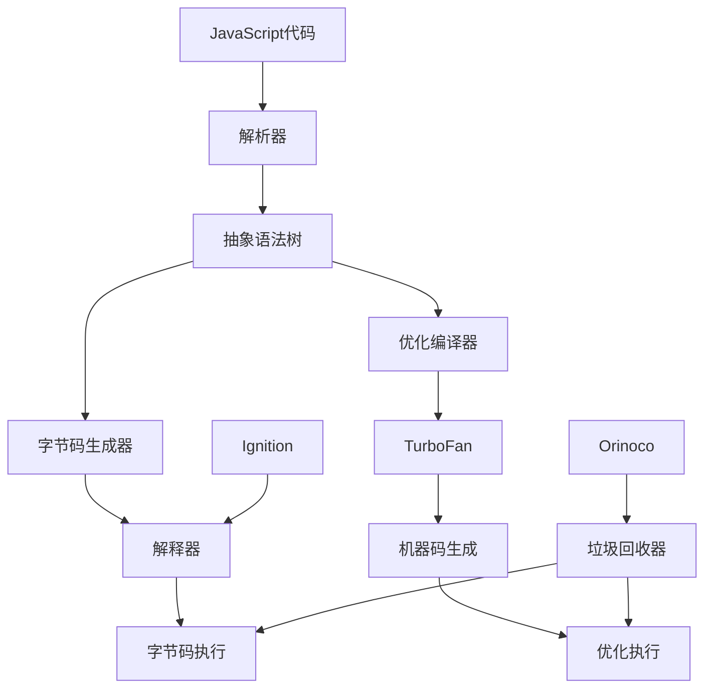
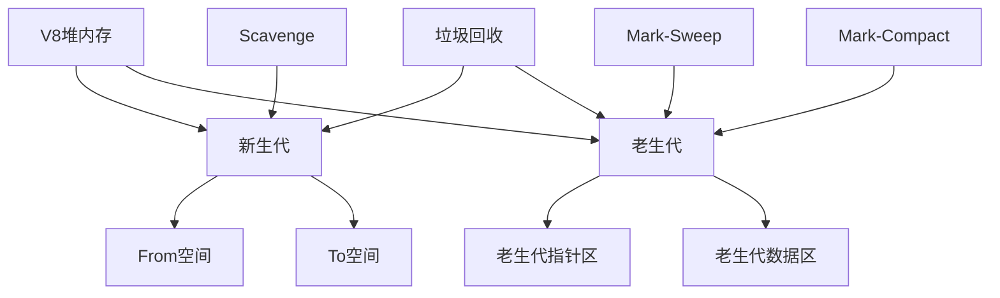

# 执行引擎(V8)

## V8引擎架构

### 核心组件


### 执行流程
```javascript
// 1. 源代码
function add(a, b) {
    return a + b;
}

// 2. 解析阶段
// 生成抽象语法树 (AST)
const ast = {
    type: 'FunctionDeclaration',
    id: { name: 'add' },
    params: [
        { name: 'a' },
        { name: 'b' }
    ],
    body: {
        type: 'ReturnStatement',
        argument: {
            type: 'BinaryExpression',
            operator: '+',
            left: { name: 'a' },
            right: { name: 'b' }
        }
    }
};

// 3. 字节码生成
// Ignition解释器生成字节码
const bytecode = [
    'LdaZero',      // 加载0
    'Star',         // 存储到寄存器
    'Ldar',         // 加载参数a
    'Add',          // 加法操作
    'Return'        // 返回结果
];

// 4. 机器码优化
// TurboFan编译器生成优化机器码
const machineCode = `
    mov eax, [esp+4]    ; 加载参数a
    add eax, [esp+8]    ; 加上参数b
    ret                 ; 返回结果
`;
```

## 内存管理

### 堆内存结构


### 垃圾回收算法
```javascript
// 1. 新生代垃圾回收 (Scavenge)
class ScavengeGC {
    constructor() {
        this.fromSpace = [];
        this.toSpace = [];
        this.allocated = 0;
    }
    
    allocate(size) {
        if (this.allocated + size > this.fromSpace.length) {
            this.collect();
        }
        
        const object = {
            size: size,
            data: new Array(size)
        };
        
        this.fromSpace.push(object);
        this.allocated += size;
        return object;
    }
    
    collect() {
        // 复制存活对象到To空间
        this.toSpace = this.fromSpace.filter(obj => obj.alive);
        
        // 交换From和To空间
        [this.fromSpace, this.toSpace] = [this.toSpace, this.fromSpace];
        this.allocated = 0;
    }
}

// 2. 老生代垃圾回收 (Mark-Sweep-Compact)
class MarkSweepCompactGC {
    constructor() {
        this.heap = [];
        this.marked = new Set();
    }
    
    mark() {
        // 标记阶段：从根对象开始标记
        const roots = this.getRoots();
        roots.forEach(root => this.markObject(root));
    }
    
    markObject(obj) {
        if (this.marked.has(obj)) return;
        
        this.marked.add(obj);
        obj.references?.forEach(ref => this.markObject(ref));
    }
    
    sweep() {
        // 清除阶段：删除未标记的对象
        this.heap = this.heap.filter(obj => this.marked.has(obj));
        this.marked.clear();
    }
    
    compact() {
        // 压缩阶段：整理内存碎片
        this.heap.sort((a, b) => a.address - b.address);
    }
}
```

### 内存优化技巧
```javascript
// 1. 避免内存泄漏
class EventManager {
    constructor() {
        this.listeners = new Map();
    }
    
    addEventListener(element, event, handler) {
        if (!this.listeners.has(element)) {
            this.listeners.set(element, new Map());
        }
        
        const elementListeners = this.listeners.get(element);
        if (!elementListeners.has(event)) {
            elementListeners.set(event, new Set());
        }
        
        elementListeners.get(event).add(handler);
        element.addEventListener(event, handler);
    }
    
    removeEventListener(element, event, handler) {
        const elementListeners = this.listeners.get(element);
        if (elementListeners) {
            const eventListeners = elementListeners.get(event);
            if (eventListeners) {
                eventListeners.delete(handler);
                element.removeEventListener(event, handler);
                
                if (eventListeners.size === 0) {
                    elementListeners.delete(event);
                }
            }
            
            if (elementListeners.size === 0) {
                this.listeners.delete(element);
            }
        }
    }
    
    destroy() {
        // 清理所有监听器
        this.listeners.forEach((elementListeners, element) => {
            elementListeners.forEach((eventListeners, event) => {
                eventListeners.forEach(handler => {
                    element.removeEventListener(event, handler);
                });
            });
        });
        this.listeners.clear();
    }
}

// 2. 对象池模式
class ObjectPool {
    constructor(createFn, resetFn) {
        this.createFn = createFn;
        this.resetFn = resetFn;
        this.pool = [];
    }
    
    acquire() {
        if (this.pool.length > 0) {
            return this.pool.pop();
        }
        return this.createFn();
    }
    
    release(obj) {
        this.resetFn(obj);
        this.pool.push(obj);
    }
}

// 使用对象池
const vectorPool = new ObjectPool(
    () => ({ x: 0, y: 0, z: 0 }),
    (vec) => { vec.x = 0; vec.y = 0; vec.z = 0; }
);

// 3. 弱引用使用
const weakMap = new WeakMap();
const weakSet = new WeakSet();

function useWeakReferences() {
    const obj = { data: 'important' };
    
    // 弱引用不会阻止垃圾回收
    weakMap.set(obj, 'metadata');
    weakSet.add(obj);
    
    // obj被垃圾回收时，弱引用自动清理
    return obj;
}
```

## 性能优化

### 隐藏类优化
```javascript
// 1. 隐藏类创建
function Point(x, y) {
    this.x = x;
    this.y = y;
}

// V8为Point创建隐藏类
const p1 = new Point(1, 2);
const p2 = new Point(3, 4);

// 2. 隐藏类转换
function BadPoint(x, y) {
    this.x = x;
    this.y = y;
    this.z = 0; // 添加属性会改变隐藏类
}

function GoodPoint(x, y, z = 0) {
    this.x = x;
    this.y = y;
    this.z = z; // 在构造函数中定义所有属性
}

// 3. 避免隐藏类破坏
function avoidHiddenClassBreakage() {
    const obj = {};
    
    // 错误：动态添加属性
    obj.a = 1;
    obj.b = 2;
    obj.c = 3;
    
    // 正确：一次性定义所有属性
    const obj2 = {
        a: 1,
        b: 2,
        c: 3
    };
    
    return obj2;
}
```

### 内联缓存优化
```javascript
// 1. 属性访问优化
function optimizePropertyAccess(obj) {
    // V8会缓存属性访问路径
    return obj.name + obj.age + obj.city;
}

// 2. 方法调用优化
class Calculator {
    add(a, b) { return a + b; }
    subtract(a, b) { return a - b; }
    multiply(a, b) { return a * b; }
}

function optimizeMethodCalls(calc) {
    // V8会缓存方法调用
    return calc.add(1, 2) + calc.subtract(3, 4);
}

// 3. 避免多态
function avoidPolymorphism() {
    const shapes = [
        new Circle(5),
        new Circle(10),
        new Circle(15)
    ];
    
    // 好：单一类型
    shapes.forEach(shape => shape.area());
    
    const mixedShapes = [
        new Circle(5),
        new Rectangle(3, 4),
        new Triangle(3, 4, 5)
    ];
    
    // 坏：多态类型
    mixedShapes.forEach(shape => shape.area());
}
```

### JIT编译优化
```javascript
// 1. 热点函数识别
function hotFunction() {
    let sum = 0;
    for (let i = 0; i < 1000000; i++) {
        sum += i;
    }
    return sum;
}

// 2. 类型特化
function typeSpecialization() {
    const numbers = [1, 2, 3, 4, 5];
    
    // V8会为数字数组创建特化版本
    return numbers.map(x => x * 2);
}

// 3. 循环优化
function loopOptimization() {
    const arr = new Array(1000);
    
    // 好：简单循环
    for (let i = 0; i < arr.length; i++) {
        arr[i] = i * 2;
    }
    
    // 更好：预计算长度
    const len = arr.length;
    for (let i = 0; i < len; i++) {
        arr[i] = i * 2;
    }
}
```

## 调试和性能分析

### 性能分析工具
```javascript
// 1. 性能计时
function performanceTiming() {
    const start = performance.now();
    
    // 执行操作
    for (let i = 0; i < 1000000; i++) {
        Math.sqrt(i);
    }
    
    const end = performance.now();
    console.log(`操作耗时: ${end - start}ms`);
}

// 2. 内存使用分析
function memoryAnalysis() {
    const initialMemory = process.memoryUsage();
    
    // 执行操作
    const largeArray = new Array(1000000).fill(0);
    
    const finalMemory = process.memoryUsage();
    
    console.log('内存使用变化:');
    console.log(`堆内存: ${(finalMemory.heapUsed - initialMemory.heapUsed) / 1024 / 1024}MB`);
    console.log(`外部内存: ${(finalMemory.external - initialMemory.external) / 1024 / 1024}MB`);
}

// 3. CPU使用分析
function cpuAnalysis() {
    const start = process.hrtime.bigint();
    
    // CPU密集型操作
    let result = 0;
    for (let i = 0; i < 10000000; i++) {
        result += Math.sin(i) * Math.cos(i);
    }
    
    const end = process.hrtime.bigint();
    const duration = Number(end - start) / 1000000;
    
    console.log(`CPU操作耗时: ${duration}ms`);
    console.log(`结果: ${result}`);
}
```

### V8标志和选项
```bash
# 启用V8优化
node --max-old-space-size=4096 --optimize-for-size app.js

# 启用垃圾回收日志
node --trace-gc app.js

# 启用性能分析
node --prof app.js

# 启用调试信息
node --inspect app.js

# 启用V8内部统计
node --trace-opt app.js
```

### 性能监控
```javascript
// 1. 垃圾回收监控
function monitorGC() {
    if (global.gc) {
        setInterval(() => {
            const before = process.memoryUsage();
            global.gc();
            const after = process.memoryUsage();
            
            console.log('垃圾回收前后:');
            console.log(`堆内存: ${before.heapUsed} -> ${after.heapUsed}`);
            console.log(`释放内存: ${before.heapUsed - after.heapUsed} bytes`);
        }, 30000);
    }
}

// 2. 事件循环监控
function monitorEventLoop() {
    let lastCheck = process.hrtime.bigint();
    
    setImmediate(function check() {
        const now = process.hrtime.bigint();
        const delay = Number(now - lastCheck) / 1000000;
        
        if (delay > 10) {
            console.warn(`事件循环延迟: ${delay}ms`);
        }
        
        lastCheck = now;
        setImmediate(check);
    });
}

// 3. 内存泄漏检测
function detectMemoryLeak() {
    const initialMemory = process.memoryUsage().heapUsed;
    const samples = [];
    
    setInterval(() => {
        const currentMemory = process.memoryUsage().heapUsed;
        samples.push(currentMemory);
        
        if (samples.length > 10) {
            samples.shift();
        }
        
        // 检测内存增长趋势
        if (samples.length === 10) {
            const growth = samples[9] - samples[0];
            if (growth > 10 * 1024 * 1024) { // 10MB
                console.warn('可能的内存泄漏检测到');
            }
        }
    }, 5000);
}
```

## 相关链接
- [[01-基础认知层/02-运行环境/01-浏览器环境]] - 浏览器环境详解
- [[01-基础认知层/02-运行环境/02-Node.js环境]] - Node.js环境详解
- [[01-基础认知层/02-运行环境/04-环境差异对比]] - 环境差异对比
- [[01-基础认知层/02-运行环境/05-环境配置指南]] - 环境配置指南
