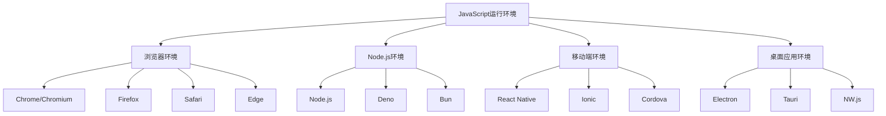
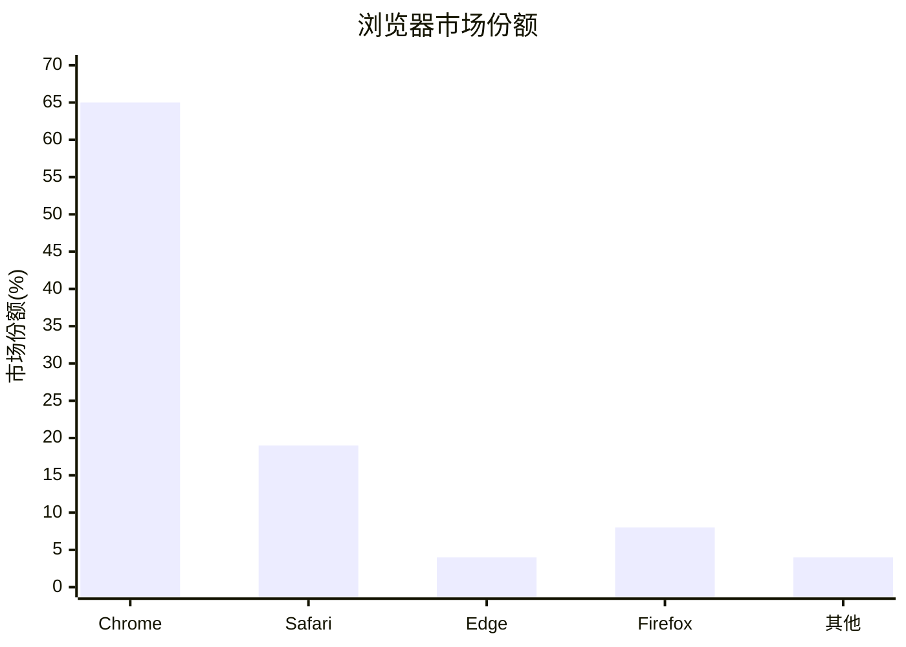

# 环境差异对比

## 环境对比总览

### 主要环境类型


### 环境特性对比表
| 特性 | 浏览器 | Node.js | 移动端 | 桌面应用 |
|------|--------|---------|--------|----------|
| DOM API | ✅ 完整支持 | ❌ 不支持 | ⚠️ 部分支持 | ⚠️ 部分支持 |
| 文件系统 | ❌ 受限 | ✅ 完整支持 | ⚠️ 受限 | ✅ 完整支持 |
| 网络请求 | ✅ fetch/XMLHttpRequest | ✅ http/https模块 | ✅ 支持 | ✅ 支持 |
| 多线程 | ⚠️ Web Workers | ✅ Worker Threads | ⚠️ 受限 | ✅ 支持 |
| 本地存储 | ✅ LocalStorage/IndexedDB | ❌ 无 | ⚠️ 受限 | ✅ 支持 |

## 浏览器环境差异

### 主流浏览器对比


### 浏览器API支持差异
| API | Chrome | Firefox | Safari | Edge | 移动端支持 |
|-----|--------|---------|--------|------|-----------|
| Service Worker | 40+ | 44+ | 11.1+ | 17+ | iOS 11.3+ |
| WebRTC | 23+ | 22+ | 11+ | 12+ | iOS 11+ |
| WebGL | 9+ | 4+ | 5.1+ | 12+ | iOS 8+ |
| WebAssembly | 57+ | 52+ | 11+ | 16+ | iOS 11+ |
| Intersection Observer | 51+ | 55+ | 12.1+ | 15+ | iOS 12.2+ |

### 浏览器兼容性处理
```javascript
// 1. 特性检测
function detectBrowserFeatures() {
    const features = {
        // Service Worker支持
        serviceWorker: 'serviceWorker' in navigator,
        
        // WebRTC支持
        webRTC: !!(navigator.mediaDevices && navigator.mediaDevices.getUserMedia),
        
        // WebGL支持
        webGL: (() => {
            try {
                const canvas = document.createElement('canvas');
                return !!(window.WebGLRenderingContext && canvas.getContext('webgl'));
            } catch (e) {
                return false;
            }
        })(),
        
        // WebAssembly支持
        webAssembly: typeof WebAssembly === 'object',
        
        // Intersection Observer支持
        intersectionObserver: 'IntersectionObserver' in window
    };
    
    return features;
}

// 2. 浏览器检测
function detectBrowser() {
    const ua = navigator.userAgent;
    const browsers = {
        Chrome: /Chrome\/(\d+)/,
        Firefox: /Firefox\/(\d+)/,
        Safari: /Version\/(\d+).*Safari/,
        Edge: /Edg\/(\d+)/,
        Opera: /OPR\/(\d+)/,
        IE: /MSIE (\d+)|Trident.*rv:(\d+)/
    };
    
    for (const [name, regex] of Object.entries(browsers)) {
        const match = ua.match(regex);
        if (match) {
            return {
                name,
                version: match[1] || match[2],
                isMobile: /Mobile|Android|iPhone|iPad/.test(ua)
            };
        }
    }
    
    return { name: 'Unknown', version: 'Unknown', isMobile: false };
}

// 3. 兼容性处理
function handleCompatibility() {
    const browser = detectBrowser();
    const features = detectBrowserFeatures();
    
    // 根据浏览器特性提供不同实现
    if (features.serviceWorker) {
        // 使用Service Worker
        navigator.serviceWorker.register('/sw.js');
    } else {
        // 降级处理
        console.warn('Service Worker not supported');
    }
    
    // 根据浏览器版本提供不同功能
    if (browser.name === 'Chrome' && parseInt(browser.version) >= 80) {
        // 使用最新Chrome特性
        useLatestChromeFeatures();
    } else {
        // 使用兼容性实现
        useCompatibleFeatures();
    }
}
```

## Node.js环境差异

### Node.js版本对比
| 版本 | LTS状态 | 发布时间 | 主要特性 | 推荐使用 |
|------|---------|----------|----------|----------|
| 16.x | LTS | 2021-04 | ES2021支持 | ✅ 稳定 |
| 18.x | LTS | 2022-04 | ES2022支持 | ✅ 推荐 |
| 20.x | Current | 2023-04 | ES2023支持 | ⚠️ 测试 |

### Node.js模块系统
```javascript
// 1. CommonJS模块
// math.js
module.exports = {
    add: (a, b) => a + b,
    subtract: (a, b) => a - b
};

// main.js
const math = require('./math');
console.log(math.add(1, 2));

// 2. ES6模块
// math.mjs
export const add = (a, b) => a + b;
export const subtract = (a, b) => a - b;

// main.mjs
import { add, subtract } from './math.mjs';
console.log(add(1, 2));

// 3. 混合使用
// package.json
{
    "type": "module", // 启用ES6模块
    "main": "index.js"
}

// 动态导入
const math = await import('./math.mjs');
console.log(math.add(1, 2));
```

### Node.js环境检测
```javascript
// 1. 环境检测
function detectNodeEnvironment() {
    return {
        nodeVersion: process.version,
        platform: process.platform,
        arch: process.arch,
        isDevelopment: process.env.NODE_ENV === 'development',
        isProduction: process.env.NODE_ENV === 'production',
        isTest: process.env.NODE_ENV === 'test'
    };
}

// 2. 功能检测
function detectNodeFeatures() {
    return {
        // 内置模块支持
        fs: typeof require('fs') !== 'undefined',
        http: typeof require('http') !== 'undefined',
        path: typeof require('path') !== 'undefined',
        
        // 新特性支持
        es6Modules: process.version >= 'v13.2.0',
        workerThreads: process.version >= 'v10.5.0',
        asyncHooks: process.version >= 'v8.1.0',
        
        // 实验性特性
        experimentalModules: process.version >= 'v8.5.0'
    };
}

// 3. 性能检测
function detectNodePerformance() {
    return {
        memoryUsage: process.memoryUsage(),
        cpuUsage: process.cpuUsage(),
        uptime: process.uptime(),
        pid: process.pid,
        ppid: process.ppid
    };
}
```

## 移动端环境差异

### 移动端平台对比
| 平台 | 引擎 | JavaScript支持 | 性能 | 兼容性 |
|------|------|----------------|------|--------|
| iOS Safari | JavaScriptCore | ES2020+ | 高 | 好 |
| Android Chrome | V8 | ES2020+ | 高 | 好 |
| React Native | Hermes/V8 | ES2018+ | 中等 | 中等 |
| Ionic | WebView | ES2018+ | 中等 | 好 |
| Cordova | WebView | ES2018+ | 低 | 中等 |

### 移动端特殊处理
```javascript
// 1. 移动端检测
function detectMobile() {
    const ua = navigator.userAgent;
    const mobile = /Mobile|Android|iPhone|iPad|iPod|BlackBerry|IEMobile|Opera Mini/i.test(ua);
    const touch = 'ontouchstart' in window || navigator.maxTouchPoints > 0;
    
    return {
        isMobile: mobile,
        isTouch: touch,
        isIOS: /iPad|iPhone|iPod/.test(ua),
        isAndroid: /Android/.test(ua),
        isTablet: /iPad|Android(?!.*Mobile)/.test(ua)
    };
}

// 2. 移动端优化
function optimizeForMobile() {
    const mobile = detectMobile();
    
    if (mobile.isMobile) {
        // 禁用双击缩放
        document.addEventListener('touchstart', function(event) {
            if (event.touches.length > 1) {
                event.preventDefault();
            }
        });
        
        // 优化滚动性能
        document.addEventListener('touchmove', function(event) {
            event.preventDefault();
        }, { passive: false });
        
        // 处理视口问题
        const viewport = document.querySelector('meta[name="viewport"]');
        if (viewport) {
            viewport.content = 'width=device-width, initial-scale=1.0, maximum-scale=1.0, user-scalable=no';
        }
    }
}

// 3. 移动端API适配
function adaptMobileAPIs() {
    // 设备方向
    if (window.DeviceOrientationEvent) {
        window.addEventListener('deviceorientation', function(event) {
            console.log('Alpha:', event.alpha);
            console.log('Beta:', event.beta);
            console.log('Gamma:', event.gamma);
        });
    }
    
    // 设备运动
    if (window.DeviceMotionEvent) {
        window.addEventListener('devicemotion', function(event) {
            console.log('Acceleration:', event.acceleration);
            console.log('Rotation:', event.rotationRate);
        });
    }
    
    // 网络状态
    if (navigator.onLine !== undefined) {
        window.addEventListener('online', () => console.log('网络已连接'));
        window.addEventListener('offline', () => console.log('网络已断开'));
    }
}
```

## 桌面应用环境差异

### 桌面应用框架对比
| 框架 | 技术栈 | 性能 | 包大小 | 跨平台 | 推荐度 |
|------|--------|------|--------|--------|--------|
| Electron | Chromium + Node.js | 中等 | 大 | ✅ | ⭐⭐⭐⭐ |
| Tauri | Rust + WebView | 高 | 小 | ✅ | ⭐⭐⭐⭐⭐ |
| NW.js | Chromium + Node.js | 中等 | 大 | ✅ | ⭐⭐⭐ |
| Neutralino | WebView + 轻量级 | 高 | 小 | ✅ | ⭐⭐⭐ |

### 桌面应用环境检测
```javascript
// 1. 桌面应用检测
function detectDesktopApp() {
    return {
        isElectron: typeof window !== 'undefined' && window.process && window.process.type,
        isTauri: typeof window !== 'undefined' && window.__TAURI__,
        isNWjs: typeof window !== 'undefined' && window.nw,
        isNeutralino: typeof window !== 'undefined' && window.Neutralino
    };
}

// 2. 桌面应用API适配
function adaptDesktopAPIs() {
    const desktop = detectDesktopApp();
    
    if (desktop.isElectron) {
        // Electron API
        const { ipcRenderer } = require('electron');
        
        // 与主进程通信
        ipcRenderer.send('message', 'Hello from renderer');
        ipcRenderer.on('reply', (event, arg) => {
            console.log('Reply from main:', arg);
        });
        
        // 文件系统访问
        const fs = require('fs');
        const path = require('path');
        
        const userDataPath = require('electron').remote.app.getPath('userData');
        const configPath = path.join(userDataPath, 'config.json');
        
        // 读取配置文件
        if (fs.existsSync(configPath)) {
            const config = JSON.parse(fs.readFileSync(configPath, 'utf8'));
            console.log('Config:', config);
        }
    }
    
    if (desktop.isTauri) {
        // Tauri API
        const { invoke } = window.__TAURI__.tauri;
        
        // 调用Rust后端
        invoke('greet', { name: 'World' })
            .then(response => console.log('Tauri response:', response));
        
        // 文件系统操作
        const { readTextFile, writeTextFile } = window.__TAURI__.fs;
        
        readTextFile('config.json')
            .then(content => console.log('Config:', content))
            .catch(err => console.error('Read error:', err));
    }
}
```

## 环境适配策略

### 统一环境检测
```javascript
// 环境检测器
class EnvironmentDetector {
    constructor() {
        this.environment = this.detectEnvironment();
        this.features = this.detectFeatures();
        this.capabilities = this.detectCapabilities();
    }
    
    detectEnvironment() {
        if (typeof window !== 'undefined') {
            // 浏览器环境
            if (window.navigator) {
                return 'browser';
            }
            // 桌面应用环境
            if (window.process && window.process.type) {
                return 'electron';
            }
            if (window.__TAURI__) {
                return 'tauri';
            }
        }
        
        if (typeof process !== 'undefined' && process.versions && process.versions.node) {
            return 'nodejs';
        }
        
        if (typeof global !== 'undefined' && global.HermesInternal) {
            return 'react-native';
        }
        
        return 'unknown';
    }
    
    detectFeatures() {
        const features = {};
        
        // DOM支持
        features.dom = typeof document !== 'undefined';
        
        // 文件系统支持
        features.filesystem = typeof require !== 'undefined' && require('fs');
        
        // 网络支持
        features.network = typeof fetch !== 'undefined' || typeof XMLHttpRequest !== 'undefined';
        
        // 存储支持
        features.storage = {
            localStorage: typeof localStorage !== 'undefined',
            sessionStorage: typeof sessionStorage !== 'undefined',
            indexedDB: typeof indexedDB !== 'undefined'
        };
        
        return features;
    }
    
    detectCapabilities() {
        return {
            // 多线程支持
            multithreading: typeof Worker !== 'undefined' || typeof require !== 'undefined',
            
            // 异步支持
            async: typeof Promise !== 'undefined' && typeof async !== 'undefined',
            
            // 模块支持
            modules: typeof import !== 'undefined' || typeof require !== 'undefined',
            
            // 性能API
            performance: typeof performance !== 'undefined'
        };
    }
    
    // 获取环境信息
    getInfo() {
        return {
            environment: this.environment,
            features: this.features,
            capabilities: this.capabilities,
            userAgent: typeof navigator !== 'undefined' ? navigator.userAgent : 'Unknown',
            platform: typeof process !== 'undefined' ? process.platform : 'Unknown'
        };
    }
}

// 使用示例
const detector = new EnvironmentDetector();
const info = detector.getInfo();
console.log('环境信息:', info);
```

## 相关链接
- [[01-基础认知层/02-运行环境/01-浏览器环境]] - 浏览器环境详解
- [[01-基础认知层/02-运行环境/02-Node.js环境]] - Node.js环境详解
- [[01-基础认知层/02-运行环境/03-执行引擎(V8)]] - V8引擎深入分析
- [[01-基础认知层/02-运行环境/05-环境配置指南]] - 环境配置指南
