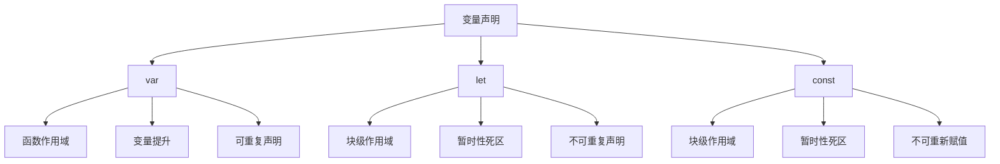

# 变量声明(var-let-const)

## 变量声明概述

### 三种声明方式


### 作用域对比
| 声明方式 | 作用域 | 变量提升 | 重复声明 | 重新赋值 |
|----------|--------|----------|----------|----------|
| var | 函数作用域 | ✅ | ✅ | ✅ |
| let | 块级作用域 | ❌ | ❌ | ✅ |
| const | 块级作用域 | ❌ | ❌ | ❌ |

## var声明

### 基本特性
```javascript
// 1. 函数作用域
function example() {
    if (true) {
        var x = 1;
    }
    console.log(x); // 1 - 可以访问
}

// 2. 变量提升
console.log(y); // undefined (不会报错)
var y = 2;

// 3. 重复声明
var z = 3;
var z = 4; // 允许重复声明
console.log(z); // 4
```

### 变量提升机制
```javascript
// 实际执行顺序
console.log(a); // undefined
var a = 5;

// 等价于
var a; // 声明提升到顶部
console.log(a); // undefined
a = 5; // 赋值留在原地
```

## let声明

### 基本特性
```javascript
// 1. 块级作用域
function example() {
    if (true) {
        let x = 1;
    }
    // console.log(x); // ReferenceError: x is not defined
}

// 2. 暂时性死区
// console.log(y); // ReferenceError: Cannot access 'y' before initialization
let y = 2;

// 3. 不可重复声明
let z = 3;
// let z = 4; // SyntaxError: Identifier 'z' has already been declared
```

### 块级作用域示例
```javascript
// 循环中的块级作用域
for (let i = 0; i < 3; i++) {
    setTimeout(() => {
        console.log(i); // 0, 1, 2
    }, 100);
}

// 对比var的行为
for (var j = 0; j < 3; j++) {
    setTimeout(() => {
        console.log(j); // 3, 3, 3
    }, 100);
}
```

## const声明

### 基本特性
```javascript
// 1. 常量声明
const PI = 3.14159;
// PI = 3.14; // TypeError: Assignment to constant variable

// 2. 对象和数组的const
const obj = { name: 'John' };
obj.name = 'Jane'; // ✅ 可以修改属性
// obj = {}; // ❌ 不能重新赋值

const arr = [1, 2, 3];
arr.push(4); // ✅ 可以修改数组
// arr = []; // ❌ 不能重新赋值
```

### 不可变数据模式
```javascript
// 使用Object.freeze()实现真正的不可变
const frozenObj = Object.freeze({ name: 'John' });
// frozenObj.name = 'Jane'; // 静默失败，严格模式下报错

// 使用展开运算符创建新对象
const newObj = { ...frozenObj, name: 'Jane' };
```

## 最佳实践

### 选择原则
1. **优先使用const**
   - 默认使用const声明
   - 只有在需要重新赋值时使用let

2. **避免使用var**
   - 除非在特殊情况下需要函数作用域
   - 现代JavaScript开发中不推荐使用

3. **命名约定**
   - const使用大写字母和下划线
   - let和var使用驼峰命名

### 实际应用
```javascript
// 好的实践
const API_URL = 'https://api.example.com';
const MAX_RETRIES = 3;

let currentUser = null;
let isLoading = false;

function fetchData() {
    isLoading = true;
    // ... 异步操作
    isLoading = false;
}

// 避免的实践
var globalVar = 'avoid this';
var anotherVar = 'also avoid';
```

## 相关链接
- [[01-基础认知层/03-基本语法/02-数据类型详解]] - 数据类型详解
- [[01-基础认知层/03-基本语法/03-类型转换机制]] - 类型转换机制
- [[02-理解掌握层/01-作用域与闭包/01-作用域链机制]] - 作用域链机制
