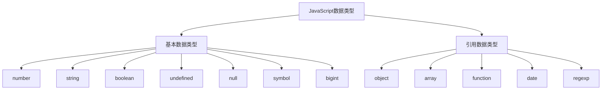

# 数据类型详解

## 数据类型概述

### 数据类型分类


### 类型检查方法
| 方法 | 描述 | 示例 |
|------|------|------|
| typeof | 返回类型字符串 | typeof 42 → "number" |
| instanceof | 检查原型链 | [] instanceof Array → true |
| Object.prototype.toString | 精确类型检查 | Object.prototype.toString.call([]) → "[object Array]" |
| constructor | 检查构造函数 | (42).constructor === Number → true |

## 基本数据类型

### number类型
```javascript
// 整数和浮点数
const integer = 42;
const float = 3.14;
const scientific = 1e6; // 1000000

// 特殊值
const infinity = Infinity;
const negativeInfinity = -Infinity;
const notANumber = NaN;

// 数值方法
console.log(Number.isInteger(42)); // true
console.log(Number.isNaN(NaN)); // true
console.log(Number.parseFloat('3.14')); // 3.14
console.log(Number.parseInt('42px')); // 42

// 数值精度问题
console.log(0.1 + 0.2); // 0.30000000000000004
console.log(0.1 + 0.2 === 0.3); // false
```

### string类型
```javascript
// 字符串创建
const singleQuote = 'Hello';
const doubleQuote = "World";
const templateLiteral = `Hello ${singleQuote}`;

// 字符串方法
const str = 'Hello World';
console.log(str.length); // 11
console.log(str.charAt(0)); // 'H'
console.log(str.indexOf('World')); // 6
console.log(str.slice(0, 5)); // 'Hello'
console.log(str.toUpperCase()); // 'HELLO WORLD'

// 模板字符串
const name = 'John';
const age = 30;
const message = `My name is ${name} and I'm ${age} years old`;
```

### boolean类型
```javascript
// 布尔值
const isTrue = true;
const isFalse = false;

// 布尔转换
console.log(Boolean(1)); // true
console.log(Boolean(0)); // false
console.log(Boolean('')); // false
console.log(Boolean('hello')); // true
console.log(Boolean(null)); // false
console.log(Boolean(undefined)); // false

// 逻辑运算符
console.log(true && false); // false
console.log(true || false); // true
console.log(!true); // false
```

### undefined和null
```javascript
// undefined - 未定义
let x;
console.log(x); // undefined
console.log(typeof x); // "undefined"

// null - 空值
const y = null;
console.log(y); // null
console.log(typeof y); // "object" (历史遗留问题)

// 区别
console.log(undefined == null); // true
console.log(undefined === null); // false
```

### symbol类型
```javascript
// 创建Symbol
const sym1 = Symbol();
const sym2 = Symbol('description');
const sym3 = Symbol('description');

console.log(sym2 === sym3); // false (每个Symbol都是唯一的)

// 全局Symbol
const globalSym = Symbol.for('global');
const sameGlobalSym = Symbol.for('global');
console.log(globalSym === sameGlobalSym); // true

// Symbol作为对象属性
const obj = {};
const key = Symbol('key');
obj[key] = 'value';
console.log(obj[key]); // 'value'
```

### bigint类型
```javascript
// 创建BigInt
const bigInt1 = 123n;
const bigInt2 = BigInt(123);
const bigInt3 = BigInt('123');

// 运算
console.log(bigInt1 + bigInt2); // 246n
console.log(bigInt1 * 2n); // 246n

// 类型转换
console.log(Number(bigInt1)); // 123
console.log(String(bigInt1)); // "123"

// 注意事项
// console.log(bigInt1 + 1); // TypeError: Cannot mix BigInt and other types
```

## 引用数据类型

### object类型
```javascript
// 对象创建
const obj1 = {}; // 字面量
const obj2 = new Object(); // 构造函数
const obj3 = Object.create(null); // 原型创建

// 对象属性
const person = {
    name: 'John',
    age: 30,
    'full name': 'John Doe' // 包含空格的属性名
};

// 属性访问
console.log(person.name); // 'John'
console.log(person['full name']); // 'John Doe'

// 属性操作
person.city = 'New York'; // 添加属性
delete person.age; // 删除属性
console.log('name' in person); // true
```

### array类型
```javascript
// 数组创建
const arr1 = []; // 空数组
const arr2 = [1, 2, 3]; // 字面量
const arr3 = new Array(3); // 构造函数
const arr4 = Array.from('hello'); // ['h', 'e', 'l', 'l', 'o']

// 数组方法
const numbers = [1, 2, 3, 4, 5];
console.log(numbers.length); // 5
console.log(numbers.push(6)); // 6 (返回新长度)
console.log(numbers.pop()); // 6 (返回删除的元素)
console.log(numbers.slice(1, 3)); // [2, 3]
console.log(numbers.map(x => x * 2)); // [2, 4, 6, 8, 10]
```

### function类型
```javascript
// 函数创建
function regularFunction() {
    return 'regular';
}

const arrowFunction = () => {
    return 'arrow';
};

const functionExpression = function() {
    return 'expression';
};

// 函数特性
console.log(typeof regularFunction); // "function"
console.log(regularFunction.name); // "regularFunction"
console.log(regularFunction.length); // 0 (参数个数)
```

## 类型转换

### 隐式转换
```javascript
// 字符串转换
console.log('5' + 3); // "53" (字符串拼接)
console.log('5' - 3); // 2 (数值运算)

// 布尔转换
if ('hello') {
    console.log('truthy'); // 执行
}

// 数值转换
console.log(+'123'); // 123
console.log('123' * 1); // 123
```

### 显式转换
```javascript
// 转换为字符串
console.log(String(123)); // "123"
console.log((123).toString()); // "123"

// 转换为数值
console.log(Number('123')); // 123
console.log(parseInt('123px')); // 123
console.log(parseFloat('123.45')); // 123.45

// 转换为布尔值
console.log(Boolean(1)); // true
console.log(!!1); // true (双重否定)
```

## 最佳实践

### 类型检查
```javascript
// 安全的类型检查
function isString(value) {
    return typeof value === 'string';
}

function isArray(value) {
    return Array.isArray(value);
}

function isObject(value) {
    return value !== null && typeof value === 'object';
}

// 使用Object.prototype.toString
function getType(value) {
    return Object.prototype.toString.call(value).slice(8, -1);
}
```

### 类型安全
```javascript
// 参数验证
function processUser(user) {
    if (typeof user !== 'object' || user === null) {
        throw new TypeError('Expected an object');
    }
    
    if (typeof user.name !== 'string') {
        throw new TypeError('Expected user.name to be a string');
    }
    
    return user.name.toUpperCase();
}
```

## 相关链接
- [[01-基础认知层/03-基本语法/01-变量声明(var-let-const)]] - 变量声明
- [[01-基础认知层/03-基本语法/03-类型转换机制]] - 类型转换机制
- [[01-基础认知层/03-基本语法/04-运算符优先级]] - 运算符优先级
