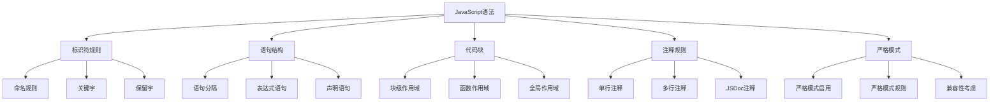

# 语法规则总结

## JavaScript语法概述

### 语法特点


### 语法规则表
| 规则类型 | 描述 | 示例 |
|----------|------|------|
| 标识符 | 字母、数字、下划线、$开头 | `name`, `_private`, `$element` |
| 关键字 | 语言保留的特殊标识符 | `var`, `let`, `const`, `function` |
| 语句分隔 | 分号或换行符 | `let x = 1;` 或 `let x = 1` |
| 代码块 | 大括号包围的语句集合 | `{ let x = 1; }` |
| 注释 | 单行//或多行/* */ | `// 注释` 或 `/* 注释 */` |

## 标识符规则

### 命名规则
```javascript
// 合法的标识符
const name = 'John';
const _private = 'private';
const $element = document.getElementById('app');
const user123 = 'user';
const camelCase = 'camel';
const snake_case = 'snake';
const PascalCase = 'Pascal';

// 非法的标识符
// const 123name = 'invalid'; // 不能以数字开头
// const my-name = 'invalid'; // 不能包含连字符
// const my name = 'invalid'; // 不能包含空格
// const class = 'invalid'; // 不能使用关键字
```

### 关键字和保留字
```javascript
// 关键字 (不能用作标识符)
const keywords = [
    'break', 'case', 'catch', 'class', 'const', 'continue',
    'debugger', 'default', 'delete', 'do', 'else', 'export',
    'extends', 'finally', 'for', 'function', 'if', 'import',
    'in', 'instanceof', 'new', 'return', 'super', 'switch',
    'this', 'throw', 'try', 'typeof', 'var', 'void', 'while',
    'with', 'yield', 'let', 'static', 'enum', 'implements',
    'interface', 'package', 'private', 'protected', 'public'
];

// 保留字 (未来可能成为关键字)
const reservedWords = [
    'abstract', 'boolean', 'byte', 'char', 'double', 'final',
    'float', 'goto', 'int', 'long', 'native', 'short',
    'synchronized', 'throws', 'transient', 'volatile'
];
```

## 语句结构

### 语句类型
```javascript
// 1. 声明语句
let x = 1;
const y = 2;
var z = 3;
function myFunction() {}

// 2. 表达式语句
x = 5;
x++;
console.log('Hello');
myFunction();

// 3. 控制语句
if (x > 0) {
    console.log('Positive');
}

for (let i = 0; i < 10; i++) {
    console.log(i);
}

// 4. 跳转语句
return x;
break;
continue;
throw new Error('Error');
```

### 语句分隔
```javascript
// 分号分隔
let a = 1; let b = 2; let c = 3;

// 换行分隔 (自动分号插入)
let a = 1
let b = 2
let c = 3

// 混合使用
let a = 1; let b = 2
let c = 3; let d = 4

// 注意：某些情况下必须使用分号
let a = 1
[1, 2, 3].forEach(console.log) // 错误：会被解析为 a[1, 2, 3]

let a = 1;
[1, 2, 3].forEach(console.log) // 正确
```

## 代码块和作用域

### 块级作用域
```javascript
// 块级作用域
{
    let blockVar = 'block scope';
    const blockConst = 'block constant';
    var functionVar = 'function scope';
}

// console.log(blockVar); // ReferenceError
// console.log(blockConst); // ReferenceError
console.log(functionVar); // 'function scope'

// 条件语句中的块级作用域
if (true) {
    let conditionVar = 'conditional';
    const conditionConst = 'conditional constant';
}
// console.log(conditionVar); // ReferenceError
```

### 函数作用域
```javascript
// 函数作用域
function myFunction() {
    var functionScoped = 'function scope';
    let blockScoped = 'block scope';
    
    if (true) {
        var innerVar = 'inner function scope';
        let innerLet = 'inner block scope';
    }
    
    console.log(functionScoped); // 'function scope'
    console.log(blockScoped); // 'block scope'
    console.log(innerVar); // 'inner function scope'
    // console.log(innerLet); // ReferenceError
}

myFunction();
```

## 注释规则

### 注释类型
```javascript
// 单行注释
let x = 1; // 这是单行注释

/* 多行注释
   可以跨越多行
   用于详细说明 */
let y = 2;

/**
 * JSDoc注释
 * @param {string} name - 用户名
 * @param {number} age - 年龄
 * @returns {string} 格式化后的用户信息
 */
function formatUser(name, age) {
    return `${name} is ${age} years old`;
}

// 注释的嵌套
/* 外层注释
   // 内层单行注释
   /* 内层多行注释 */
   外层注释结束 */
```

### 注释最佳实践
```javascript
// 好的注释实践
function calculateTotal(items) {
    // 计算所有商品的总价
    let total = 0;
    
    for (let item of items) {
        // 累加每个商品的价格
        total += item.price * item.quantity;
    }
    
    // 应用折扣 (如果有)
    if (total > 100) {
        total *= 0.9; // 10% 折扣
    }
    
    return total;
}

// 避免的注释
let x = 1; // 设置x为1 (无意义的注释)
let y = x + 1; // y等于x加1 (显而易见的注释)
```

## 严格模式

### 启用严格模式
```javascript
// 1. 全局严格模式
'use strict';
// 整个文件都是严格模式

// 2. 函数级严格模式
function strictFunction() {
    'use strict';
    // 只有这个函数是严格模式
}

// 3. 模块自动严格模式
// ES6模块自动启用严格模式
export function moduleFunction() {
    // 自动严格模式
}
```

### 严格模式规则
```javascript
'use strict';

// 1. 变量必须声明
// undeclaredVar = 1; // ReferenceError

// 2. 不能删除变量
let x = 1;
// delete x; // SyntaxError

// 3. 函数参数不能重复
// function duplicateParam(a, a) {} // SyntaxError

// 4. 不能使用with语句
// with (obj) {} // SyntaxError

// 5. this指向undefined (非严格模式下指向全局对象)
function testThis() {
    console.log(this); // undefined
}
testThis();

// 6. 不能使用八进制字面量
// let octal = 0123; // SyntaxError
let octal = 0o123; // 使用0o前缀
```

## 语法错误和警告

### 常见语法错误
```javascript
// 1. 缺少括号
// if (condition { // SyntaxError
if (condition) { // 正确

// 2. 缺少引号
// let str = 'hello; // SyntaxError
let str = 'hello'; // 正确

// 3. 错误的标识符
// let 123name = 'invalid'; // SyntaxError
let name123 = 'valid'; // 正确

// 4. 使用关键字
// let var = 'invalid'; // SyntaxError
let variable = 'valid'; // 正确

// 5. 缺少分号 (在某些情况下)
let a = 1
[1, 2, 3].forEach(console.log) // SyntaxError
```

### 语法警告
```javascript
// 1. 未使用的变量
let unusedVar = 'unused'; // 警告

// 2. 重复的变量声明
let x = 1;
let x = 2; // 警告 (在严格模式下是错误)

// 3. 缺少return语句
function noReturn() {
    let x = 1;
    // 缺少return语句
}

// 4. 死代码
function deadCode() {
    return 'early return';
    console.log('never executed'); // 警告
}
```

## 最佳实践

### 代码风格
```javascript
// 1. 使用一致的缩进 (2或4个空格)
function example() {
  if (condition) {
    console.log('indented');
  }
}

// 2. 使用有意义的变量名
let userAge = 25; // 好
let a = 25; // 不好

// 3. 使用const优先于let
const PI = 3.14159; // 常量
let counter = 0; // 变量

// 4. 使用分号
let x = 1;
let y = 2;

// 5. 使用驼峰命名
let userName = 'John';
let userAge = 30;
```

### 代码组织
```javascript
// 1. 函数声明在顶部
function main() {
    const result = processData();
    displayResult(result);
}

function processData() {
    return 'processed';
}

function displayResult(data) {
    console.log(data);
}

// 2. 相关代码分组
const API_CONFIG = {
    baseUrl: 'https://api.example.com',
    timeout: 5000
};

const UI_ELEMENTS = {
    button: document.getElementById('btn'),
    input: document.getElementById('input')
};
```

## 相关链接
- [[01-基础认知层/03-基本语法/01-变量声明(var-let-const)]] - 变量声明
- [[01-基础认知层/03-基本语法/02-数据类型详解]] - 数据类型详解
- [[01-基础认知层/03-基本语法/03-类型转换机制]] - 类型转换机制
- [[01-基础认知层/03-基本语法/04-运算符优先级]] - 运算符优先级
