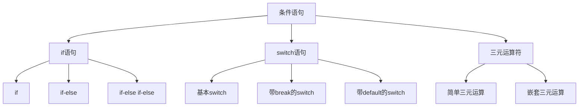

# 条件语句(if-switch)

## 条件语句概述

### 条件语句类型


### 条件语句对比
| 语句类型 | 适用场景 | 优点 | 缺点 |
|----------|----------|------|------|
| if | 简单条件判断 | 灵活、易读 | 复杂时嵌套深 |
| switch | 多值比较 | 结构清晰 | 只能比较相等 |
| 三元运算符 | 简单赋值 | 简洁 | 复杂时难读 |

## if语句

### 基本if语句
```javascript
// 1. 简单if语句
let age = 18;
if (age >= 18) {
    console.log('成年人');
}

// 2. if-else语句
if (age >= 18) {
    console.log('成年人');
} else {
    console.log('未成年人');
}

// 3. if-else if-else语句
let score = 85;
if (score >= 90) {
    console.log('优秀');
} else if (score >= 80) {
    console.log('良好');
} else if (score >= 70) {
    console.log('中等');
} else if (score >= 60) {
    console.log('及格');
} else {
    console.log('不及格');
}
```

### 复杂条件判断
```javascript
// 1. 逻辑运算符组合
let user = {
    name: 'John',
    age: 25,
    isVip: true,
    hasPermission: false
};

if (user.age >= 18 && user.isVip) {
    console.log('VIP成年人');
} else if (user.age >= 18 || user.hasPermission) {
    console.log('有权限用户');
} else {
    console.log('无权限用户');
}

// 2. 嵌套if语句
if (user.age >= 18) {
    if (user.isVip) {
        console.log('VIP成年人');
    } else {
        console.log('普通成年人');
    }
} else {
    console.log('未成年人');
}

// 3. 复杂条件表达式
let temperature = 25;
let isSummer = true;
let hasAirConditioner = true;

if ((temperature > 30 && isSummer) || 
    (temperature > 25 && !hasAirConditioner)) {
    console.log('需要降温');
} else if (temperature < 10 && !isSummer) {
    console.log('需要保暖');
} else {
    console.log('温度适宜');
}
```

### 条件判断最佳实践
```javascript
// 1. 使用早期返回
function processUser(user) {
    if (!user) {
        return '用户不存在';
    }
    
    if (!user.name) {
        return '用户名不能为空';
    }
    
    if (user.age < 0) {
        return '年龄不能为负数';
    }
    
    // 主要逻辑
    return `处理用户: ${user.name}`;
}

// 2. 使用变量存储复杂条件
function canAccess(user, resource) {
    const isAdmin = user.role === 'admin';
    const hasPermission = user.permissions.includes(resource);
    const isActive = user.status === 'active';
    
    if (isAdmin || (hasPermission && isActive)) {
        return true;
    }
    
    return false;
}

// 3. 使用函数封装条件逻辑
function isWeekend(date) {
    const day = date.getDay();
    return day === 0 || day === 6; // 0=周日, 6=周六
}

function isBusinessHours(date) {
    const hour = date.getHours();
    return hour >= 9 && hour < 18;
}

if (isWeekend(new Date()) || !isBusinessHours(new Date())) {
    console.log('非工作时间');
}
```

## switch语句

### 基本switch语句
```javascript
// 1. 基本switch结构
let day = 3;
let dayName;

switch (day) {
    case 1:
        dayName = '星期一';
        break;
    case 2:
        dayName = '星期二';
        break;
    case 3:
        dayName = '星期三';
        break;
    case 4:
        dayName = '星期四';
        break;
    case 5:
        dayName = '星期五';
        break;
    case 6:
        dayName = '星期六';
        break;
    case 7:
        dayName = '星期日';
        break;
    default:
        dayName = '无效日期';
}

console.log(dayName); // '星期三'
```

### switch语句特性
```javascript
// 1. 没有break的穿透效果
let month = 2;
let season;

switch (month) {
    case 12:
    case 1:
    case 2:
        season = '冬季';
        break;
    case 3:
    case 4:
    case 5:
        season = '春季';
        break;
    case 6:
    case 7:
    case 8:
        season = '夏季';
        break;
    case 9:
    case 10:
    case 11:
        season = '秋季';
        break;
    default:
        season = '无效月份';
}

console.log(season); // '冬季'

// 2. 使用表达式作为case
let score = 85;
let grade;

switch (true) {
    case score >= 90:
        grade = 'A';
        break;
    case score >= 80:
        grade = 'B';
        break;
    case score >= 70:
        grade = 'C';
        break;
    case score >= 60:
        grade = 'D';
        break;
    default:
        grade = 'F';
}

console.log(grade); // 'B'
```

### switch语句最佳实践
```javascript
// 1. 使用对象映射替代复杂switch
const statusMap = {
    'pending': '等待中',
    'processing': '处理中',
    'completed': '已完成',
    'failed': '失败',
    'cancelled': '已取消'
};

function getStatusText(status) {
    return statusMap[status] || '未知状态';
}

// 2. 使用函数映射
const actionMap = {
    'create': (data) => createItem(data),
    'update': (data) => updateItem(data),
    'delete': (data) => deleteItem(data),
    'read': (data) => readItem(data)
};

function executeAction(action, data) {
    const handler = actionMap[action];
    if (handler) {
        return handler(data);
    }
    throw new Error(`未知操作: ${action}`);
}

// 3. 现代switch用法
function processUser(user) {
    switch (user.role) {
        case 'admin': {
            const permissions = ['read', 'write', 'delete'];
            return { ...user, permissions };
        }
        case 'user': {
            const permissions = ['read'];
            return { ...user, permissions };
        }
        case 'guest': {
            const permissions = [];
            return { ...user, permissions };
        }
        default:
            throw new Error(`未知角色: ${user.role}`);
    }
}
```

## 三元运算符

### 基本三元运算符
```javascript
// 1. 简单三元运算
let age = 18;
let status = age >= 18 ? '成年人' : '未成年人';
console.log(status); // '成年人'

// 2. 嵌套三元运算
let score = 85;
let grade = score >= 90 ? 'A' : 
            score >= 80 ? 'B' : 
            score >= 70 ? 'C' : 
            score >= 60 ? 'D' : 'F';
console.log(grade); // 'B'

// 3. 复杂表达式
let user = { name: 'John', age: 25 };
let message = user.age >= 18 ? 
    `欢迎, ${user.name}!` : 
    '抱歉, 您未满18岁';
console.log(message); // '欢迎, John!'
```

### 三元运算符应用
```javascript
// 1. 条件赋值
let config = {
    apiUrl: process.env.NODE_ENV === 'production' ? 
        'https://api.prod.com' : 
        'http://localhost:3000',
    debug: process.env.NODE_ENV !== 'production'
};

// 2. 条件渲染 (React示例)
function UserCard({ user }) {
    return (
        <div>
            <h3>{user.name}</h3>
            {user.isVip ? 
                <span className="vip-badge">VIP</span> : 
                <span className="normal-badge">普通用户</span>
            }
        </div>
    );
}

// 3. 条件函数调用
function processData(data, options) {
    const processor = options.strict ? 
        strictProcessor : 
        lenientProcessor;
    
    return processor(data);
}
```

## 条件语句最佳实践

### 代码组织
```javascript
// 1. 使用早期返回减少嵌套
function validateUser(user) {
    if (!user) return { valid: false, error: '用户不存在' };
    if (!user.name) return { valid: false, error: '用户名不能为空' };
    if (!user.email) return { valid: false, error: '邮箱不能为空' };
    if (user.age < 0) return { valid: false, error: '年龄不能为负数' };
    
    return { valid: true, user };
}

// 2. 使用常量提高可读性
const USER_ROLES = {
    ADMIN: 'admin',
    USER: 'user',
    GUEST: 'guest'
};

const PERMISSIONS = {
    READ: 'read',
    WRITE: 'write',
    DELETE: 'delete'
};

function checkPermission(user, permission) {
    if (user.role === USER_ROLES.ADMIN) {
        return true;
    }
    
    if (user.role === USER_ROLES.USER) {
        return user.permissions.includes(permission);
    }
    
    return false;
}
```

### 性能优化
```javascript
// 1. 将最可能为真的条件放在前面
function processOrder(order) {
    // 大多数订单都是正常的，所以先检查正常情况
    if (order.status === 'normal') {
        return processNormalOrder(order);
    }
    
    if (order.status === 'urgent') {
        return processUrgentOrder(order);
    }
    
    if (order.status === 'cancelled') {
        return handleCancelledOrder(order);
    }
    
    return handleUnknownStatus(order);
}

// 2. 使用查找表替代复杂条件
const STATUS_HANDLERS = {
    'pending': handlePending,
    'processing': handleProcessing,
    'completed': handleCompleted,
    'failed': handleFailed
};

function processStatus(status, data) {
    const handler = STATUS_HANDLERS[status];
    if (handler) {
        return handler(data);
    }
    throw new Error(`未知状态: ${status}`);
}
```

## 相关链接
- [[01-基础认知层/04-控制结构/02-循环语句(for-while)]] - 循环语句
- [[01-基础认知层/04-控制结构/03-跳转语句(break-continue)]] - 跳转语句
- [[01-基础认知层/04-控制结构/04-控制流最佳实践]] - 控制流最佳实践
