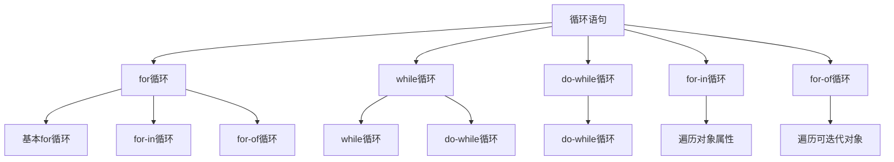

# 循环语句(for-while)

## 循环语句概述

### 循环类型


### 循环对比
| 循环类型 | 适用场景 | 优点 | 缺点 |
|----------|----------|------|------|
| for | 已知循环次数 | 结构清晰、性能好 | 语法相对复杂 |
| while | 条件循环 | 灵活、简洁 | 容易死循环 |
| do-while | 至少执行一次 | 保证执行一次 | 使用场景有限 |
| for-in | 遍历对象属性 | 简单易用 | 性能较差 |
| for-of | 遍历可迭代对象 | 语法简洁、性能好 | 需要ES6支持 |

## for循环

### 基本for循环
```javascript
// 1. 基本for循环
for (let i = 0; i < 5; i++) {
    console.log(i); // 0, 1, 2, 3, 4
}

// 2. 倒序循环
for (let i = 4; i >= 0; i--) {
    console.log(i); // 4, 3, 2, 1, 0
}

// 3. 步长循环
for (let i = 0; i < 10; i += 2) {
    console.log(i); // 0, 2, 4, 6, 8
}

// 4. 多变量循环
for (let i = 0, j = 10; i < j; i++, j--) {
    console.log(`i: ${i}, j: ${j}`);
}
```

### 复杂for循环
```javascript
// 1. 嵌套循环
for (let i = 0; i < 3; i++) {
    for (let j = 0; j < 3; j++) {
        console.log(`(${i}, ${j})`);
    }
}
// 输出: (0,0), (0,1), (0,2), (1,0), (1,1), (1,2), (2,0), (2,1), (2,2)

// 2. 条件循环
for (let i = 0; i < 10; i++) {
    if (i % 2 === 0) {
        console.log(`${i} 是偶数`);
    }
}

// 3. 提前终止
for (let i = 0; i < 10; i++) {
    if (i === 5) {
        break; // 跳出循环
    }
    console.log(i); // 0, 1, 2, 3, 4
}

// 4. 跳过当前迭代
for (let i = 0; i < 10; i++) {
    if (i % 2 === 0) {
        continue; // 跳过偶数
    }
    console.log(i); // 1, 3, 5, 7, 9
}
```

### for循环最佳实践
```javascript
// 1. 使用let避免变量提升问题
for (let i = 0; i < 3; i++) {
    setTimeout(() => {
        console.log(i); // 0, 1, 2
    }, 100);
}

// 对比var的问题
for (var j = 0; j < 3; j++) {
    setTimeout(() => {
        console.log(j); // 3, 3, 3
    }, 100);
}

// 2. 缓存数组长度
const arr = [1, 2, 3, 4, 5];
for (let i = 0, len = arr.length; i < len; i++) {
    console.log(arr[i]);
}

// 3. 使用解构赋值
const users = [
    { name: 'John', age: 30 },
    { name: 'Jane', age: 25 }
];

for (let i = 0; i < users.length; i++) {
    const { name, age } = users[i];
    console.log(`${name} is ${age} years old`);
}
```

## while循环

### 基本while循环
```javascript
// 1. 基本while循环
let i = 0;
while (i < 5) {
    console.log(i); // 0, 1, 2, 3, 4
    i++;
}

// 2. 条件循环
let count = 0;
while (count < 10) {
    if (count % 2 === 0) {
        console.log(`${count} 是偶数`);
    }
    count++;
}

// 3. 复杂条件
let userInput;
while (userInput !== 'quit') {
    userInput = prompt('请输入命令 (quit退出):');
    if (userInput === 'help') {
        console.log('可用命令: help, quit');
    }
}
```

### while循环应用
```javascript
// 1. 数据验证
function getValidNumber() {
    let input;
    while (true) {
        input = prompt('请输入一个数字:');
        if (!isNaN(input) && input !== '') {
            return Number(input);
        }
        console.log('请输入有效的数字!');
    }
}

// 2. 文件读取模拟
function readFile() {
    let content = '';
    let line;
    while ((line = getNextLine()) !== null) {
        content += line + '\n';
    }
    return content;
}

// 3. 游戏循环
function gameLoop() {
    let gameRunning = true;
    let score = 0;
    
    while (gameRunning) {
        const action = getPlayerAction();
        
        switch (action) {
            case 'move':
                score += 10;
                break;
            case 'quit':
                gameRunning = false;
                break;
        }
        
        if (score >= 100) {
            console.log('游戏胜利!');
            gameRunning = false;
        }
    }
}
```

## do-while循环

### 基本do-while循环
```javascript
// 1. 基本do-while循环
let i = 0;
do {
    console.log(i); // 0, 1, 2, 3, 4
    i++;
} while (i < 5);

// 2. 至少执行一次
let userChoice;
do {
    userChoice = prompt('请选择: 1-继续, 2-退出');
    if (userChoice === '1') {
        console.log('继续游戏...');
    }
} while (userChoice !== '2');

// 3. 菜单系统
function showMenu() {
    let choice;
    do {
        console.log('1. 新建文件');
        console.log('2. 打开文件');
        console.log('3. 保存文件');
        console.log('4. 退出');
        
        choice = prompt('请选择操作:');
        
        switch (choice) {
            case '1':
                createFile();
                break;
            case '2':
                openFile();
                break;
            case '3':
                saveFile();
                break;
            case '4':
                console.log('退出程序');
                break;
            default:
                console.log('无效选择，请重试');
        }
    } while (choice !== '4');
}
```

## for-in循环

### 遍历对象属性
```javascript
// 1. 遍历对象属性
const person = {
    name: 'John',
    age: 30,
    city: 'New York'
};

for (let key in person) {
    console.log(`${key}: ${person[key]}`);
}
// 输出: name: John, age: 30, city: New York

// 2. 遍历数组索引
const arr = ['a', 'b', 'c'];
for (let index in arr) {
    console.log(`${index}: ${arr[index]}`);
}
// 输出: 0: a, 1: b, 2: c

// 3. 检查属性
const obj = { a: 1, b: 2, c: 3 };
for (let prop in obj) {
    if (obj.hasOwnProperty(prop)) {
        console.log(`${prop}: ${obj[prop]}`);
    }
}
```

### for-in循环注意事项
```javascript
// 1. 原型链属性
function Person(name) {
    this.name = name;
}

Person.prototype.sayHello = function() {
    console.log(`Hello, I'm ${this.name}`);
};

const person = new Person('John');

for (let key in person) {
    console.log(key); // name, sayHello (包括原型方法)
}

// 2. 只遍历自有属性
for (let key in person) {
    if (person.hasOwnProperty(key)) {
        console.log(key); // 只有 name
    }
}

// 3. 使用Object.keys()替代
Object.keys(person).forEach(key => {
    console.log(`${key}: ${person[key]}`);
});
```

## for-of循环

### 遍历可迭代对象
```javascript
// 1. 遍历数组
const fruits = ['apple', 'banana', 'orange'];
for (let fruit of fruits) {
    console.log(fruit); // apple, banana, orange
}

// 2. 遍历字符串
const str = 'Hello';
for (let char of str) {
    console.log(char); // H, e, l, l, o
}

// 3. 遍历Map
const map = new Map([
    ['name', 'John'],
    ['age', 30],
    ['city', 'New York']
]);

for (let [key, value] of map) {
    console.log(`${key}: ${value}`);
}

// 4. 遍历Set
const set = new Set([1, 2, 3, 4, 5]);
for (let value of set) {
    console.log(value); // 1, 2, 3, 4, 5
}
```

### for-of循环应用
```javascript
// 1. 遍历NodeList
const elements = document.querySelectorAll('.item');
for (let element of elements) {
    element.classList.add('highlighted');
}

// 2. 遍历生成器
function* numberGenerator() {
    yield 1;
    yield 2;
    yield 3;
}

for (let num of numberGenerator()) {
    console.log(num); // 1, 2, 3
}

// 3. 遍历自定义可迭代对象
const customIterable = {
    *[Symbol.iterator]() {
        yield 'first';
        yield 'second';
        yield 'third';
    }
};

for (let item of customIterable) {
    console.log(item); // first, second, third
}
```

## 循环最佳实践

### 性能优化
```javascript
// 1. 缓存数组长度
const arr = [1, 2, 3, 4, 5];
const len = arr.length; // 缓存长度
for (let i = 0; i < len; i++) {
    console.log(arr[i]);
}

// 2. 使用for-of替代for-in
// 不推荐
for (let index in arr) {
    console.log(arr[index]);
}

// 推荐
for (let item of arr) {
    console.log(item);
}

// 3. 使用数组方法
// 替代for循环
arr.forEach(item => console.log(item));
arr.map(item => item * 2);
arr.filter(item => item > 2);
```

### 代码组织
```javascript
// 1. 使用函数封装循环逻辑
function processItems(items) {
    for (let item of items) {
        if (item.isValid) {
            processItem(item);
        }
    }
}

// 2. 使用早期返回
function findItem(items, target) {
    for (let item of items) {
        if (item.id === target) {
            return item; // 找到后立即返回
        }
    }
    return null;
}

// 3. 使用标签跳出嵌套循环
outerLoop: for (let i = 0; i < 3; i++) {
    for (let j = 0; j < 3; j++) {
        if (i === 1 && j === 1) {
            break outerLoop; // 跳出外层循环
        }
        console.log(`(${i}, ${j})`);
    }
}
```

## 相关链接
- [[01-基础认知层/04-控制结构/01-条件语句(if-switch)]] - 条件语句
- [[01-基础认知层/04-控制结构/03-跳转语句(break-continue)]] - 跳转语句
- [[01-基础认知层/04-控制结构/04-控制流最佳实践]] - 控制流最佳实践
