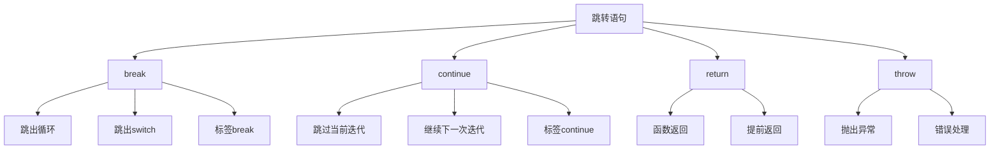

# 跳转语句(break-continue)

## 跳转语句概述

### 跳转语句类型


### 跳转语句对比
| 语句 | 作用范围 | 功能 | 使用场景 |
|------|----------|------|----------|
| break | 循环、switch | 跳出当前结构 | 条件满足时退出 |
| continue | 循环 | 跳过当前迭代 | 跳过某些情况 |
| return | 函数 | 返回函数值 | 函数执行完毕 |
| throw | 全局 | 抛出异常 | 错误处理 |

## break语句

### 基本break语句
```javascript
// 1. 在循环中使用break
for (let i = 0; i < 10; i++) {
    if (i === 5) {
        break; // 跳出循环
    }
    console.log(i); // 0, 1, 2, 3, 4
}

// 2. 在while循环中使用break
let i = 0;
while (i < 10) {
    if (i === 5) {
        break; // 跳出循环
    }
    console.log(i); // 0, 1, 2, 3, 4
    i++;
}

// 3. 在do-while循环中使用break
let j = 0;
do {
    if (j === 5) {
        break; // 跳出循环
    }
    console.log(j); // 0, 1, 2, 3, 4
    j++;
} while (j < 10);
```

### 在switch中使用break
```javascript
// 1. 基本switch中的break
let day = 3;
switch (day) {
    case 1:
        console.log('星期一');
        break; // 防止穿透
    case 2:
        console.log('星期二');
        break;
    case 3:
        console.log('星期三');
        break;
    default:
        console.log('其他');
}

// 2. 故意不使用break实现穿透
let month = 2;
switch (month) {
    case 12:
    case 1:
    case 2:
        console.log('冬季');
        break;
    case 3:
    case 4:
    case 5:
        console.log('春季');
        break;
    case 6:
    case 7:
    case 8:
        console.log('夏季');
        break;
    case 9:
    case 10:
    case 11:
        console.log('秋季');
        break;
}
```

### 标签break语句
```javascript
// 1. 跳出嵌套循环
outerLoop: for (let i = 0; i < 3; i++) {
    innerLoop: for (let j = 0; j < 3; j++) {
        if (i === 1 && j === 1) {
            break outerLoop; // 跳出外层循环
        }
        console.log(`(${i}, ${j})`);
    }
}
// 输出: (0,0), (0,1), (0,2), (1,0)

// 2. 复杂嵌套结构
function processMatrix(matrix) {
    rowLoop: for (let i = 0; i < matrix.length; i++) {
        colLoop: for (let j = 0; j < matrix[i].length; j++) {
            if (matrix[i][j] === null) {
                console.log(`发现空值 at (${i}, ${j})`);
                break rowLoop; // 跳出行循环
            }
            console.log(`处理 (${i}, ${j}): ${matrix[i][j]}`);
        }
    }
}

// 3. 多层嵌套
level1: for (let a = 0; a < 2; a++) {
    level2: for (let b = 0; b < 2; b++) {
        level3: for (let c = 0; c < 2; c++) {
            if (a === 1 && b === 1 && c === 1) {
                break level1; // 跳出最外层循环
            }
            console.log(`(${a}, ${b}, ${c})`);
        }
    }
}
```

## continue语句

### 基本continue语句
```javascript
// 1. 在for循环中使用continue
for (let i = 0; i < 10; i++) {
    if (i % 2 === 0) {
        continue; // 跳过偶数
    }
    console.log(i); // 1, 3, 5, 7, 9
}

// 2. 在while循环中使用continue
let i = 0;
while (i < 10) {
    i++;
    if (i % 2 === 0) {
        continue; // 跳过偶数
    }
    console.log(i); // 1, 3, 5, 7, 9
}

// 3. 在do-while循环中使用continue
let j = 0;
do {
    j++;
    if (j % 2 === 0) {
        continue; // 跳过偶数
    }
    console.log(j); // 1, 3, 5, 7, 9
} while (j < 10);
```

### continue语句应用
```javascript
// 1. 跳过无效数据
const data = [1, null, 3, undefined, 5, '', 7];
for (let item of data) {
    if (item == null || item === '') {
        continue; // 跳过无效数据
    }
    console.log(`处理数据: ${item}`);
}

// 2. 条件处理
const users = [
    { name: 'John', age: 30, active: true },
    { name: 'Jane', age: 25, active: false },
    { name: 'Bob', age: 35, active: true }
];

for (let user of users) {
    if (!user.active) {
        continue; // 跳过非活跃用户
    }
    if (user.age < 18) {
        continue; // 跳过未成年用户
    }
    console.log(`处理用户: ${user.name}`);
}

// 3. 错误处理
const files = ['file1.txt', 'file2.txt', 'file3.txt'];
for (let file of files) {
    try {
        const content = readFile(file);
        if (!content) {
            continue; // 跳过空文件
        }
        processFile(content);
    } catch (error) {
        console.log(`跳过文件 ${file}: ${error.message}`);
        continue; // 跳过出错的文件
    }
}
```

### 标签continue语句
```javascript
// 1. 在嵌套循环中使用continue
outerLoop: for (let i = 0; i < 3; i++) {
    innerLoop: for (let j = 0; j < 3; j++) {
        if (i === 1 && j === 1) {
            continue outerLoop; // 继续外层循环的下一次迭代
        }
        console.log(`(${i}, ${j})`);
    }
}
// 输出: (0,0), (0,1), (0,2), (1,0), (2,0), (2,1), (2,2)

// 2. 复杂嵌套结构
function processData(data) {
    rowLoop: for (let i = 0; i < data.length; i++) {
        if (data[i].length === 0) {
            continue rowLoop; // 跳过空行
        }
        
        colLoop: for (let j = 0; j < data[i].length; j++) {
            if (data[i][j] === null) {
                continue colLoop; // 跳过空值
            }
            console.log(`处理 (${i}, ${j}): ${data[i][j]}`);
        }
    }
}

// 3. 多层嵌套
level1: for (let a = 0; a < 3; a++) {
    level2: for (let b = 0; b < 3; b++) {
        if (a === 1 && b === 1) {
            continue level1; // 继续外层循环
        }
        level3: for (let c = 0; c < 3; c++) {
            if (c === 1) {
                continue level2; // 继续中层循环
            }
            console.log(`(${a}, ${b}, ${c})`);
        }
    }
}
```

## return语句

### 基本return语句
```javascript
// 1. 基本函数返回
function add(a, b) {
    return a + b; // 返回计算结果
}

// 2. 提前返回
function processUser(user) {
    if (!user) {
        return null; // 提前返回
    }
    
    if (!user.name) {
        return null; // 提前返回
    }
    
    // 主要逻辑
    return {
        id: user.id,
        name: user.name.toUpperCase(),
        age: user.age
    };
}

// 3. 条件返回
function getGrade(score) {
    if (score >= 90) return 'A';
    if (score >= 80) return 'B';
    if (score >= 70) return 'C';
    if (score >= 60) return 'D';
    return 'F';
}
```

### return语句应用
```javascript
// 1. 查找函数
function findUser(users, id) {
    for (let user of users) {
        if (user.id === id) {
            return user; // 找到后立即返回
        }
    }
    return null; // 未找到
}

// 2. 验证函数
function validateEmail(email) {
    if (!email) {
        return { valid: false, error: '邮箱不能为空' };
    }
    
    if (!email.includes('@')) {
        return { valid: false, error: '邮箱格式不正确' };
    }
    
    return { valid: true };
}

// 3. 递归函数
function factorial(n) {
    if (n <= 1) {
        return 1; // 基础情况
    }
    return n * factorial(n - 1); // 递归调用
}
```

## throw语句

### 基本throw语句
```javascript
// 1. 抛出错误
function divide(a, b) {
    if (b === 0) {
        throw new Error('除数不能为零');
    }
    return a / b;
}

// 2. 抛出自定义错误
class ValidationError extends Error {
    constructor(message) {
        super(message);
        this.name = 'ValidationError';
    }
}

function validateAge(age) {
    if (age < 0) {
        throw new ValidationError('年龄不能为负数');
    }
    if (age > 150) {
        throw new ValidationError('年龄不能超过150岁');
    }
}

// 3. 重新抛出错误
function processData(data) {
    try {
        return JSON.parse(data);
    } catch (error) {
        throw new Error(`数据解析失败: ${error.message}`);
    }
}
```

### 错误处理模式
```javascript
// 1. try-catch-finally
function riskyOperation() {
    try {
        // 可能出错的代码
        const result = dangerousFunction();
        return result;
    } catch (error) {
        console.error('操作失败:', error.message);
        return null;
    } finally {
        // 清理资源
        cleanup();
    }
}

// 2. 错误传播
function outerFunction() {
    try {
        innerFunction();
    } catch (error) {
        console.log('捕获到错误:', error.message);
        throw error; // 重新抛出
    }
}

// 3. 错误分类处理
function handleError(error) {
    if (error instanceof ValidationError) {
        console.log('验证错误:', error.message);
    } else if (error instanceof TypeError) {
        console.log('类型错误:', error.message);
    } else {
        console.log('未知错误:', error.message);
    }
}
```

## 跳转语句最佳实践

### 代码组织
```javascript
// 1. 使用早期返回减少嵌套
function processOrder(order) {
    if (!order) return null;
    if (!order.items || order.items.length === 0) return null;
    if (order.total <= 0) return null;
    
    // 主要逻辑
    return calculateTotal(order);
}

// 2. 使用标签提高可读性
function searchInMatrix(matrix, target) {
    searchLoop: for (let i = 0; i < matrix.length; i++) {
        for (let j = 0; j < matrix[i].length; j++) {
            if (matrix[i][j] === target) {
                console.log(`找到目标 at (${i}, ${j})`);
                break searchLoop; // 找到后跳出搜索
            }
        }
    }
}

// 3. 使用continue简化逻辑
function processValidItems(items) {
    for (let item of items) {
        if (!item.isValid) continue;
        if (item.isProcessed) continue;
        if (item.isLocked) continue;
        
        // 处理有效项目
        processItem(item);
    }
}
```

### 性能优化
```javascript
// 1. 使用break提前退出
function findFirstMatch(items, predicate) {
    for (let item of items) {
        if (predicate(item)) {
            return item; // 找到第一个匹配就返回
        }
    }
    return null;
}

// 2. 使用continue跳过无效数据
function processLargeDataset(data) {
    for (let item of data) {
        if (!item || item.isDeleted) continue;
        if (item.isArchived) continue;
        
        // 只处理有效数据
        processItem(item);
    }
}

// 3. 避免深层嵌套
function complexLogic(data) {
    for (let item of data) {
        if (!validateItem(item)) continue;
        
        const result = processItem(item);
        if (!result) continue;
        
        saveResult(result);
    }
}
```

## 相关链接
- [[01-基础认知层/04-控制结构/01-条件语句(if-switch)]] - 条件语句
- [[01-基础认知层/04-控制结构/02-循环语句(for-while)]] - 循环语句
- [[01-基础认知层/04-控制结构/04-控制流最佳实践]] - 控制流最佳实践
