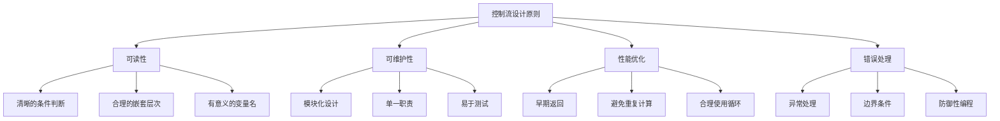

# 控制流最佳实践

## 控制流设计原则

### 设计原则


### 控制流质量指标
| 指标 | 描述 | 最佳实践 |
|------|------|----------|
| 圈复杂度 | 代码路径数量 | < 10 |
| 嵌套层次 | 代码嵌套深度 | < 4层 |
| 函数长度 | 单个函数行数 | < 50行 |
| 条件复杂度 | 条件表达式复杂度 | 使用辅助函数 |

## 条件语句最佳实践

### 提高可读性
```javascript
// 1. 使用有意义的变量名
const isUserLoggedIn = user && user.token;
const hasValidPermission = user.permissions.includes(requiredPermission);
const isWithinBusinessHours = currentHour >= 9 && currentHour < 18;

if (isUserLoggedIn && hasValidPermission && isWithinBusinessHours) {
    processRequest();
}

// 2. 使用早期返回减少嵌套
function processUser(user) {
    // 早期返回处理边界情况
    if (!user) return { error: '用户不存在' };
    if (!user.name) return { error: '用户名不能为空' };
    if (user.age < 0) return { error: '年龄不能为负数' };
    
    // 主要逻辑
    return {
        success: true,
        data: {
            id: user.id,
            name: user.name.toUpperCase(),
            age: user.age
        }
    };
}

// 3. 使用常量提高可读性
const USER_ROLES = {
    ADMIN: 'admin',
    USER: 'user',
    GUEST: 'guest'
};

const PERMISSIONS = {
    READ: 'read',
    WRITE: 'write',
    DELETE: 'delete'
};

function checkAccess(user, resource) {
    if (user.role === USER_ROLES.ADMIN) {
        return true;
    }
    
    if (user.role === USER_ROLES.USER) {
        return user.permissions.includes(resource);
    }
    
    return false;
}
```

### 复杂条件处理
```javascript
// 1. 使用辅助函数分解复杂条件
function isEligibleForDiscount(user, order) {
    return isVipUser(user) || 
           isFirstTimeCustomer(user) || 
           hasLargeOrder(order);
}

function isVipUser(user) {
    return user.membership === 'VIP' && user.membershipExpiry > new Date();
}

function isFirstTimeCustomer(user) {
    return user.orderCount === 0;
}

function hasLargeOrder(order) {
    return order.total > 1000;
}

// 2. 使用查找表替代复杂switch
const STATUS_HANDLERS = {
    'pending': handlePendingStatus,
    'processing': handleProcessingStatus,
    'completed': handleCompletedStatus,
    'failed': handleFailedStatus
};

function processStatus(status, data) {
    const handler = STATUS_HANDLERS[status];
    if (handler) {
        return handler(data);
    }
    throw new Error(`未知状态: ${status}`);
}

// 3. 使用策略模式
const validationStrategies = {
    email: (value) => /^[^\s@]+@[^\s@]+\.[^\s@]+$/.test(value),
    phone: (value) => /^\d{10,11}$/.test(value),
    age: (value) => value >= 0 && value <= 150
};

function validateField(type, value) {
    const validator = validationStrategies[type];
    if (!validator) {
        throw new Error(`未知验证类型: ${type}`);
    }
    return validator(value);
}
```

## 循环语句最佳实践

### 性能优化
```javascript
// 1. 缓存数组长度
function processArray(arr) {
    const len = arr.length; // 缓存长度
    for (let i = 0; i < len; i++) {
        processItem(arr[i]);
    }
}

// 2. 使用for-of替代for-in
// 不推荐
function processObjectKeys(obj) {
    for (let key in obj) {
        if (obj.hasOwnProperty(key)) {
            processValue(obj[key]);
        }
    }
}

// 推荐
function processObjectValues(obj) {
    for (let value of Object.values(obj)) {
        processValue(value);
    }
}

// 3. 使用数组方法
const numbers = [1, 2, 3, 4, 5];

// 替代for循环
const doubled = numbers.map(x => x * 2);
const evens = numbers.filter(x => x % 2 === 0);
const sum = numbers.reduce((acc, x) => acc + x, 0);

// 4. 使用生成器处理大数据
function* processLargeDataset(data) {
    for (let item of data) {
        if (item.isValid) {
            yield processItem(item);
        }
    }
}

function handleLargeDataset(data) {
    for (let result of processLargeDataset(data)) {
        saveResult(result);
    }
}
```

### 循环结构优化
```javascript
// 1. 使用早期退出
function findFirstMatch(items, predicate) {
    for (let item of items) {
        if (predicate(item)) {
            return item; // 找到第一个匹配就返回
        }
    }
    return null;
}

// 2. 使用continue跳过无效数据
function processValidItems(items) {
    for (let item of items) {
        if (!item || item.isDeleted) continue;
        if (item.isArchived) continue;
        if (!item.isValid) continue;
        
        // 只处理有效数据
        processItem(item);
    }
}

// 3. 使用标签跳出嵌套循环
function searchInMatrix(matrix, target) {
    searchLoop: for (let i = 0; i < matrix.length; i++) {
        for (let j = 0; j < matrix[i].length; j++) {
            if (matrix[i][j] === target) {
                console.log(`找到目标 at (${i}, ${j})`);
                break searchLoop; // 找到后跳出搜索
            }
        }
    }
}

// 4. 使用函数封装循环逻辑
function processItems(items, processor) {
    for (let item of items) {
        try {
            processor(item);
        } catch (error) {
            console.error(`处理项目失败: ${error.message}`);
        }
    }
}
```

## 错误处理最佳实践

### 异常处理模式
```javascript
// 1. 使用try-catch处理可能出错的代码
function safeParseJSON(jsonString) {
    try {
        return JSON.parse(jsonString);
    } catch (error) {
        console.error('JSON解析失败:', error.message);
        return null;
    }
}

// 2. 使用自定义错误类型
class ValidationError extends Error {
    constructor(message, field) {
        super(message);
        this.name = 'ValidationError';
        this.field = field;
    }
}

class NetworkError extends Error {
    constructor(message, statusCode) {
        super(message);
        this.name = 'NetworkError';
        this.statusCode = statusCode;
    }
}

// 3. 错误分类处理
function handleError(error) {
    if (error instanceof ValidationError) {
        console.log(`验证错误 (${error.field}): ${error.message}`);
    } else if (error instanceof NetworkError) {
        console.log(`网络错误 (${error.statusCode}): ${error.message}`);
    } else {
        console.log(`未知错误: ${error.message}`);
    }
}

// 4. 使用finally确保资源清理
function processFile(filename) {
    let fileHandle = null;
    try {
        fileHandle = openFile(filename);
        const content = readFile(fileHandle);
        return processContent(content);
    } catch (error) {
        console.error(`处理文件失败: ${error.message}`);
        throw error;
    } finally {
        if (fileHandle) {
            closeFile(fileHandle);
        }
    }
}
```

### 防御性编程
```javascript
// 1. 参数验证
function calculateArea(width, height) {
    if (typeof width !== 'number' || typeof height !== 'number') {
        throw new TypeError('宽度和高度必须是数字');
    }
    
    if (width < 0 || height < 0) {
        throw new RangeError('宽度和高度不能为负数');
    }
    
    return width * height;
}

// 2. 边界条件检查
function getArrayItem(arr, index) {
    if (!Array.isArray(arr)) {
        throw new TypeError('第一个参数必须是数组');
    }
    
    if (index < 0 || index >= arr.length) {
        throw new RangeError('索引超出范围');
    }
    
    return arr[index];
}

// 3. 使用默认值
function createUser(userData = {}) {
    return {
        id: userData.id || generateId(),
        name: userData.name || 'Anonymous',
        email: userData.email || '',
        age: userData.age || 0,
        isActive: userData.isActive !== undefined ? userData.isActive : true
    };
}

// 4. 使用可选链和空值合并
function getUserDisplayName(user) {
    return user?.profile?.displayName ?? user?.name ?? 'Unknown User';
}
```

## 代码组织最佳实践

### 函数设计
```javascript
// 1. 单一职责原则
function validateEmail(email) {
    if (!email) return false;
    return /^[^\s@]+@[^\s@]+\.[^\s@]+$/.test(email);
}

function validatePassword(password) {
    if (!password) return false;
    return password.length >= 8 && /[A-Z]/.test(password);
}

function validateUser(user) {
    return {
        email: validateEmail(user.email),
        password: validatePassword(user.password)
    };
}

// 2. 纯函数设计
function calculateTax(amount, rate) {
    return amount * rate;
}

function formatCurrency(amount) {
    return new Intl.NumberFormat('zh-CN', {
        style: 'currency',
        currency: 'CNY'
    }).format(amount);
}

// 3. 高阶函数
function createValidator(rules) {
    return function(data) {
        const errors = [];
        
        for (let [field, rule] of Object.entries(rules)) {
            if (!rule(data[field])) {
                errors.push(`${field} 验证失败`);
            }
        }
        
        return {
            isValid: errors.length === 0,
            errors
        };
    };
}

const userValidator = createValidator({
    name: (value) => value && value.length > 0,
    email: (value) => /^[^\s@]+@[^\s@]+\.[^\s@]+$/.test(value),
    age: (value) => value >= 0 && value <= 150
});
```

### 模块化设计
```javascript
// 1. 使用模块模式
const UserService = (function() {
    let users = [];
    
    function addUser(user) {
        if (validateUser(user)) {
            users.push(user);
            return true;
        }
        return false;
    }
    
    function getUser(id) {
        return users.find(user => user.id === id);
    }
    
    function getAllUsers() {
        return [...users]; // 返回副本
    }
    
    return {
        addUser,
        getUser,
        getAllUsers
    };
})();

// 2. 使用类设计
class OrderProcessor {
    constructor(validator, calculator, notifier) {
        this.validator = validator;
        this.calculator = calculator;
        this.notifier = notifier;
    }
    
    processOrder(order) {
        if (!this.validator.validate(order)) {
            throw new Error('订单验证失败');
        }
        
        const total = this.calculator.calculate(order);
        this.notifier.notify(order, total);
        
        return { success: true, total };
    }
}

// 3. 使用组合模式
function createOrderProcessor() {
    const validator = createOrderValidator();
    const calculator = createPriceCalculator();
    const notifier = createNotificationService();
    
    return new OrderProcessor(validator, calculator, notifier);
}
```

## 性能优化技巧

### 算法优化
```javascript
// 1. 使用Map替代对象查找
const userCache = new Map();

function getUser(id) {
    if (userCache.has(id)) {
        return userCache.get(id);
    }
    
    const user = fetchUserFromDatabase(id);
    userCache.set(id, user);
    return user;
}

// 2. 使用Set进行快速查找
const validStatuses = new Set(['pending', 'processing', 'completed']);

function isValidStatus(status) {
    return validStatuses.has(status);
}

// 3. 使用位运算优化
function hasPermission(userPermissions, requiredPermission) {
    return (userPermissions & requiredPermission) === requiredPermission;
}

// 4. 使用缓存避免重复计算
const memoCache = new Map();

function memoizedFibonacci(n) {
    if (memoCache.has(n)) {
        return memoCache.get(n);
    }
    
    let result;
    if (n <= 1) {
        result = n;
    } else {
        result = memoizedFibonacci(n - 1) + memoizedFibonacci(n - 2);
    }
    
    memoCache.set(n, result);
    return result;
}
```

## 相关链接
- [[01-基础认知层/04-控制结构/01-条件语句(if-switch)]] - 条件语句
- [[01-基础认知层/04-控制结构/02-循环语句(for-while)]] - 循环语句
- [[01-基础认知层/04-控制结构/03-跳转语句(break-continue)]] - 跳转语句
