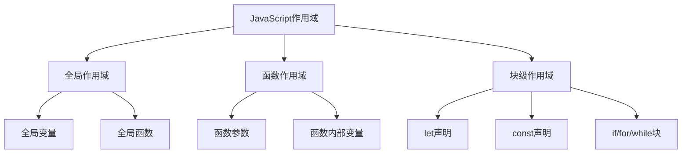

# 作用域链机制

## 作用域基础概念

### 作用域类型


### 作用域链形成机制
```javascript
// 1. 全局作用域
var globalVar = 'global';

function outerFunction() {
    // 2. 函数作用域
    var outerVar = 'outer';
    
    function innerFunction() {
        // 3. 内层函数作用域
        var innerVar = 'inner';
        
        // 作用域链查找顺序：
        // 1. innerFunction作用域
        // 2. outerFunction作用域  
        // 3. 全局作用域
        console.log(innerVar);  // 'inner' - 当前作用域
        console.log(outerVar);  // 'outer' - 外层作用域
        console.log(globalVar); // 'global' - 全局作用域
    }
    
    innerFunction();
}

outerFunction();
```

## 词法作用域详解

### 词法作用域特点
```javascript
// 词法作用域：函数的作用域在定义时确定，而不是调用时
var name = 'global';

function outer() {
    var name = 'outer';
    
    function inner() {
        console.log(name); // 输出 'outer'，不是 'global'
    }
    
    return inner;
}

var innerFunc = outer();
innerFunc(); // 仍然输出 'outer'
```

### 作用域链查找过程
```javascript
function createScopeChain() {
    var level1 = 'level1';
    
    function level2() {
        var level2Var = 'level2';
        
        function level3() {
            var level3Var = 'level3';
            
            // 变量查找过程：
            // 1. 在level3作用域查找 level3Var ✓
            // 2. 在level3作用域查找 level2Var ✗
            // 3. 在level2作用域查找 level2Var ✓
            // 4. 在level3作用域查找 level1 ✗
            // 5. 在level2作用域查找 level1 ✗
            // 6. 在全局作用域查找 level1 ✓
            
            console.log(level3Var); // 'level3'
            console.log(level2Var); // 'level2'
            console.log(level1);    // 'level1'
        }
        
        return level3;
    }
    
    return level2;
}

const level2Func = createScopeChain();
const level3Func = level2Func();
level3Func();
```

## 变量提升机制

### var声明提升
```javascript
// 1. 变量提升示例
console.log(hoistedVar); // undefined，不是 ReferenceError
var hoistedVar = 'Hello';

// 等价于：
var hoistedVar; // 声明提升到顶部
console.log(hoistedVar); // undefined
hoistedVar = 'Hello'; // 赋值留在原地

// 2. 函数声明提升
console.log(hoistedFunction()); // 'Hello'，函数完全提升

function hoistedFunction() {
    return 'Hello';
}

// 3. 函数表达式不提升
console.log(functionExpression); // undefined
var functionExpression = function() {
    return 'Hello';
};
```

### let/const暂时性死区
```javascript
// let/const 不提升，存在暂时性死区
console.log(letVar); // ReferenceError: Cannot access 'letVar' before initialization
let letVar = 'Hello';

console.log(constVar); // ReferenceError: Cannot access 'constVar' before initialization
const constVar = 'Hello';

// 暂时性死区示例
function temporalDeadZone() {
    console.log(typeof letVar); // ReferenceError
    let letVar = 'Hello';
}
```

## 作用域链性能优化

### 变量查找优化
```javascript
// 1. 避免深层嵌套
function avoidDeepNesting() {
    var result = 0;
    
    // 好的做法：减少作用域层级
    for (let i = 0; i < 1000; i++) {
        result += i;
    }
    
    return result;
}

// 2. 缓存外部变量
function cacheExternalVariables() {
    var externalData = getExternalData(); // 假设这是一个昂贵的操作
    
    function processData() {
        // 缓存外部变量，避免重复查找
        var data = externalData;
        
        for (let i = 0; i < data.length; i++) {
            // 使用缓存的变量
            processItem(data[i]);
        }
    }
    
    return processData;
}

// 3. 避免全局变量污染
(function() {
    // 使用IIFE创建私有作用域
    var privateVar = 'private';
    
    function privateFunction() {
        return privateVar;
    }
    
    // 只暴露必要的接口
    window.publicAPI = {
        getPrivate: privateFunction
    };
})();
```

### 内存管理优化
```javascript
// 1. 及时释放不需要的引用
function memoryOptimization() {
    var largeData = new Array(1000000).fill('data');
    
    function processData() {
        // 处理数据
        return largeData.map(item => item.toUpperCase());
    }
    
    var result = processData();
    
    // 及时释放大对象引用
    largeData = null;
    
    return result;
}

// 2. 避免循环引用
function avoidCircularReference() {
    var obj1 = { name: 'obj1' };
    var obj2 = { name: 'obj2' };
    
    // 创建循环引用
    obj1.ref = obj2;
    obj2.ref = obj1;
    
    // 使用完毕后及时清理
    function cleanup() {
        obj1.ref = null;
        obj2.ref = null;
    }
    
    return { obj1, obj2, cleanup };
}
```

## 作用域链调试技巧

### 调试工具使用
```javascript
// 1. 使用console.trace()追踪调用栈
function debugScopeChain() {
    var outerVar = 'outer';
    
    function inner() {
        var innerVar = 'inner';
        
        // 追踪当前调用栈和作用域
        console.trace('Current scope chain');
        console.log('Available variables:', {
            innerVar,
            outerVar,
            globalVar: typeof globalVar !== 'undefined' ? globalVar : 'undefined'
        });
    }
    
    inner();
}

// 2. 使用debugger语句
function debugWithBreakpoint() {
    var debugVar = 'debug';
    
    function inner() {
        var innerVar = 'inner';
        
        debugger; // 在此处设置断点
        // 在开发者工具中可以查看当前作用域链
        console.log(innerVar, debugVar);
    }
    
    inner();
}

// 3. 动态检查作用域
function inspectScope() {
    var inspectVar = 'inspect';
    
    function inner() {
        var innerVar = 'inner';
        
        // 动态检查变量是否存在
        function checkVariable(varName) {
            try {
                return eval(varName);
            } catch (e) {
                return 'undefined';
            }
        }
        
        console.log('inspectVar:', checkVariable('inspectVar'));
        console.log('innerVar:', checkVariable('innerVar'));
        console.log('nonExistentVar:', checkVariable('nonExistentVar'));
    }
    
    inner();
}
```

## 实际应用场景

### 模块模式
```javascript
// 1. 基本模块模式
var MyModule = (function() {
    // 私有变量
    var privateVar = 'private';
    var privateFunction = function() {
        return 'private function';
    };
    
    // 公共接口
    return {
        publicMethod: function() {
            return privateFunction();
        },
        getPrivateVar: function() {
            return privateVar;
        }
    };
})();

// 2. 增强模块模式
var EnhancedModule = (function(module) {
    // 添加新功能
    module.newMethod = function() {
        return 'new method';
    };
    
    return module;
})(MyModule || {});

// 3. 现代模块模式 (ES6)
const ModernModule = (() => {
    let privateVar = 'private';
    
    const privateFunction = () => 'private function';
    
    return {
        publicMethod: () => privateFunction(),
        getPrivateVar: () => privateVar
    };
})();
```

### 事件处理中的作用域
```javascript
// 1. 事件处理函数中的作用域
function createEventHandler() {
    var counter = 0;
    
    return function(event) {
        counter++;
        console.log(`Button clicked ${counter} times`);
        
        // 访问外部作用域的变量
        if (counter > 5) {
            event.target.disabled = true;
        }
    };
}

// 2. 使用闭包保持状态
function createCounter() {
    var count = 0;
    
    return {
        increment: function() {
            count++;
            return count;
        },
        decrement: function() {
            count--;
            return count;
        },
        getCount: function() {
            return count;
        }
    };
}

const counter = createCounter();
console.log(counter.increment()); // 1
console.log(counter.increment()); // 2
console.log(counter.getCount());  // 2
```

## 相关链接
- [[02-理解掌握层/01-作用域与闭包/02-词法作用域vs动态作用域]] - 作用域类型对比
- [[02-理解掌握层/01-作用域与闭包/03-闭包原理与应用]] - 闭包深入分析
- [[02-理解掌握层/01-作用域与闭包/04-内存泄漏与防范]] - 内存管理
- [[02-理解掌握层/01-作用域与闭包/05-实战案例分析]] - 实际应用案例
- [[02-理解掌握层/01-作用域与闭包/06-代码示例库-作用域闭包]] - 代码示例
