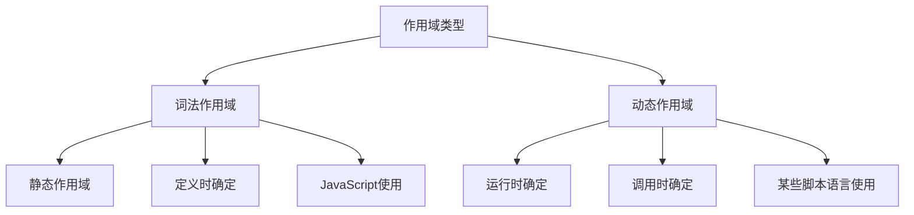

# 词法作用域 vs 动态作用域

## 作用域类型对比

### 作用域分类


### 核心区别
| 特性 | 词法作用域 | 动态作用域 |
|------|------------|------------|
| 确定时机 | 代码编写时 | 函数调用时 |
| 查找方式 | 静态分析 | 运行时查找 |
| 性能 | 编译时优化 | 运行时查找 |
| 可预测性 | 高 | 低 |
| JavaScript | ✅ 使用 | ❌ 不使用 |

## 词法作用域详解

### 词法作用域特点
```javascript
// 1. 词法作用域：函数的作用域在定义时确定
var name = 'global';

function outer() {
    var name = 'outer';
    
    function inner() {
        // 词法作用域：inner函数在定义时就能确定访问的name是outer作用域的
        console.log(name); // 输出 'outer'
    }
    
    return inner;
}

var innerFunc = outer();
innerFunc(); // 仍然输出 'outer'，不是 'global'

// 2. 词法作用域链
function createScopeChain() {
    var level1 = 'level1';
    
    function level2() {
        var level2Var = 'level2';
        
        function level3() {
            var level3Var = 'level3';
            
            // 词法作用域链：level3 -> level2 -> createScopeChain -> 全局
            console.log(level3Var); // 'level3'
            console.log(level2Var); // 'level2'
            console.log(level1);    // 'level1'
        }
        
        return level3;
    }
    
    return level2;
}

const level2Func = createScopeChain();
const level3Func = level2Func();
level3Func();
```

### 词法作用域的优势
```javascript
// 1. 可预测性
function predictableScope() {
    var config = { theme: 'dark' };
    
    function renderUI() {
        // 开发者可以确定这里访问的是外层作用域的config
        return `<div class="${config.theme}">Content</div>`;
    }
    
    return renderUI;
}

// 2. 性能优化
function performanceOptimization() {
    var expensiveData = processExpensiveData();
    
    function processData() {
        // 编译器可以优化变量查找，因为作用域是静态的
        return expensiveData.map(item => item.value * 2);
    }
    
    return processData;
}

// 3. 代码分析工具支持
function codeAnalysis() {
    var apiKey = 'secret-key';
    
    function makeRequest() {
        // 静态分析工具可以确定apiKey的来源
        return fetch('/api/data', {
            headers: { 'Authorization': `Bearer ${apiKey}` }
        });
    }
    
    return makeRequest;
}
```

## 动态作用域模拟

### 动态作用域概念
```javascript
// JavaScript本身不支持动态作用域，但可以模拟
function simulateDynamicScope() {
    var name = 'outer';
    
    function inner() {
        // 在动态作用域中，这里会查找调用时的作用域
        console.log(name);
    }
    
    function caller1() {
        var name = 'caller1';
        inner(); // 在动态作用域中会输出 'caller1'
    }
    
    function caller2() {
        var name = 'caller2';
        inner(); // 在动态作用域中会输出 'caller2'
    }
    
    // 在词法作用域中，两者都输出 'outer'
    caller1(); // 输出 'outer'
    caller2(); // 输出 'outer'
}

// 使用with语句模拟动态作用域（不推荐）
function simulateWithDynamicScope() {
    var obj1 = { name: 'obj1' };
    var obj2 = { name: 'obj2' };
    
    function inner() {
        console.log(name); // 动态查找
    }
    
    with (obj1) {
        inner(); // 输出 'obj1'
    }
    
    with (obj2) {
        inner(); // 输出 'obj2'
    }
}
```

### 动态作用域的问题
```javascript
// 1. 不可预测性
function unpredictableScope() {
    function inner() {
        // 无法确定name来自哪里
        console.log(name);
    }
    
    // 不同的调用方式产生不同的结果
    function callerA() {
        var name = 'A';
        inner(); // 输出 'A'
    }
    
    function callerB() {
        var name = 'B';
        inner(); // 输出 'B'
    }
    
    callerA();
    callerB();
}

// 2. 性能问题
function performanceIssue() {
    function inner() {
        // 每次调用都要动态查找变量
        return expensiveOperation + complexCalculation;
    }
    
    // 无法进行编译时优化
    for (let i = 0; i < 1000000; i++) {
        inner();
    }
}

// 3. 调试困难
function debuggingDifficulty() {
    function inner() {
        // 调试时无法确定变量的来源
        debugger;
        console.log(mysteriousVar);
    }
    
    function caller1() {
        var mysteriousVar = 'from caller1';
        inner();
    }
    
    function caller2() {
        var mysteriousVar = 'from caller2';
        inner();
    }
}
```

## 实际应用对比

### 词法作用域应用
```javascript
// 1. 模块模式
var Module = (function() {
    var privateVar = 'private';
    
    function privateFunction() {
        return privateVar;
    }
    
    return {
        publicMethod: function() {
            // 词法作用域确保访问私有变量
            return privateFunction();
        }
    };
})();

// 2. 闭包应用
function createCounter() {
    var count = 0;
    
    return {
        increment: function() {
            count++;
            return count;
        },
        getCount: function() {
            return count;
        }
    };
}

// 3. 事件处理
function createEventHandler(element) {
    var clickCount = 0;
    
    element.addEventListener('click', function() {
        clickCount++;
        console.log(`Clicked ${clickCount} times`);
    });
}
```

### 动态作用域模拟应用
```javascript
// 1. 上下文传递
function createContextualFunction() {
    function execute(context) {
        // 模拟动态作用域，通过参数传递上下文
        return context.data.map(item => item.value);
    }
    
    return execute;
}

// 2. 配置对象模式
function createConfigurableFunction() {
    function process(config) {
        // 通过配置对象模拟动态作用域
        return config.algorithm(config.data);
    }
    
    return process;
}

// 3. 回调函数模式
function createCallbackFunction() {
    function execute(callback, context) {
        // 通过回调函数模拟动态作用域
        return callback(context);
    }
    
    return execute;
}
```

## 性能对比分析

### 词法作用域性能
```javascript
// 1. 编译时优化
function lexicalScopePerformance() {
    var data = getLargeDataSet();
    
    function processData() {
        // 编译器可以优化变量查找
        return data.map(item => item.value * 2);
    }
    
    // 性能测试
    console.time('lexical');
    for (let i = 0; i < 1000000; i++) {
        processData();
    }
    console.timeEnd('lexical');
}

// 2. 内联缓存优化
function inlineCacheOptimization() {
    var obj = { name: 'test', value: 42 };
    
    function accessProperty() {
        // V8引擎可以缓存属性访问
        return obj.name + obj.value;
    }
    
    // 重复调用时性能更好
    for (let i = 0; i < 1000000; i++) {
        accessProperty();
    }
}
```

### 动态作用域性能问题
```javascript
// 1. 运行时查找开销
function dynamicScopePerformance() {
    function inner() {
        // 每次调用都要动态查找变量
        return globalVar + localVar;
    }
    
    // 性能测试
    console.time('dynamic');
    for (let i = 0; i < 1000000; i++) {
        inner();
    }
    console.timeEnd('dynamic');
}

// 2. 无法进行编译时优化
function noCompileTimeOptimization() {
    function inner() {
        // 编译器无法确定变量的类型和位置
        return unknownVar * 2;
    }
    
    // 无法进行类型特化和内联优化
    for (let i = 0; i < 1000000; i++) {
        inner();
    }
}
```

## 最佳实践建议

### 词法作用域最佳实践
```javascript
// 1. 合理使用闭包
function bestPracticeClosure() {
    var config = { apiUrl: '/api', timeout: 5000 };
    
    function createApiClient() {
        // 使用词法作用域访问配置
        return {
            get: function(endpoint) {
                return fetch(config.apiUrl + endpoint, {
                    timeout: config.timeout
                });
            }
        };
    }
    
    return createApiClient();
}

// 2. 避免全局变量污染
(function() {
    // 使用IIFE创建私有作用域
    var privateVar = 'private';
    
    function privateFunction() {
        return privateVar;
    }
    
    // 只暴露必要的接口
    window.publicAPI = {
        getPrivate: privateFunction
    };
})();

// 3. 模块化设计
const MyModule = (() => {
    let state = {};
    
    const privateMethod = () => {
        return state;
    };
    
    return {
        publicMethod: () => privateMethod(),
        setState: (newState) => { state = newState; }
    };
})();
```

### 避免动态作用域陷阱
```javascript
// 1. 避免使用with语句
function avoidWithStatement() {
    var obj = { name: 'test' };
    
    // 错误：使用with语句
    // with (obj) {
    //     console.log(name);
    // }
    
    // 正确：直接访问属性
    console.log(obj.name);
}

// 2. 避免eval函数
function avoidEval() {
    var code = 'var dynamicVar = "dynamic";';
    
    // 错误：使用eval
    // eval(code);
    
    // 正确：使用其他方式
    var dynamicVar = 'dynamic';
}

// 3. 明确变量来源
function explicitVariableSource() {
    var config = { theme: 'dark' };
    
    function renderComponent(componentConfig) {
        // 明确指定配置来源
        const theme = componentConfig.theme || config.theme;
        return `<div class="${theme}">Content</div>`;
    }
    
    return renderComponent;
}
```

## 相关链接
- [[02-理解掌握层/01-作用域与闭包/01-作用域链机制]] - 作用域链基础
- [[02-理解掌握层/01-作用域与闭包/03-闭包原理与应用]] - 闭包深入分析
- [[02-理解掌握层/01-作用域与闭包/04-内存泄漏与防范]] - 内存管理
- [[02-理解掌握层/01-作用域与闭包/05-实战案例分析]] - 实际应用案例
- [[02-理解掌握层/01-作用域与闭包/06-代码示例库-作用域闭包]] - 代码示例
