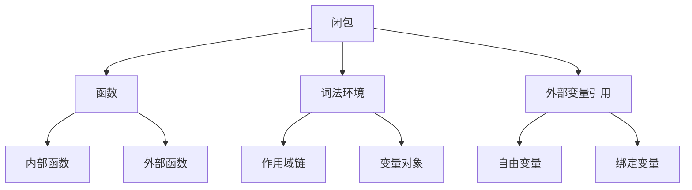

# 闭包原理与应用

## 闭包基础概念

### 闭包定义


### 闭包形成条件
```javascript
// 1. 基本闭包示例
function outerFunction() {
    var outerVariable = 'I am outer';
    
    function innerFunction() {
        // 内部函数访问外部函数的变量
        console.log(outerVariable);
    }
    
    return innerFunction; // 返回内部函数
}

var closure = outerFunction();
closure(); // 输出: 'I am outer'

// 2. 闭包保持对外部变量的引用
function createCounter() {
    var count = 0; // 外部变量
    
    return function() {
        count++; // 访问并修改外部变量
        return count;
    };
}

var counter1 = createCounter();
var counter2 = createCounter();

console.log(counter1()); // 1
console.log(counter1()); // 2
console.log(counter2()); // 1 (独立的闭包)
console.log(counter1()); // 3
```

## 闭包原理深入

### 闭包的内存机制
```javascript
// 1. 闭包如何保持变量引用
function demonstrateClosure() {
    var data = 'sensitive data';
    
    function getData() {
        return data;
    }
    
    function setData(newData) {
        data = newData;
    }
    
    // 返回包含多个函数的对象
    return {
        get: getData,
        set: setData
    };
}

var dataManager = demonstrateClosure();
console.log(dataManager.get()); // 'sensitive data'
dataManager.set('new data');
console.log(dataManager.get()); // 'new data'

// 2. 闭包的生命周期
function closureLifecycle() {
    var lifecycle = 'created';
    
    function updateLifecycle() {
        lifecycle = 'updated';
        return lifecycle;
    }
    
    function getLifecycle() {
        return lifecycle;
    }
    
    return { update: updateLifecycle, get: getLifecycle };
}

var lifecycle = closureLifecycle();
console.log(lifecycle.get()); // 'created'
lifecycle.update();
console.log(lifecycle.get()); // 'updated'
```

### 闭包的作用域链
```javascript
// 1. 多层闭包
function createMultiLevelClosure() {
    var level1 = 'level1';
    
    function level2() {
        var level2Var = 'level2';
        
        function level3() {
            var level3Var = 'level3';
            
            // 闭包可以访问所有外层作用域的变量
            return {
                getLevel1: () => level1,
                getLevel2: () => level2Var,
                getLevel3: () => level3Var,
                getAll: () => ({ level1, level2Var, level3Var })
            };
        }
        
        return level3();
    }
    
    return level2();
}

var multiClosure = createMultiLevelClosure();
console.log(multiClosure.getAll());
// { level1: 'level1', level2Var: 'level2', level3Var: 'level3' }

// 2. 闭包中的this绑定
function closureWithThis() {
    var self = this;
    var data = 'data';
    
    return {
        getData: function() {
            // 闭包中的this指向调用对象
            return this.data || data;
        },
        getDataArrow: () => {
            // 箭头函数中的this指向外层作用域
            return self.data || data;
        }
    };
}

var obj = { data: 'object data' };
var closure = closureWithThis.call(obj);
console.log(closure.getData()); // 'object data'
console.log(closure.getDataArrow()); // 'object data'
```

## 闭包的实际应用

### 1. 模块模式
```javascript
// 基本模块模式
var Calculator = (function() {
    // 私有变量
    var result = 0;
    var history = [];
    
    // 私有函数
    function addToHistory(operation, value) {
        history.push({ operation, value, result });
    }
    
    // 公共接口
    return {
        add: function(value) {
            result += value;
            addToHistory('add', value);
            return this;
        },
        
        subtract: function(value) {
            result -= value;
            addToHistory('subtract', value);
            return this;
        },
        
        multiply: function(value) {
            result *= value;
            addToHistory('multiply', value);
            return this;
        },
        
        getResult: function() {
            return result;
        },
        
        getHistory: function() {
            return history.slice(); // 返回副本
        },
        
        reset: function() {
            result = 0;
            history = [];
            return this;
        }
    };
})();

// 使用示例
Calculator.add(5).multiply(2).subtract(3);
console.log(Calculator.getResult()); // 7
console.log(Calculator.getHistory());

// 增强模块模式
var EnhancedCalculator = (function(calculator) {
    // 添加新功能
    calculator.divide = function(value) {
        if (value === 0) {
            throw new Error('Division by zero');
        }
        this.result /= value;
        this.addToHistory('divide', value);
        return this;
    };
    
    calculator.power = function(exponent) {
        this.result = Math.pow(this.result, exponent);
        this.addToHistory('power', exponent);
        return this;
    };
    
    return calculator;
})(Calculator);
```

### 2. 函数工厂
```javascript
// 创建不同类型的验证器
function createValidator(type, options = {}) {
    var rules = [];
    var customMessages = options.messages || {};
    
    function addRule(rule, message) {
        rules.push({ rule, message });
    }
    
    return {
        required: function(message) {
            addRule('required', message || customMessages.required || 'This field is required');
            return this;
        },
        
        minLength: function(length, message) {
            addRule('minLength', message || customMessages.minLength || `Minimum length is ${length}`);
            return this;
        },
        
        maxLength: function(length, message) {
            addRule('maxLength', message || customMessages.maxLength || `Maximum length is ${length}`);
            return this;
        },
        
        pattern: function(regex, message) {
            addRule('pattern', message || customMessages.pattern || 'Invalid format');
            return this;
        },
        
        validate: function(value) {
            var errors = [];
            
            for (var i = 0; i < rules.length; i++) {
                var rule = rules[i];
                var isValid = true;
                
                switch (rule.rule) {
                    case 'required':
                        isValid = value !== null && value !== undefined && value !== '';
                        break;
                    case 'minLength':
                        isValid = value.length >= rule.length;
                        break;
                    case 'maxLength':
                        isValid = value.length <= rule.length;
                        break;
                    case 'pattern':
                        isValid = rule.regex.test(value);
                        break;
                }
                
                if (!isValid) {
                    errors.push(rule.message);
                }
            }
            
            return {
                isValid: errors.length === 0,
                errors: errors
            };
        }
    };
}

// 使用示例
var emailValidator = createValidator('email', {
    messages: {
        required: 'Email is required',
        pattern: 'Invalid email format'
    }
}).required().pattern(/^[^\s@]+@[^\s@]+\.[^\s@]+$/);

var passwordValidator = createValidator('password')
    .required('Password is required')
    .minLength(8, 'Password must be at least 8 characters')
    .maxLength(20, 'Password must be no more than 20 characters');

console.log(emailValidator.validate('test@example.com'));
console.log(passwordValidator.validate('123456'));
```

### 3. 事件处理
```javascript
// 创建事件管理器
function createEventManager() {
    var events = {};
    var maxListeners = 10;
    
    function validateEventName(eventName) {
        if (typeof eventName !== 'string' || eventName.trim() === '') {
            throw new Error('Event name must be a non-empty string');
        }
    }
    
    function validateListener(listener) {
        if (typeof listener !== 'function') {
            throw new Error('Listener must be a function');
        }
    }
    
    return {
        on: function(eventName, listener) {
            validateEventName(eventName);
            validateListener(listener);
            
            if (!events[eventName]) {
                events[eventName] = [];
            }
            
            if (events[eventName].length >= maxListeners) {
                console.warn(`Maximum listeners (${maxListeners}) exceeded for event "${eventName}"`);
            }
            
            events[eventName].push(listener);
            return this;
        },
        
        off: function(eventName, listener) {
            validateEventName(eventName);
            
            if (!events[eventName]) {
                return this;
            }
            
            if (listener) {
                var index = events[eventName].indexOf(listener);
                if (index > -1) {
                    events[eventName].splice(index, 1);
                }
            } else {
                events[eventName] = [];
            }
            
            return this;
        },
        
        emit: function(eventName, ...args) {
            validateEventName(eventName);
            
            if (!events[eventName]) {
                return this;
            }
            
            events[eventName].forEach(function(listener) {
                try {
                    listener.apply(null, args);
                } catch (error) {
                    console.error(`Error in listener for event "${eventName}":`, error);
                }
            });
            
            return this;
        },
        
        once: function(eventName, listener) {
            validateEventName(eventName);
            validateListener(listener);
            
            var onceWrapper = function(...args) {
                listener.apply(null, args);
                this.off(eventName, onceWrapper);
            }.bind(this);
            
            return this.on(eventName, onceWrapper);
        },
        
        setMaxListeners: function(max) {
            maxListeners = max;
            return this;
        },
        
        getEventNames: function() {
            return Object.keys(events);
        },
        
        getListenerCount: function(eventName) {
            return events[eventName] ? events[eventName].length : 0;
        }
    };
}

// 使用示例
var eventManager = createEventManager();

eventManager
    .on('user:login', function(user) {
        console.log('User logged in:', user.name);
    })
    .on('user:login', function(user) {
        console.log('Welcome back,', user.name);
    })
    .once('user:first-login', function(user) {
        console.log('First time login for:', user.name);
    });

eventManager.emit('user:login', { name: 'John', id: 1 });
eventManager.emit('user:first-login', { name: 'John', id: 1 });
```

### 4. 缓存和记忆化
```javascript
// 创建缓存函数
function createCache(fn, maxSize = 100) {
    var cache = new Map();
    var accessOrder = [];
    
    function get(key) {
        if (cache.has(key)) {
            // 更新访问顺序
            var index = accessOrder.indexOf(key);
            if (index > -1) {
                accessOrder.splice(index, 1);
            }
            accessOrder.push(key);
            return cache.get(key);
        }
        return undefined;
    }
    
    function set(key, value) {
        if (cache.size >= maxSize) {
            // 移除最久未使用的项
            var oldestKey = accessOrder.shift();
            cache.delete(oldestKey);
        }
        
        cache.set(key, value);
        accessOrder.push(key);
    }
    
    return function(...args) {
        var key = JSON.stringify(args);
        var cached = get(key);
        
        if (cached !== undefined) {
            console.log('Cache hit for:', key);
            return cached;
        }
        
        console.log('Cache miss for:', key);
        var result = fn.apply(this, args);
        set(key, result);
        return result;
    };
}

// 使用示例
function expensiveCalculation(n) {
    console.log('Computing for:', n);
    var result = 0;
    for (var i = 0; i < n; i++) {
        result += Math.sqrt(i);
    }
    return result;
}

var cachedCalculation = createCache(expensiveCalculation, 5);

console.log(cachedCalculation(1000)); // 计算
console.log(cachedCalculation(1000)); // 从缓存获取
console.log(cachedCalculation(2000)); // 计算
console.log(cachedCalculation(1000)); // 从缓存获取
```

## 闭包性能优化

### 内存管理
```javascript
// 1. 及时释放闭包引用
function createClosureWithCleanup() {
    var largeData = new Array(1000000).fill('data');
    var listeners = [];
    
    function addListener(listener) {
        listeners.push(listener);
    }
    
    function removeListener(listener) {
        var index = listeners.indexOf(listener);
        if (index > -1) {
            listeners.splice(index, 1);
        }
    }
    
    function cleanup() {
        // 清理大对象引用
        largeData = null;
        listeners = [];
    }
    
    return {
        addListener: addListener,
        removeListener: removeListener,
        cleanup: cleanup
    };
}

// 2. 避免循环引用
function avoidCircularReference() {
    var obj1 = { name: 'obj1' };
    var obj2 = { name: 'obj2' };
    
    // 创建循环引用
    obj1.ref = obj2;
    obj2.ref = obj1;
    
    function createClosure() {
        return function() {
            // 闭包引用循环对象
            console.log(obj1.name, obj2.name);
        };
    }
    
    var closure = createClosure();
    
    // 使用完毕后清理
    function cleanup() {
        obj1.ref = null;
        obj2.ref = null;
        obj1 = null;
        obj2 = null;
    }
    
    return { closure, cleanup };
}
```

### 性能优化技巧
```javascript
// 1. 减少闭包中的变量数量
function optimizedClosure() {
    var config = { apiUrl: '/api', timeout: 5000 };
    var cache = new Map();
    
    // 只保留必要的变量在闭包中
    function createApiClient() {
        var apiUrl = config.apiUrl;
        var timeout = config.timeout;
        
        return {
            get: function(endpoint) {
                var key = endpoint;
                if (cache.has(key)) {
                    return cache.get(key);
                }
                
                var result = fetch(apiUrl + endpoint, { timeout });
                cache.set(key, result);
                return result;
            }
        };
    }
    
    return createApiClient();
}

// 2. 使用对象池
function createObjectPool() {
    var pool = [];
    var maxSize = 100;
    
    function createObject() {
        return { id: Date.now(), data: null };
    }
    
    function getObject() {
        if (pool.length > 0) {
            return pool.pop();
        }
        return createObject();
    }
    
    function returnObject(obj) {
        if (pool.length < maxSize) {
            obj.data = null; // 清理数据
            pool.push(obj);
        }
    }
    
    return {
        get: getObject,
        return: returnObject,
        size: () => pool.length
    };
}
```

## 相关链接
- [[02-理解掌握层/01-作用域与闭包/01-作用域链机制]] - 作用域链基础
- [[02-理解掌握层/01-作用域与闭包/02-词法作用域vs动态作用域]] - 作用域类型对比
- [[02-理解掌握层/01-作用域与闭包/04-内存泄漏与防范]] - 内存管理
- [[02-理解掌握层/01-作用域与闭包/05-实战案例分析]] - 实际应用案例
- [[02-理解掌握层/01-作用域与闭包/06-代码示例库-作用域闭包]] - 代码示例
