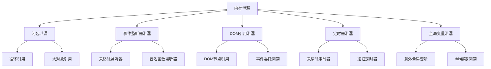

# 内存泄漏与防范

## 内存泄漏概述

### 内存泄漏类型


### 内存泄漏检测
```javascript
// 1. 内存使用监控
function monitorMemory() {
    if (performance.memory) {
        const memory = performance.memory;
        console.log('内存使用情况:');
        console.log(`已使用: ${(memory.usedJSHeapSize / 1024 / 1024).toFixed(2)} MB`);
        console.log(`总分配: ${(memory.totalJSHeapSize / 1024 / 1024).toFixed(2)} MB`);
        console.log(`限制: ${(memory.jsHeapSizeLimit / 1024 / 1024).toFixed(2)} MB`);
    }
}

// 2. 内存泄漏检测器
class MemoryLeakDetector {
    constructor() {
        this.baseline = null;
        this.threshold = 10 * 1024 * 1024; // 10MB
        this.interval = 5000; // 5秒
        this.timer = null;
    }
    
    start() {
        this.baseline = this.getCurrentMemory();
        this.timer = setInterval(() => {
            this.checkMemoryLeak();
        }, this.interval);
    }
    
    stop() {
        if (this.timer) {
            clearInterval(this.timer);
            this.timer = null;
        }
    }
    
    getCurrentMemory() {
        return performance.memory ? performance.memory.usedJSHeapSize : 0;
    }
    
    checkMemoryLeak() {
        const current = this.getCurrentMemory();
        const increase = current - this.baseline;
        
        if (increase > this.threshold) {
            console.warn(`潜在内存泄漏检测到: 增加了 ${(increase / 1024 / 1024).toFixed(2)} MB`);
        }
    }
}

// 使用示例
const detector = new MemoryLeakDetector();
detector.start();
```

## 闭包内存泄漏

### 循环引用问题
```javascript
// 1. 循环引用示例
function createCircularReference() {
    var obj1 = { name: 'obj1' };
    var obj2 = { name: 'obj2' };
    
    // 创建循环引用
    obj1.ref = obj2;
    obj2.ref = obj1;
    
    // 闭包引用循环对象
    return function() {
        console.log(obj1.name, obj2.name);
    };
}

// 2. 避免循环引用
function avoidCircularReference() {
    var obj1 = { name: 'obj1' };
    var obj2 = { name: 'obj2' };
    
    // 使用弱引用或避免直接引用
    return function() {
        console.log(obj1.name, obj2.name);
        
        // 使用完毕后清理引用
        obj1 = null;
        obj2 = null;
    };
}

// 3. 使用WeakMap避免循环引用
function useWeakMap() {
    var weakMap = new WeakMap();
    var obj = { name: 'test' };
    
    weakMap.set(obj, 'metadata');
    
    return function() {
        console.log(weakMap.get(obj));
        // obj被垃圾回收时，WeakMap中的条目也会被自动清理
    };
}
```

### 大对象引用
```javascript
// 1. 大对象泄漏示例
function createLargeObjectLeak() {
    var largeData = new Array(1000000).fill('data');
    
    return function() {
        // 闭包保持对大对象的引用
        return largeData.length;
    };
}

// 2. 避免大对象泄漏
function avoidLargeObjectLeak() {
    var largeData = new Array(1000000).fill('data');
    
    // 只保留必要的数据
    var dataLength = largeData.length;
    var dataSummary = largeData.slice(0, 100); // 只保留前100个元素
    
    // 清理大对象
    largeData = null;
    
    return function() {
        return { length: dataLength, summary: dataSummary };
    };
}

// 3. 使用对象池
function createObjectPool() {
    var pool = [];
    var maxSize = 100;
    
    function createObject() {
        return { id: Date.now(), data: new Array(1000).fill(0) };
    }
    
    function getObject() {
        if (pool.length > 0) {
            return pool.pop();
        }
        return createObject();
    }
    
    function returnObject(obj) {
        if (pool.length < maxSize) {
            obj.data = null; // 清理数据
            pool.push(obj);
        }
    }
    
    return { get: getObject, return: returnObject };
}
```

## 事件监听器泄漏

### 未移除的监听器
```javascript
// 1. 事件监听器泄漏示例
function createEventListenerLeak() {
    var element = document.getElementById('button');
    var data = new Array(100000).fill('data');
    
    // 错误：未移除事件监听器
    element.addEventListener('click', function() {
        console.log('Clicked', data.length);
    });
    
    return element;
}

// 2. 正确的事件监听器管理
function createEventListenerManager() {
    var element = document.getElementById('button');
    var data = new Array(100000).fill('data');
    var listeners = [];
    
    function addListener(event, handler) {
        element.addEventListener(event, handler);
        listeners.push({ event, handler });
    }
    
    function removeListener(event, handler) {
        element.removeEventListener(event, handler);
        var index = listeners.findIndex(l => l.event === event && l.handler === handler);
        if (index > -1) {
            listeners.splice(index, 1);
        }
    }
    
    function cleanup() {
        listeners.forEach(({ event, handler }) => {
            element.removeEventListener(event, handler);
        });
        listeners = [];
        data = null;
    }
    
    addListener('click', function() {
        console.log('Clicked', data.length);
    });
    
    return { addListener, removeListener, cleanup };
}

// 3. 使用事件委托
function useEventDelegation() {
    var container = document.getElementById('container');
    var data = new Array(100000).fill('data');
    
    // 使用事件委托，只需要一个监听器
    container.addEventListener('click', function(event) {
        if (event.target.matches('.button')) {
            console.log('Button clicked', data.length);
        }
    });
    
    return {
        cleanup: function() {
            container.removeEventListener('click', arguments.callee);
            data = null;
        }
    };
}
```

### 匿名函数监听器
```javascript
// 1. 匿名函数监听器问题
function createAnonymousListenerLeak() {
    var element = document.getElementById('button');
    var data = new Array(100000).fill('data');
    
    // 错误：匿名函数无法移除
    element.addEventListener('click', function() {
        console.log('Anonymous click', data.length);
    });
    
    return element;
}

// 2. 使用命名函数
function createNamedListener() {
    var element = document.getElementById('button');
    var data = new Array(100000).fill('data');
    
    // 正确：命名函数可以移除
    function clickHandler() {
        console.log('Named click', data.length);
    }
    
    element.addEventListener('click', clickHandler);
    
    return {
        element: element,
        removeListener: function() {
            element.removeEventListener('click', clickHandler);
            data = null;
        }
    };
}

// 3. 使用AbortController
function useAbortController() {
    var element = document.getElementById('button');
    var data = new Array(100000).fill('data');
    var controller = new AbortController();
    
    element.addEventListener('click', function() {
        console.log('AbortController click', data.length);
    }, { signal: controller.signal });
    
    return {
        element: element,
        cleanup: function() {
            controller.abort();
            data = null;
        }
    };
}
```

## DOM引用泄漏

### DOM节点引用
```javascript
// 1. DOM节点引用泄漏
function createDOMLeak() {
    var elements = [];
    var data = new Array(100000).fill('data');
    
    // 错误：保持DOM节点引用
    for (var i = 0; i < 1000; i++) {
        var element = document.createElement('div');
        element.textContent = 'Element ' + i;
        elements.push(element);
        document.body.appendChild(element);
    }
    
    return {
        elements: elements,
        data: data
    };
}

// 2. 避免DOM节点引用
function avoidDOMLeak() {
    var data = new Array(100000).fill('data');
    
    // 正确：不保持DOM节点引用
    for (var i = 0; i < 1000; i++) {
        var element = document.createElement('div');
        element.textContent = 'Element ' + i;
        document.body.appendChild(element);
    }
    
    return {
        cleanup: function() {
            // 清理数据
            data = null;
            
            // 移除DOM节点
            var elements = document.querySelectorAll('div');
            elements.forEach(function(element) {
                if (element.textContent.startsWith('Element ')) {
                    element.remove();
                }
            });
        }
    };
}

// 3. 使用DocumentFragment
function useDocumentFragment() {
    var data = new Array(100000).fill('data');
    var fragment = document.createDocumentFragment();
    
    for (var i = 0; i < 1000; i++) {
        var element = document.createElement('div');
        element.textContent = 'Element ' + i;
        fragment.appendChild(element);
    }
    
    document.body.appendChild(fragment);
    
    return {
        cleanup: function() {
            data = null;
            fragment = null;
        }
    };
}
```

### 事件委托问题
```javascript
// 1. 事件委托泄漏
function createEventDelegationLeak() {
    var container = document.getElementById('container');
    var data = new Array(100000).fill('data');
    
    // 错误：未移除事件委托
    container.addEventListener('click', function(event) {
        if (event.target.matches('.button')) {
            console.log('Button clicked', data.length);
        }
    });
    
    return container;
}

// 2. 正确的事件委托管理
function createEventDelegationManager() {
    var container = document.getElementById('container');
    var data = new Array(100000).fill('data');
    
    function clickHandler(event) {
        if (event.target.matches('.button')) {
            console.log('Button clicked', data.length);
        }
    }
    
    container.addEventListener('click', clickHandler);
    
    return {
        container: container,
        cleanup: function() {
            container.removeEventListener('click', clickHandler);
            data = null;
        }
    };
}

// 3. 使用事件委托管理器
class EventDelegationManager {
    constructor(container) {
        this.container = container;
        this.handlers = new Map();
        this.data = new Array(100000).fill('data');
    }
    
    on(selector, event, handler) {
        var key = `${selector}:${event}`;
        
        if (!this.handlers.has(key)) {
            var delegatedHandler = (e) => {
                if (e.target.matches(selector)) {
                    handler.call(e.target, e);
                }
            };
            
            this.container.addEventListener(event, delegatedHandler);
            this.handlers.set(key, delegatedHandler);
        }
    }
    
    off(selector, event) {
        var key = `${selector}:${event}`;
        var handler = this.handlers.get(key);
        
        if (handler) {
            this.container.removeEventListener(event, handler);
            this.handlers.delete(key);
        }
    }
    
    cleanup() {
        this.handlers.forEach((handler, key) => {
            var [selector, event] = key.split(':');
            this.container.removeEventListener(event, handler);
        });
        this.handlers.clear();
        this.data = null;
    }
}
```

## 定时器泄漏

### 未清除的定时器
```javascript
// 1. 定时器泄漏示例
function createTimerLeak() {
    var data = new Array(100000).fill('data');
    
    // 错误：未清除定时器
    setInterval(function() {
        console.log('Timer running', data.length);
    }, 1000);
    
    return data;
}

// 2. 正确的定时器管理
function createTimerManager() {
    var data = new Array(100000).fill('data');
    var timers = [];
    
    function createTimer(callback, interval) {
        var id = setInterval(callback, interval);
        timers.push(id);
        return id;
    }
    
    function clearTimer(id) {
        clearInterval(id);
        var index = timers.indexOf(id);
        if (index > -1) {
            timers.splice(index, 1);
        }
    }
    
    function cleanup() {
        timers.forEach(function(id) {
            clearInterval(id);
        });
        timers = [];
        data = null;
    }
    
    var timerId = createTimer(function() {
        console.log('Timer running', data.length);
    }, 1000);
    
    return { clearTimer, cleanup };
}

// 3. 使用定时器管理器
class TimerManager {
    constructor() {
        this.timers = new Set();
        this.data = new Array(100000).fill('data');
    }
    
    setTimeout(callback, delay) {
        var id = setTimeout(() => {
            callback();
            this.timers.delete(id);
        }, delay);
        
        this.timers.add(id);
        return id;
    }
    
    setInterval(callback, interval) {
        var id = setInterval(callback, interval);
        this.timers.add(id);
        return id;
    }
    
    clearTimeout(id) {
        clearTimeout(id);
        this.timers.delete(id);
    }
    
    clearInterval(id) {
        clearInterval(id);
        this.timers.delete(id);
    }
    
    clearAll() {
        this.timers.forEach(id => {
            clearTimeout(id);
            clearInterval(id);
        });
        this.timers.clear();
    }
    
    cleanup() {
        this.clearAll();
        this.data = null;
    }
}
```

### 递归定时器
```javascript
// 1. 递归定时器泄漏
function createRecursiveTimerLeak() {
    var data = new Array(100000).fill('data');
    
    function recursiveTimer() {
        console.log('Recursive timer', data.length);
        setTimeout(recursiveTimer, 1000);
    }
    
    recursiveTimer();
    return data;
}

// 2. 避免递归定时器泄漏
function avoidRecursiveTimerLeak() {
    var data = new Array(100000).fill('data');
    var isRunning = true;
    
    function recursiveTimer() {
        if (!isRunning) return;
        
        console.log('Recursive timer', data.length);
        setTimeout(recursiveTimer, 1000);
    }
    
    recursiveTimer();
    
    return {
        stop: function() {
            isRunning = false;
            data = null;
        }
    };
}

// 3. 使用requestAnimationFrame
function useRequestAnimationFrame() {
    var data = new Array(100000).fill('data');
    var animationId;
    var isRunning = true;
    
    function animate() {
        if (!isRunning) return;
        
        console.log('Animation frame', data.length);
        animationId = requestAnimationFrame(animate);
    }
    
    animate();
    
    return {
        stop: function() {
            isRunning = false;
            if (animationId) {
                cancelAnimationFrame(animationId);
            }
            data = null;
        }
    };
}
```

## 全局变量泄漏

### 意外全局变量
```javascript
// 1. 意外全局变量
function createAccidentalGlobal() {
    // 错误：忘记var/let/const
    accidentalGlobal = 'This is a global variable';
    
    // 错误：this指向全局对象
    this.globalProperty = 'This is also global';
    
    return accidentalGlobal;
}

// 2. 避免意外全局变量
function avoidAccidentalGlobal() {
    // 正确：使用严格模式
    'use strict';
    
    // 正确：明确声明变量
    var localVar = 'This is local';
    let localLet = 'This is also local';
    const localConst = 'This is constant';
    
    return { localVar, localLet, localConst };
}

// 3. 使用IIFE避免全局污染
(function() {
    'use strict';
    
    var privateVar = 'private';
    var privateFunction = function() {
        return privateVar;
    };
    
    // 只暴露必要的接口
    window.publicAPI = {
        getPrivate: privateFunction
    };
})();
```

### this绑定问题
```javascript
// 1. this绑定泄漏
function createThisBindingLeak() {
    var obj = {
        name: 'test',
        data: new Array(100000).fill('data'),
        
        // 错误：this指向全局对象
        method: function() {
            return function() {
                console.log(this.name); // undefined
                console.log(this.data); // undefined
            };
        }
    };
    
    return obj;
}

// 2. 正确的this绑定
function createCorrectThisBinding() {
    var obj = {
        name: 'test',
        data: new Array(100000).fill('data'),
        
        // 正确：使用箭头函数
        method: function() {
            return () => {
                console.log(this.name); // 'test'
                console.log(this.data.length); // 100000
            };
        },
        
        // 正确：使用bind
        method2: function() {
            return function() {
                console.log(this.name); // 'test'
                console.log(this.data.length); // 100000
            }.bind(this);
        },
        
        // 正确：保存this引用
        method3: function() {
            var self = this;
            return function() {
                console.log(self.name); // 'test'
                console.log(self.data.length); // 100000
            };
        }
    };
    
    return obj;
}
```

## 内存泄漏防范策略

### 最佳实践
```javascript
// 1. 使用WeakMap和WeakSet
function useWeakCollections() {
    var weakMap = new WeakMap();
    var weakSet = new WeakSet();
    var obj = { name: 'test' };
    
    weakMap.set(obj, 'metadata');
    weakSet.add(obj);
    
    // 对象被垃圾回收时，WeakMap和WeakSet中的条目也会被自动清理
    return { weakMap, weakSet };
}

// 2. 实现资源管理器
class ResourceManager {
    constructor() {
        this.resources = new Set();
        this.cleanupFunctions = new Set();
    }
    
    addResource(resource) {
        this.resources.add(resource);
        return resource;
    }
    
    addCleanupFunction(cleanup) {
        this.cleanupFunctions.add(cleanup);
        return cleanup;
    }
    
    cleanup() {
        this.cleanupFunctions.forEach(cleanup => {
            try {
                cleanup();
            } catch (error) {
                console.error('Cleanup error:', error);
            }
        });
        
        this.cleanupFunctions.clear();
        this.resources.clear();
    }
}

// 3. 使用自动清理
function createAutoCleanup() {
    var manager = new ResourceManager();
    var data = new Array(100000).fill('data');
    
    manager.addResource(data);
    manager.addCleanupFunction(() => {
        data = null;
    });
    
    // 页面卸载时自动清理
    window.addEventListener('beforeunload', () => {
        manager.cleanup();
    });
    
    return manager;
}
```

## 相关链接
- [[02-理解掌握层/01-作用域与闭包/01-作用域链机制]] - 作用域链基础
- [[02-理解掌握层/01-作用域与闭包/02-词法作用域vs动态作用域]] - 作用域类型对比
- [[02-理解掌握层/01-作用域与闭包/03-闭包原理与应用]] - 闭包深入分析
- [[02-理解掌握层/01-作用域与闭包/05-实战案例分析]] - 实际应用案例
- [[02-理解掌握层/01-作用域与闭包/06-代码示例库-作用域闭包]] - 代码示例
